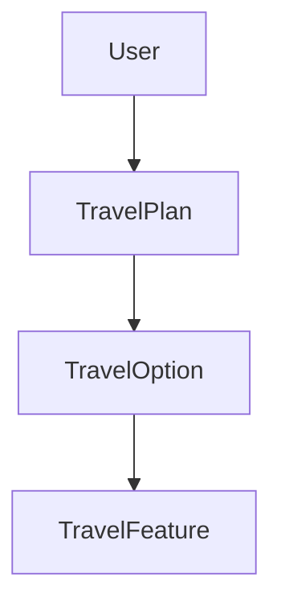
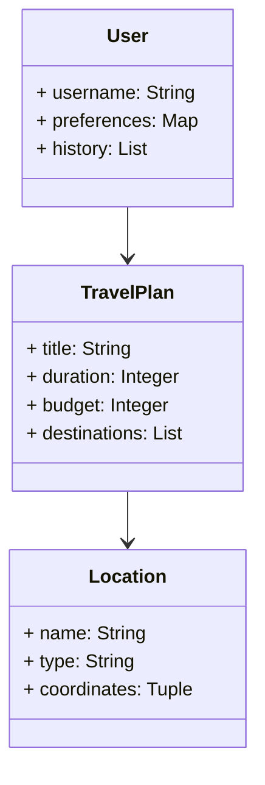

                 


# 智能旅游规划 AI Agent：LLM 辅助个性化旅行定制

## 关键词：智能旅游规划，AI Agent，LLM，个性化旅行定制，自然语言处理，深度学习

## 摘要：  
随着旅游业的快速发展和用户对个性化旅行需求的不断增加，传统的旅游规划方式逐渐暴露出效率低下、缺乏个性化的问题。本文探讨了如何利用人工智能（AI）代理（AI Agent）结合大型语言模型（LLM）来实现个性化的旅行定制服务。通过分析AI Agent与LLM的结合原理、算法实现及系统架构设计，本文提出了一个基于LLM的智能旅游规划系统，并通过实际案例展示了该系统的应用效果。本文旨在为旅游行业提供一种高效、个性化的解决方案，同时为后续的研究提供理论和实践参考。

---

# 第一部分: 智能旅游规划 AI Agent 背景与概念

## 第1章: 智能旅游规划与AI Agent概述

### 1.1 智能旅游规划的背景与现状

#### 1.1.1 传统旅游规划的局限性  
传统的旅游规划主要依赖于人工服务或简单的在线工具，存在以下问题：  
1. **信息过载**：用户需要手动筛选大量信息，耗时且效率低。  
2. **缺乏个性化**：无法根据用户的偏好和历史行为提供定制化建议。  
3. **服务单一**：传统工具难以覆盖用户的所有需求，例如行程优化、酒店推荐等。  

#### 1.1.2 智能化旅游规划的兴起  
随着人工智能技术的快速发展，智能化旅游规划逐渐成为可能。通过AI技术，可以实现以下目标：  
1. **自动化推荐**：基于用户输入快速生成个性化旅行计划。  
2. **实时优化**：根据实时数据（如天气、交通状况）动态调整行程。  
3. **多维度服务**：提供包括酒店、机票、景点推荐等全方位服务。  

#### 1.1.3 当前市场对个性化旅行的需求  
近年来，用户对个性化旅行的需求显著增加，具体表现为：  
- 用户期望旅行计划能够根据他们的兴趣、预算和时间灵活调整。  
- 用户希望获得基于数据的推荐，而不仅仅是随机推荐。  
- 用户对服务的响应速度和准确性提出了更高要求。  

---

### 1.2 AI Agent的基本概念

#### 1.2.1 什么是AI Agent  
AI Agent（人工智能代理）是一种智能实体，能够感知环境、理解用户需求并执行相应操作以实现目标。在旅游规划中，AI Agent可以扮演用户的代理，帮助其完成旅行计划的制定和优化。  

#### 1.2.2 AI Agent的核心特征  
AI Agent的核心特征包括：  
1. **自主性**：能够在没有人工干预的情况下独立运行。  
2. **反应性**：能够根据环境变化实时调整行为。  
3. **学习能力**：能够通过数据和经验不断优化自身的决策能力。  

#### 1.2.3 AI Agent与传统旅游规划工具的区别  
| 特性 | AI Agent | 传统旅游规划工具 |  
|------|-----------|--------------------|  
| 自主性 | 高 | 低 |  
| 个性化 | 强 | 弱 |  
| 学习能力 | 高 | 无 |  

---

### 1.3 LLM在旅游规划中的应用

#### 1.3.1 LLM的基本概念  
LLM（Large Language Model）是一种基于深度学习的自然语言处理模型，能够理解和生成人类语言。LLM的核心优势在于其强大的文本生成和理解能力。  

#### 1.3.2 LLM在旅游规划中的优势  
1. **个性化推荐**：LLM可以根据用户的历史行为和偏好生成个性化的旅行建议。  
2. **多语言支持**：LLM能够处理多种语言，满足全球用户的需求。  
3. **实时更新**：LLM能够根据最新的数据（如航班信息、天气状况）动态调整推荐结果。  

#### 1.3.3 LLM辅助旅游规划的实现方式  
1. **对话式交互**：通过自然语言对话，LLM理解用户需求并生成旅行计划。  
2. **内容生成**：LLM可以直接生成旅行相关的文本内容，如行程安排、景点介绍等。  
3. **意图识别**：通过分析用户的输入，LLM能够准确识别用户的意图并提供相应服务。  

---

### 1.4 本章小结  
本章介绍了智能旅游规划的背景、AI Agent的基本概念以及LLM在旅游规划中的应用。通过对比分析，展示了AI Agent与传统旅游规划工具的区别，为后续章节的深入探讨奠定了基础。

---

# 第二部分: 智能旅游规划 AI Agent的核心概念与原理

## 第2章: AI Agent与LLM的结合原理

### 2.1 AI Agent的核心概念与原理

#### 2.1.1 AI Agent的构成要素  
AI Agent的构成要素包括：  
1. **感知模块**：用于获取环境信息（如用户输入、实时数据等）。  
2. **推理模块**：用于理解和分析感知到的信息。  
3. **决策模块**：基于推理结果生成行动计划。  
4. **执行模块**：将决策结果转化为具体操作。  

#### 2.1.2 AI Agent的决策机制  
AI Agent的决策机制通常包括以下步骤：  
1. **信息收集**：通过感知模块获取相关信息。  
2. **目标设定**：明确用户的旅行目标（如预算、时间、兴趣等）。  
3. **方案生成**：基于目标生成多个旅行方案。  
4. **方案优化**：根据用户反馈优化方案。  

#### 2.1.3 AI Agent的学习与优化  
AI Agent通过机器学习技术不断优化自身的决策能力。常用的学习方法包括：  
1. **监督学习**：通过标注数据进行训练。  
2. **无监督学习**：通过聚类等技术发现数据中的模式。  
3. **强化学习**：通过奖励机制优化决策策略。  

---

### 2.2 LLM在AI Agent中的角色

#### 2.2.1 LLM作为知识库的作用  
LLM可以作为AI Agent的知识库，存储大量的旅行相关信息（如景点介绍、交通方式等）。  

#### 2.2.2 LLM作为对话生成器的作用  
LLM可以通过自然语言生成技术，帮助AI Agent与用户进行流畅的对话。  

#### 2.2.3 LLM作为意图识别器的作用  
通过LLM的自然语言理解能力，AI Agent可以准确识别用户的意图（如“我想去巴黎旅游”中的“旅游”意图）。  

---

### 2.3 AI Agent与LLM的结合模型

#### 2.3.1 模型的整体架构  
结合AI Agent与LLM的整体架构通常包括以下模块：  
1. **用户输入模块**：接收用户的输入（如文本或语音）。  
2. **LLM模块**：处理用户输入并生成响应。  
3. **决策模块**：根据LLM的输出制定行动计划。  
4. **执行模块**：将行动计划转化为具体操作。  

#### 2.3.2 模型的输入与输出  
- **输入**：用户的旅行需求（如“我想在暑假期间去欧洲旅游，预算5000元”）。  
- **输出**：个性化的旅行计划（包括行程安排、酒店推荐等）。  

#### 2.3.3 模型的训练与优化  
1. **预训练阶段**：使用通用的旅行数据进行初步训练。  
2. **微调阶段**：根据具体场景数据进行微调，提升模型的性能。  

---

### 2.4 核心概念对比表格

| 概念 | 描述 | 特点 |  
|------|------|------|  
| AI Agent | 一种智能体，能够根据用户需求生成个性化旅行计划 | 具备学习、推理和决策能力 |  
| LLM | 大型语言模型，用于自然语言处理任务 | 具备强大的文本生成和理解能力 |  

---

### 2.5 ER实体关系图



---

### 2.6 本章小结  
本章详细讲解了AI Agent与LLM的结合原理，分析了LLM在AI Agent中的具体作用，并通过对比表格和实体关系图展示了核心概念之间的联系。

---

# 第三部分: LLM辅助个性化旅行定制的算法原理

## 第3章: LLM的训练与优化

### 3.1 LLM的训练过程

#### 3.1.1 预训练阶段  
预训练阶段通常采用大规模的通用文本数据进行训练，目标是使模型具备基本的语言理解能力。  

#### 3.1.2 微调阶段  
微调阶段使用特定领域的数据（如旅行相关的数据）对模型进行进一步训练，以提升其在该领域的性能。  

#### 3.1.3 评估与优化  
通过评估指标（如准确率、召回率）对模型的性能进行评估，并根据评估结果进行优化。  

---

### 3.2 LLM的生成机制

#### 3.2.1 解码过程  
LLM的生成过程通常包括编码和解码两个阶段：  
1. **编码**：将输入文本转化为模型内部的表示形式。  
2. **解码**：基于编码结果生成输出文本。  

#### 3.2.2 概率生成模型  
概率生成模型通过计算每个可能的输出的概率，选择概率最高的输出作为最终结果。  

#### 3.2.3 模型的可解释性  
为了提高模型的可解释性，可以通过可视化技术（如注意力机制）展示模型的决策过程。  

---

### 3.3 核心算法与数学模型

#### 3.3.1 损失函数  
常用的损失函数包括交叉熵损失函数：  
$$ \text{CrossEntropy}(p, q) = -\sum_{i=1}^{n} p_i \log q_i $$  

#### 3.3.2 优化算法  
常用的优化算法包括随机梯度下降（SGD）和Adam优化器。  

---

### 3.4 本章小结  
本章详细讲解了LLM的训练与优化过程，分析了其生成机制，并通过数学公式展示了模型的核心算法。

---

# 第四部分: 系统分析与架构设计方案

## 第4章: 系统分析与架构设计

### 4.1 问题场景介绍  
用户希望通过AI Agent快速获得个性化的旅行计划，包括行程安排、酒店推荐等。  

### 4.2 项目介绍  
本项目旨在开发一个基于LLM的智能旅游规划系统，为用户提供高效、个性化的旅行服务。  

---

### 4.3 系统功能设计

#### 4.3.1 领域模型  


#### 4.3.2 系统架构图  


---

### 4.4 系统接口设计  
- **输入接口**：接收用户的旅行需求。  
- **输出接口**：提供个性化的旅行计划。  

---

### 4.5 系统交互流程

#### 4.5.1 交互流程图  
```mermaid
sequenceDiagram
    User ->+> AI Agent: "我想去巴黎旅游"
    AI Agent ->+> LLM: "生成巴黎旅游计划"
    LLM ->+> Knowledge Base: "查询巴黎旅游信息"
    Knowledge Base --> LLM: "巴黎旅游信息"
    LLM --> AI Agent: "巴黎旅游计划"
    AI Agent ->+> User: "巴黎旅游计划"
```

---

### 4.6 本章小结  
本章从系统层面分析了智能旅游规划AI Agent的实现方案，通过领域模型和系统架构图展示了系统的组成部分，为后续的项目实战奠定了基础。

---

# 第五部分: 项目实战

## 第5章: 项目实战

### 5.1 环境安装

#### 5.1.1 安装Python  
```bash
python --version
# 确保Python版本为3.8或更高
```

#### 5.1.2 安装依赖库  
```bash
pip install transformers
pip install requests
pip install beautifulsoup4
```

---

### 5.2 系统核心实现

#### 5.2.1 对话生成模块  
```python
from transformers import AutoTokenizer, AutoModelForCausalLM
import torch

model_name = "gpt2"
tokenizer = AutoTokenizer.from_pretrained(model_name)
model = AutoModelForCausalLM.from_pretrained(model_name)

def generate_response(prompt):
    inputs = tokenizer.encode(prompt, return_tensors="pt")
    outputs = model.generate(inputs, max_length=50, do_sample=True)
    response = tokenizer.decode(outputs[0], skip_special_tokens=True)
    return response
```

#### 5.2.2 意图识别模块  
```python
import requests
from bs4 import BeautifulSoup

def get_travel_info(location):
    url = f"https://www.example.com/travel-info/{location}"
    response = requests.get(url)
    soup = BeautifulSoup(response.text, 'html.parser')
    info = soup.find('div', {'class': 'travel-info'}).text
    return info
```

---

### 5.3 实际案例分析

#### 5.3.1 案例1：用户需求分析  
**输入**：用户输入“我想去巴黎旅游”。  
**输出**：AI Agent生成巴黎旅游计划，包括景点推荐、酒店选择等。  

#### 5.3.2 案例2：动态调整  
**输入**：用户反馈“预算超支”。  
**输出**：AI Agent调整行程，减少高消费项目。  

---

### 5.4 本章小结  
本章通过实际案例展示了AI Agent在智能旅游规划中的应用，详细讲解了系统的实现过程，并通过代码示例说明了核心模块的实现方法。

---

# 第六部分: 最佳实践、小结与注意事项

## 第6章: 最佳实践与注意事项

### 6.1 最佳实践

#### 6.1.1 数据质量管理  
确保训练数据的多样性和质量，避免偏见。  

#### 6.1.2 模型优化  
定期更新模型，提升其性能和适应性。  

#### 6.1.3 用户隐私保护  
严格遵守数据隐私保护法规，确保用户数据的安全性。  

---

### 6.2 小结  
本文通过详细分析智能旅游规划AI Agent的背景、原理和实现过程，展示了LLM在旅游规划中的重要性。通过实际案例的分析，进一步验证了该技术的可行性和应用价值。

---

### 6.3 注意事项

#### 6.3.1 模型的局限性  
- LLM可能无法覆盖所有场景，需要结合其他技术进行优化。  
- 模型的生成结果可能存在偏差，需要人工审核。  

#### 6.3.2 系统的可扩展性  
- 随着用户数量的增加，系统需要具备良好的扩展性。  
- 需要定期更新知识库，保持信息的准确性。  

#### 6.3.3 用户体验优化  
- 提供多语言支持，满足全球用户的需求。  
- 提供友好的用户界面，提升用户体验。  

---

### 6.4 拓展阅读  
1. [《Deep Learning》—— Ian Goodfellow  
2. [《Natural Language Processing with PyTorch》—— Yuan Kao, etc.  
3. [《Convolutional Neural Networks for Visual Recognition》—— Fei-Fei Li, etc.  

---

# 结语  
智能旅游规划AI Agent的实现不仅提升了用户体验，还为旅游行业带来了新的发展机遇。未来，随着人工智能技术的不断进步，智能旅游规划系统将更加智能化和个性化，为用户带来更优质的旅行体验。

---

# 作者：AI天才研究院/AI Genius Institute & 禅与计算机程序设计艺术/Zen And The Art of Computer Programming

