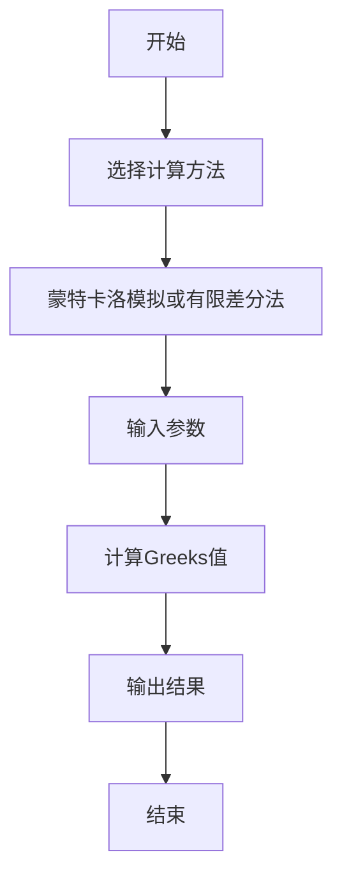
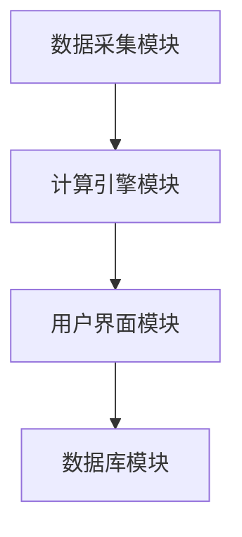
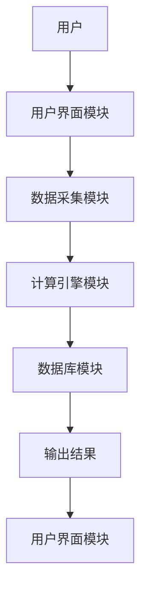

                 


# 智能期权组合Greeks实时监控系统

> 关键词：智能期权、Greeks实时监控、量化投资、金融风险管理、系统架构

> 摘要：本文详细探讨了智能期权组合Greeks实时监控系统的开发与实现。通过对期权组合中Delta、Gamma、Vega、Theta、Rho等Greeks值的实时计算与监控，结合蒙特卡洛模拟和数值分析方法，构建了一个高效的金融风险管理系统。文章从背景、核心概念、算法原理、系统架构到项目实战，全面解析了该系统的实现过程，并通过实际案例展示了其在量化投资中的应用价值。

---

# 第一部分: 期权组合Greeks实时监控的背景与需求

## 第1章: 期权组合Greeks实时监控的背景与需求

### 1.1 期权市场的基本概念

#### 1.1.1 期权的基本定义与类型
期权（Options）是金融衍生品的一种，赋予持有者在特定时间内以预定价格买入或卖出标的资产的权利。期权可以分为看涨期权（Call Options）和看跌期权（Put Options）。

#### 1.1.2 期权组合的概念与重要性
期权组合是指将多个期权合约组合在一起，通过合理的配置来实现特定的风险收益目标。期权组合的应用广泛存在于对冲基金、资产管理等领域。

#### 1.1.3 期权组合Greeks的核心意义
Greeks值（Delta、Gamma、Vega、Theta、Rho）是用来衡量期权价格对各种风险因素（如标的资产价格、波动率、时间衰减、利率变化等）敏感性的指标。实时监控Greeks值可以帮助投资者及时了解组合的风险敞口。

---

### 1.2 期权组合Greeks实时监控的背景

#### 1.2.1 金融市场波动性与风险控制
金融市场波动性高，投资者需要实时了解期权组合的风险暴露情况，以便及时调整投资策略。

#### 1.2.2 机构投资者对实时监控的需求
机构投资者管理着大量资金，对风险的敏感性和实时性要求极高，需要实时监控Greeks值来优化投资组合。

#### 1.2.3 技术进步对监控系统的影响
随着计算能力的提升和大数据技术的发展，实时监控Greeks值的技术实现变得更加高效和可行。

---

### 1.3 期权组合Greeks实时监控的必要性

#### 1.3.1 风险管理的需要
通过实时监控Greeks值，投资者可以量化和控制期权组合在不同市场条件下的风险。

#### 1.3.2 提高交易效率
实时监控Greeks值可以帮助投资者快速做出交易决策，优化投资组合的收益与风险比。

#### 1.3.3 满足监管要求
许多金融监管机构要求金融机构实时监控和报告其衍生品组合的风险敞口，实时监控Greeks值是合规的重要部分。

---

### 1.4 本章小结

本章介绍了期权市场的基本概念、期权组合的概念及其Greeks值的重要性，阐述了实时监控Greeks值的背景和必要性，为后续章节的分析奠定了基础。

---

# 第二部分: 期权组合Greeks的核心概念与数学模型

## 第2章: 期权组合Greeks的数学模型与属性

### 2.1 Delta的数学表达与计算

#### 2.1.1 Delta的定义公式
$$ \Delta = \frac{\partial C}{\partial S} $$
其中，$C$表示期权的理论价格，$S$表示标的资产的价格。

#### 2.1.2 Delta的属性特征对比
| 属性         | Delta特征                       |
|--------------|--------------------------------|
| 线性性       | 非线性                         |
| 方向性       | 看涨期权Delta为正，看跌期权Delta为负 |
| 时间稳定性   | 随时间衰减                     |

---

### 2.2 Gamma的数学表达与计算

#### 2.2.1 Gamma的定义公式
$$ \Gamma = \frac{\partial^2 C}{\partial S^2} $$
Gamma表示Delta对标的资产价格变动的二阶导数，衡量Delta的变化率。

#### 2.2.2 Gamma的属性特征对比
| 属性         | Gamma特征                       |
|--------------|--------------------------------|
| 非线性性     | 非线性                         |
| 单调性       | 随标的资产价格增加而递减       |
| 时间稳定性   | 随时间衰减                     |

---

### 2.3 Vega的数学表达与计算

#### 2.3.1 Vega的定义公式
$$ \text{Vega} = \frac{\partial C}{\partial \sigma} $$
Vega表示期权价格对标的资产波动率变动的敏感性，$\sigma$为波动率。

#### 2.3.2 Vega的属性特征对比
| 属性         | Vega特征                       |
|--------------|--------------------------------|
| 线性性       | 线性                         |
| 方向性       | 正向                         |
| 时间稳定性   | 随时间变化而变化               |

---

### 2.4 Theta的数学表达与计算

#### 2.4.1 Theta的定义公式
$$ \Theta = \frac{\partial C}{\partial t} $$
Theta表示期权价格对时间的敏感性，$t$为时间因素。

#### 2.4.2 Theta的属性特征对比
| 属性         | Theta特征                       |
|--------------|--------------------------------|
| 单调性       | 随时间衰减                     |
| 方向性       | 负向                         |

---

### 2.5 Rho的数学表达与计算

#### 2.5.1 Rho的定义公式
$$ \text{Rho} = \frac{\partial C}{\partial r} $$
Rho表示期权价格对利率变动的敏感性，$r$为无风险利率。

#### 2.5.2 Rho的属性特征对比
| 属性         | Rho特征                       |
|--------------|--------------------------------|
| 线性性       | 线性                         |
| 方向性       | 正向或负向                     |
| 时间稳定性   | 随时间变化而变化               |

---

### 2.6 本章小结

本章详细阐述了期权组合Greeks值的数学模型及其属性特征，为后续的实时监控系统实现提供了理论基础。

---

# 第三部分: 期权组合Greeks实时监控的算法原理

## 第3章: 期权组合Greeks的实时计算方法

### 3.1 蒙特卡洛模拟方法

#### 3.1.1 蒙特卡洛模拟的基本原理
蒙特卡洛模拟是一种通过随机采样方法来估计复杂问题数值的方法，广泛应用于金融衍生品定价中。

#### 3.1.2 蒙特卡洛模拟的实现步骤
1. 确定标的资产的价格路径模型（如布朗运动）。
2. 生成大量随机价格路径。
3. 计算每条路径下的期权价格。
4. 统计Greeks值的平均值和标准差。

#### 3.1.3 蒙特卡洛模拟的优缺点
- **优点**：适用于高维问题，计算效率高。
- **缺点**：计算量大，收敛速度慢。

---

### 3.2 数值分析方法

#### 3.2.1 有限差分法
有限差分法是一种通过离散化偏微分方程来近似求解数值解的方法，常用于计算期权的Greeks值。

#### 3.2.2 有限差分法的实现步骤
1. 建立偏微分方程模型。
2. 离散化时间变量和空间变量。
3. 使用数值方法求解方程组。
4. 输出Greeks值的结果。

---

### 3.3 算法流程图



---

### 3.4 本章小结

本章介绍了期权组合Greeks实时监控的两种主要算法：蒙特卡洛模拟和有限差分法，通过流程图展示了算法的实现步骤。

---

# 第四部分: 期权组合Greeks实时监控的系统架构

## 第4章: 期权组合Greeks实时监控系统的架构设计

### 4.1 系统模块划分

#### 4.1.1 数据采集模块
负责从金融市场获取标的资产的价格数据、波动率数据等。

#### 4.1.2 计算引擎模块
实现Greeks值的实时计算，包括Delta、Gamma、Vega、Theta、Rho的计算。

#### 4.1.3 用户界面模块
提供友好的人机交互界面，展示实时监控结果。

---

### 4.2 系统架构图



---

### 4.3 系统接口设计

#### 4.3.1 数据接口
- 数据输入接口：接收金融市场数据。
- 数据输出接口：输出Greeks值计算结果。

#### 4.3.2 用户接口
- 用户输入接口：接收用户的查询请求。
- 用户输出接口：展示实时监控结果。

---

### 4.4 系统交互流程图



---

### 4.5 本章小结

本章详细描述了期权组合Greeks实时监控系统的架构设计，包括模块划分、系统架构图和交互流程图。

---

# 第五部分: 期权组合Greeks实时监控系统的实现

## 第5章: 期权组合Greeks实时监控系统的实现

### 5.1 环境搭建

#### 5.1.1 安装Python环境
安装Python 3.8及以上版本，并安装必要的库（如numpy、pandas、scipy）。

#### 5.1.2 安装依赖库
使用pip安装以下库：
```bash
pip install numpy pandas scipy matplotlib
```

---

### 5.2 核心代码实现

#### 5.2.1 计算Delta的Python代码
```python
import numpy as np

def compute_delta(S, K, r, T, sigma):
    # 计算Delta的函数
    S = np.array(S)
    K = np.array(K)
    r = np.array(r)
    T = np.array(T)
    sigma = np.array(sigma)
    
    delta = (S * np.exp(-r*T)) * norm.cdf((np.log(S/K) + (r + 0.5*sigma**2)*T)/(sigma*np.sqrt(T)))
    return delta
```

#### 5.2.2 计算Gamma的Python代码
```python
import numpy as np

def compute_gamma(S, K, r, T, sigma):
    # 计算Gamma的函数
    S = np.array(S)
    K = np.array(K)
    r = np.array(r)
    T = np.array(T)
    sigma = np.array(sigma)
    
    gamma = (np.exp(-r*T) * norm.pdf((np.log(S/K) + (r + 0.5*sigma**2)*T)/(sigma*np.sqrt(T)))) / (S * sigma * np.sqrt(T))
    return gamma
```

---

### 5.3 实际案例分析

#### 5.3.1 案例背景
假设我们有一个由看涨期权组成的组合，标的资产价格为$100，执行价为$100，无风险利率为5%，波动率为20%，时间跨度为1年。

#### 5.3.2 计算Greeks值
使用上述代码计算Delta、Gamma、Vega、Theta、Rho的值。

---

### 5.4 本章小结

本章详细介绍了期权组合Greeks实时监控系统的实现过程，包括环境搭建、核心代码实现和实际案例分析。

---

# 第六部分: 系统优化与扩展

## 第6章: 期权组合Greeks实时监控系统的优化与扩展

### 6.1 系统优化

#### 6.1.1 并行计算优化
通过多线程或分布式计算优化蒙特卡洛模拟的计算效率。

#### 6.1.2 算法优化
使用更高效的数值方法（如傅里叶变换）优化有限差分法的计算速度。

---

### 6.2 系统扩展

#### 6.2.1 功能扩展
增加对其他Greeks值（如Rho）的计算支持。

#### 6.2.2 模块化设计
将系统模块化设计，便于后续功能扩展和维护。

---

### 6.3 本章小结

本章讨论了期权组合Greeks实时监控系统的优化方法和扩展方向，为系统的进一步发展提供了思路。

---

# 第七部分: 总结与展望

## 第7章: 总结与展望

### 7.1 本章总结

本文详细探讨了智能期权组合Greeks实时监控系统的开发与实现，从理论基础到系统架构，再到具体实现，全面解析了该系统的各个组成部分。

---

### 7.2 未来展望

未来，随着人工智能和大数据技术的不断发展，期权组合Greeks实时监控系统将更加智能化和自动化，为金融风险管理提供更强大的工具支持。

---

# 附录

## 附录A: 术语表

- **Delta**：期权价格对标的资产价格变动的敏感性。
- **Gamma**：Delta对标的资产价格变动的二阶导数。
- **Vega**：期权价格对波动率变动的敏感性。
- **Theta**：期权价格对时间的敏感性。
- **Rho**：期权价格对利率变动的敏感性。

---

## 附录B: 工具安装指南

### Python环境安装
安装Python 3.8及以上版本：
```bash
https://www.python.org/downloads/
```

安装依赖库：
```bash
pip install numpy pandas scipy matplotlib
```

---

## 附录C: 参考文献

1. Hull, John C. *Options, Futures, and Other Derivatives*. Prentice Hall, 2021.
2. Joshi, Mark S. *The Concepts and Practice of Mathematical Finance*. Cambridge University Press, 2008.

---

# 作者

**作者：AI天才研究院/AI Genius Institute & 禅与计算机程序设计艺术 /Zen And The Art of Computer Programming**

---

感谢您的阅读！如需进一步了解或使用本系统的相关内容，请联系作者。

