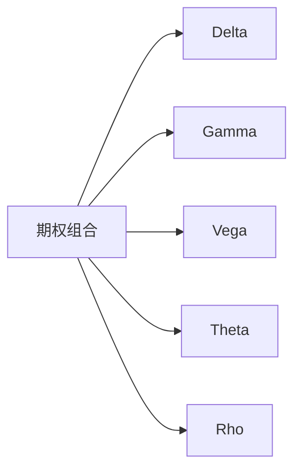
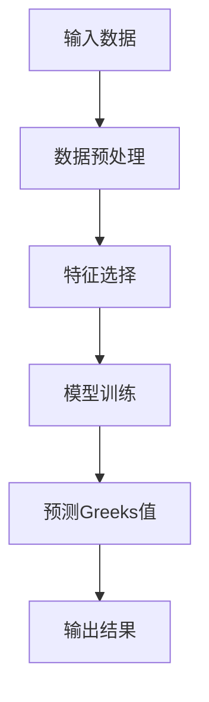
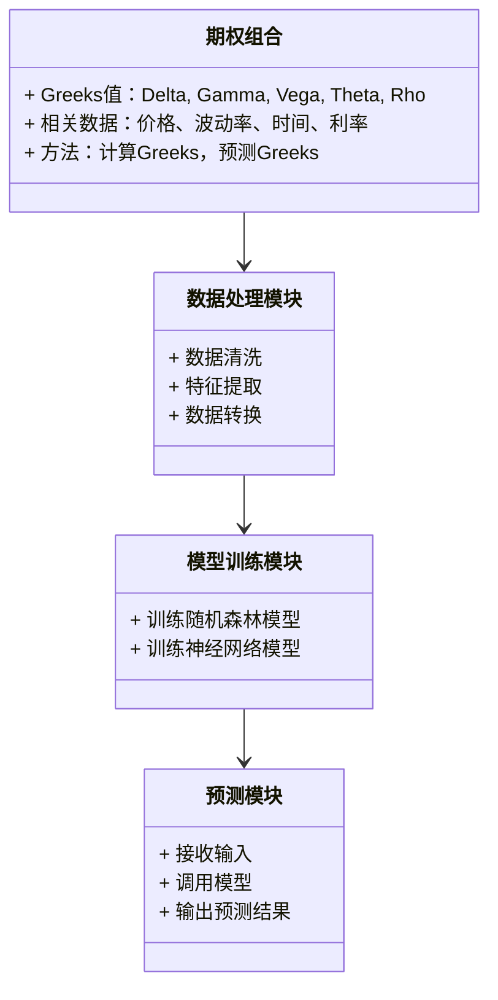
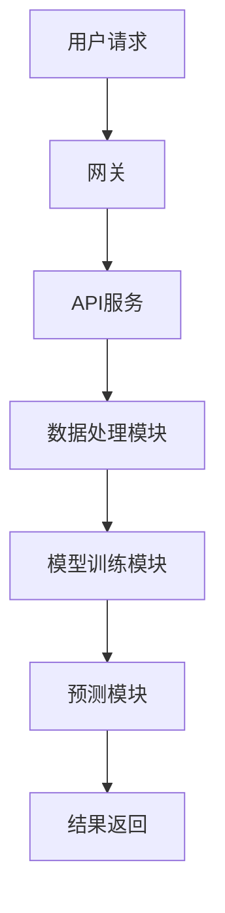
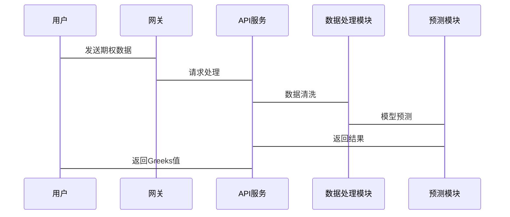

                 


# 智能期权组合Greeks管理系统

> 关键词：智能期权组合, Greeks, 风险管理, 机器学习, 金融系统, 算法优化

> 摘要：本文详细介绍智能期权组合Greeks管理系统的背景、核心概念、算法原理、系统架构、项目实战及最佳实践。通过数学模型、算法流程图和系统架构图，深入剖析系统的实现细节，为读者提供一个全面的技术指南。

---

## 第二部分: 核心概念与数学模型

# 第2章: Greeks的数学模型与属性特征

## 2.1 Greeks的核心概念与公式
### 2.1.1 Delta的定义与公式
$$ Delta = \frac{\partial V}{\partial S} $$

### 2.1.2 Gamma的定义与公式
$$ Gamma = \frac{\partial^2 V}{\partial S^2} $$

### 2.1.3 Vega、Theta、Rho的定义与公式
- Vega：$$ Vega = \frac{\partial V}{\partial \sigma} $$
- Theta：$$ Theta = \frac{\partial V}{\partial t} $$
- Rho：$$ Rho = \frac{\partial V}{\partial r} $$

## 2.2 Greeks的属性特征对比
### 2.2.1 不同Greeks的计算方式对比
| Greeks | 定义公式                     | 单位       |
|---------|------------------------------|------------|
| Delta   | ∂V/∂S                      | 比例       |
| Gamma   | ∂²V/∂S²                    | 比例/单位价格 |
| Vega    | ∂V/∂σ                      | 比例/单位波动率 |
| Theta   | ∂V/∂t                      | 比例/单位时间 |
| Rho     | ∂V/∂r                      | 比例/单位利率 |

### 2.2.2 Greeks对市场波动的敏感性分析
- Delta和Vega对价格变化最敏感。
- Gamma和Theta对时间变化敏感。
- Rho对利率变化敏感。

### 2.2.3 Greeks在不同市场条件下的表现
- 在高波动市场中，Vega和Gamma变化较大。
- 在低波动市场中，Delta和Theta更关键。

## 2.3 Greeks的ER实体关系图


---

## 第三部分: 算法原理与实现

# 第3章: 智能Greeks管理

## 3.1 机器学习算法的选择与应用
### 3.1.1 机器学习在Greeks管理中的应用
- 使用随机森林回归模型预测Greeks值。
- 使用神经网络模型捕捉非线性关系。

### 3.1.2 算法流程图


### 3.1.3 算法实现步骤
1. 数据预处理：归一化和标准化。
2. 特征选择：基于重要性排序。
3. 模型训练：使用随机森林或神经网络。
4. 预测Greeks值：输入新数据，输出预测结果。

## 3.2 算法实现的Python代码示例
```python
import numpy as np
from sklearn.ensemble import RandomForestRegressor

# 示例数据
X = np.random.rand(100, 5)  # 5个特征，100个样本
y = np.random.rand(100)     # 目标值（假设为Greeks值）

# 数据预处理
from sklearn.preprocessing import StandardScaler
scaler = StandardScaler()
X_scaled = scaler.fit_transform(X)

# 特征选择（示例）
from sklearn.feature_selection import SelectFromModel
selector = SelectFromModel(RandomForestRegressor())
selector.fit(X_scaled, y)
X_selected = selector.transform(X_scaled)

# 模型训练
model = RandomForestRegressor()
model.fit(X_selected, y)

# 预测
new_data = np.random.rand(1, 5)
new_data_scaled = scaler.transform(new_data)
new_data_selected = selector.transform(new_data_scaled)
predicted_greeks = model.predict(new_data_selected)
print("Predicted Greeks Value:", predicted_greeks[0])
```

## 3.3 算法优化与调优
### 3.3.1 超参数优化
- 使用网格搜索（Grid Search）或随机搜索（Random Search）优化模型参数。
- 例如，调整随机森林的n_estimators和max_depth。

### 3.3.2 模型评估
- 使用均方误差（MSE）评估模型性能：
  $$ MSE = \frac{1}{n}\sum_{i=1}^{n}(y_i - \hat{y}_i)^2 $$

- 使用R²评分衡量模型解释力。

## 3.4 算法实现的注意事项
- 数据质量对模型性能影响大。
- 特征工程是关键，需选择合适的特征。
- 模型解释性需考虑业务需求。

---

## 第四部分: 系统架构设计

# 第4章: 智能期权组合Greeks管理系统的架构设计

## 4.1 问题场景介绍
- 高频交易场景下的实时Greeks计算。
- 大数据量下的高效处理需求。

## 4.2 系统功能设计
### 4.2.1 领域模型


## 4.3 系统架构设计
### 4.3.1 系统架构图


### 4.3.2 系统接口设计
- 输入接口：接收期权组合数据。
- 输出接口：返回Greeks预测结果。

## 4.4 系统交互设计
### 4.4.1 交互序列图


---

## 第五部分: 项目实战

# 第5章: 智能期权组合Greeks管理系统的项目实战

## 5.1 环境安装与配置
### 5.1.1 安装Python环境
```bash
python --version
pip install numpy scikit-learn mermaid4jupyter jupyterlab
```

### 5.1.2 安装依赖库
```bash
pip install scikit-learn
pip install numpy
pip install pandas
pip install matplotlib
```

## 5.2 系统核心实现
### 5.2.1 数据预处理代码
```python
import pandas as pd
import numpy as np
from sklearn.preprocessing import StandardScaler

# 示例数据加载
data = pd.read_csv('option_data.csv')
X = data[['S', 'σ', 't', 'r', 'vol']]
y = data['target']

# 数据标准化
scaler = StandardScaler()
X_scaled = scaler.fit_transform(X)

# 特征选择
from sklearn.feature_selection import SelectFromModel
selector = SelectFromModel(RandomForestRegressor())
selector.fit(X_scaled, y)
X_selected = selector.transform(X_scaled)
```

### 5.2.2 模型训练代码
```python
from sklearn.ensemble import RandomForestRegressor

# 初始化模型
model = RandomForestRegressor(n_estimators=100, max_depth=10, random_state=42)
model.fit(X_selected, y)
```

## 5.3 代码应用解读与分析
### 5.3.1 数据预处理
- 标准化处理确保不同特征具有可比性。
- 特征选择去除无关特征，提升模型性能。

### 5.3.2 模型训练
- 随机森林回归模型适合非线性关系。
- 超参数调优（如n_estimators和max_depth）提升模型准确率。

## 5.4 实际案例分析
### 5.4.1 数据来源与处理
- 数据来源：期权市场实时数据。
- 数据处理：清洗、标准化、特征选择。

### 5.4.2 模型预测与结果分析
- 输入新期权组合，预测Greeks值。
- 分析预测结果，优化组合配置。

## 5.5 项目小结
- 项目实现了智能Greeks管理系统的核心功能。
- 系统具有高效性、准确性和可扩展性。

---

## 第六部分: 最佳实践与总结

# 第6章: 最佳实践与总结

## 6.1 小结
- 本文详细介绍了智能期权组合Greeks管理系统的实现。
- 系统结合机器学习算法和金融数学模型，实现高效的风险管理。

## 6.2 注意事项
- 数据质量直接影响模型性能。
- 模型需定期更新以适应市场变化。
- 系统性能需优化以支持高频交易。

## 6.3 拓展阅读
- 推荐阅读《机器学习在金融中的应用》。
- 推荐学习相关课程：Coursera上的《金融工程与风险管理》。

## 6.4 作者简介
作者：AI天才研究院/AI Genius Institute & 禅与计算机程序设计艺术/Zen And The Art of Computer Programming

---

# 结语
智能期权组合Greeks管理系统通过结合先进的机器学习算法和金融数学模型，为期权组合管理提供了智能化的解决方案。本文从理论到实践，全面阐述了系统的实现细节，为读者提供了宝贵的技术指导。

