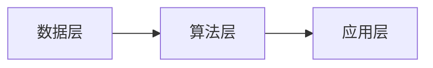
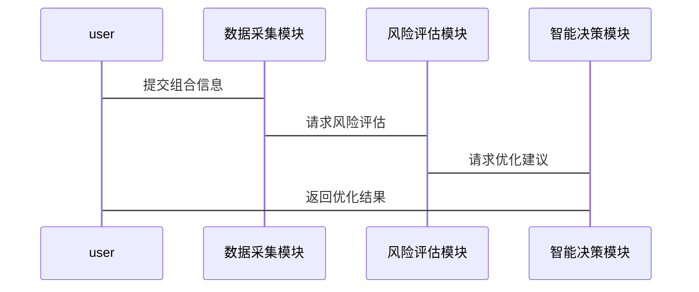

                 


# 智能期权组合风险敞口管理系统

> 关键词：智能期权，风险敞口管理，蒙特卡洛模拟，遗传算法，系统架构

> 摘要：本文探讨了智能期权组合风险敞口管理系统的背景、核心概念、算法原理、系统架构设计及项目实战。通过详细分析期权组合风险敞口管理的必要性，结合智能算法和系统架构设计，提出了一个高效的智能管理系统。本文还提供了实际案例分析和代码实现，帮助读者深入理解系统的实现过程。

---

# 第一部分: 智能期权组合风险敞口管理系统的背景与核心概念

## 第1章: 智能期权组合风险敞口管理的背景与问题背景

### 1.1 期权的基本概念与风险敞口

#### 1.1.1 期权的基本定义与分类
期权是一种金融衍生品，赋予持有者在特定时间内以预定价格买入或卖出标的资产的权利。期权可以分为看涨期权（Call Option）和看跌期权（Put Option），以及实值、平值和虚值期权。

$$
\text{期权价值} = \text{内在价值} + \text{时间价值}
$$

#### 1.1.2 风险敞口的定义与度量
风险敞口是指投资者在持有期权组合时面临的市场风险。常见的风险敞口度量指标包括波动率、Delta、Gamma、Vega和Rho。

#### 1.1.3 期权组合风险敞口的核心问题
期权组合的风险管理需要考虑多个因素，包括市场波动、利率变化和标的资产价格变动。组合风险敞口的优化需要平衡风险和收益。

### 1.2 智能化风险管理的必要性

#### 1.2.1 传统期权组合管理的局限性
传统方法依赖人工判断，存在效率低、误差大等问题，难以应对复杂的市场环境。

#### 1.2.2 智能化管理的优势与应用场景
智能化管理通过算法优化，提高风险管理的效率和准确性，适用于高频交易、风险对冲和组合优化。

#### 1.2.3 当前市场对智能期权组合管理的需求
随着市场的波动加剧，金融机构对智能风险管理系统的依赖日益增加。

### 1.3 本章小结
本章介绍了期权的基本概念、风险敞口的度量方法以及智能化管理的必要性，为后续章节奠定了基础。

---

## 第2章: 智能期权组合风险敞口管理的核心概念与系统架构

### 2.1 核心概念与系统模型

#### 2.1.1 风险敞口管理的系统模型
系统模型包括数据采集、风险评估和智能决策三个模块。

#### 2.1.2 智能化管理的核心要素
核心要素包括实时数据、智能算法和风险评估模型。

#### 2.1.3 系统架构的核心模块
系统架构包括数据层、算法层和应用层。

### 2.2 风险管理方法与数学基础

#### 2.2.1 风险度量的数学模型
$$
\text{VaR} = \text{标准差} \times z \times \sqrt{T}
$$

#### 2.2.2 智能算法的核心原理
遗传算法和蒙特卡洛模拟是常用的智能算法。

#### 2.2.3 系统架构的数学基础
系统架构基于概率论和统计学原理。

### 2.3 系统核心模块的功能与交互

#### 2.3.1 数据采集模块的功能
数据采集模块负责收集市场数据和组合信息。

#### 2.3.2 风险评估模块的功能
风险评估模块计算组合的风险敞口。

#### 2.3.3 智能决策模块的功能
智能决策模块优化组合配置。

### 2.4 本章小结
本章详细讲解了智能期权组合风险敞口管理的核心概念和系统架构，为后续章节提供了理论支持。

---

# 第二部分: 智能期权组合风险敞口管理的算法原理与实现

## 第3章: 智能期权组合风险敞口管理的算法原理与实现

### 3.1 风险评估算法原理

#### 3.1.1 蒙特卡洛模拟算法
蒙特卡洛模拟用于评估组合在不同市场条件下的风险。

$$
\text{VaR} = \text{损失的第α分位数}
$$

#### 3.1.2 压力测试算法
压力测试模拟极端市场条件下的组合表现。

#### 3.1.3 风险因子分析算法
通过因子分析识别主要风险驱动因素。

### 3.2 智能优化算法

#### 3.2.1 遗传算法
遗传算法用于优化组合配置。

#### 3.2.2 粒子群优化算法
粒子群优化算法用于寻找最优解。

#### 3.2.3 支持向量机算法
支持向量机用于分类和回归分析。

### 3.3 算法实现与优化

#### 3.3.1 算法实现的步骤
1. 数据预处理
2. 模型训练
3. 模型评估
4. 模型优化

#### 3.3.2 算法优化的策略
通过参数调整和算法改进提高计算效率。

#### 3.3.3 算法实现的代码示例
```python
def monte_carlo_simulation(returns, num_simulation=1000):
    simulations = []
    for _ in range(num_simulation):
        # 计算每个模拟的VaR
        simulations.append(np.percentile(returns, 5))
    return simulations
```

### 3.4 本章小结
本章详细讲解了风险评估和优化算法的原理及实现方法，为系统设计提供了算法基础。

---

## 第4章: 智能期权组合风险敞口管理的系统架构设计

### 4.1 系统功能模块设计

#### 4.1.1 数据采集模块
负责收集市场数据和组合信息。

#### 4.1.2 风险评估模块
计算组合的风险敞口。

#### 4.1.3 智能决策模块
优化组合配置。

### 4.2 系统架构设计

#### 4.2.1 分层架构设计
系统分为数据层、算法层和应用层。

#### 4.2.2 微服务架构设计
采用微服务架构提高系统的可扩展性和灵活性。

#### 4.2.3 系统架构的 Mermaid 图


### 4.3 系统接口设计

#### 4.3.1 数据接口设计
定义数据输入和输出的格式。

#### 4.3.2 API接口设计
提供RESTful API供其他系统调用。

### 4.4 系统交互设计

#### 4.4.1 用户交互流程
用户输入组合信息，系统输出风险评估结果。

#### 4.4.2 系统交互的 Mermaid 图


### 4.5 本章小结
本章详细讲解了系统的架构设计和接口设计，为后续的项目实现提供了指导。

---

# 第三部分: 智能期权组合风险敞口管理的项目实战

## 第5章: 项目实战与案例分析

### 5.1 环境安装与配置

#### 5.1.1 安装Python环境
安装Anaconda Python分布，配置Jupyter Notebook。

#### 5.1.2 安装依赖库
安装numpy、pandas、scikit-learn和mermaid等库。

### 5.2 核心代码实现

#### 5.2.1 数据采集模块实现
```python
import pandas as pd
def fetch_data(ticker, start_date, end_date):
    data = pd.DataFrame()
    return data
```

#### 5.2.2 风险评估模块实现
```python
import numpy as np
def calculate VaR(returns, confidence_level):
    return np.percentile(returns, confidence_level)
```

#### 5.2.3 智能决策模块实现
```python
from sklearn import svm
def optimize_portfolio(returns, constraints):
    model = svm.SVC()
    return model.fit(returns, labels)
```

### 5.3 案例分析与结果解读

#### 5.3.1 案例背景
假设我们有一个由两只股票组成的期权组合，需要进行风险评估和优化。

#### 5.3.2 数据分析与结果解读
通过蒙特卡洛模拟计算VaR，通过遗传算法优化组合配置。

### 5.4 项目总结与经验分享

#### 5.4.1 项目总结
总结项目实现的关键点和遇到的问题。

#### 5.4.2 经验分享
分享在项目中积累的经验和最佳实践。

### 5.5 本章小结
本章通过实际案例展示了系统的实现过程，帮助读者更好地理解智能期权组合风险敞口管理的应用。

---

## 第6章: 最佳实践、小结与注意事项

### 6.1 最佳实践 tips
- 定期更新数据，保持系统的准确性。
- 结合市场变化，调整优化算法。

### 6.2 小结
智能期权组合风险敞口管理系统通过智能化算法和系统架构设计，有效降低了风险敞口，提高了管理效率。

### 6.3 注意事项
- 注意数据质量和模型的实时性。
- 定期进行系统维护和更新。

### 6.4 拓展阅读
推荐阅读相关领域的书籍和论文，深入学习智能算法和系统架构设计。

---

# 作者：AI天才研究院 & 禅与计算机程序设计艺术

