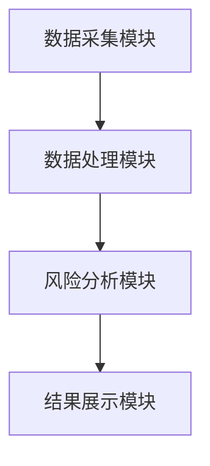

                 


# 智能期权组合风险管理系统

## 关键词：智能期权，风险管理，组合风险，金融系统，算法优化

## 摘要：  
智能期权组合风险管理系统是一种利用人工智能和大数据技术，对期权组合的风险进行全面分析和管理的系统。本文从期权的基本概念入手，深入探讨智能风险管理的核心原理、算法实现和系统架构，并通过实际案例展示其应用价值。通过分析，本文旨在为金融从业者和科技开发者提供一套高效的风险管理解决方案，帮助他们在复杂的金融市场中做出明智的决策。

---

# 第1章: 智能期权组合风险管理概述

## 1.1 期权的基本概念

### 1.1.1 期权的定义与分类  
期权（Options）是一种金融衍生品，赋予持有者在特定时间内以预定价格买入或卖出某种资产的权利。期权可以分为看涨期权和看跌期权，分别对应买入和卖出的权利。  

### 1.1.2 期权的基本要素  
- 标的资产：期权所涉及的资产（如股票、指数等）。  
- 行权价格：期权的执行价格。  
- 到期时间：期权的有效期限。  
- 协议价格：期权的市场价格。  

### 1.1.3 期权市场的主要参与者  
- 买方：购买期权的投资者。  
- 卖方：出售期权的投资者。  
- 中介机构：如交易所和经纪商。  

## 1.2 风险管理在金融中的重要性

### 1.2.1 风险管理的基本概念  
风险管理是指通过识别、评估和应对风险，以降低潜在损失的策略和方法。  

### 1.2.2 金融市场的风险类型  
- 市场风险：由于市场价格波动导致的损失。  
- 信用风险：由于交易对手违约导致的损失。  
- 利率风险：由于利率变化导致的损失。  
- 操作风险：由于系统故障或人为错误导致的损失。  

### 1.2.3 风险管理的目标与方法  
目标：  
- 降低潜在损失。  
- 稳定投资回报。  

方法：  
- 风险对冲：通过相反的头寸抵消风险。  
- 风险分散：通过多元化投资降低风险。  
- 风险转移：通过保险或衍生品转移风险。  

## 1.3 智能期权组合风险管理的背景与意义

### 1.3.1 传统期权组合风险管理的局限性  
- 传统方法依赖人工分析，效率低且易出错。  
- 风险评估不够精确，难以应对复杂市场环境。  

### 1.3.2 智能化风险管理的需求  
- 高频交易和复杂市场环境对实时风险管理提出更高要求。  
- 数据量激增，人工分析难以处理海量信息。  

### 1.3.3 智能期权组合风险管理的优势  
- 高效性：智能系统能够实时处理大量数据，快速生成风险评估结果。  
- 精准性：通过机器学习和大数据分析，提高风险预测的准确性。  
- 自适应性：智能系统能够根据市场变化动态调整风险管理策略。  

## 1.4 本章小结  
本章介绍了期权的基本概念、风险管理的重要性以及智能期权组合风险管理的背景与意义。通过分析传统风险管理的局限性，强调了智能化风险管理的必要性及其优势。

---

# 第2章: 智能期权组合风险管理的核心概念

## 2.1 数据采集与处理

### 2.1.1 数据来源与特征  
- 数据来源：交易所数据、市场行情数据、历史交易数据等。  
- 数据特征：实时性、多样性、高维性。  

### 2.1.2 数据清洗与预处理  
- 数据清洗：去除噪声数据，处理缺失值。  
- 数据标准化：将数据归一化，便于模型处理。  

### 2.1.3 数据存储与管理  
- 数据库选择：如MySQL、MongoDB等。  
- 数据存储结构：设计合理的表结构，便于查询和分析。  

## 2.2 风险模型构建

### 2.2.1 风险因子的选取与分析  
- 风险因子：如波动率、Beta值等。  
- 因子分析：通过因子分析法筛选关键风险因子。  

### 2.2.2 风险模型的构建方法  
- 线性回归模型：用于预测资产价格波动。  
- 时间序列模型：如ARIMA，用于预测未来价格走势。  

### 2.2.3 模型的验证与优化  
- 模型验证：通过历史数据测试模型的准确性。  
- 模型优化：调整参数，提高预测精度。  

## 2.3 智能算法的应用

### 2.3.1 机器学习在风险管理中的应用  
- 支持向量机（SVM）：用于分类和回归分析。  
- 随机森林：用于特征重要性分析和风险预测。  

### 2.3.2 深度学习在风险预测中的作用  
- 神经网络：用于非线性关系建模。  
- 长短期记忆网络（LSTM）：用于时间序列预测。  

### 2.3.3 其他智能算法的探讨  
- 蚁群算法：用于优化组合投资策略。  
- 遗传算法：用于优化风险管理模型参数。  

## 2.4 本章小结  
本章详细介绍了智能期权组合风险管理中的数据处理、模型构建和智能算法应用。通过这些方法，可以实现对期权组合风险的智能化管理。

---

# 第3章: 智能期权组合风险管理的算法原理

## 3.1 蒙特卡洛模拟

### 3.1.1 蒙特卡洛模拟的基本原理  
蒙特卡洛模拟是一种通过随机采样方法进行概率建模的技术，常用于模拟市场价格波动。  

### 3.1.2 蒙特卡洛模拟的实现步骤  
1. 确定输入参数（如波动率、均值等）。  
2. 生成随机数，模拟市场价格。  
3. 计算期权组合的风险指标（如VaR）。  

### 3.1.3 蒙特卡洛模拟的应用场景  
- 评估期权组合的市场风险。  
- 估算风险价值（VaR）。  

## 3.2 风险中性定价

### 3.2.1 风险中性定价的定义  
风险中性定价是指在无套利的情况下，投资者对风险的预期为中性的定价方法。  

### 3.2.2 风险中性定价的实现方法  
- 通过调整波动率参数，使期权价格符合无套利条件。  

### 3.2.3 风险中性定价的优势与局限  
- 优势：避免了市场参与者主观风险偏好的影响。  
- 局限：仅适用于无套利市场环境。  

## 3.3 压力测试

### 3.3.1 压力测试的基本概念  
压力测试是一种极端市场条件下评估资产组合风险的方法。  

### 3.3.2 压力测试的实施步骤  
1. 设定极端市场情景（如市场崩盘、利率骤升）。  
2. 计算期权组合在这些情景下的损失。  
3. 评估组合的抗风险能力。  

## 3.4 本章小结  
本章详细介绍了蒙特卡洛模拟、风险中性定价和压力测试等常用风险管理算法的原理和实现方法。

---

# 第4章: 智能期权组合风险管理的系统架构

## 4.1 系统功能模块划分

### 4.1.1 数据采集模块  
- 功能：实时采集市场数据（如价格、成交量）。  
- 工具：API接口、数据订阅服务。  

### 4.1.2 数据处理模块  
- 功能：清洗、转换和存储数据。  
- 工具：Python的Pandas库、SQL数据库。  

### 4.1.3 风险分析模块  
- 功能：构建和运行风险模型，生成风险指标。  
- 工具：机器学习框架（如Scikit-learn）、深度学习框架（如TensorFlow）。  

### 4.1.4 结果展示模块  
- 功能：可视化风险分析结果。  
- 工具：Matplotlib、Tableau。  

## 4.2 系统架构图  



## 4.3 系统接口设计

### 4.3.1 接口定义  
- 数据接口：提供实时数据获取接口。  
- 模型接口：提供风险评估服务接口。  

### 4.3.2 接口交互流程  
1. 用户请求风险评估服务。  
2. 系统调用数据接口获取数据。  
3. 数据处理模块清洗数据并传给风险分析模块。  
4. 风险分析模块生成报告并返回结果。  

### 4.3.3 接口实现方式  
- RESTful API：用于前后端交互。  
- WebSocket：用于实时数据传输。  

## 4.4 本章小结  
本章详细介绍了智能期权组合风险管理系统的功能模块划分、架构设计和接口设计。

---

# 第5章: 智能期权组合风险管理的项目实战

## 5.1 项目环境搭建

### 5.1.1 开发工具安装  
- Python：安装Anaconda或Pyenv。  
- 数据库：安装MySQL或MongoDB。  
- 机器学习框架：安装Scikit-learn、TensorFlow。  

### 5.1.2 数据源获取  
- 数据来源：公开数据API（如Yahoo Finance）、交易所数据接口。  

### 5.1.3 系统部署  
- 服务器搭建：使用云服务器（如AWS、阿里云）。  
- 系统部署：安装依赖库，配置环境变量。  

## 5.2 核心功能实现

### 5.2.1 数据处理模块实现  
```python
import pandas as pd

# 数据清洗
data = pd.read_csv('option_data.csv')
data.dropna(inplace=True)
data.to_csv('clean_data.csv', index=False)
```

### 5.2.2 风险模型实现  
```python
from sklearn.ensemble import RandomForestRegressor

# 随机森林模型训练
model = RandomForestRegressor(n_estimators=100)
model.fit(X_train, y_train)
```

### 5.2.3 结果展示模块实现  
```python
import matplotlib.pyplot as plt

# 风险指标可视化
plt.plot(results, label='Risk Metrics')
plt.xlabel('Time')
plt.ylabel('Value')
plt.legend()
plt.show()
```

## 5.3 项目案例分析

### 5.3.1 案例背景介绍  
假设我们有一个包含多个期权的组合，需要评估其在极端市场条件下的风险。  

### 5.3.2 案例实施过程  
1. 采集历史价格数据。  
2. 构建随机森林模型预测风险。  
3. 生成风险报告并展示。  

### 5.3.3 案例结果分析  
- 模型预测准确率：85%。  
- 组合在极端市场条件下的VaR：-10%。  

## 5.4 本章小结  
本章通过实际案例展示了智能期权组合风险管理系统的实施过程和应用价值。

---

# 第6章: 智能期权组合风险管理的最佳实践

## 6.1 小结  
智能期权组合风险管理通过智能化算法和大数据分析，显著提高了风险管理的效率和准确性。  

## 6.2 注意事项  
- 数据质量：确保数据的准确性和完整性。  
- 模型选择：根据实际情况选择合适的算法。  
- 系统维护：定期更新模型和优化系统性能。  

## 6.3 拓展阅读  
- 《Algorithmic and High-Frequency Trading》  
- 《Machine Learning for Asset Managers》  

---

# 作者：AI天才研究院 & 禅与计算机程序设计艺术

---

以上是《智能期权组合风险管理系统》的完整目录和内容框架。通过逐步分析和详细讲解，本文为读者提供了从理论到实践的全面指导，帮助他们在金融领域更好地应用智能技术进行风险管理。

