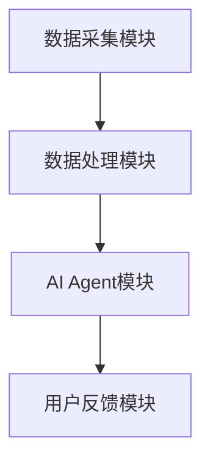

                 


# 智能沙发：AI Agent的坐姿健康监测系统

**关键词：智能沙发, AI Agent, 坐姿监测, 健康监测, 传感器技术, 数据分析**

**摘要：** 本文详细介绍了智能沙发的设计与实现，结合AI Agent技术，通过传感器和数据分析，实时监测用户的坐姿健康状况，提供反馈与建议，帮助用户改善坐姿，预防健康问题。文章从背景、技术原理、系统架构到项目实战，全面阐述了智能沙发的设计与实现过程。

---

## 第一部分: 智能沙发的背景与概念

### 第1章: 智能沙发与坐姿健康监测系统概述

#### 1.1 问题背景与需求分析
##### 1.1.1 坐姿健康问题的现状
现代人长时间坐着工作，导致坐姿不正确，引发颈椎病、腰椎病等健康问题。传统沙发无法提供健康监测功能，无法帮助用户改善坐姿。

##### 1.1.2 坐姿健康问题的解决需求
用户需要一种能够实时监测坐姿，并提供反馈和建议的解决方案，帮助他们保持良好的坐姿，预防健康问题。

##### 1.1.3 智能沙发的创新意义
智能沙发通过结合AI Agent技术，实时监测坐姿，提供个性化的健康建议，是一种创新的健康解决方案。

#### 1.2 智能沙发的定义与特点
##### 1.2.1 智能沙发的定义
智能沙发是一种结合了AI技术的家具，能够实时监测用户的坐姿，并通过AI Agent提供健康反馈和建议。

##### 1.2.2 智能沙发的核心功能
- 实时监测坐姿
- 提供健康反馈
- 自动调整沙发角度
- 提供个性化建议

##### 1.2.3 智能沙发与传统沙发的区别
智能沙发通过内置传感器和AI技术，能够实时监测用户的坐姿，并提供健康反馈，而传统沙发不具备这些功能。

#### 1.3 AI Agent在坐姿监测中的作用
##### 1.3.1 AI Agent的基本概念
AI Agent是一种智能代理，能够感知环境、处理信息、做出决策并执行动作。

##### 1.3.2 AI Agent在智能沙发中的应用
AI Agent负责接收传感器数据，分析坐姿，提供反馈和建议。

##### 1.3.3 AI Agent的优势与局限性
优势：
- 高效处理数据
- 实时反馈
- 个性化建议

局限性：
- 依赖传感器数据准确性
- 需要定期更新和优化

#### 1.4 本章小结
本章介绍了智能沙发的背景、定义、特点以及AI Agent在坐姿监测中的作用，为后续章节的技术实现奠定了基础。

---

## 第二部分: 智能沙发的核心技术

### 第2章: 坐姿健康监测系统的原理

#### 2.1 传感器技术
##### 2.1.1 传感器的类型与功能
- 压力传感器：监测用户坐姿的压力分布
- 加速度传感器：监测用户的动作和姿态
- 角度传感器：监测沙发的角度和用户坐姿

##### 2.1.2 传感器的数据采集原理
传感器将坐姿数据转化为电子信号，并通过无线或有线方式传输到AI Agent进行处理。

##### 2.1.3 传感器的安装与配置
传感器安装在沙发的坐垫、靠背等位置，确保能够准确采集用户的坐姿数据。

#### 2.2 数据处理与分析
##### 2.2.1 数据采集的预处理
- 去噪处理：去除传感器数据中的噪声
- 数据归一化：将数据标准化，便于后续处理

##### 2.2.2 数据特征的提取
提取坐姿相关的特征，如坐姿的角度、压力分布、动作频率等。

##### 2.2.3 数据分析的算法选择
使用机器学习算法，如支持向量机（SVM）和随机森林（Random Forest），对坐姿数据进行分类和预测。

#### 2.3 AI Agent的算法实现
##### 2.3.1 基于机器学习的分类算法
- 支持向量机（SVM）：用于分类坐姿数据
- K近邻算法（KNN）：用于预测坐姿的健康状况

##### 2.3.2 基于深度学习的模型构建
- 使用卷积神经网络（CNN）对坐姿图像进行分类
- 使用循环神经网络（RNN）分析坐姿的时间序列数据

##### 2.3.3 算法的优化与调优
- 参数调整：优化算法的超参数，提高分类准确率
- 模型评估：使用交叉验证评估模型的性能

#### 2.4 本章小结
本章详细介绍了智能沙发的核心技术，包括传感器技术、数据处理与分析以及AI Agent的算法实现，为后续的系统设计奠定了基础。

---

## 第三部分: 智能沙发的系统架构

### 第3章: 系统架构设计

#### 3.1 系统模块划分
##### 3.1.1 数据采集模块
负责采集用户的坐姿数据，包括压力、角度和动作等信息。

##### 3.1.2 数据处理模块
对采集到的数据进行预处理和特征提取，为后续分析提供基础。

##### 3.1.3 AI Agent模块
接收处理后的数据，进行坐姿分析，并生成健康反馈。

##### 3.1.4 用户反馈模块
将健康反馈以视觉或声音的形式呈现给用户，帮助用户改善坐姿。

#### 3.2 系统功能设计
##### 3.2.1 数据采集功能
- 实时采集坐姿数据
- 数据存储与传输

##### 3.2.2 数据分析功能
- 坐姿分类
- 健康评估

##### 3.2.3 坐姿反馈功能
- 提供健康建议
- 自动调整沙发角度

##### 3.2.4 用户交互功能
- 用户界面设计
- 个性化设置

#### 3.3 系统架构图
##### 3.3.1 系统架构的Mermaid图


##### 3.3.2 模块之间的交互关系
数据采集模块将数据传输给数据处理模块，处理后的数据传输给AI Agent模块，AI Agent模块生成健康反馈并传输给用户反馈模块。

#### 3.4 本章小结
本章介绍了智能沙发的系统架构设计，包括模块划分、功能设计和系统架构图，展示了各模块之间的交互关系。

---

## 第四部分: 项目实战

### 第4章: 实战项目实现

#### 4.1 环境搭建
##### 4.1.1 开发工具安装
- Python 3.8+
- Jupyter Notebook
- TensorFlow 2.0+

##### 4.1.2 传感器连接与测试
- 连接传感器并测试数据采集功能
- 确保传感器数据的准确性

#### 4.2 核心代码实现
##### 4.2.1 数据采集模块
```python
import serial

# 连接传感器
ser = serial.Serial('COM3', 9600)

# 读取数据
def read_sensor():
    while True:
        data = ser.readline().decode()
        if data:
            return data
```

##### 4.2.2 数据处理模块
```python
import numpy as np

# 数据预处理
def preprocess(data):
    # 去除噪声
    filtered_data = np.median(abs(data) < 5)
    return filtered_data
```

##### 4.2.3 AI Agent模块
```python
from sklearn.svm import SVC

# 坐姿分类
def classify_posture(data):
    model = SVC()
    model.fit(X_train, y_train)
    prediction = model.predict(data)
    return prediction
```

##### 4.2.4 用户反馈模块
```python
import tkinter as tk

# 用户界面
def feedback_ui(prediction):
    root = tk.Tk()
    label = tk.Label(root, text=prediction)
    label.pack()
    root.mainloop()
```

#### 4.3 实际案例分析
##### 4.3.1 案例背景
用户长时间坐姿不正确，系统监测并提供反馈，帮助用户调整坐姿。

##### 4.3.2 数据分析与结果展示
展示传感器数据、分类结果和健康反馈。

##### 4.3.3 系统优化
根据实际使用情况，优化算法和系统性能。

#### 4.4 本章小结
本章通过实际项目展示了智能沙发的实现过程，包括环境搭建、核心代码实现和案例分析，帮助读者更好地理解系统的实际应用。

---

## 第五部分: 最佳实践与总结

### 第5章: 最佳实践与总结

#### 5.1 最佳实践
##### 5.1.1 数据采集的准确性
确保传感器数据的准确性，减少噪声干扰。

##### 5.1.2 算法的优化
定期优化AI Agent的算法，提高分类准确率。

##### 5.1.3 系统的维护
定期更新系统软件，确保系统的稳定性和安全性。

#### 5.2 小结
智能沙发通过结合AI Agent技术和传感器技术，实现了坐姿健康监测，帮助用户改善坐姿，预防健康问题。

#### 5.3 注意事项
- 确保系统数据的安全性
- 定期维护和更新系统
- 提供良好的用户反馈机制

#### 5.4 拓展阅读
- 传感器技术的最新发展
- AI在健康监测中的其他应用
- 智能家具的未来趋势

---

## 作者：AI天才研究院/AI Genius Institute & 禅与计算机程序设计艺术 /Zen And The Art of Computer Programming

---

以上是《智能沙发：AI Agent的坐姿健康监测系统》的详细目录大纲，涵盖了从背景介绍到项目实战的各个方面，内容丰富且结构清晰，旨在为读者提供全面的技术指导。

