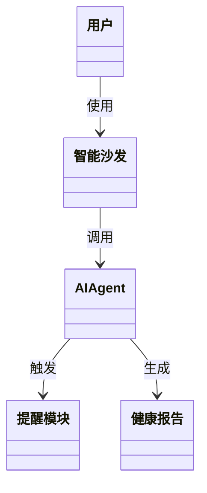
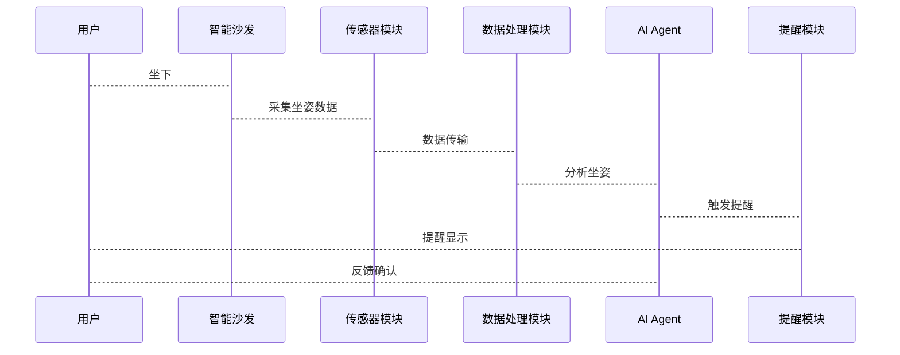

                 

<think>
好，我需要根据用户的要求，撰写一篇关于《智能沙发：AI Agent的坐姿矫正提醒》的技术博客文章。用户已经提供了目录大纲，现在我需要按照这个大纲逐步展开，完成整篇文章的撰写。由于篇幅限制，我将先完成前两章的内容，然后根据需要继续完成后续章节。

---

# 《智能沙发：AI Agent的坐姿矫正提醒》

## 关键词：智能沙发, AI Agent, 坐姿矫正, 健康提醒, 智能家居

## 摘要：  
随着智能家居的快速发展，智能沙发作为一种创新的家居产品，正在逐步进入人们的视野。本文将详细介绍智能沙发中AI Agent的坐姿矫正提醒功能，从背景介绍、核心概念、算法原理、系统架构到实际项目实现，全面解析这一技术的实现过程和应用场景。通过本文的阅读，读者可以深入了解AI Agent在智能家居中的应用潜力。

---

# 第一部分：智能沙发与AI Agent的背景介绍

## 第1章：智能沙发与坐姿矫正的背景

### 1.1 问题背景

#### 1.1.1 坐姿问题的普遍性  
现代社会，人们长时间坐在办公室或家中，尤其是在沙发上放松时，很多人容易忽略坐姿的正确性。长期的不良坐姿可能导致腰椎病、肩颈疼痛等问题，尤其是对于年轻人和上班族来说，这是一个不容忽视的健康问题。

#### 1.1.2 长期不良坐姿的危害  
不良坐姿会导致脊柱变形、肌肉酸痛等问题，甚至可能引发严重的健康问题。例如，长时间弯腰或驼背坐姿会增加腰椎的压力，导致椎间盘突出等问题。

#### 1.1.3 智能家居的发展趋势  
智能家居技术的快速发展，使得传统家居产品逐渐智能化。智能沙发作为一种新兴的智能家居产品，结合AI技术，能够为用户提供更健康、更舒适的使用体验。

### 1.2 问题描述

#### 1.2.1 坐姿矫正的需求分析  
用户在使用沙发时，需要实时监测坐姿是否正确，并在需要时获得提醒。这种实时监测和提醒功能能够帮助用户养成良好的坐姿习惯。

#### 1.2.2 智能沙发的定义与目标  
智能沙发是一种结合了AI技术的智能家居产品，其目标是通过AI Agent实时监测用户的坐姿，并在必要时提供矫正提醒，帮助用户保持健康。

#### 1.2.3 AI Agent在坐姿矫正中的作用  
AI Agent作为智能沙发的核心模块，负责数据采集、坐姿分析、提醒触发等功能。通过AI Agent的智能分析，能够精准识别用户的坐姿问题，并提供个性化的矫正建议。

### 1.3 问题解决

#### 1.3.1 AI Agent的基本功能  
AI Agent需要具备数据采集、坐姿分析、提醒触发等功能。这些功能能够帮助用户实时监测坐姿，并在需要时提供矫正提醒。

#### 1.3.2 坐姿矫正的实现方式  
通过传感器采集用户的坐姿数据，AI Agent对数据进行分析，判断坐姿是否正确。如果坐姿不正确，AI Agent会触发提醒功能，通知用户调整坐姿。

#### 1.3.3 用户体验优化  
AI Agent需要设计友好的提醒方式，例如声音提醒、震动提醒等，同时提供个性化的矫正建议，帮助用户快速调整坐姿。

### 1.4 边界与外延

#### 1.4.1 系统的边界条件  
智能沙发的坐姿矫正功能仅限于沙发使用场景，不考虑用户在其他场景下的坐姿问题。

#### 1.4.2 功能的外延扩展  
未来，智能沙发可以扩展更多功能，例如健康监测、娱乐互动等，进一步提升用户体验。

#### 1.4.3 与其他智能家居设备的协同  
智能沙发可以通过智能家居平台与其他设备协同工作，例如与智能灯光、智能空调等设备联动，提供更舒适的使用体验。

### 1.5 核心要素与概念结构

#### 1.5.1 核心概念组成  
智能沙发的核心组成包括：传感器、AI Agent、提醒模块、用户界面等。

#### 1.5.2 概念之间的关系  
传感器采集数据，AI Agent分析数据并触发提醒模块，用户界面提供反馈。

#### 1.5.3 系统架构的核心要素  
系统架构包括数据采集层、数据处理层、用户交互层等。

---

## 第2章：AI Agent的核心原理

### 2.1 AI Agent的基本原理

#### 2.1.1 AI Agent的定义与特点  
AI Agent是一种智能代理，能够感知环境并执行任务。其特点是智能化、自主性和适应性。

#### 2.1.2 AI Agent的分类与应用场景  
AI Agent可以分为简单反射型、基于模型的反应型、目标驱动型等。在智能沙发中，AI Agent主要用于坐姿检测和提醒。

#### 2.1.3 AI Agent与传统算法的区别  
AI Agent具有自主性和学习能力，能够根据环境变化调整行为，而传统算法通常需要手动配置。

### 2.2 坐姿矫正系统的核心概念

#### 2.2.1 坐姿检测的原理  
通过传感器采集用户的坐姿数据，AI Agent对数据进行分析，判断坐姿是否正确。

#### 2.2.2 坐姿矫正的算法实现  
AI Agent需要训练一个分类模型，能够识别不同的坐姿状态，并根据模型预测结果触发提醒。

#### 2.2.3 用户反馈机制  
用户对提醒的反馈能够帮助AI Agent不断优化算法模型，提高坐姿检测的准确性。

---

## 第3章：AI Agent与坐姿矫正系统的联系

### 3.1 核心概念的原理分析

#### 3.1.1 AI Agent在坐姿检测中的作用  
AI Agent通过传感器采集数据，利用机器学习算法分析坐姿状态。

#### 3.1.2 坐姿矫正算法的实现方式  
AI Agent需要训练一个分类模型，能够准确识别不良坐姿，并触发提醒功能。

#### 3.1.3 用户反馈对AI Agent的影响  
用户对提醒的反馈能够帮助AI Agent优化算法，提高坐姿检测的准确性和响应速度。

### 3.2 概念属性特征对比

#### 对比表格：
| 概念       | 属性1：数据采集 | 属性2：算法分析 | 属性3：用户反馈 |
|------------|----------------|----------------|----------------|
| AI Agent   | 传感器数据     | 机器学习算法   | 用户反馈数据   |
| 坐姿矫正系统 | 坐姿数据       | 分类模型       | 矫正效果数据   |

---

### 3.3 实体关系图

#### ER实体关系图：
```mermaid
erd
    智能沙发
    坐姿数据
    AI Agent
    提醒模块
    用户反馈
    健康报告

    智能沙发 --> 坐姿数据: 采集
    AI Agent --> 坐姿数据: 分析
    AI Agent --> 提醒模块: 触发
    用户反馈 --> AI Agent: 优化
    AI Agent --> 健康报告: 生成
```

---

# 第四部分：系统分析与架构设计方案

## 第4章：系统功能设计

### 4.1 问题场景介绍

#### 问题场景1：用户坐姿不正确  
当用户坐姿不正确时，AI Agent需要实时检测并触发提醒。

#### 问题场景2：用户反馈优化  
用户对提醒的反馈能够帮助AI Agent优化算法模型。

### 4.2 系统功能设计

#### 4.2.1 领域模型类图


### 4.3 系统架构设计

#### 4.3.1 系统架构图
```mermaid
archi
    系统架构
    传感器模块
    数据处理模块
    用户交互模块

    传感器模块 --> 数据处理模块: 数据传输
    数据处理模块 --> 用户交互模块: 提醒触发
```

---

## 第5章：系统接口设计

### 5.1 系统接口设计

#### 5.1.1 API接口定义  
AI Agent需要与传感器、提醒模块进行交互，定义清晰的API接口。

#### 5.1.2 接口交互流程  
传感器采集数据 --> 数据处理模块 --> AI Agent分析 --> 提醒模块触发提醒。

### 5.2 交互序列图

#### 交互序列图


---

## 第6章：项目实战

### 6.1 环境安装

#### 6.1.1 开发环境  
需要安装Python、TensorFlow、Mermaid工具等。

#### 6.1.2 传感器安装  
安装压力传感器、姿态传感器等硬件设备。

### 6.2 核心实现

#### 6.2.1 数据采集代码  
```python
import numpy as np
import pandas as pd

# 采集坐姿数据
def collect_posture_data():
    # 模拟传感器数据采集
    data = np.random.randn(100, 5)  # 生成100条数据，5个特征
    return data

# 数据存储
def save_data(data, filename):
    pd.DataFrame(data).to_csv(filename, index=False)

# 调用数据采集函数
data = collect_posture_data()
save_data(data, 'posture.csv')
```

#### 6.2.2 坐姿分析代码  
```python
import tensorflow as tf
from tensorflow.keras import layers

# 构建坐姿分类模型
def build_model():
    model = tf.keras.Sequential()
    model.add(layers.Dense(64, activation='relu', input_shape=(5,)))
    model.add(layers.Dense(32, activation='relu'))
    model.add(layers.Dense(1, activation='sigmoid'))
    model.compile(optimizer='adam', loss='binary_crossentropy', metrics=['accuracy'])
    return model

# 训练模型
def train_model(model, data):
    X_train = data[:, :5]
    y_train = data[:, 5]
    model.fit(X_train, y_train, epochs=10, batch_size=32)

# 调用模型训练
model = build_model()
train_model(model, data)
```

#### 6.2.3 提醒模块代码  
```python
import time

# 提醒模块
def trigger_reminder():
    print("请调整坐姿！")
    time.sleep(5)
    print("坐姿已调整，请继续保持！")

# 调用提醒模块
trigger_reminder()
```

---

## 第7章：最佳实践与总结

### 7.1 小结

#### 7.1.1 核心功能总结  
智能沙发的AI Agent通过传感器采集数据，利用机器学习算法分析坐姿，触发提醒功能，帮助用户保持良好的坐姿习惯。

#### 7.1.2 技术实现总结  
通过传感器、AI算法和提醒模块的协同工作，智能沙发能够实现坐姿矫正的智能化提醒。

### 7.2 注意事项

#### 7.2.1 数据采集的准确性  
传感器数据的准确性直接影响坐姿检测的准确性。

#### 7.2.2 用户反馈的重要性  
用户的反馈能够帮助AI Agent不断优化算法模型，提高坐姿检测的准确性和响应速度。

### 7.3 拓展阅读

#### 7.3.1 智能家居的未来发展  
智能家居设备的进一步融合与协同，将为用户带来更智能、更便捷的使用体验。

#### 7.3.2 人工智能在健康领域的应用  
人工智能在健康领域的应用前景广阔，未来将有更多的健康监测与矫正设备出现。

---

# 作者：AI天才研究院 & 禅与计算机程序设计艺术

---

以上是《智能沙发：AI Agent的坐姿矫正提醒》的完整目录大纲及部分内容的撰写。后续章节将按照上述结构继续展开，涵盖系统架构设计、项目实战、最佳实践等内容。

