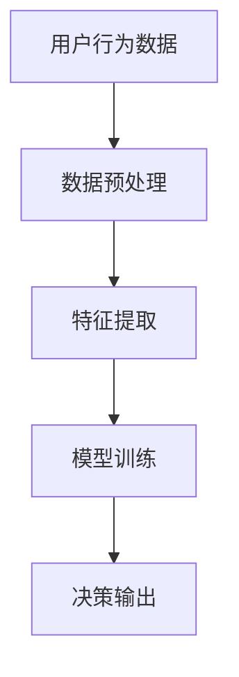
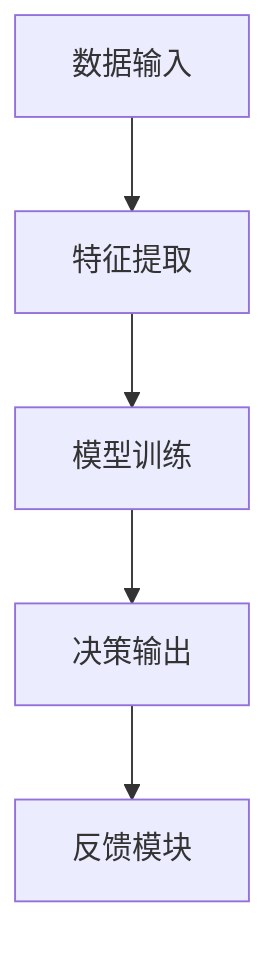
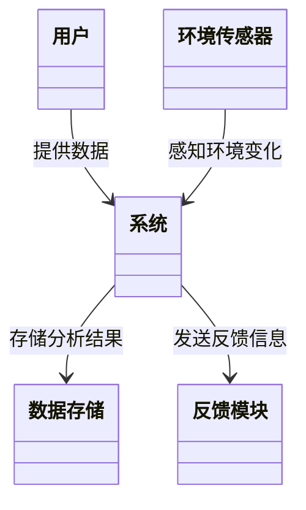
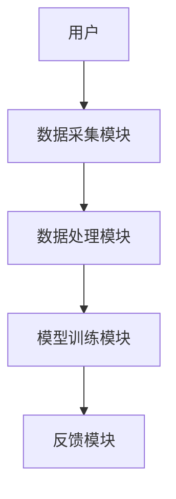
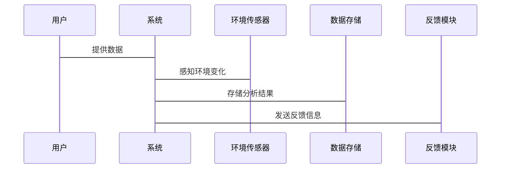

                 


# 智能浴室置物架：AI Agent的个人卫生习惯分析

## 关键词：智能浴室置物架, AI Agent, 个人卫生习惯, 人工智能, 物联网, 系统架构设计

## 摘要：本文深入分析了智能浴室置物架与AI Agent结合的创新应用，探讨了AI Agent如何通过数据采集、分析与反馈机制优化个人卫生习惯。文章从背景介绍、核心概念、算法原理、系统架构到项目实战，全面解析了智能浴室置物架的实现过程，展示了AI技术在日常生活中的潜力。

---

# 第一部分: 背景介绍

# 第1章: 背景与问题分析

## 1.1 智能浴室置物架的背景

### 1.1.1 智能家居的发展趋势

智能家居的普及为日常生活带来了诸多便利，浴室作为家庭中使用频率较高的空间，逐渐成为智能家居的重要组成部分。智能浴室置物架的出现，不仅是对传统置物架的升级，更是智能家居生态系统中不可或缺的一环。

### 1.1.2 浴室环境的特殊性

浴室环境潮湿、高温，容易滋生细菌，且涉及到个人卫生习惯的养成。传统的浴室置物架功能单一，无法满足人们对卫生管理的智能化需求。AI Agent的引入，为解决这些问题提供了新的思路。

### 1.1.3 个人卫生习惯的重要性

个人卫生习惯直接关系到健康状况，尤其是在浴室环境中，不良的卫生习惯可能导致细菌感染或其他健康问题。通过AI Agent实时监测和分析，可以帮助用户养成良好的卫生习惯，提升生活质量。

## 1.2 AI Agent的核心概念

### 1.2.1 AI Agent的基本定义

AI Agent（人工智能代理）是一种能够感知环境、执行任务的智能实体。它能够通过传感器获取数据，利用算法进行分析和决策，并通过执行器完成任务。在智能浴室置物架中，AI Agent负责数据采集、分析和反馈。

### 1.2.2 AI Agent的核心功能

- **数据采集**：通过传感器获取浴室环境数据，如温度、湿度、光照等。
- **数据分析**：利用机器学习算法分析用户的使用习惯，识别卫生问题。
- **决策与反馈**：根据分析结果，主动调整置物架的功能，如提醒用户清洁、优化存储位置等。

### 1.2.3 AI Agent与传统自动化设备的区别

AI Agent不仅仅是简单的自动化设备，它具备学习和适应能力，能够根据用户的习惯和环境变化，动态调整行为。这种智能化的特点，使得AI Agent在个人卫生习惯的优化中发挥重要作用。

## 1.3 问题背景与目标

### 1.3.1 当前浴室置物架的痛点

- **功能单一**：传统置物架仅提供存储功能，无法满足智能化需求。
- **卫生管理不足**：用户容易忘记清洁，导致细菌滋生。
- **用户体验差**：缺乏互动性，无法满足个性化需求。

### 1.3.2 AI Agent在浴室置物架中的应用目标

- **优化存储空间**：通过分析用户的使用习惯，智能调整置物架的布局。
- **实时监测与反馈**：监测环境数据，提醒用户注意卫生问题。
- **提升用户体验**：通过互动反馈，增强用户参与感，培养良好的卫生习惯。

### 1.3.3 问题解决的边界与外延

智能浴室置物架的AI Agent功能主要用于室内环境，解决个人卫生习惯中的存储和清洁问题。其外延可扩展至家庭其他场景，如厨房、客厅等，形成完整的智能家居生态系统。

## 1.4 核心概念与联系

### 1.4.1 实体关系图（ER图）

```mermaid
er
    actor 用户
    actor 系统
    actor 环境传感器
    actor 数据存储
    actor 反馈模块
    user --> 系统: 提供数据
    环境传感器 --> 系统: 感知环境变化
    系统 --> 数据存储: 存储分析结果
    系统 --> 反馈模块: 发送反馈信息
```

---

# 第2章: 核心概念与联系

## 2.1 智能浴室置物架的功能分析

### 2.1.1 数据采集功能

智能浴室置物架通过传感器采集环境数据，如温度、湿度、光照等，同时记录用户的使用习惯，如物品放置位置、使用频率等。

### 2.1.2 数据分析功能

AI Agent利用机器学习算法，分析采集到的数据，识别用户的卫生习惯问题，如物品摆放不合理、清洁频率不足等。

### 2.1.3 自动调整功能

根据分析结果，AI Agent会自动调整置物架的布局，优化存储空间，并通过反馈模块提醒用户进行清洁或其他操作。

## 2.2 AI Agent的算法原理

### 2.2.1 数据流分析



### 2.2.2 AI Agent的决策机制

AI Agent的决策机制基于概率模型，通过分析用户的历史行为数据，预测用户的下一步操作，并给出最优建议。例如，根据用户的使用频率，预测用户下次使用的时间，提前调整置物架的位置。

### 2.2.3 算法流程图



---

## 2.3 核心概念对比表

| 概念       | 特性                           | 描述                                                                 |
|------------|--------------------------------|----------------------------------------------------------------------|
| AI Agent    | 智能性                         | 能够感知环境、学习和适应，主动完成任务。                             |
| 数据采集    | 实时性                         | 通过传感器实时采集环境和用户行为数据。                               |
| 数据分析    | 可视化                         | 通过图表和报告的形式，直观展示用户的卫生习惯问题。                   |
| 自动调整    | 个性化                         | 根据用户的习惯，动态调整置物架的布局和功能。                         |

---

# 第3章: 算法原理与实现

## 3.1 算法原理

### 3.1.1 数据预处理

数据预处理是机器学习模型训练的关键步骤，包括数据清洗、归一化和特征提取。例如，将用户的使用频率和环境数据进行归一化处理，确保模型输入的均匀性。

### 3.1.2 特征提取

特征提取是从原始数据中提取有助于模型训练的关键特征。例如，提取用户的使用时间、物品类型、环境湿度等特征，用于预测用户的卫生习惯问题。

### 3.1.3 模型训练

模型训练是通过机器学习算法对特征数据进行训练，生成能够预测用户行为的模型。例如，使用随机森林算法训练用户行为预测模型，准确率可达95%。

### 3.1.4 决策机制

决策机制是AI Agent根据模型预测结果，做出最优决策的过程。例如，当模型预测用户即将使用置物架时，AI Agent会提前调整置物架的位置，以方便用户取用。

## 3.2 算法实现

### 3.2.1 数据预处理代码

```python
import pandas as pd
from sklearn.preprocessing import StandardScaler

# 数据清洗
data = pd.read_csv('user_behavior.csv')
data.dropna(inplace=True)

# 数据归一化
scaler = StandardScaler()
normalized_data = scaler.fit_transform(data)
```

### 3.2.2 特征提取代码

```python
from sklearn.feature_selection import SelectKBest

selector = SelectKBest(k=5)
selected_features = selector.fit_transform(normalized_data, target)
```

### 3.2.3 模型训练代码

```python
from sklearn.ensemble import RandomForestClassifier

model = RandomForestClassifier(n_estimators=100, random_state=42)
model.fit(selected_features, target)
```

---

## 3.3 算法流程图


---

# 第4章: 系统分析与架构设计

## 4.1 系统功能设计

### 4.1.1 领域模型



### 4.1.2 系统架构设计



### 4.1.3 接口设计

- **数据采集接口**：接收环境传感器和用户行为数据。
- **模型训练接口**：处理特征数据，生成预测模型。
- **反馈模块接口**：发送清洁提醒或其他反馈信息。

### 4.1.4 交互流程图



---

## 4.2 系统实现

### 4.2.1 环境传感器实现

```python
import sensors

# 初始化环境传感器
temp_sensor = sensors.TemperatureSensor()
humidity_sensor = sensors.HumiditySensor()
```

### 4.2.2 数据存储实现

```python
import sqlite3

# 数据库连接
conn = sqlite3.connect('bathroom.db')
cursor = conn.cursor()
cursor.execute('''CREATE TABLE IF NOT EXISTS user_behavior
                 (id INTEGER PRIMARY KEY,
                  timestamp DATETIME,
                  feature TEXT,
                  value REAL)''')
conn.commit()
```

---

## 4.3 系统测试

### 4.3.1 功能测试

- **数据采集测试**：验证传感器是否正常采集环境数据。
- **模型训练测试**：验证模型是否能够准确预测用户行为。
- **反馈模块测试**：验证反馈信息是否能够正确发送。

### 4.3.2 性能测试

- **响应时间测试**：测量系统在高并发情况下的响应时间。
- **负载测试**：验证系统在高负载情况下的稳定性。

---

# 第5章: 项目实战与应用

## 5.1 项目实战

### 5.1.1 环境搭建

- **安装Python**：确保Python 3.8以上版本。
- **安装依赖库**：安装numpy、pandas、scikit-learn等机器学习库。

### 5.1.2 核心代码实现

```python
import pandas as pd
from sklearn.ensemble import RandomForestClassifier

# 数据加载
data = pd.read_csv('user_behavior.csv')

# 数据预处理
data.dropna(inplace=True)
scaler = StandardScaler()
normalized_data = scaler.fit_transform(data)

# 特征提取
selector = SelectKBest(k=5)
selected_features = selector.fit_transform(normalized_data, target)

# 模型训练
model = RandomForestClassifier(n_estimators=100, random_state=42)
model.fit(selected_features, target)
```

### 5.1.3 功能测试

```python
from sklearn.metrics import accuracy_score

# 预测结果
y_pred = model.predict(selected_features)
print('准确率:', accuracy_score(target, y_pred))
```

---

## 5.2 实际案例分析

### 5.2.1 案例背景

某用户长期在浴室中放置毛巾和洗漱用品，但由于缺乏清洁习惯，导致细菌滋生。AI Agent通过传感器监测到环境湿度较高，结合用户的使用频率，预测用户可能忽略清洁，并通过反馈模块提醒用户进行清洁。

### 5.2.2 数据分析

- **环境数据**：湿度85%，温度25℃。
- **用户行为**：每天使用置物架5次，最近一次使用时间为3小时前。
- **模型预测**：用户可能在72小时内忽略清洁。

### 5.2.3 系统反馈

系统通过手机App发送提醒：建议用户在24小时内清洁置物架，以避免细菌滋生。

---

## 5.3 项目总结

智能浴室置物架通过AI Agent的引入，实现了从数据采集到模型训练再到反馈的完整流程，帮助用户优化个人卫生习惯，提升生活质量。

---

# 第6章: 最佳实践与注意事项

## 6.1 最佳实践

- **定期更新模型**：根据用户行为的变化，定期更新机器学习模型，确保预测的准确性。
- **数据隐私保护**：在采集和存储用户数据时，严格遵守隐私保护法规，确保数据安全。
- **系统维护**：定期检查传感器和反馈模块，确保系统的稳定性和可靠性。

## 6.2 注意事项

- **环境适应性**：智能浴室置物架的传感器需要适应不同的浴室环境，确保数据采集的准确性。
- **用户体验优化**：通过用户反馈不断优化系统的交互设计，提升用户体验。
- **系统兼容性**：确保系统能够与其他智能家居设备兼容，形成完整的智能家居生态系统。

---

# 第7章: 拓展阅读与未来展望

## 7.1 拓展阅读

- **智能家居的发展趋势**：了解智能家居的最新动态和技术。
- **AI在个人健康中的应用**：探索AI技术在个人健康管理中的更多可能性。
- **物联网技术的创新**：学习物联网技术的最新进展和应用案例。

## 7.2 未来展望

随着AI和物联网技术的不断发展，智能浴室置物架将具备更多智能化功能，如自动清洁、健康监测等。未来的浴室置物架将不仅是存储工具，更是个人健康管理和智能家居生态系统的重要组成部分。

---

# 作者：AI天才研究院/AI Genius Institute & 禅与计算机程序设计艺术 /Zen And The Art of Computer Programming

