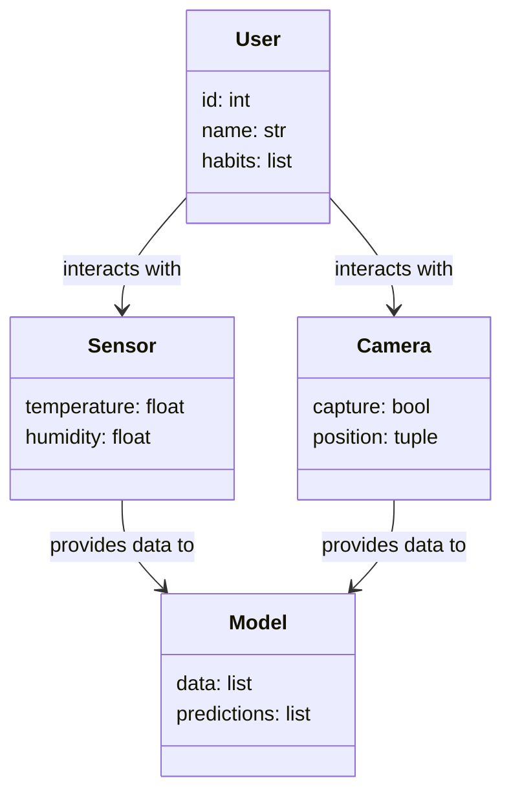
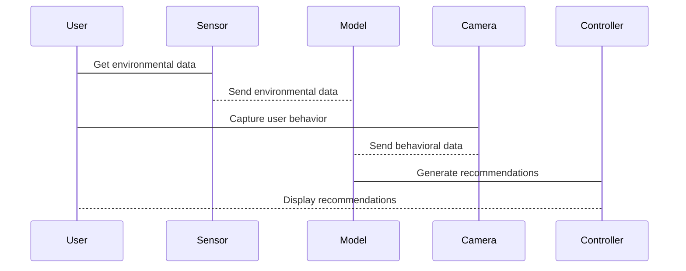

                 


# 智能浴室置物架：AI Agent的个人卫生习惯改善

> 关键词：智能浴室置物架，AI Agent，个人卫生习惯，智能家居，人工智能

> 摘要：本文探讨了如何利用AI Agent技术优化个人卫生习惯，特别是在浴室环境中。通过智能浴室置物架的设计与实现，展示了AI技术在改善生活习惯中的潜力。文章详细介绍了系统的背景、核心概念、算法原理、系统架构以及项目实战，为读者提供了一个全面的技术视角。

---

# 第一部分：智能浴室置物架的背景与需求

## 第1章：问题背景与目标

### 1.1 个人卫生习惯的重要性

#### 1.1.1 卫生习惯对健康的影响
良好的卫生习惯是预防疾病、保持健康的重要基础。特别是在浴室环境中，保持清洁和有序的环境有助于减少细菌滋生，提升个人健康水平。

#### 1.1.2 浴室环境的特殊性
浴室是一个潮湿、易滋生细菌的环境。传统的浴室置物架设计简单，难以有效管理物品，容易导致物品摆放混乱，增加细菌滋生的风险。

#### 1.1.3 当前浴室置物架的痛点
传统浴室置物架功能单一，无法满足现代人对智能化、个性化的需求。用户常常面临物品摆放混乱、清洁困难等问题，影响使用体验和健康。

### 1.2 智能化需求的提出

#### 1.2.1 智能家居的发展趋势
智能家居技术的快速发展为浴室环境的智能化改造提供了技术支持。通过引入AI技术，浴室设备能够实现智能化管理，提升用户体验。

#### 1.2.2 浴室场景的智能化机会
浴室是一个私密且使用频率高的空间，智能化改造能够显著提升用户的便利性和舒适性。智能浴室置物架作为智能家居的一部分，具有广阔的应用前景。

#### 1.2.3 通过AI Agent改善卫生习惯的目标
通过引入AI Agent技术，智能浴室置物架能够实时监测用户的卫生习惯，提供个性化的建议和反馈，帮助用户养成良好的卫生习惯。

### 1.3 本章小结
本章介绍了智能浴室置物架的背景，分析了传统浴室置物架的痛点，并提出了通过AI Agent技术改善卫生习惯的目标。

---

# 第二部分：AI Agent的核心概念与原理

## 第2章：AI Agent的基本原理

### 2.1 AI Agent的定义与特点

#### 2.1.1 AI Agent的定义
AI Agent（智能体）是指能够感知环境、自主决策并执行任务的智能系统。它能够通过传感器获取信息，利用算法进行分析，并根据结果采取相应行动。

#### 2.1.2 AI Agent的核心特点
- **自主性**：能够在没有外部干预的情况下独立运行。
- **反应性**：能够实时感知环境并做出反应。
- **学习能力**：通过数据和经验不断优化自身的决策能力。

#### 2.1.3 AI Agent与传统软件的区别
AI Agent具有自主性和学习能力，能够适应复杂多变的环境，而传统软件通常遵循固定的逻辑和规则。

### 2.2 AI Agent在浴室置物架中的应用

#### 2.2.1 数据采集与分析
智能浴室置物架通过传感器采集用户的使用习惯和环境数据，分析用户的卫生行为，如物品摆放频率、清洁习惯等。

#### 2.2.2 行为识别与反馈
AI Agent能够识别用户的异常行为，例如物品摆放混乱、清洁不及时等，并通过语音或视觉提示提供反馈，引导用户改善卫生习惯。

#### 2.2.3 个性化推荐
基于用户的行为数据，AI Agent可以推荐个性化的卫生管理方案，例如最优的物品摆放位置、清洁时间提醒等。

### 2.3 本章小结
本章介绍了AI Agent的基本概念和特点，并详细探讨了其在智能浴室置物架中的应用，包括数据采集、行为识别和个性化推荐等方面。

---

# 第三部分：智能浴室置物架的系统架构

## 第3章：系统功能设计

### 3.1 系统功能概述

#### 3.1.1 数据采集模块
通过传感器和摄像头采集用户的使用数据，如物品摆放位置、使用频率等。

#### 3.1.2 行为分析模块
利用AI算法对用户行为进行分析，识别异常行为并提供反馈。

#### 3.1.3 个性化推荐模块
根据用户行为数据，推荐个性化的卫生管理方案。

### 3.2 系统功能实现

#### 3.2.1 数据采集模块实现
- 传感器数据采集：使用温度、湿度传感器实时监测环境数据。
- 用户行为数据采集：通过摄像头捕捉用户的动作，记录物品摆放位置。

#### 3.2.2 行为分析模块实现
- 数据预处理：清洗和归一化数据。
- 行为识别：利用机器学习算法识别用户行为，如物品摆放混乱、清洁不及时等。

#### 3.2.3 个性化推荐模块实现
- 数据建模：建立用户行为模型，预测用户的卫生习惯。
- 推荐策略：根据模型结果，推荐最优的卫生管理方案。

### 3.3 本章小结
本章详细介绍了智能浴室置物架的系统功能设计，包括数据采集、行为分析和个性化推荐模块的实现。

---

# 第四部分：算法原理与实现

## 第4章：数据采集与处理

### 4.1 数据采集方法

#### 4.1.1 传感器数据采集
- 温度传感器：监测浴室环境的温度。
- 湿度传感器：监测浴室环境的湿度。

#### 4.1.2 用户行为数据采集
- 摄像头：捕捉用户的动作，记录物品摆放位置。

#### 4.1.3 数据预处理
- 数据清洗：去除噪声数据。
- 数据归一化：将数据标准化，便于后续分析。

### 4.2 数据分析与建模

#### 4.2.1 数据分析方法
- 统计分析：分析用户行为的频率和分布。
- 数据可视化：使用图表展示数据，帮助理解用户行为。

#### 4.2.2 数据建模方法
- 机器学习：使用分类算法识别用户行为。
- 深度学习：利用神经网络模型进行行为预测。

#### 4.2.3 模型优化
- 调参优化：通过网格搜索优化模型参数。
- 模型评估：使用准确率、召回率等指标评估模型性能。

### 4.3 本章小结
本章介绍了数据采集与处理的方法，包括传感器数据采集、用户行为数据采集以及数据分析与建模的实现。

---

## 第5章：AI Agent算法实现

### 5.1 算法原理

#### 5.1.1 算法概述
AI Agent通过感知环境、分析数据并做出决策，帮助用户改善卫生习惯。

#### 5.1.2 算法实现步骤
1. 数据采集：通过传感器和摄像头获取用户行为数据。
2. 数据分析：利用机器学习算法识别用户行为。
3. 行为反馈：根据分析结果，提供个性化的反馈和建议。

#### 5.1.3 算法优缺点
- 优点：能够实时感知环境，提供个性化的反馈。
- 缺点：需要大量的数据支持，算法复杂度较高。

### 5.2 算法实现代码

#### 5.2.1 代码实现
```python
import numpy as np
from sklearn import svm

# 示例代码：使用支持向量机（SVM）进行用户行为分类
def preprocess_data(data):
    # 数据预处理
    processed_data = data.dropna().astype(float)
    return processed_data

def train_model(X, y):
    # 训练SVM模型
    model = svm.SVC()
    model.fit(X, y)
    return model

def predict_behavior(model, new_data):
    # 预测用户行为
    prediction = model.predict(new_data)
    return prediction
```

#### 5.2.2 代码解释
- `preprocess_data`函数：对数据进行预处理，去除缺失值并转换为浮点数类型。
- `train_model`函数：使用支持向量机（SVM）训练分类模型。
- `predict_behavior`函数：利用训练好的模型对新数据进行预测。

#### 5.2.3 代码优化
- 使用交叉验证优化模型参数。
- 引入数据增强技术，提升模型的泛化能力。

### 5.3 本章小结
本章详细介绍了AI Agent算法的实现，包括算法原理、代码实现和优化方法。

---

# 第五部分：系统分析与架构设计

## 第6章：系统分析与架构设计

### 6.1 问题场景介绍
智能浴室置物架需要在复杂的浴室环境中实现数据采集、行为分析和个性化推荐功能。

### 6.2 系统功能设计

#### 6.2.1 领域模型（Mermaid类图）


#### 6.2.2 系统架构设计（Mermaid架构图）


#### 6.2.3 系统接口设计
- 用户与系统交互的接口：通过UI或语音指令操作置物架。
- 系统内部接口：Sensor、Camera、Model和Controller之间的数据传输。

#### 6.2.4 系统交互流程图（Mermaid序列图）


### 6.3 本章小结
本章详细介绍了智能浴室置物架的系统架构设计，包括领域模型、系统架构图和交互流程图。

---

# 第六部分：项目实战与优化

## 第7章：项目实战

### 7.1 环境安装

#### 7.1.1 硬件安装
- 安装传感器和摄像头，确保它们正常工作。
- 连接电源和数据线，配置网络环境。

#### 7.1.2 软件安装
- 安装Python和相关库（如NumPy、Scikit-learn）。
- 配置开发环境，如Jupyter Notebook或VS Code。

### 7.2 系统核心实现

#### 7.2.1 数据采集模块实现
```python
import numpy as np
import pandas as pd

# 示例代码：读取传感器数据
def read_sensor_data():
    data = pd.read_csv('sensor.csv')
    return data

# 示例代码：读取摄像头数据
def read_camera_data():
    # 假设摄像头数据存储在图像文件中
    # 这里仅展示读取数据的逻辑
    return np.array([1, 2, 3, 4])
```

#### 7.2.2 行为分析模块实现
```python
from sklearn import svm

# 示例代码：训练行为分析模型
def train_behavior_model(X_train, y_train):
    model = svm.SVC()
    model.fit(X_train, y_train)
    return model

# 示例代码：预测用户行为
def predict_behavior(model, X_test):
    y_pred = model.predict(X_test)
    return y_pred
```

#### 7.2.3 个性化推荐模块实现
```python
def generate_recommendations(model, user_data):
    # 示例代码：生成个性化推荐
    recommendation = model.predict(user_data)
    return recommendation
```

### 7.3 实际案例分析
通过实际数据测试系统性能，分析模型的准确率和召回率，优化算法参数，提升系统性能。

### 7.4 本章小结
本章通过实际项目展示了智能浴室置物架的实现过程，包括环境安装、核心代码实现和案例分析。

---

# 第七部分：最佳实践与总结

## 第8章：最佳实践与总结

### 8.1 项目经验总结
- 数据质量对模型性能影响重大，需要重视数据预处理。
- 系统的实时性和稳定性需要在设计阶段充分考虑。

### 8.2 项目注意事项
- 保护用户隐私，避免数据泄露。
- 系统设计要注重可扩展性，方便后续功能的添加。

### 8.3 拓展阅读
建议读者进一步学习智能家居、AI算法优化等相关知识，深入了解AI在个人卫生习惯改善中的应用。

### 8.4 本章小结
本章总结了项目的实践经验，提出了注意事项和拓展阅读的方向。

---

# 作者信息

作者：AI天才研究院/AI Genius Institute & 禅与计算机程序设计艺术 /Zen And The Art of Computer Programming

---

通过以上目录结构，我们可以看到，文章内容从背景介绍到系统实现，从算法原理到项目实战，全面而深入地探讨了智能浴室置物架的设计与实现。接下来，我将根据这个目录结构，逐步展开每一部分的内容，撰写一篇完整的技术博客文章。

