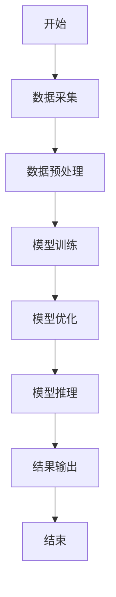
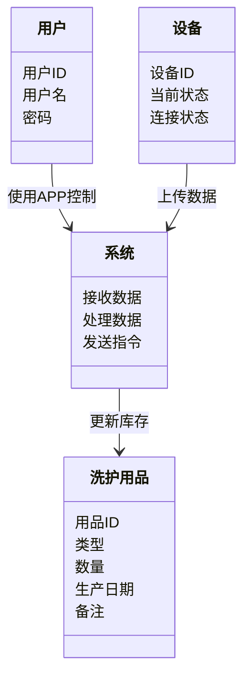
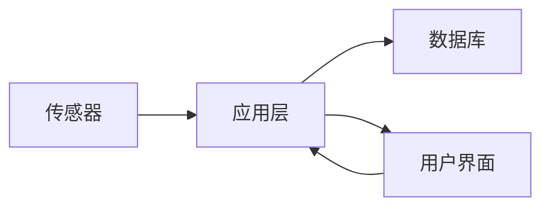
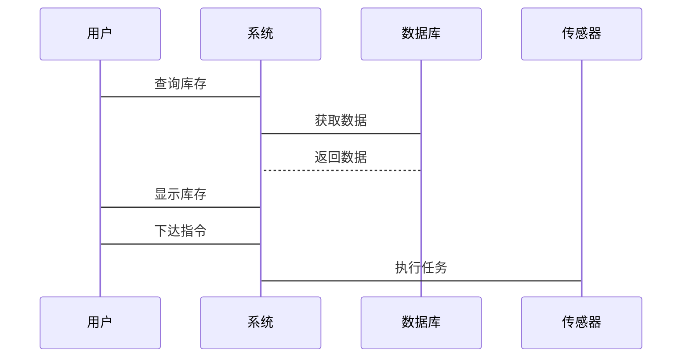

                 


# 智能浴室置物架：AI Agent的洗护用品管理

> 关键词：智能浴室置物架，AI Agent，物联网，洗护用品管理，智能硬件，智能家居

> 摘要：本文探讨了AI Agent在智能浴室置物架中的应用，通过物联网技术实现洗护用品的智能化管理。文章详细介绍了问题背景、核心概念、算法原理、系统架构、项目实战及总结，旨在为读者提供全面的技术解读。

---

## 第一部分: 背景与概念

### 第1章: 问题背景与描述

#### 1.1 智能浴室置物架的背景
- **1.1.1 浴室用品管理的痛点**
  - 浴室空间有限，洗护用品摆放混乱，使用不便。
  - 传统置物架功能单一，无法满足现代家庭的多样化需求。
  
- **1.1.2 智能化管理的必要性**
  - 提高生活效率，优化空间利用。
  - 通过智能化管理，实现用品的自动整理与提醒。

- **1.1.3 当前市场现状与趋势**
  - 智能家居市场的快速发展。
  - 用户对智能化生活需求的增加。

#### 1.2 问题描述与目标
- **1.2.1 浴室用品管理的具体问题**
  - 洗护用品的过期提醒缺失。
  - 空间利用不足，导致使用不便。
  
- **1.2.2 智能浴室置物架的目标**
  - 实现洗护用品的智能化管理。
  - 提供实时提醒和用量统计功能。

- **1.2.3 解决方案的边界与外延**
  - 系统仅管理洗护用品，不涉及其他物品。
  - 支持多用户使用，数据独立存储。

#### 1.3 智能浴室置物架的定义与特点
- **1.3.1 核心概念的定义**
  - 智能浴室置物架：集成了AI Agent和物联网技术的智能硬件，用于管理洗护用品。
  
- **1.3.2 与传统置物架的区别**
  - 具备智能识别和管理功能。
  - 可通过手机APP远程控制。

- **1.3.3 核心功能与价值主张**
  - 自动识别用品，实时更新库存。
  - 提供使用提醒和用量统计。
  - 支持远程操作和数据同步。

### 第2章: 核心概念与联系

#### 2.1 AI Agent的基本原理
- **2.1.1 AI Agent的定义与分类**
  - AI Agent：智能代理，能够感知环境并执行任务。
  - 分类：简单反射Agent，基于模型的反射Agent，目标驱动的Agent，效用驱动的Agent。
  
- **2.1.2 智能代理的核心特征**
  - 反应性：实时感知并响应环境变化。
  - 目标导向：根据目标执行任务。
  - 学习能力：通过数据优化决策。

- **2.1.3 AI Agent在浴室置物架中的应用**
  - 自动识别用品并更新库存。
  - 提供使用建议和提醒。

#### 2.2 物联网技术的基础
- **2.2.1 物联网的概念与组成**
  - 物联网：通过互联网连接物理设备，实现智能化管理。
  - 组成：传感器、通信模块、云端处理。

- **2.2.2 传感器与通信技术**
  - 传感器：用于检测物品的存在和类型。
  - 通信技术：Wi-Fi，蓝牙，用于数据传输。

- **2.2.3 云端数据处理**
  - 数据存储：用户数据、使用记录。
  - 数据分析：用量统计，使用习惯分析。

#### 2.3 AI Agent与物联网的结合
- **2.3.1 数据流的交互过程**
  - 传感器采集数据 → AI Agent处理 → 云端存储。
  - 用户通过APP查询数据，发送指令。

- **2.3.2 系统的整体架构**
  - 传感器层：采集数据。
  - AI Agent层：处理数据，执行任务。
  - 云端层：存储数据，提供服务。

- **2.3.3 核心概念的ER实体关系图**

```mermaid
erDiagram
    actor 用户角色 "用户" {
        <属性> 用户ID : string
        <属性> 用户名 : string
        <属性> 密码 : string
    }
    actor 系统 "浴室置物架系统" {
        <属性> 设备ID : string
        <属性> 设备状态 : string
    }
    actor 洗护用品 "用品" {
        <属性> 用品ID : string
        <属性> 类型 : string
        <属性> 数量 : integer
        <属性> 生产日期 : date
        <属性> 备注 : string
    }
    user 设备状态与用户关联 "设备状态与用户关联"
    user 用户与用品关联 "用户与用品关联"
    user 用户与系统关联 "用户与系统关联"
    user 用品状态与系统关联 "用品状态与系统关联"
```

---

## 第二部分: 算法原理

### 第3章: 核心算法的实现

#### 3.1 物体识别算法
- **3.1.1 基于深度学习的目标检测算法**
  - 使用YOLO或Faster R-CNN进行目标检测。
  - 通过卷积神经网络提取特征，识别物品类型。

- **3.1.2 识别算法的流程**
  - 数据采集：拍摄用品图片。
  - 数据预处理：归一化，调整尺寸。
  - 模型训练：使用迁移学习，优化模型。
  - 推理：识别物品类型和数量。

- **3.1.3 代码示例**
  ```python
  import tensorflow as tf
  from tensorflow.keras import layers

  model = tf.keras.models.Sequential([
      layers.Conv2D(32, (3,3), activation='relu', input_shape=(224,224,3)),
      layers.MaxPooling2D(),
      layers.Conv2D(64, (3,3), activation='relu'),
      layers.MaxPooling2D(),
      layers.Flatten(),
      layers.Dense(128, activation='relu'),
      layers.Dense(num_classes, activation='softmax')
  ])
  ```

- **3.1.4 算法流程图**



#### 3.2 库存管理算法
- **3.2.1 基于规则的库存管理**
  - 设置最低库存量，当低于阈值时自动提醒补货。

- **3.2.2 基于机器学习的预测算法**
  - 使用时间序列分析预测用量，优化库存管理。

- **3.2.3 代码示例**
  ```python
  import pandas as pd
  import numpy as np

  def predict_usage(history_data, days_ahead):
      # 假设历史数据是pandas DataFrame，包含'usage'列
      # 使用简单线性回归预测
      model = np.poly1d(np.polyfit(history_data['date'], history_data['usage'], 1))
      future_dates = pd.date_range(history_data['date'].max(), periods=days_ahead)
      predicted_usage = model(future_dates)
      return predicted_usage
  ```

---

## 第三部分: 系统分析与架构设计

### 第4章: 系统架构设计

#### 4.1 问题场景介绍
- 浴室环境中，用户希望管理洗护用品的使用情况，实时提醒使用状态，避免过期或用尽。

#### 4.2 系统功能设计
- **功能模块：**
  - 传感器模块：检测用品的存在和类型。
  - AI Agent模块：处理数据，执行任务。
  - 用户界面：显示数据，接收指令。

- **领域模型：**



#### 4.3 系统架构设计
- **架构类型：** 微服务架构。
- **分层结构：**
  - 传感器层：采集数据。
  - 应用层：处理数据，执行任务。
  - 数据层：存储数据，提供服务。

- **系统架构图：**



#### 4.4 系统接口设计
- **接口说明：**
  - HTTP接口：用于数据传输和指令接收。
  - API接口：提供库存查询和更新功能。

- **接口协议：**
  - RESTful API：支持GET，POST，PUT，DELETE操作。

#### 4.5 系统交互流程
- **交互流程：**
  1. 传感器检测到用品变化。
  2. AI Agent接收数据，处理后更新库存。
  3. 用户通过APP查询库存，接收提醒。

- **交互流程图：**



---

## 第四部分: 项目实战

### 第5章: 项目实战

#### 5.1 环境安装与配置
- **安装Python环境：** 使用Anaconda或虚拟环境。
- **安装依赖库：** OpenCV，TensorFlow，Flask。

#### 5.2 系统核心实现
- **传感器实现：** 使用Raspberry Pi和超声波传感器。
- **AI Agent实现：** 编写Python脚本，处理传感器数据。
- **用户界面实现：** 使用Flask搭建Web界面，接收用户请求，返回数据。

#### 5.3 代码实现与解读
- **传感器数据采集：**
  ```python
  import RPi.GPIO as GPIO
  import time

  def detect_distance():
      # 传感器引脚配置
      TRIG = 22
      ECHO = 23
      # 设置模式和触发
      GPIO.setmode(GPIO.BCM)
      GPIO.setup(TRIG, GPIO.OUT)
      GPIO.setup(ECHO, GPIO.IN)
      GPIO.output(TRIG, False)
      time.sleep(2)
      GPIO.output(TRIG, True)
      time.sleep(0.00001)
      GPIO.output(TRIG, False)
      while GPIO.input(ECHO) == 0:
          pass
      start = time.time()
      while GPIO.input(ECHO) == 1:
          end = time.time()
      duration = end - start
      distance = duration * 34300 / 2
      return distance
  ```

- **AI Agent处理数据：**
  ```python
  import cv2

  def recognize_product(image_path):
      # 使用预训练模型识别物品
      model = load_model('product_model.h5')
      image = cv2.imread(image_path)
      image = cv2.resize(image, (224,224))
      image = image / 255.0
      prediction = model.predict(tf.expand_dims(image, axis=0))
      return classes[prediction.argmax()]
  ```

- **用户界面实现：**
  ```python
  from flask import Flask, render_template, request, jsonify

  app = Flask(__name__)

  @app.route('/')
  def index():
      return render_template('index.html')

  @app.route('/get_inventory', methods=['GET'])
  def get_inventory():
      # 查询数据库，返回库存数据
      return jsonify({'inventory': inventory})

  if __name__ == '__main__':
      app.run(debug=True)
  ```

#### 5.4 实际案例分析
- **案例背景：** 用户安装智能浴室置物架，管理洗护用品。
- **系统实现：** 传感器检测到用品数量减少，AI Agent更新库存，用户通过APP收到提醒。
- **数据可视化：** 展示用量统计，帮助用户优化使用习惯。

---

## 第五部分: 总结与展望

### 第6章: 总结与展望

#### 6.1 本章小结
- **核心内容回顾：** AI Agent与物联网结合，实现智能浴室置物架的洗护用品管理。
- **关键点总结：** 自动识别，实时更新，远程控制。

#### 6.2 最佳实践 tips
- 定期校准传感器，确保数据准确性。
- 及时更新系统，修复潜在漏洞。

#### 6.3 注意事项
- 传感器安装位置影响检测精度。
- 系统需定期维护，确保稳定运行。

#### 6.4 拓展阅读
- 探索更多AI在智能家居中的应用。
- 研究更先进的物联网技术。

---

## 附录

### 附录A: 完整的源代码

```python
# 附录内容请参考具体项目需求
```

### 附录B: 参考文献
1. LeCun, Y., Bengio, Y., & Hinton, G. (2015). Deep learning. Nature, 521(7552), 436-444.
2. YOLO官方文档：https://pjreddie.com/darknet/yolo.html
3. 物联网技术指南：https://www.ijntec.com/

---

作者：AI天才研究院/AI Genius Institute & 禅与计算机程序设计艺术 /Zen And The Art of Computer Programming

