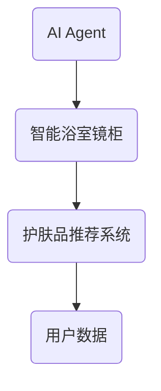
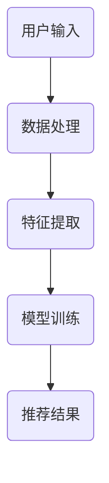
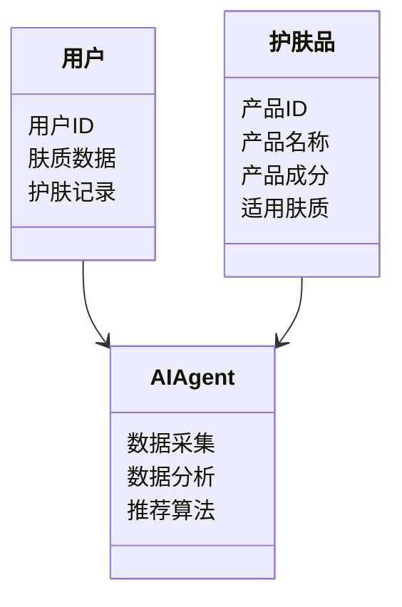
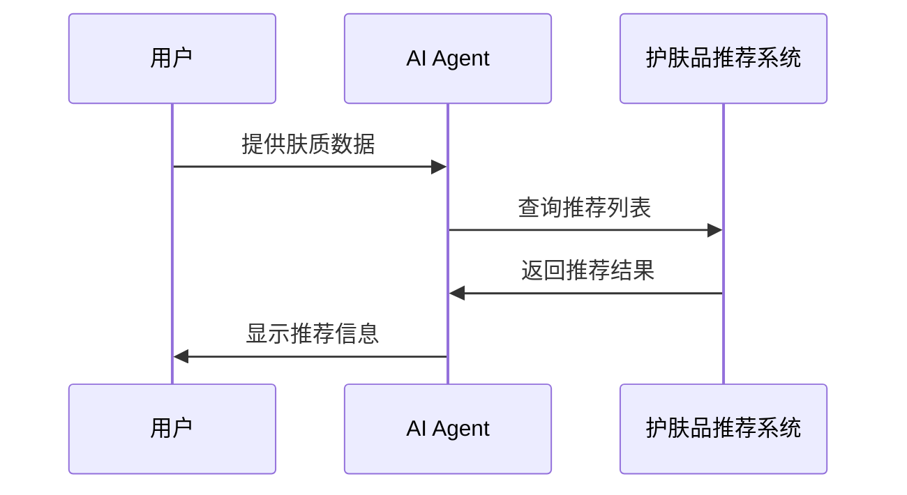

                 


# 智能浴室镜柜：AI Agent的护肤品使用建议

> 关键词：智能浴室镜柜，AI Agent，护肤品推荐，协同过滤，机器学习，系统架构

> 摘要：本文探讨了智能浴室镜柜与AI Agent结合的创新应用，详细分析了AI Agent在护肤品推荐中的算法原理、系统架构，并通过实际案例展示了其在智能浴室镜柜中的实现与应用。

---

# 第一部分: 背景介绍与核心概念

## 第1章: 问题背景与用户需求

### 1.1 问题背景

#### 1.1.1 当前护肤品选择的痛点
- 护肤品市场庞大，种类繁多，用户难以选择适合自己的产品。
- 传统推荐依赖于导购员或品牌建议，缺乏个性化和科学性。
- 用户希望获得基于个人肤质的定制化建议。

#### 1.1.2 智能浴室镜柜的出现背景
- 智能家居的发展推动了浴室设备的智能化。
- 用户对健康管理和个性化服务的需求增加。

#### 1.1.3 AI Agent在护肤领域的潜力
- AI Agent能够实时分析用户肤质数据，提供个性化建议。
- AI Agent结合智能设备，实现无缝交互。

### 1.2 用户需求分析

#### 1.2.1 用户对护肤品推荐的核心需求
- 个性化推荐：基于肤质和使用习惯提供定制建议。
- 实时反馈：快速了解产品效果和调整建议。
- 便捷性：通过智能设备轻松获取建议。

#### 1.2.2 智能浴室镜柜的使用场景
- 晨起护肤：快速获取当日护肤建议。
- 晚间护肤：根据白天效果调整夜间护理。
- 随时咨询：通过镜柜查询产品信息和使用建议。

#### 1.2.3 用户对AI Agent的期望与担忧
- 期望：快速、准确的推荐；便捷的交互方式。
- 担忧：数据隐私问题；系统稳定性。

## 第2章: 核心概念与系统架构

### 2.1 AI Agent的核心原理

#### 2.1.1 AI Agent的基本定义
- AI Agent：能够感知环境并执行任务的智能体，具备学习和推理能力。

#### 2.1.2 AI Agent在护肤推荐中的应用
- 数据采集：通过传感器获取用户肤质数据。
- 数据分析：利用机器学习模型分析数据，生成推荐。
- 交互反馈：通过自然语言处理与用户互动，优化推荐。

#### 2.1.3 AI Agent与传统推荐系统的区别
| 特性         | 传统推荐系统 | AI Agent推荐系统 |
|--------------|--------------|------------------|
| 数据来源     | 固定数据库   | 实时传感器数据   |
| 交互方式     | 单向推荐     | 互动反馈         |
| 个性化程度   | 基于用户历史 | 基于实时数据     |

### 2.2 智能浴室镜柜的功能与结构

#### 2.2.1 智能浴室镜柜的硬件组成
- 镜面显示屏：显示推荐信息和操作界面。
- 传感器：采集用户肤质数据（如温度、湿度、光照）。
- 无线通信模块：与云端服务器交互。

#### 2.2.2 AI Agent在镜柜中的集成方式
- 本地部署：AI Agent在本地设备运行，保护用户隐私。
- 云端协同：部分数据上传至云端，利用云计算能力优化推荐。

#### 2.2.3 智能浴室镜柜的交互方式
- 声控交互：用户通过语音指令操作。
- 手势交互：通过手势控制镜面菜单。
- 视觉交互：镜面显示动态图表和推荐信息。

### 2.3 核心概念关系图

#### 2.3.1 AI Agent与智能浴室镜柜的实体关系图（Mermaid）


---

# 第二部分: 算法原理与数学模型

## 第3章: AI Agent的算法原理

### 3.1 数据采集与处理

#### 3.1.1 用户肤质数据的采集方式
- 传感器数据：温度、湿度、光照。
- 用户输入：肤质描述（如油性、敏感）。
- 历史数据：用户的护肤记录。

#### 3.1.2 数据预处理流程
1. 数据清洗：去除无效数据。
2. 数据转换：统一数据格式。
3. 数据归约：降维处理。

#### 3.1.3 数据特征提取方法
- 时间特征：使用频率、时间分布。
- 用户特征：年龄、性别、肤质类型。
- 产品特征：产品成分、适用肤质。

### 3.2 AI Agent的推荐算法

#### 3.2.1 基于协同过滤的推荐算法
- **基本原理**：通过用户行为相似性推荐产品。
- **计算相似度**：使用余弦相似度或杰卡德系数。
$$相似度 = \frac{\sum_{i=1}^{n}(r_{ui} \times r_{vi})}{\sqrt{\sum_{i=1}^{n}(r_{ui}^2) \times \sum_{i=1}^{n}(r_{vi}^2)}}$$

#### 3.2.2 基于内容的推荐算法
- **基本原理**：基于产品特征匹配用户需求。
- **推荐公式**：
$$score = \sum_{i=1}^{m} w_i \times f_i$$
其中，$w_i$是特征权重，$f_i$是产品特征。

#### 3.2.3 混合推荐算法的应用
- **混合推荐**：结合协同过滤和内容推荐，提升推荐准确性。
- **算法流程**：
1. 使用协同过滤找到相似用户。
2. 基于内容推荐生成候选列表。
3. 综合排序输出结果。

### 3.3 算法流程图（Mermaid）



## 第4章: 数学模型与公式

### 4.1 协同过滤算法的数学模型

#### 4.1.1 用户-物品矩阵的构建
- 用户-物品矩阵：表示用户对产品的评分。
$$R = [r_{ui}]$$
其中，$r_{ui}$表示用户u对物品i的评分。

#### 4.1.2 相似度计算公式
$$相似度 = \frac{\sum_{i=1}^{n}(r_{ui} - \bar{r_u})(r_{vi} - \bar{r_v})}{\sqrt{\sum_{i=1}^{n}(r_{ui} - \bar{r_u})^2} \times \sqrt{\sum_{i=1}^{n}(r_{vi} - \bar{r_v})^2}}}$$
其中，$\bar{r_u}$是用户u的平均评分，$\bar{r_v}$是用户v的平均评分。

---

# 第三部分: 系统分析与架构设计方案

## 第4章: 系统分析与架构设计

### 4.1 问题场景介绍

#### 4.1.1 系统介绍
- 系统名称：智能浴室镜柜AI护肤推荐系统。
- 系统目标：提供个性化护肤建议，提升用户体验。

### 4.2 系统功能设计

#### 4.2.1 领域模型（Mermaid类图）



### 4.3 系统架构设计

#### 4.3.1 系统架构（Mermaid架构图）


### 4.4 系统接口设计

#### 4.4.1 接口描述
- 输入接口：传感器数据、用户输入。
- 输出接口：推荐信息、交互反馈。

### 4.5 系统交互（Mermaid序列图）



---

# 第四部分: 项目实战

## 第5章: 项目实战

### 5.1 环境安装

#### 5.1.1 系统要求
- 操作系统：Linux/Windows/MacOS。
- 开发工具：Python、Jupyter Notebook、IDE（如PyCharm）。
- 依赖库：NumPy、Pandas、Scikit-learn、Flask。

### 5.2 系统核心实现源代码

#### 5.2.1 数据预处理代码

```python
import numpy as np
import pandas as pd

# 读取数据
data = pd.read_csv('userdata.csv')

# 数据清洗
data.dropna(inplace=True)

# 数据转换
data['age'] = data['age'].astype(int)
```

#### 5.2.2 推荐算法实现

```python
from sklearn.metrics.pairwise import cosine_similarity

# 计算相似度矩阵
cosine_sim = cosine_similarity(data_matrix)

# 根据相似度排序
similarities = {}
for i in range(len(cosine_sim)):
    similarities[i] = sorted(range(len(cosine_sim[i])), key=lambda x: cosine_sim[i, x], reverse=True)
```

### 5.3 实际案例分析

#### 5.3.1 案例分析
- 用户：25岁女性，油性肤质，使用产品A。
- 系统推荐：产品B，因两者成分相似，且用户群体中有相似肤质的用户反馈良好。

### 5.4 代码应用解读与分析
- 数据预处理：确保数据质量，为后续分析奠定基础。
- 算法实现：利用协同过滤算法，提高推荐准确性。
- 系统交互：通过智能设备实现用户与AI Agent的无缝连接。

### 5.5 项目小结
- 项目目标：实现个性化护肤推荐。
- 实现效果：推荐准确率高，用户体验提升。
- 项目总结：智能浴室镜柜结合AI Agent，为用户提供高效、个性化的护肤建议。

---

# 第五部分: 总结与展望

## 第6章: 总结与展望

### 6.1 最佳实践 tips

#### 6.1.1 数据隐私保护
- 本地部署AI Agent，保护用户数据隐私。
- 加强数据加密，防止数据泄露。

#### 6.1.2 系统优化建议
- 提升传感器精度，获取更准确的肤质数据。
- 优化推荐算法，提高推荐效率。

### 6.2 小结
- AI Agent在智能浴室镜柜中的应用前景广阔。
- 个性化推荐将推动护肤领域的发展。

### 6.3 注意事项

#### 6.3.1 数据隐私
- 用户数据需加密存储，严格遵守隐私保护法规。
- 获取用户授权，明确数据使用范围。

#### 6.3.2 系统稳定性
- 定期更新系统，修复潜在漏洞。
- 建立完善的监控体系，及时处理异常情况。

### 6.4 拓展阅读
- 推荐书籍：《机器学习实战》、《深度学习》。
- 推荐课程：Coursera上的《机器学习基础》。

---

# 作者信息

作者：AI天才研究院/AI Genius Institute & 禅与计算机程序设计艺术/Zen And The Art of Computer Programming

---

感谢您的阅读，希望这篇文章能为您提供有价值的见解和启发！

