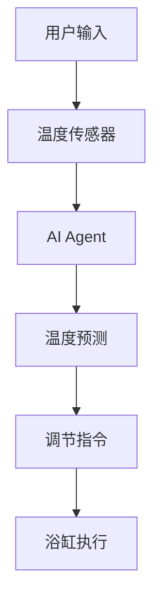
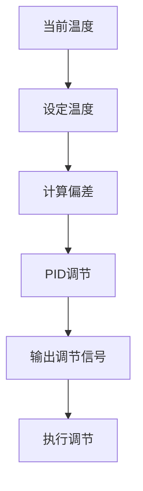
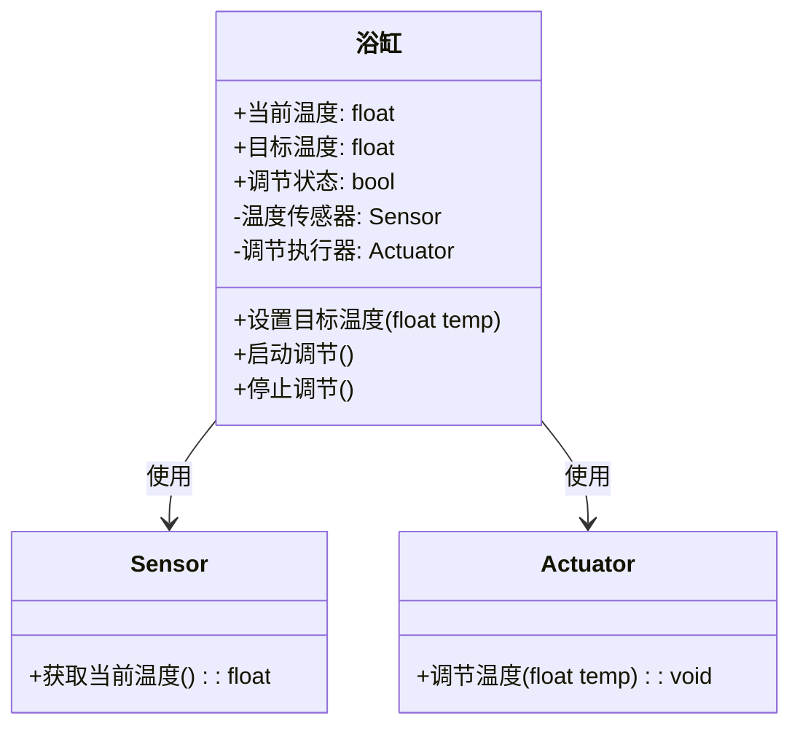
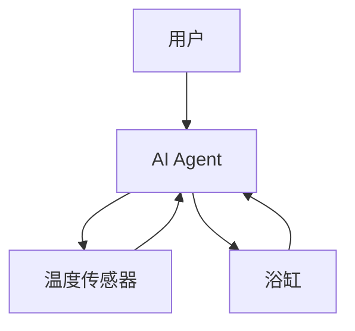
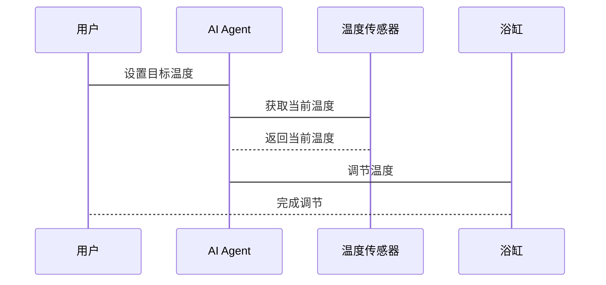

                 


# 智能浴缸：AI Agent的水温调节系统

## 关键词：AI Agent, 智能浴缸, 水温调节, 算法原理, 系统架构

## 摘要

本文探讨AI Agent在智能浴缸水温调节系统中的应用，从背景、核心概念到算法和系统设计，详细阐述其工作原理和实际应用。通过系统分析和项目实战，展示如何利用AI技术实现精准水温控制，为智能家居领域提供参考。

---

## 第一部分: 背景介绍与核心概念

### 第1章: 智能浴缸与AI Agent概述

#### 1.1 问题背景与描述

智能浴缸的发展趋势日益显著，AI Agent的应用为其增添了智能化。用户对舒适体验的需求推动了这一技术的进步。AI Agent通过感知、决策和执行，实现精准水温调节，满足个性化需求。

#### 1.2 问题解决与边界

水温调节的核心问题是实时调整至用户设定温度。系统边界包括温度传感器、AI Agent和浴缸。核心要素包括温度数据采集、调节指令输出和用户反馈。

### 第2章: AI Agent的核心概念与联系

#### 2.1 核心概念原理

AI Agent通过感知环境数据，如温度，进行决策并执行调节指令。系统架构包括传感器、处理单元和执行机构。通信机制确保各模块协同工作。

#### 2.2 概念属性特征对比表

| 特性 | 描述 |
|------|------|
| 感知 | 数据采集 |
| 决策 | 制定策略 |
| 执行 | 输出指令 |
| 反馈 | 用户反馈 |

#### 2.3 ER实体关系图

```mermaid
erd
    节点: 浴缸
    节点: 水温传感器
    节点: AI Agent
    节点: 用户
    关系: 水温传感器 -> 浴缸 (监测)
    关系: AI Agent -> 水温传感器 (接收数据)
    关系: AI Agent -> 用户 (接收指令)
    关系: AI Agent -> 浴缸 (调节温度)
```

---

## 第二部分: 算法原理讲解

### 第3章: AI Agent的水温调节算法

#### 3.1 温度预测模型



#### 3.2 PID控制算法



#### 3.3 数学模型与公式

温度预测模型：
$$ T_{\text{预测}} = T_{\text{当前}} + \alpha \cdot \Delta t $$

PID控制公式：
$$ u = K_p \cdot e + K_i \cdot \int e \, dt + K_d \cdot \frac{de}{dt} $$

---

## 第三部分: 系统分析与架构设计

### 第4章: 系统功能设计

#### 4.1 领域模型



### 4.2 系统架构设计



### 4.3 系统接口设计

API接口：
```javascript
// 获取当前温度
function getCurrentTemperature(): float;

// 设置目标温度
function setTargetTemperature(float temp): void;

// 启动调节
function startRegulation(): void;

// 停止调节
function stopRegulation(): void;
```

### 4.4 系统交互设计



---

## 第四部分: 项目实战

### 第5章: 系统核心实现

#### 5.1 环境安装

安装Python和必要的库：
```bash
pip install numpy scikit-learn
```

#### 5.2 核心代码实现

PID控制器实现：
```python
class PIDController:
    def __init__(self, Kp, Ki, Kd):
        self.Kp = Kp
        self.Ki = Ki
        self.Kd = Kd
        self.error = 0
        self.integral = 0
        self.derivative = 0

    def calculate(self, target, current):
        self.error = target - current
        self.integral += self.error * dt
        self.derivative = (self.error - previous_error) / dt
        output = self.Kp * self.error + self.Ki * self.integral + self.Kd * self.derivative
        return output
```

温度调节系统实现：
```python
class WaterTemperatureRegulator:
    def __init__(self, target_temp):
        self.target_temp = target_temp
        self.current_temp = get_current_temp()
        self.pid = PIDController(Kp=0.1, Ki=0.05, Kd=0.1)

    def regulate(self):
        while abs(self.current_temp - self.target_temp) > 0.5:
            desired_output = self.pid.calculate(self.target_temp, self.current_temp)
            self.current_temp += desired_output * dt
            time.sleep(dt)
```

#### 5.3 案例分析与应用

通过实际案例分析，展示系统在不同场景下的调节效果，如快速达到目标温度和应对温度波动的能力。

---

## 第五部分: 总结与展望

### 5.1 总结

AI Agent在智能浴缸中的应用展示了其强大的感知和执行能力，通过精确的算法实现水温调节，提升了用户体验。系统架构和算法设计确保了高效性和稳定性。

### 5.2 最佳实践 tips

- 系统设计需考虑实时性和稳定性。
- 传感器选择影响数据准确性。
- 调试时需关注PID参数的优化。

### 5.3 小结

AI Agent的应用扩展了智能家居的可能性，未来将结合更多传感器和用户反馈，进一步提升智能化水平。

---

## 参考文献

1. Russell, S. and Norvig, P. (2010). *Artificial Intelligence: A Modern Approach*.
2. Ljung, L. (1999). *System Identification: Theory and Practice*.

---

## 作者

作者：AI天才研究院/AI Genius Institute & 禅与计算机程序设计艺术 /Zen And The Art of Computer Programming

