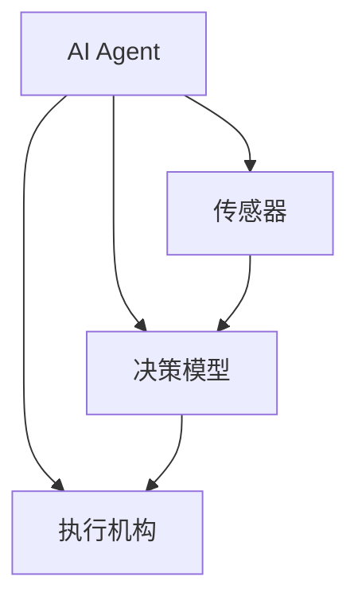
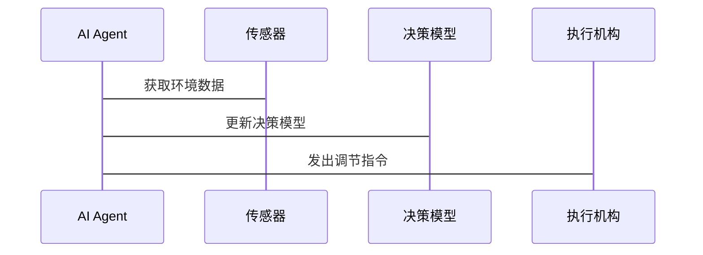

                 


# 智能温室：AI Agent的环境调节系统

## 关键词：
智能温室、AI Agent、环境调节、强化学习、传感器网络

## 摘要：
本文详细探讨了AI Agent在智能温室环境调节系统中的应用，从理论基础到实际实现，结合数学模型、系统架构设计和代码实现，分析了AI Agent在温室环境调节中的核心作用和实现方式。通过强化学习算法和传感器数据的结合，展示了如何构建一个高效的智能温室环境调节系统。

---

# 第一部分: 智能温室与AI Agent概述

## 第1章: 智能温室与AI Agent的背景介绍

### 1.1 智能温室的概念与背景
#### 1.1.1 温室环境调节的背景与问题背景
智能温室是一种利用自动化技术实现环境控制的现代农业设施。传统的温室依赖人工操作，存在效率低、成本高、精度不足等问题。随着AI技术的发展，智能温室逐渐成为农业现代化的重要方向。

#### 1.1.2 AI Agent在智能温室中的作用与目标
AI Agent（智能体）通过感知环境、做出决策并执行动作，能够实时调节温室的温度、湿度、光照等参数，从而优化植物生长条件。AI Agent的目标是实现温室环境的智能化、自动化管理。

#### 1.1.3 智能温室与传统温室的对比分析
| 比较维度 | 传统温室 | 智能温室 |
|----------|----------|----------|
| 调节方式 | 人工操作 | 自动化控制 |
| 调节精度 | 低 | 高 |
| 效率 | 低 | 高 |

#### 1.1.4 智能温室的边界与外延
智能温室的核心边界是温室环境的调节，外延包括传感器网络、执行机构、AI算法等技术支持。

### 1.2 AI Agent的核心概念与原理
#### 1.2.1 AI Agent的基本定义与特点
AI Agent是一种能够感知环境、自主决策并执行动作的智能实体。其特点包括自主性、反应性、目标导向和学习能力。

#### 1.2.2 AI Agent的感知、决策与执行机制
- **感知**：通过传感器获取环境数据。
- **决策**：基于感知数据做出调节决策。
- **执行**：通过执行机构调整环境参数。

#### 1.2.3 AI Agent与智能温室的结合方式
AI Agent通过传感器获取数据，利用算法做出决策，并通过执行机构调节环境。

#### 1.2.4 AI Agent在环境调节中的核心要素
- 数据采集：温度、湿度、光照强度等。
- 决策算法：强化学习、监督学习。
- 执行机构：加热器、加湿器、遮光帘等。

---

## 第2章: AI Agent与智能温室的核心概念与联系

### 2.1 AI Agent的核心概念原理
#### 2.1.1 AI Agent的基本原理与工作流程
AI Agent的工作流程包括感知、决策、执行和反馈四个阶段。

#### 2.1.2 AI Agent的感知能力与数据处理机制
- **感知**：通过传感器获取环境数据。
- **数据处理**：对传感器数据进行预处理和特征提取。

#### 2.1.3 AI Agent的决策模型与算法
- **监督学习**：基于历史数据训练分类模型。
- **强化学习**：通过奖励机制优化决策策略。

#### 2.1.4 AI Agent的执行与反馈机制
AI Agent根据决策结果驱动执行机构，并根据反馈调整决策策略。

### 2.2 核心概念属性特征对比表
| 概念 | 属性 | 特征 |
|------|------|------|
| AI Agent | 感知能力 | 数据采集、特征提取 |
| 决策模型 | 算法类型 | 监督学习、强化学习 |
| 执行机构 | 控制方式 | 开关控制、调节控制 |
| 环境变量 | 监测指标 | 温度、湿度、光照 |

### 2.3 ER实体关系图（Mermaid）
```mermaid
er
actor(AI Agent) -[发出指令]-> action(执行机构)
actor(AI Agent) -[获取数据]-> sensor(传感器)
actor(AI Agent) -[更新模型]-> model(决策模型)
```

---

## 第3章: AI Agent算法原理与数学模型

### 3.1 AI Agent的算法原理
#### 3.1.1 强化学习在AI Agent中的应用
强化学习通过奖励机制优化决策策略。例如，Q-learning算法用于温室温度调节。

#### 3.1.2 监督学习在环境调节中的作用
监督学习用于分类任务，例如根据历史数据预测最佳调节方案。

#### 3.1.3 联合概率图与决策树的使用
联合概率图用于建模变量之间的关系，决策树用于分类和回归。

#### 3.1.4 算法选择的依据与优化方向
算法选择应考虑数据特性、调节目标和计算资源。

### 3.2 数学模型与公式
#### 3.2.1 强化学习的Q-learning算法
$$ Q(s, a) = Q(s, a) + \alpha \times (r + \gamma \max Q(s', a') - Q(s, a)) $$
其中，$\alpha$是学习率，$\gamma$是折扣因子。

#### 3.2.2 监督学习的线性回归模型
$$ y = \beta_0 + \beta_1 x + \epsilon $$
其中，$y$是目标变量，$x$是自变量，$\epsilon$是误差项。

---

## 第4章: 系统设计与实现

### 4.1 问题场景介绍
智能温室环境调节系统需要实时采集环境数据，通过AI Agent做出决策，并驱动执行机构调整环境参数。

### 4.2 系统架构设计
#### 4.2.1 系统功能模块
- 数据采集模块：传感器采集环境数据。
- 数据处理模块：数据预处理和特征提取。
- 决策模块：AI Agent做出调节决策。
- 执行模块：驱动执行机构调整环境。

#### 4.2.2 系统架构图（Mermaid）


#### 4.2.3 系统接口设计
- 传感器接口：提供温度、湿度、光照强度等数据。
- 执行机构接口：接收调节指令。

#### 4.2.4 系统交互流程（Mermaid）


### 4.3 项目实战
#### 4.3.1 环境安装
安装Python、TensorFlow、Scikit-learn等库。

#### 4.3.2 系统核心实现
```python
# 强化学习部分
import numpy as np

class AI_Agent:
    def __init__(self, state_space, action_space):
        self.state_space = state_space
        self.action_space = action_space
        self.Q = np.zeros((state_space, action_space))

    def get_action(self, state):
        return np.argmax(self.Q[state, :])

    def update_Q(self, state, action, reward, next_state):
        self.Q[state, action] += 0.1 * (reward + 0.9 * np.max(self.Q[next_state, :]))
```

#### 4.3.3 代码应用解读与分析
代码实现了一个简单的Q-learning算法，用于温室温度调节。

#### 4.3.4 实际案例分析
通过传感器数据和历史调节记录，训练AI Agent优化温室环境。

#### 4.3.5 项目小结
项目展示了AI Agent在智能温室中的实际应用，验证了算法的有效性。

---

## 第5章: 优化与扩展

### 5.1 系统优化方向
- 提高算法效率。
- 增强系统的鲁棒性。

### 5.2 系统扩展建议
- 引入更多环境变量。
- 结合物联网技术实现远程控制。

### 5.3 最佳实践 tips
- 定期更新模型。
- 优化传感器布局。

### 5.4 小结
本文详细探讨了AI Agent在智能温室环境调节系统中的应用，从理论到实践，展示了系统的实现过程。

---

## 作者信息

作者：AI天才研究院/AI Genius Institute & 禅与计算机程序设计艺术 /Zen And The Art of Computer Programming

---

# 结语
智能温室与AI Agent的结合为农业自动化带来了新的可能性。通过强化学习和传感器网络的应用，AI Agent能够实时调节环境参数，优化植物生长条件。未来，随着技术的不断发展，智能温室将更加高效和智能化。

