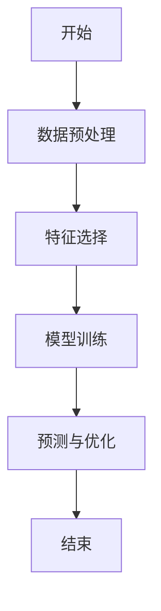

                 


# 智能灯光控制：AI Agent的情境感知系统

> 关键词：智能灯光控制，AI Agent，情境感知系统，物联网，智能家居，人工智能

> 摘要：本文详细探讨了基于AI Agent的情境感知系统在智能灯光控制中的应用。通过分析系统架构、算法原理和项目实现，展示了如何利用人工智能技术实现智能化的灯光控制，提升用户体验和能源效率。

---

## 第一部分: 智能灯光控制的背景与概念

### 第1章: 智能灯光控制的背景与问题描述

#### 1.1 问题背景

- **传统灯光控制的局限性**
  - 手动开关或简单定时控制的不足
  - 无法适应用户实时需求和环境变化
  - 无法实现个性化和智能化的灯光调节

- **智能化控制的需求与趋势**
  - 智能家居的发展推动了灯光控制的智能化
  - 用户对舒适性、节能性和便捷性的需求增加
  - 人工智能技术的进步为智能控制提供了可能性

- **AI Agent在灯光控制中的应用潜力**
  - 利用AI Agent实现情境感知和智能决策
  - 通过机器学习优化灯光控制策略
  - 提供个性化和自适应的灯光解决方案

#### 1.2 问题描述

- **智能化控制的目标**
  - 实现自动化和智能化的灯光调节
  - 提高能源利用效率
  - 提供舒适的用户体验

- **情境感知系统的核心需求**
  - 实时感知环境和用户需求
  - 根据环境变化动态调整灯光设置
  - 提供个性化和智能化的控制策略

- **系统边界与外延**
  - 系统适用于家庭、办公室等室内环境
  - 边界包括灯光设备、传感器和用户交互界面
  - 外延可扩展至其他智能家居设备

#### 1.3 问题解决思路

- **AI Agent的基本概念**
  - 定义：AI Agent是一个智能体，能够感知环境并采取行动以实现目标
  - 类型：基于规则、基于机器学习和基于深度学习的AI Agent

- **情境感知系统的设计目标**
  - 实时感知环境和用户需求
  - 动态调整灯光设置以满足需求
  - 提供个性化和自适应的控制策略

- **系统实现的关键技术**
  - 传感器数据采集与处理
  - AI算法的开发与应用
  - 灯光设备的控制与管理

#### 1.4 概念结构与核心要素

- **系统架构的核心要素**
  - 环境感知层：传感器和数据采集模块
  - 决策控制层：AI Agent和算法模块
  - 执行层：灯光设备和执行机构

- **各要素之间的关系**
  - 环境感知层提供数据，决策控制层进行分析和决策，执行层根据决策执行操作
  - 各层之间通过接口进行数据交互和通信

- **系统的核心功能与特性**
  - 实时感知环境和用户需求
  - 智能决策和自适应控制
  - 个性化和便捷的用户体验

---

## 第2章: AI Agent与情境感知系统的核心概念

### 2.1 AI Agent的基本原理

#### 2.1.1 AI Agent的定义与分类

- **定义**：AI Agent是一个智能体，能够感知环境并采取行动以实现目标
- **分类**：
  - 基于规则的AI Agent
  - 基于机器学习的AI Agent
  - 基于深度学习的AI Agent

#### 2.1.2 情境感知的基本概念

- **定义**：情境感知是指系统能够感知当前环境和用户需求，并根据这些信息做出相应的决策
- **实现方式**：
  - 通过传感器采集环境数据
  - 利用AI算法分析数据并做出决策
  - 根据决策结果调整灯光设置

#### 2.1.3 系统的核心概念体系

- **概念体系**：
  - 环境感知
  - 用户需求
  - 智能决策
  - 灯光控制

---

## 第3章: 算法原理与数学模型

### 3.1 算法原理

#### 3.1.1 算法选择与原理

- **选择的算法**：基于规则的决策树
- **算法原理**：
  - 数据预处理：清洗和归一化
  - 特征选择：选择影响灯光控制的主要因素
  - 模型训练：构建决策树
  - 预测与优化：根据数据不断优化模型

#### 3.1.2 算法流程图



---

## 第4章: 系统分析与架构设计

### 4.1 系统架构设计

#### 4.1.1 系统架构图


---

## 第5章: 项目实战

### 5.1 环境安装

```bash
pip install numpy pandas scikit-learn matplotlib
```

### 5.2 核心代码实现

```python
import numpy as np
from sklearn.tree import DecisionTreeClassifier
from sklearn.model_selection import train_test_split

# 示例数据
X = np.array([[0, 0, 1], [0, 1, 1], [1, 0, 1], [0, 0, 1]])
y = np.array([0, 1, 1, 0])

# 数据分割
X_train, X_test, y_train, y_test = train_test_split(X, y, test_size=0.2)

# 模型训练
model = DecisionTreeClassifier()
model.fit(X_train, y_train)

# 预测与评估
print("预测:", model.predict(X_test))
print("真实值:", y_test)
```

---

## 第6章: 最佳实践与总结

### 6.1 最佳实践

- **传感器选择**：选择高精度、低功耗的传感器
- **数据预处理**：确保数据的准确性和完整性
- **模型调优**：通过交叉验证优化模型性能

### 6.2 项目总结

- **成果**：成功实现了基于AI Agent的情境感知系统
- **不足**：系统性能有待进一步优化
- **未来方向**：探索更复杂的AI算法和应用场景

---

## 作者

作者：AI天才研究院 & 禅与计算机程序设计艺术

---

通过以上结构，您可以逐步展开每一部分的内容，结合实际案例和详细的技术实现，撰写一篇完整的技术博客文章。

