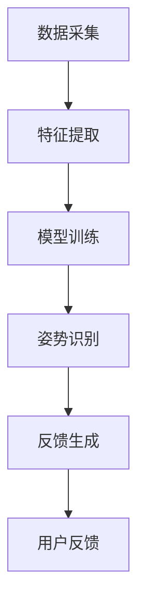
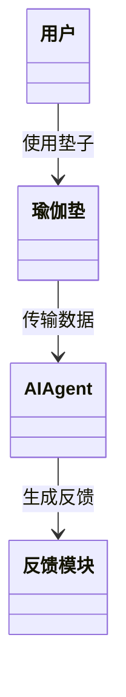
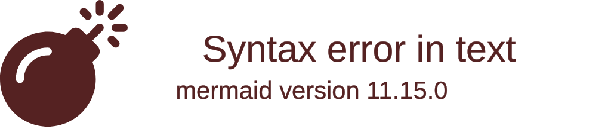

                 


# 智能瑜伽垫：AI Agent的姿势纠正系统

## 关键词：AI Agent，智能瑜伽垫，姿势纠正系统，物联网，运动分析，深度学习

## 摘要：  
随着人工智能和物联网技术的快速发展，智能瑜伽垫结合AI Agent的姿势纠正系统正逐渐成为瑜伽教学和自我练习的重要工具。本文将从背景介绍、核心概念、算法原理、系统架构、项目实战等多个方面，详细探讨这一创新技术的实现过程、应用场景及未来发展方向。

---

## 第一部分：背景介绍

### 第1章：智能瑜伽垫的背景与问题背景

#### 1.1 问题背景
- **1.1.1 瑜伽姿势纠正的重要性**  
  瑜伽是一种通过体位法（Asana）来改善身体柔韧性、平衡性和专注力的运动。然而，许多人在练习瑜伽时由于缺乏专业指导，容易出现姿势不正确的问题，导致运动损伤或效果不佳。

- **1.1.2 传统瑜伽教学的局限性**  
  传统瑜伽教学依赖于人工观察和经验丰富的教练，但这种方式存在以下问题：  
  - 教练资源有限，难以覆盖大量需求。  
  - 学习者需要频繁预约，灵活性不足。  
  - 远程学习者无法获得实时反馈。

- **1.1.3 AI技术在瑜伽教学中的应用潜力**  
  AI技术的快速发展为瑜伽教学带来了新的可能性。通过计算机视觉、深度学习等技术，AI Agent可以实时分析用户的姿势，提供即时反馈和纠正建议。

#### 1.2 问题描述
- **1.2.1 瑜伽姿势纠正的需求分析**  
  学习者需要一个便捷、低成本、实时反馈的工具，帮助他们纠正姿势，避免受伤，提高练习效果。

- **1.2.2 智能瑜伽垫的目标用户**  
  - 初学者：帮助他们掌握正确的姿势。  
  - 中级学习者：提供进阶指导。  
  - 远程学习者：无需现场教练即可获得反馈。

- **1.2.3 系统需要解决的核心问题**  
  - 实时检测用户的瑜伽姿势。  
  - 准确识别姿势中的错误。  
  - 提供有效的纠正建议。

#### 1.3 问题解决
- **1.3.1 AI Agent在姿势纠正中的作用**  
  AI Agent通过传感器数据和计算机视觉技术，实时分析用户的姿势，并通过语音或震动等方式提供反馈。

- **1.3.2 智能瑜伽垫的技术实现路径**  
  - 数据采集：通过垫子内置的传感器或摄像头捕捉用户的姿势数据。  
  - 数据处理：利用深度学习算法分析数据，识别姿势问题。  
  - 反馈输出：通过震动、灯光或语音等方式通知用户纠正姿势。

- **1.3.3 系统设计的创新点**  
  - 结合AI技术与物联网设备，实现智能化、实时化的姿势纠正。  
  - 用户友好设计，便于远程学习和自我练习。

#### 1.4 系统的边界与外延
- **1.4.1 系统的功能边界**  
  系统仅专注于姿势纠正，不涉及瑜伽课程的生成或播放。  
- **1.4.2 系统的外延应用场景**  
  - 健身房、家庭、远程教学等场景。  
- **1.4.3 系统与其他系统的接口关系**  
  - 可与智能音箱、手机App等设备联动，提供更丰富的反馈方式。

### 第2章：核心概念与联系

#### 2.1 AI Agent的核心原理
- **2.1.1 AI Agent的基本概念**  
  AI Agent是一种能够感知环境、自主决策并执行任务的智能实体。  
- **2.1.2 AI Agent的分类与特点**  
  - 分类：基于智能水平可分为反应式、认知式和混合式AI Agent。  
  - 特点：自主性、反应性、学习能力、推理能力。  
- **2.1.3 AI Agent在姿势纠正中的应用**  
  AI Agent通过感知用户姿势数据，实时提供纠正建议。

#### 2.2 瑜伽姿势纠正系统的概念结构
- **2.2.1 系统的功能模块**  
  - 数据采集模块：负责采集用户的姿势数据。  
  - 姿势分析模块：利用AI算法分析数据，识别错误姿势。  
  - 反馈模块：通过震动或语音提供纠正建议。  
- **2.2.2 系统的输入输出**  
  - 输入：用户的姿势数据。  
  - 输出：纠正建议、反馈信息。  
- **2.2.3 系统的核心算法**  
  - 基于深度学习的姿势识别算法。

#### 2.3 核心概念的联系
- **2.3.1 AI Agent与瑜伽姿势的关系**  
  AI Agent通过分析瑜伽姿势数据，帮助用户纠正错误姿势。  
- **2.3.2 数据采集与姿势分析的关联**  
  数据采集是姿势分析的基础，姿势分析是数据采集的目的。  
- **2.3.3 用户反馈与系统优化的互动**  
  用户反馈帮助系统不断优化姿势纠正算法。

---

## 第二部分：核心概念与联系的图表分析

### 第3章：AI Agent与瑜伽垫的实体关系图

```mermaid
er
  actor 用户
  entity 瑜伽姿势数据
  entity 系统反馈
  entity 姿势纠正建议
  relation 用户姿势数据
  relation 系统反馈
  relation 姿势纠正建议
```

---

## 第三部分：算法原理讲解

### 第4章：数据采集与特征提取

#### 4.1 数据采集流程
- 传感器数据采集：垫子内置压力传感器采集用户的体重分布数据。  
- 视频数据采集：摄像头捕捉用户的动作姿态。  

#### 4.2 特征提取
- 压力分布特征：分析用户重心分布情况。  
- 姿势关键点特征：提取动作中的关键点坐标。

### 第5章：模型训练与实时反馈

#### 5.1 算法流程


#### 5.2 模型训练
- 使用深度学习框架（如TensorFlow）训练姿势识别模型。  
- 数据集：包含多种瑜伽姿势的标注数据。  

#### 5.3 实时反馈
- 通过传感器或摄像头实时采集数据，输入模型进行分析，输出纠正建议。

---

## 第四部分：系统分析与架构设计

### 第6章：系统功能设计

#### 6.1 领域模型


#### 6.2 系统架构


---

## 第五部分：项目实战

### 第7章：环境安装与核心代码实现

#### 7.1 环境安装
- 安装Python、TensorFlow、OpenCV等依赖库。

#### 7.2 核心代码实现
```python
import tensorflow as tf
import cv2

# 加载预训练模型
model = tf.keras.models.load_model('pose_correction_model.h5')

# 实时采集视频流
cap = cv2.VideoCapture(0)

while True:
    ret, frame = cap.read()
    if not ret:
        break
    # 进行姿势分析
    prediction = model.predict(frame)
    # 生成反馈
    feedback = get_feedback(prediction)
    print(feedback)
```

---

## 第六部分：总结与展望

### 第8章：总结与注意事项

#### 8.1 最佳实践 Tips
- 数据采集要多样化，确保模型的泛化能力。  
- 反馈模块的设计要简洁易懂，避免信息过载。  

#### 8.2 小结
智能瑜伽垫结合AI Agent的姿势纠正系统，通过技术创新解决了传统瑜伽教学中的痛点，为用户提供了便捷、高效的练习方式。

#### 8.3 注意事项
- 系统数据的安全性需要重视。  
- 确保传感器和摄像头的精度和稳定性。  

#### 8.4 拓展阅读
- 深度学习在计算机视觉中的应用。  
- 物联网技术在健身领域的创新应用。

---

## 作者：AI天才研究院/AI Genius Institute & 禅与计算机程序设计艺术 /Zen And The Art of Computer Programming

