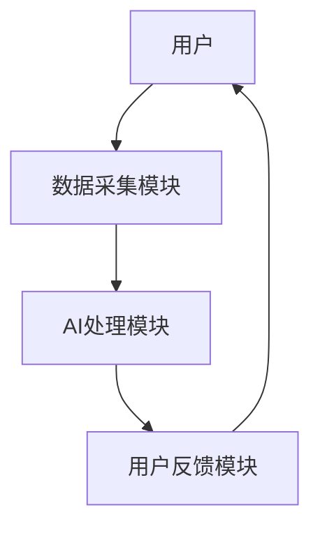

                 


# 智能瑜伽垫：AI Agent的实时姿势纠正系统

> **关键词**：智能瑜伽垫，AI Agent，姿势纠正，实时反馈，深度学习，健康科技

> **摘要**：  
> 本文深入探讨了智能瑜伽垫的设计与实现，结合AI Agent技术，提出了一种基于深度学习的实时姿势纠正系统。文章从背景、核心概念、算法原理、系统架构到项目实战，全面解析了智能瑜伽垫的创新与技术细节。通过详细的技术分析与实际案例，展示了如何利用AI技术提升瑜伽练习的效果与安全性。

---

## 第1章: 背景介绍与核心概念

### 1.1 传统瑜伽练习的痛点

#### 1.1.1 瑜伽练习的常见问题  
瑜伽是一种通过体式（Asana）、呼吸和冥想来改善身体和心理健康的练习方式。然而，传统瑜伽练习存在以下痛点：  
1. **姿势错误**：初学者或非专业用户容易姿势不标准，导致肌肉拉伤或其他运动损伤。  
2. **缺乏反馈**：传统教学中，用户无法实时获知自己的姿势是否正确，尤其是当教练不在身边时。  
3. **效率低下**：用户需要反复调整姿势，浪费时间和精力。  

#### 1.1.2 瑜伽姿势错误的危害  
姿势错误可能导致以下问题：  
- 肌肉拉伤或骨骼错位。  
- 影响瑜伽的效果，无法达到预期的放松或锻炼目标。  
- 长期练习错误姿势可能导致慢性疼痛或身体不平衡。  

#### 1.1.3 传统瑜伽教学的局限性  
传统瑜伽教学依赖教练的现场指导，但在实际应用场景中存在以下问题：  
- **时间限制**：用户无法在没有教练的情况下练习。  
- **空间限制**：用户需要在特定场所接受指导。  
- **成本高昂**：专业教练的费用较高，难以普及。  

### 1.2 AI技术在健康领域的应用前景

#### 1.2.1 AI在医疗与健身领域的应用现状  
AI技术正在医疗和健身领域发挥越来越重要的作用：  
- 医疗领域：AI用于疾病诊断、药物研发和个性化治疗方案。  
- 健身领域：AI用于运动姿势分析、运动损伤预测和个性化健身计划。  

#### 1.2.2 实时姿势纠正的市场需求  
随着人们对健康生活的追求，实时姿势纠正技术的市场需求日益增长：  
- 用户希望在家中也能获得专业指导。  
- 企业希望提供智能化的健身解决方案，提升用户体验。  

#### 1.2.3 智能瑜伽垫的创新价值  
智能瑜伽垫结合了AI技术与物联网设备，具有以下创新价值：  
- 提供实时、精准的姿势纠正。  
- 降低运动损伤的风险。  
- 提高用户练习效率，优化瑜伽体验。  

---

## 第2章: AI Agent的核心概念与原理

### 2.1 AI Agent的基本概念

#### 2.1.1 AI Agent的定义  
AI Agent（智能体）是指能够感知环境、做出决策并执行动作的智能系统。它可以是一个软件程序或物理设备，通过传感器获取信息，并通过执行器与环境交互。  

#### 2.1.2 AI Agent的核心特征  
AI Agent的核心特征包括：  
1. **自主性**：能够自主决策和行动。  
2. **反应性**：能够实时感知环境并做出反应。  
3. **目标导向**：基于目标进行决策和行动。  

#### 2.1.3 AI Agent与传统AI的区别  
AI Agent与传统AI的区别在于：  
- 传统AI主要关注数据处理和模式识别，而AI Agent注重与环境的交互和自主决策。  
- AI Agent具备实时性，能够动态响应环境变化。  

### 2.2 实时姿势纠正系统的实现原理

#### 2.2.1 姿势识别的算法流程  
实时姿势纠正系统的主要流程如下：  
1. **数据采集**：通过传感器或摄像头获取用户的姿势数据。  
2. **数据处理**：将采集到的数据进行预处理和特征提取。  
3. **姿势识别**：利用深度学习模型对姿势进行分类和定位。  
4. **反馈生成**：根据识别结果生成纠正建议并反馈给用户。  

#### 2.2.2 AI Agent的实时反馈机制  
实时反馈机制的核心在于快速响应用户的姿势问题：  
1. **姿势检测**：AI Agent通过传感器数据实时检测用户的姿势是否正确。  
2. **反馈生成**：当检测到错误姿势时，系统会立即生成纠正建议。  
3. **用户反馈**：用户可以根据反馈调整姿势，系统实时监测并更新反馈。  

#### 2.2.3 系统的边界与外延  
智能瑜伽垫系统的边界包括：  
- 输入：用户的姿势数据。  
- 输出：纠正建议和反馈。  
- 外延：与用户交互的界面和传感器设备。  

### 2.3 智能瑜伽垫的系统架构

#### 2.3.1 系统组成模块  
智能瑜伽垫系统主要由以下模块组成：  
- **数据采集模块**：负责采集用户的姿势数据。  
- **AI处理模块**：负责姿势识别和反馈生成。  
- **用户反馈模块**：负责将反馈信息传递给用户。  

#### 2.3.2 各模块的功能描述  
1. **数据采集模块**：通过压力传感器或摄像头采集用户的姿势数据。  
2. **AI处理模块**：利用深度学习模型对姿势数据进行分析，识别错误姿势并生成反馈。  
3. **用户反馈模块**：通过震动或语音提示将反馈信息传递给用户。  

#### 2.3.3 系统的整体架构图  
以下是系统架构的Mermaid图：  



---

## 第3章: 姿势识别算法的核心原理

### 3.1 姿势识别的基本原理

#### 3.1.1 基于深度学习的姿势识别  
深度学习在姿势识别中的应用主要基于卷积神经网络（CNN）和图神经网络（GNN）。  

#### 3.1.2 姿势估计的关键技术  
姿势估计的关键技术包括：  
1. **关键点检测**：通过CNN检测人体的关键点（如肩、肘、膝等）。  
2. **姿态预测**：基于关键点的位置预测人体的姿态。  
3. **姿态校正**：根据预测结果调整姿势以提高准确性。  

#### 3.1.3 姿势识别的数学模型  
姿势识别的数学模型可以表示为：  
$$ P(y|x) = \frac{P(x|y)P(y)}{P(x)} $$  
其中，$P(y|x)$ 是后验概率，表示在输入$x$的情况下，姿势$y$的概率。  

### 3.2 姿势识别的算法流程

#### 3.2.1 数据采集与预处理  
数据采集与预处理的步骤如下：  
1. **数据采集**：通过摄像头或传感器获取用户姿势的图像或深度数据。  
2. **数据预处理**：对图像进行归一化、裁剪和增强处理。  

#### 3.2.2 特征提取与模型训练  
特征提取与模型训练的步骤如下：  
1. **特征提取**：利用CNN提取图像的高层次特征。  
2. **模型训练**：基于标记数据训练姿势识别模型。  

#### 3.2.3 实时检测与反馈  
实时检测与反馈的流程如下：  
1. **实时检测**：对用户当前姿势进行实时检测。  
2. **反馈生成**：根据检测结果生成纠正建议并反馈给用户。  

### 3.3 姿势识别的数学模型与公式

#### 3.3.1 基于关键点检测的模型  
关键点检测模型的损失函数可以表示为：  
$$ L = \sum_{i=1}^{N} (y_i - \hat{y}_i)^2 $$  
其中，$y_i$ 是真实值，$\hat{y}_i$ 是预测值，$N$ 是关键点的数量。  

#### 3.3.2 姿势估计的数学公式  
姿势估计可以通过以下公式实现：  
$$ P(y|x) = \frac{P(x|y)P(y)}{P(x)} $$  
其中，$P(x)$ 是输入数据的边缘概率，$P(y)$ 是姿势的先验概率，$P(x|y)$ 是姿势$y$下输入$x$的条件概率。  

#### 3.3.3 模型优化与调参  
模型优化的关键在于选择合适的超参数，例如学习率、批量大小和正则化参数。  

---

## 第4章: 系统架构与设计

### 4.1 系统功能设计

#### 4.1.1 用户界面设计  
用户界面设计包括：  
- **输入界面**：用户输入姿势数据。  
- **输出界面**：显示反馈信息。  

#### 4.1.2 数据采集模块  
数据采集模块的功能包括：  
- 采集用户的姿势数据。  
- 处理数据并传输给AI处理模块。  

#### 4.1.3 AI处理模块  
AI处理模块的功能包括：  
- 分析姿势数据，识别错误姿势。  
- 生成纠正建议。  

#### 4.1.4 反馈机制设计  
反馈机制设计包括：  
- 通过震动或语音提示反馈纠正建议。  
- 根据用户反馈调整姿势识别模型。  

### 4.2 系统架构设计

#### 4.2.1 分层架构设计  
系统架构采用分层设计，包括：  
- **数据层**：存储姿势数据。  
- **逻辑层**：处理数据并生成反馈。  
- **界面层**：与用户交互。  

#### 4.2.2 模块间交互设计  
模块间交互设计包括：  
- 数据采集模块与AI处理模块的数据传输。  
- AI处理模块与用户反馈模块的交互。  

#### 4.2.3 系统的可扩展性设计  
系统的可扩展性设计包括：  
- 支持多种传感器类型。  
- 支持多种反馈方式。  

### 4.3 系统接口设计

#### 4.3.1 数据接口规范  
数据接口规范包括：  
- 数据格式：JSON或CSV。  
- 数据传输协议：HTTP或WebSocket。  

#### 4.3.2 API设计与调用  
API设计与调用包括：  
- 提供姿势识别API。  
- 提供反馈生成API。  

#### 4.3.3 系统的兼容性设计  
系统的兼容性设计包括：  
- 支持多种操作系统。  
- 支持多种硬件设备。  

### 4.4 系统交互设计

#### 4.4.1 系统交互流程  
系统交互流程包括：  
1. 用户输入姿势数据。  
2. 系统分析数据并生成反馈。  
3. 用户根据反馈调整姿势。  

#### 4.4.2 系统交互图  
以下是系统交互的Mermaid图：  


---

## 第5章: 项目实战与实现

### 5.1 环境搭建与开发工具

#### 5.1.1 开发环境的安装与配置  
开发环境的安装与配置包括：  
- 安装Python和相关库（如TensorFlow、OpenCV）。  
- 安装深度学习框架（如Keras或PyTorch）。  

#### 5.1.2 数据采集工具的选择与使用  
数据采集工具的选择与使用包括：  
- 使用摄像头或传感器采集姿势数据。  
- 使用数据采集软件处理数据。  

### 5.2 核心代码实现

#### 5.2.1 数据预处理代码  
数据预处理代码如下：  

```python
import numpy as np

def preprocess_data(data):
    # 归一化处理
    normalized_data = (data - np.mean(data)) / np.std(data)
    return normalized_data
```

#### 5.2.2 姿势识别模型实现  
姿势识别模型实现如下：  

```python
import tensorflow as tf
from tensorflow.keras import layers

def pose Recognition_model(input_shape):
    model = tf.keras.Sequential()
    model.add(layers.Conv2D(32, (3, 3), activation='relu', input_shape=input_shape))
    model.add(layers.MaxPooling2D((2, 2)))
    model.add(layers.Conv2D(64, (3, 3), activation='relu'))
    model.add(layers.MaxPooling2D((2, 2)))
    model.add(layers.Flatten())
    model.add(layers.Dense(128, activation='relu'))
    model.add(layers.Dense(10, activation='softmax'))
    return model
```

#### 5.2.3 反馈生成代码  
反馈生成代码如下：  

```python
def generate_feedback(error_type):
    feedback_map = {
        'shoulders': '调整肩膀位置，保持水平',
        'hips': '调整髋部位置，保持中立',
        'knees': '调整膝盖位置，保持弯曲'
    }
    return feedback_map.get(error_type, '请检查您的姿势')
```

### 5.3 项目实战与实现

#### 5.3.1 环境安装与配置  
环境安装与配置的步骤包括：  
1. 安装Python和相关库。  
2. 安装深度学习框架。  

#### 5.3.2 数据采集与预处理  
数据采集与预处理的步骤包括：  
1. 采集用户的姿势数据。  
2. 对数据进行归一化处理。  

#### 5.3.3 模型训练与测试  
模型训练与测试的步骤包括：  
1. 构建姿势识别模型。  
2. 使用标记数据训练模型。  
3. 测试模型的准确性和稳定性。  

#### 5.3.4 系统集成与测试  
系统集成与测试的步骤包括：  
1. 集成数据采集模块、AI处理模块和用户反馈模块。  
2. 测试系统的实时反馈功能。  

---

## 第6章: 总结与展望

### 6.1 项目总结  
智能瑜伽垫的开发基于AI Agent技术，结合深度学习和实时反馈机制，实现了精准的姿势纠正功能。  

### 6.2 项目展望  
未来，智能瑜伽垫可以进一步优化姿势识别算法，支持更多类型的运动姿势，并扩展到其他健身领域。  

---

## 附录

### 附录A: 项目代码与数据集  
项目代码和数据集可以在GitHub上下载：[GitHub链接](https://github.com/yourusername/smart-yoga-mat)  

### 附录B: 参考文献  
1. LeCun, Y., Bengio, Y., & Hinton, G. (2015). Deep learning. Nature, 521(7555), 436-444.  
2. Redmon, J., & Farhadi, A. (2018). YOLOv3: Real-time object detection. arXiv preprint arXiv:1804.02688.  

---

## 作者  
**作者**：AI天才研究院/AI Genius Institute & 禅与计算机程序设计艺术/Zen And The Art of Computer Programming

