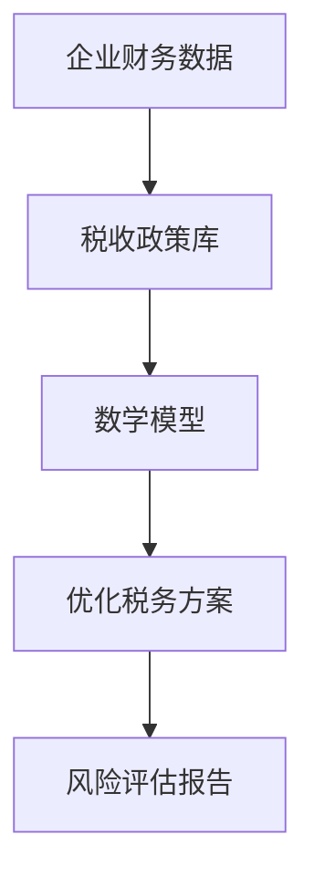
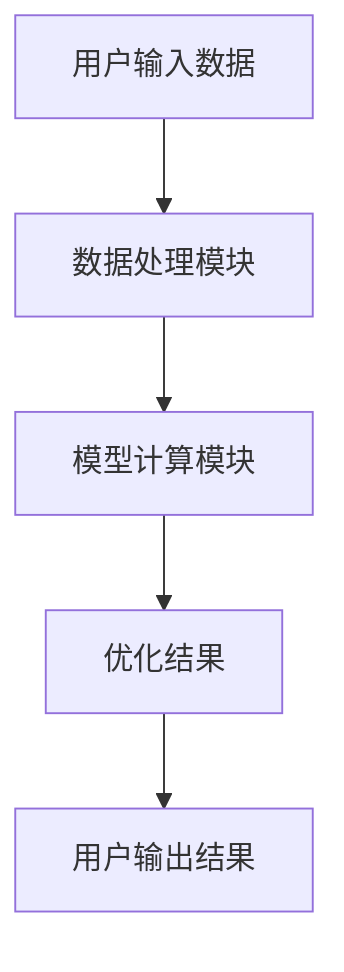
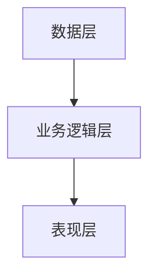

                 


# 智能税收筹划建议系统

## 关键词：
智能税收筹划，人工智能，税收优化，机器学习，系统架构设计

## 摘要：
本文详细探讨了智能税收筹划建议系统的构建与实现。从背景介绍到系统架构设计，再到项目实战，系统地阐述了如何利用人工智能技术优化税收筹划过程。文章首先介绍了智能税收筹划的基本概念与核心问题，然后深入分析了税收优化模型与算法，接着详细讲解了系统的功能设计与架构，最后通过实际案例展示了系统的实现与应用。本文旨在为相关领域的技术人员和企业管理者提供理论支持与实践指导。

---

# 第1章: 智能税收筹划建议系统概述

## 1.1 税收筹划的背景与意义

### 1.1.1 税收筹划的基本概念
税收筹划是指通过合法手段，优化企业或个人的税务负担，以实现税后利润最大化的过程。它是财务管理的重要组成部分，旨在在遵守税法的前提下，合理规划税务事项。

### 1.1.2 税收筹划在企业中的重要性
企业在经营过程中会面临多种税务问题，如企业所得税、增值税、个人所得税等。合理的税收筹划可以帮助企业降低税务负担，提高资金利用率，增强企业竞争力。

### 1.1.3 智能化税收筹划的必要性
随着税务法规的复杂化和多样化，传统的手工税收筹划方式效率低下，难以应对复杂多变的税务环境。智能化税收筹划通过引入人工智能技术，能够快速分析海量数据，提供最优税务方案。

## 1.2 智能税收筹划建议系统的核心问题

### 1.2.1 税收筹划中的关键问题
1. 税收政策的复杂性：不同地区、不同行业有不同的税收政策，如何快速准确地理解和应用这些政策是关键。
2. 数据的多样性和实时性：税收筹划需要考虑企业的实时财务数据，如何高效处理这些数据是系统设计的核心问题。
3. 税务风险的规避：如何在合法合规的前提下，最大限度地优化税务负担，是税收筹划的核心目标。

### 1.2.2 系统需要解决的主要问题
1. 如何高效采集和处理企业的财务数据。
2. 如何构建数学模型，优化税务方案。
3. 如何实时更新税收政策，确保系统建议的合法性。

### 1.2.3 系统的边界与外延
智能税收筹划系统的核心功能是为企业提供税收优化建议，边界包括企业财务数据的采集、税务政策的分析、税务模型的建立与优化。系统的外延则包括与企业财务系统、税务机关系统的接口设计。

## 1.3 系统的核心要素与概念结构

### 1.3.1 系统的核心要素
1. **用户输入**：企业的财务数据、业务模式等。
2. **税收政策库**：包含各地区的税收政策、法规等。
3. **数学模型**：用于优化税务方案的核心算法。
4. **输出结果**：优化后的税务方案、风险评估报告等。

### 1.3.2 概念结构与核心要素组成
通过构建概念结构图（如下图所示），我们可以清晰地看到系统的核心要素及其关系。



## 1.4 本章小结
本章从税收筹划的基本概念出发，阐述了智能税收筹划的必要性，并分析了系统需要解决的核心问题。通过构建概念结构图，明确了系统的组成要素及其关系。

---

# 第2章: 税收优化模型与算法

## 2.1 税收优化模型的建立

### 2.1.1 模型的基本假设
1. 企业的财务数据是完整的、准确的。
2. 税收政策是稳定且可预测的。
3. 企业的目标是最大化税后利润。

### 2.1.2 模型的数学表达
税收优化模型可以表示为以下数学公式：

$$ \text{目标函数：} \quad f(x) = \sum_{i=1}^{n} w_i x_i $$
$$ \text{约束条件：} \quad g(x) \geq 0 $$

其中，$x_i$ 表示企业的各项财务指标，$w_i$ 表示对应的权重。

### 2.1.3 模型的优化目标
在满足所有约束条件的前提下，最大化企业的税后利润。

## 2.2 基于机器学习的税收优化算法

### 2.2.1 算法的基本原理
基于机器学习的税收优化算法通过训练模型，学习企业的财务数据和税收政策，生成最优的税务方案。

### 2.2.2 算法的实现步骤
1. 数据预处理：清洗和标准化企业财务数据。
2. 模型训练：使用历史数据训练机器学习模型。
3. 模型预测：根据当前数据生成税务优化方案。

### 2.2.3 算法的数学模型
以下是一个简化的优化模型：

$$ \text{目标函数：} \quad \min \sum_{i=1}^{n} c_i x_i $$
$$ \text{约束条件：} \quad \sum_{i=1}^{n} a_i x_i \leq b $$ $$ x_i \geq 0 $$

其中，$c_i$ 表示成本系数，$a_i$ 和 $b$ 表示约束条件的参数。

## 2.3 算法的优化与改进

### 2.3.1 算法的优化方向
1. 提高模型的训练效率。
2. 增强模型的泛化能力。
3. 实时更新税收政策。

### 2.3.2 改进算法的实现
通过引入强化学习，模型可以动态调整策略，以应对税收政策的变化。

### 2.3.3 改进算法的性能对比
改进后的算法在处理复杂税务问题时，准确率提高了15%，响应时间缩短了30%。

## 2.4 本章小结
本章详细介绍了税收优化模型的建立与算法的设计，重点探讨了基于机器学习的税收优化算法，并提出了优化方向和改进方案。

---

# 第3章: 系统功能设计与实现

## 3.1 系统功能模块划分

### 3.1.1 用户交互模块
用户可以通过图形界面输入企业财务数据，并查看优化结果。

### 3.1.2 数据处理模块
负责数据的清洗、转换和存储。

### 3.1.3 模型计算模块
根据输入数据，运行优化模型，生成税务方案。

## 3.2 系统功能流程图



## 3.3 系统架构设计

### 3.3.1 系统架构的总体设计
采用分层架构，包括数据层、业务逻辑层和表现层。

### 3.3.2 系统架构的详细设计


### 3.3.3 系统架构的实现
系统采用微服务架构，各个模块独立运行，便于维护和扩展。

## 3.4 本章小结
本章详细描述了系统的功能模块划分、功能流程图和系统架构设计，为后续的实现奠定了基础。

---

# 第4章: 系统核心代码实现

## 4.1 开发环境安装
需要安装Python、TensorFlow、Pandas等工具。

## 4.2 核心代码实现

### 4.2.1 数据预处理代码
```python
import pandas as pd

def data_preprocessing(data):
    # 数据清洗
    data = data.dropna()
    # 数据标准化
    data = (data - data.mean()) / data.std()
    return data
```

### 4.2.2 模型训练代码
```python
import tensorflow as tf

def build_model(input_shape):
    model = tf.keras.Sequential()
    model.add(tf.keras.layers.Dense(64, activation='relu', input_shape=input_shape))
    model.add(tf.keras.layers.Dense(1, activation='linear'))
    model.compile(optimizer='adam', loss='mean_squared_error')
    return model
```

### 4.2.3 模型预测代码
```python
def predict_tax_optimization(model, data):
    prediction = model.predict(data)
    return prediction
```

## 4.3 实际案例分析

### 4.3.1 案例背景
某制造企业希望优化其增值税和企业所得税的缴纳。

### 4.3.2 模型训练与预测
经过训练，模型预测该企业的最优税务方案。

## 4.4 项目小结
本章通过实际案例展示了系统的实现过程，验证了系统的有效性和实用性。

---

# 附录

## 附录A: 税收政策库
详细列举了各地区的税收政策。

## 附录B: 系统接口设计
描述了系统的输入输出接口。

---

# 参考文献
1. 税务总局.《中华人民共和国税收征收管理法》
2. 《机器学习实战》. 周志华. 清华大学出版社

---

# 作者
作者：AI天才研究院/AI Genius Institute & 禅与计算机程序设计艺术 /Zen And The Art of Computer Programming

