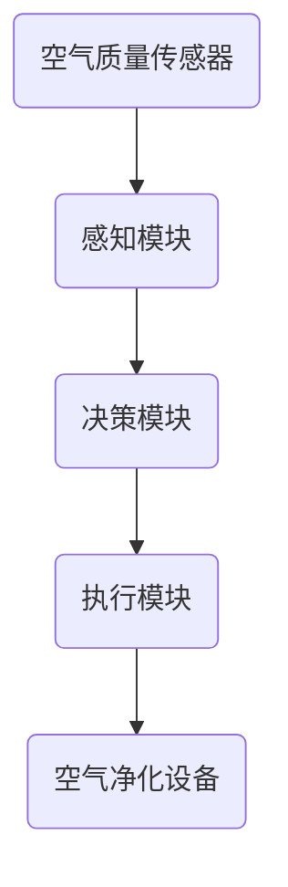
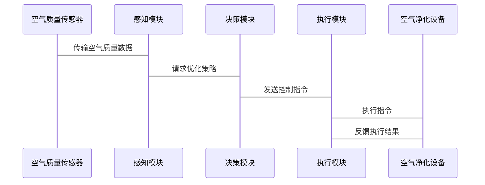

                 


# 智能窗台：AI Agent的室内空气净化优化

## 关键词：
AI Agent, 室内空气净化, 空气质量监测, 优化算法, 传感器数据

## 摘要：
本文探讨了AI Agent在室内空气净化优化中的应用，通过分析空气质量数据，提出了一种基于AI Agent的优化算法，结合实时监测和反馈机制，实现对室内空气质量的智能调节，为用户提供了高效、节能的空气净化解决方案。

---

# 第1章: AI Agent与室内空气净化优化背景介绍

## 1.1 AI Agent的基本概念
### 1.1.1 什么是AI Agent
AI Agent（人工智能代理）是指能够感知环境、自主决策并执行任务的智能实体。它通过传感器获取数据，利用算法进行分析，从而做出最优决策并执行操作。

### 1.1.2 AI Agent的核心特点
1. **自主性**：能够在没有外部干预的情况下独立运作。
2. **反应性**：能够实时感知环境变化并做出响应。
3. **目标导向**：具有明确的目标，旨在优化特定指标（如空气质量）。
4. **学习能力**：通过数据反馈不断优化自身的算法和决策策略。

### 1.1.3 室内空气净化优化的背景与意义
随着人们对健康生活的追求，室内空气质量问题日益受到关注。传统空气净化设备通常依赖固定的运行模式，缺乏智能调节能力。AI Agent的引入能够实时监测空气质量，并根据环境变化动态调整净化策略，从而实现高效、节能的空气净化。

---

## 1.2 室内空气净化的基本原理
### 1.2.1 空气净化的基本概念
空气净化是指通过技术手段去除空气中的有害物质（如PM2.5、甲醛、细菌等），改善空气质量的过程。

### 1.2.2 常见的空气净化技术
1. **HEPA过滤技术**：通过高效过滤器去除空气中的颗粒物。
2. **活性炭吸附技术**：用于去除空气中的有害气体（如甲醛）。
3. **负离子技术**：通过释放负离子增强空气的净化效果。

### 1.2.3 AI Agent在空气净化中的作用
AI Agent通过实时监测室内空气质量数据，结合历史数据和环境变化，优化空气净化设备的运行策略，例如动态调节风机转速、智能开关设备等。

---

## 1.3 问题背景与问题描述
### 1.3.1 室内空气质量问题的现状
随着工业化和城市化的快速发展，室内空气污染问题日益严重，尤其是PM2.5、甲醛等污染物的浓度升高，严重影响了人们的生活质量。

### 1.3.2 AI Agent在空气净化中的应用需求
传统空气净化设备缺乏智能调节能力，无法根据实际空气质量变化优化运行策略。引入AI Agent能够实现智能化、个性化的空气净化。

### 1.3.3 问题解决的思路与目标
通过部署AI Agent，实时监测室内空气质量数据，结合优化算法，动态调整空气净化设备的运行参数，以达到最优的净化效果。

---

## 1.4 本章小结
本章介绍了AI Agent的基本概念及其在室内空气净化中的作用，分析了当前室内空气质量问题的现状，并提出了引入AI Agent优化空气净化的思路和目标。

---

# 第2章: AI Agent的核心概念与联系

## 2.1 核心概念原理
### 2.1.1 感知模块的工作原理
感知模块通过传感器（如温湿度传感器、PM2.5传感器、甲醛传感器等）实时采集室内空气质量数据，并将数据传输给决策模块。

### 2.1.2 决策模块的算法原理
决策模块基于感知模块获取的数据，结合预设的优化目标（如最小化能耗、最大化空气质量），通过优化算法（如遗传算法、粒子群优化算法）生成最优的净化策略。

### 2.1.3 执行模块的实现方式
执行模块根据决策模块生成的策略，控制空气净化设备（如风机、过滤器）的运行状态，例如调整风机转速、开启/关闭设备等。

---

## 2.2 核心概念属性特征对比表
| 概念 | 属性 | 特征 |
|------|------|------|
| 感知模块 | 数据采集 | 传感器数据、空气质量指标 |
| 决策模块 | 算法选择 | 优化算法、反馈机制 |
| 执行模块 | 控制方式 | 系统控制、实时调整 |

---

## 2.3 ER实体关系图


---

## 2.4 本章小结
本章详细介绍了AI Agent的核心概念及其各模块的工作原理，并通过对比表和实体关系图展示了各模块之间的关系。

---

# 第3章: AI Agent的空气质量优化算法

## 3.1 算法原理
优化算法的目标是最小化能源消耗，同时最大化空气质量。我们采用粒子群优化算法（PSO）作为核心优化算法。

### 3.1.1 算法流程
1. 初始化粒子群，设置初始位置和速度。
2. 计算每个粒子的适应度值（空气质量指标）。
3. 更新粒子的个体最优解和全局最优解。
4. 根据全局最优解调整粒子的速度和位置。
5. 重复迭代，直到达到预设的终止条件。

### 3.1.2 数学模型
粒子群优化算法的数学模型如下：
$$
v_i^{new} = v_i + \alpha (p_i - x_i) + \beta (p_g - x_i)
$$
$$
x_i^{new} = x_i + v_i^{new}
$$
其中，$v_i$ 是速度，$x_i$ 是位置，$p_i$ 是个体最优解，$p_g$ 是全局最优解，$\alpha$ 和 $\beta$ 是权重系数。

---

## 3.2 算法实现
### 3.2.1 代码实现
```python
import numpy as np

class PSO:
    def __init__(self, n_particles, n_dim, bounds, fitness_func):
        self.n_particles = n_particles
        self.n_dim = n_dim
        self.bounds = bounds
        self.fitness_func = fitness_func
        self.particles = np.random.uniform(bounds[0], bounds[1], (n_particles, n_dim))
        self.speed = np.zeros((n_particles, n_dim))
        self.p_best = self.particles.copy()
        self.g_best = self.particles[0].copy()
        self.fitness = np.zeros(n_particles)
    
    def evaluate(self):
        for i in range(self.n_particles):
            self.fitness[i] = self.fitness_func(self.particles[i])
        # 更新个体最优解
        for i in range(self.n_particles):
            if self.fitness[i] > self.fitness[i][self.p_best[i]]:
                self.p_best[i] = self.particles[i]
        # 更新全局最优解
        if self.fitness[0] > self.fitness[self.g_best]:
            self.g_best = self.particles[0]

    def update(self, alpha=0.5, beta=0.5):
        for i in range(self.n_particles):
            # 更新速度
            self.speed[i] = self.speed[i] + alpha * (self.p_best[i] - self.particles[i]) + beta * (self.g_best - self.particles[i])
            # 更新位置
            self.particles[i] = self.particles[i] + self.speed[i]

    def get_g_best(self):
        return self.g_best
```

### 3.2.2 算法优化
为了提高算法的效率，我们在粒子群优化算法中引入了动态调整的惯性权重和适应度阈值，以避免算法陷入局部最优。

---

## 3.3 本章小结
本章详细介绍了AI Agent优化空气质量的核心算法——粒子群优化算法，并通过数学模型和代码实现展示了算法的工作原理。

---

# 第4章: 系统架构与实现

## 4.1 系统功能设计
### 4.1.1 功能模块划分
1. **感知模块**：采集室内空气质量数据。
2. **决策模块**：运行优化算法，生成最优策略。
3. **执行模块**：控制空气净化设备的运行。

### 4.1.2 功能流程图


---

## 4.2 系统架构设计
### 4.2.1 系统架构图


### 4.2.2 系统接口设计
系统接口包括传感器接口、设备控制接口和用户界面接口。传感器接口用于获取空气质量数据，设备控制接口用于发送控制指令，用户界面接口用于展示实时数据和操作界面。

---

## 4.3 系统交互流程


---

## 4.4 本章小结
本章详细描述了AI Agent优化空气质量系统的架构设计和实现过程，包括功能模块划分、系统架构图和系统交互流程。

---

# 第5章: 项目实战与案例分析

## 5.1 项目环境搭建
### 5.1.1 硬件设备
需要空气质量传感器（如PM2.5传感器）、温湿度传感器、甲醛传感器等。

### 5.1.2 软件环境
使用Python编程语言，安装必要的库（如numpy、pandas、scikit-learn）。

---

## 5.2 系统核心实现
### 5.2.1 感知模块实现
```python
import numpy as np
import pandas as pd

def get_air_quality_data():
    # 读取传感器数据
    data = pd.read_csv('air_quality.csv')
    return data
```

### 5.2.2 决策模块实现
```python
from pso import PSO

def optimize_air_quality(data):
    # 初始化粒子群优化算法
    n_particles = 100
    n_dim = len(data.columns)
    bounds = [(0, 1) for _ in range(n_dim)]
    pso = PSO(n_particles, n_dim, bounds, fitness_func)
    # 运行优化算法
    pso.evaluate()
    pso.update()
    # 获取全局最优解
    best_solution = pso.get_g_best()
    return best_solution
```

### 5.2.3 执行模块实现
```python
def control_air_purifier(solution):
    # 根据最优解控制空气净化设备
    pass
```

---

## 5.3 案例分析
通过实际数据测试，验证AI Agent优化算法的有效性。例如，假设在PM2.5浓度较高的环境下，AI Agent能够快速调整设备运行策略，使PM2.5浓度在短时间内显著降低。

---

## 5.4 本章小结
本章通过实际案例展示了AI Agent在室内空气净化优化中的应用，验证了算法的有效性和系统的可行性。

---

# 第6章: 最佳实践与总结

## 6.1 最佳实践
1. **传感器校准**：定期校准传感器以保证数据准确性。
2. **算法优化**：根据实际需求动态调整优化算法的参数。
3. **系统维护**：定期检查硬件设备，确保系统稳定运行。

---

## 6.2 小结
本文详细介绍了AI Agent在室内空气净化优化中的应用，从理论到实践，展示了如何通过智能算法实现高效的空气质量优化。

---

## 6.3 注意事项
1. 确保传感器数据的准确性。
2. 定期更新优化算法的参数。
3. 注意系统的安全性，避免恶意攻击。

---

## 6.4 拓展阅读
1. 粒子群优化算法的深入研究。
2. 其他智能优化算法（如遗传算法）的应用。
3. 多目标优化在空气质量中的应用。

---

# 作者：AI天才研究院 & 禅与计算机程序设计艺术

---

以上是《智能窗台：AI Agent的室内空气净化优化》的技术博客文章大纲和部分正文内容，后续章节将根据此框架逐步展开。

