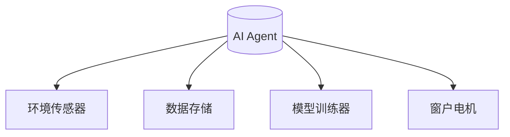

                 


# 智能窗台：AI Agent的室内空气质量监测

## 关键词：AI Agent，室内空气质量，物联网，智能窗台，空气质量监测，环境传感器

## 摘要：  
本文详细探讨了基于AI Agent的智能窗台在室内空气质量监测中的应用。通过分析空气质量监测的背景、AI Agent的核心原理以及物联网技术的整合，本文提出了一个创新的空气质量监测系统设计。该系统通过传感器数据采集、特征提取、模型训练等步骤，实现了对室内空气质量的实时监测与智能优化。文章还提供了具体的系统架构设计、项目实战代码以及优化建议，为读者提供了全面的技术指导。

---

# 第1章: 智能窗台与AI Agent背景介绍

## 1.1 问题背景与目标

### 1.1.1 室内空气质量问题的背景  
随着城市化进程的加快，室内空气质量问题日益受到关注。现代建筑的密闭性增加，导致空气流通不畅，室内污染物浓度升高，对居民健康造成威胁。根据世界卫生组织的数据，全球每年有超过700万人死于空气污染相关疾病。因此，如何有效监测和改善室内空气质量成为一项重要的技术挑战。

### 1.1.2 智能窗台的定义与目标  
智能窗台是一种结合了AI技术与物联网设备的智能化建筑组件，旨在通过实时监测室内空气质量，自动调整窗户的开合状态，从而优化室内空气质量。其目标是实现人机交互的智能化空气质量管理，提升居住舒适度和健康水平。

### 1.1.3 AI Agent在智能窗台中的作用  
AI Agent（智能体）通过实时分析传感器数据，能够主动决策窗户的开合角度和时间，从而优化室内空气质量。AI Agent的核心作用包括数据采集、特征提取、模型训练和智能决策。

## 1.2 智能窗台的核心概念结构

### 1.2.1 核心要素组成  
智能窗台系统的核心要素包括：  
1. **环境传感器**：监测温度、湿度、PM2.5、CO2等参数。  
2. **AI Agent**：负责数据处理、模型预测和决策控制。  
3. **物联网设备**：包括窗户电机、风扇和其他执行机构。  
4. **用户界面**：提供可视化数据和交互功能。  

### 1.2.2 系统边界与外延  
智能窗台系统的核心边界是室内空气质量监测与优化，外延包括与智能家居系统的联动（如空气净化器、加湿器等）以及与外部环境数据（如天气预报）的结合。

### 1.2.3 概念属性特征对比表  
| 概念       | 属性         | 特征对比       |  
|------------|--------------|---------------|  
| AI Agent   | 数据处理能力 | 强             |  
| 物联网设备 | 执行能力     | 高             |  
| 环境传感器 | 数据采集能力 | 精准           |  

### 1.2.4 ER实体关系图  
```mermaid
erDiagram
    SENSOR[环境传感器] {
        int id
        string type
        float value
    }
    ACTuator[执行机构] {
        int id
        string type
        bool status
    }
    AI_AGENT[AI Agent] {
        int id
        string model
        float accuracy
    }
    SENSOR --> ACTuator: 控制
    SENSOR --> AI_AGENT: 分析
    AI_AGENT --> ACTuator: 决策
```

---

# 第2章: AI Agent与物联网基础

## 2.1 AI Agent的基本原理

### 2.1.1 定义与分类  
AI Agent是一种能够感知环境、自主决策并执行任务的智能实体。根据应用场景，AI Agent可以分为简单反射型、基于模型的反应型、目标驱动型和效用驱动型。

### 2.1.2 AI Agent的核心算法  
AI Agent的核心算法包括：  
1. **监督学习**：用于分类和回归任务。  
2. **无监督学习**：用于聚类和异常检测。  
3. **强化学习**：用于序列决策任务。  

### 2.1.3 AI Agent与传统算法的对比  
| 特性       | AI Agent        | 传统算法        |  
|------------|-----------------|-----------------|  
| 自主性     | 高              | 低              |  
| 决策能力   | 强              | 弱              |  
| 适应性     | 优              | 中              |  

## 2.2 物联网技术基础

### 2.2.1 物联网的概念与架构  
物联网（IoT）通过传感器、通信网络和云平台实现设备间的互联互通。其典型架构包括：  
1. **感知层**：传感器采集数据。  
2. **网络层**：数据传输（如Wi-Fi、蓝牙）。  
3. **应用层**：数据处理与应用。  

### 2.2.2 智能窗台的物联网实现  
智能窗台通过集成环境传感器、窗户电机和AI Agent，实现了室内空气质量的实时监测与优化。

### 2.2.3 物联网与AI Agent的结合  
物联网提供了数据采集和设备控制的通道，而AI Agent则通过数据分析和智能决策，实现了对物联网设备的智能化管理。

---

# 第3章: 空气质量监测系统设计

## 3.1 系统功能需求分析

### 3.1.1 系统目标  
系统的目标是实时监测室内空气质量，并通过AI Agent自动调整窗户的开合状态，优化空气质量。

### 3.1.2 功能模块划分  
系统功能模块包括：  
1. **数据采集模块**：采集室内空气质量数据。  
2. **数据处理模块**：对数据进行预处理和特征提取。  
3. **模型预测模块**：预测空气质量并生成决策。  
4. **执行控制模块**：根据决策控制窗户的开合。  

## 3.2 系统架构设计

### 3.2.1 系统整体架构  


### 3.2.2 模块化设计  
系统采用模块化设计，各模块之间通过标准接口进行通信。

### 3.2.3 系统接口设计  
系统接口包括：  
1. 传感器数据接口：采集PM2.5、CO2等参数。  
2. 数据存储接口：支持本地和云端存储。  
3. 模型预测接口：输出空气质量指数和决策指令。  

---

# 第4章: 数据采集与特征提取

## 4.1 数据采集模块

### 4.1.1 数据采集方法  
通过环境传感器（如温湿度传感器、PM2.5传感器）采集实时数据。

### 4.1.2 数据预处理  
数据预处理包括去噪、归一化和插值处理。

### 4.1.3 数据存储  
数据存储采用本地数据库和云数据库结合的方式。

## 4.2 特征提取算法

### 4.2.1 基于机器学习的特征提取  
使用主成分分析（PCA）进行特征降维。

### 4.2.2 基于深度学习的特征提取  
采用卷积神经网络（CNN）提取特征。

### 4.2.3 特征选择与优化  
通过交叉验证选择最优特征组合。

---

# 第5章: 空气质量预测模型

## 5.1 模型选择与训练

### 5.1.1 常见机器学习模型  
包括线性回归、支持向量机（SVM）、随机森林等。

### 5.1.2 深度学习模型  
包括长短期记忆网络（LSTM）和卷积神经网络（CNN）。

### 5.1.3 模型训练与优化  
通过交叉验证和超参数调优提升模型性能。

## 5.2 模型评估与部署

### 5.2.1 模型评估指标  
包括均方误差（MSE）、R²值和准确率。

### 5.2.2 模型部署与应用  
将模型部署到云平台，实现实时预测和决策。

### 5.2.3 模型的实时更新  
通过在线学习不断优化模型性能。

---

# 第6章: 系统实现与项目实战

## 6.1 系统实现

### 6.1.1 系统安装与配置  
安装环境传感器、窗户电机和AI Agent软件。

### 6.1.2 核心代码实现  
核心代码实现包括数据采集、特征提取和模型预测。

### 6.1.3 系统功能测试  
通过模拟实验验证系统功能。

## 6.2 项目实战

### 6.2.1 项目背景与目标  
通过实际案例展示系统在家庭环境中的应用。

### 6.2.2 项目实施过程  
包括硬件部署、软件开发和系统调试。

### 6.2.3 项目成果与总结  
总结项目的成果和经验教训。

---

# 第7章: 最佳实践与系统优化

## 7.1 系统优化建议

### 7.1.1 系统性能优化  
通过硬件升级和算法优化提升系统性能。

### 7.1.2 系统安全性提升  
加强数据加密和访问控制。

### 7.1.3 系统可扩展性设计  
设计模块化架构，便于功能扩展。

## 7.2 最佳实践总结

### 7.2.1 项目开发经验  
总结项目开发中的关键点和注意事项。

### 7.2.2 系统维护与升级  
制定系统的维护和升级计划。

### 7.2.3 未来发展方向  
探讨未来可能的技术进步和应用场景。

---

# 作者：AI天才研究院 & 禅与计算机程序设计艺术

---

本文详细探讨了AI Agent在室内空气质量监测中的应用，通过理论分析和实践案例，展示了如何利用AI技术优化室内空气质量。希望本文能为相关领域的研究和应用提供有价值的参考。

