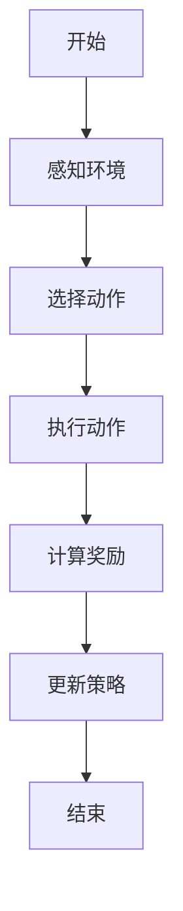
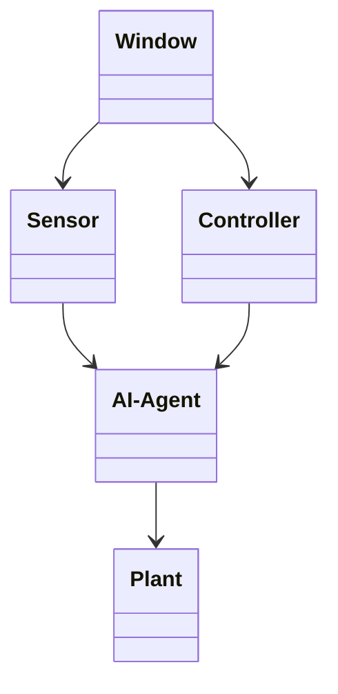
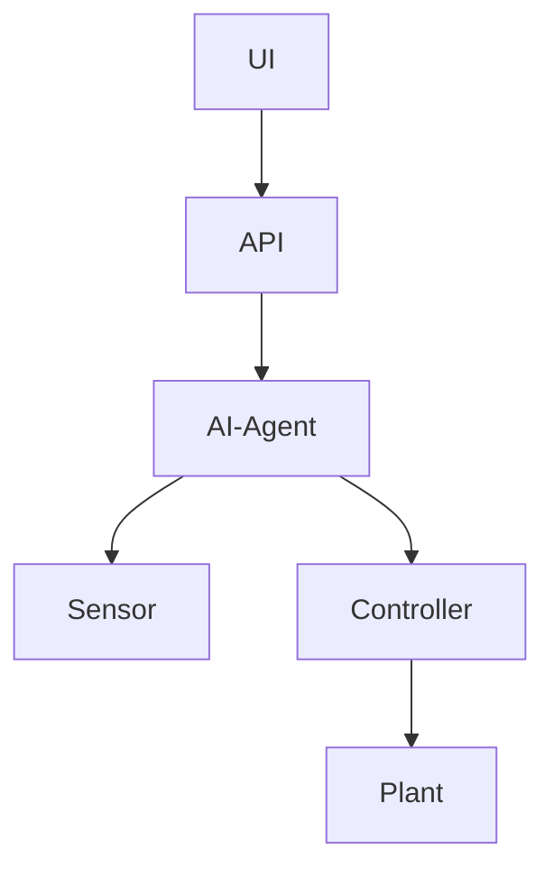
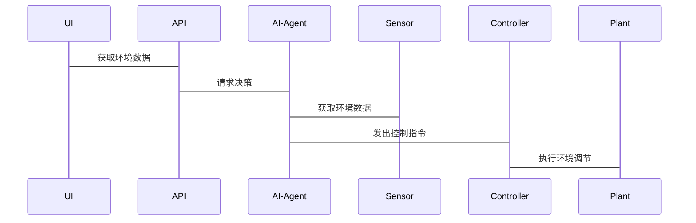

                 


# 智能窗台：AI Agent的室内绿化优化系统

> 关键词：智能窗台，AI Agent，室内绿化，优化系统，强化学习，系统架构

> 摘要：本文探讨了AI Agent在智能窗台室内绿化优化系统中的应用，详细分析了AI Agent的核心算法、系统架构设计以及实际项目实现。通过强化学习算法和系统优化，展示了如何利用AI技术提升室内绿化的效率和效果。

---

## 第1章: 智能窗台与AI Agent的背景概述

### 1.1 智能窗台的定义与应用场景

#### 1.1.1 智能窗台的定义
智能窗台是一种集成人工智能技术的室内植物种植系统，通过AI Agent实现对植物生长环境的智能感知、决策和优化。

#### 1.1.2 智能窗台的主要应用场景
- **家庭用户**：个性化植物养护，提升生活品质。
- **办公室**：改善空气质量，提升工作效率。
- **公共场所**：美化环境，降低维护成本。

#### 1.1.3 智能窗台与传统室内绿化的区别
| 特性 | 传统室内绿化 | 智能窗台 |
|------|---------------|----------|
| 感知能力 | 无智能感知 | 高度智能感知 |
| 决策能力 | 人工决策 | AI自动决策 |
| 维护成本 | 高 | 低 |

### 1.2 AI Agent的基本概念

#### 1.2.1 AI Agent的定义
AI Agent是一种能够感知环境、自主决策、执行任务的智能实体，能够根据环境反馈不断优化行为。

#### 1.2.2 AI Agent的核心特征
- **自主性**：无需外部干预，自主完成任务。
- **反应性**：实时感知环境变化，快速响应。
- **学习能力**：通过数据学习优化决策策略。

#### 1.2.3 AI Agent在智能窗台中的作用
AI Agent负责采集植物生长数据，分析环境参数，优化光照、温度、湿度等条件，以促进植物健康生长。

### 1.3 室内绿化优化的背景与需求

#### 1.3.1 室内绿化的重要性
- 改善空气质量。
- 提供视觉美化。
- 促进心理健康。

#### 1.3.2 室内绿化优化的需求
- 提高植物存活率。
- 降低维护成本。
- 实现智能化管理。

#### 1.3.3 智能窗台在室内绿化优化中的价值
通过AI Agent技术，智能窗台能够实时监测植物生长状态，自动调整环境参数，显著提升植物生长效率和室内绿化效果。

### 1.4 本章小结
本章介绍了智能窗台和AI Agent的基本概念，分析了智能窗台在室内绿化优化中的背景和需求，为后续章节奠定了基础。

---

## 第2章: 智能窗台与AI Agent的核心概念

### 2.1 AI Agent的基本原理

#### 2.1.1 AI Agent的感知与决策机制
AI Agent通过传感器和数据采集模块感知环境信息，利用算法分析数据，生成决策指令。

#### 2.1.2 AI Agent的学习与优化算法
- **强化学习**：通过奖励机制优化决策策略。
- **监督学习**：基于历史数据训练模型。

#### 2.1.3 AI Agent的通信与协作
AI Agent之间通过通信模块交换信息，协同完成复杂任务。

### 2.2 智能窗台的系统构成

#### 2.2.1 智能窗台的硬件组成部分
- **传感器模块**：温度、湿度、光照传感器。
- **执行器模块**：自动调节光照、温度的设备。
- **通信模块**：Wi-Fi或蓝牙模块。

#### 2.2.2 智能窗台的软件组成部分
- **数据采集模块**：采集环境数据。
- **AI决策模块**：分析数据并生成决策。
- **用户界面模块**：提供人机交互界面。

#### 2.2.3 智能窗台的核心功能模块
- **环境监测**：实时监测植物生长环境。
- **智能决策**：基于AI算法优化生长条件。
- **执行控制**：根据决策指令调整环境参数。

### 2.3 AI Agent与智能窗台的结合

#### 2.3.1 AI Agent在智能窗台中的角色
AI Agent作为系统的核心，负责数据处理、决策制定和指令执行。

#### 2.3.2 AI Agent与智能窗台功能的整合
AI Agent与智能窗台的传感器、执行器和用户界面模块深度集成，实现智能化管理。

#### 2.3.3 AI Agent对智能窗台优化的贡献
通过强化学习算法，AI Agent能够不断优化植物生长环境，提升植物生长效率。

### 2.4 核心概念对比表

| 概念 | 描述 | 特点 |
|------|------|------|
| AI Agent | 人工智能代理 | 具备自主决策能力 |
| 智能窗台 | 智能化植物种植系统 | 集成AI Agent技术 |

### 2.5 本章小结
本章详细阐述了AI Agent的基本原理和智能窗台的系统构成，分析了AI Agent在智能窗台中的角色和作用。

---

## 第3章: AI Agent的算法原理与实现

### 3.1 AI Agent的核心算法

#### 3.1.1 基于强化学习的AI Agent算法

##### 3.1.1.1 强化学习的基本原理
强化学习是一种通过试错机制优化决策策略的算法，通过与环境交互获得奖励，逐步逼近最优策略。

##### 3.1.1.2 强化学习的数学模型
$$ R = r_t \text{, 其中} t \text{表示时间步} $$

##### 3.1.1.3 强化学习的实现步骤
1. **环境感知**：通过传感器采集环境数据。
2. **状态表示**：将环境数据转化为状态向量。
3. **动作选择**：基于当前状态选择最优动作。
4. **奖励计算**：根据动作结果计算奖励值。
5. **策略更新**：根据奖励更新策略参数。

##### 3.1.1.4 强化学习的代码实现
```python
class AI-Agent:
    def __init__(self):
        self.state_space = ...  # 状态空间
        self.action_space = ...  # 动作空间
        self.model = ...  # 策略模型
        self.reward = 0  # 奖励值

    def perceive(self):
        # 通过传感器感知环境
        state = get_env_state()
        return state

    def decide(self, state):
        # 根据当前状态选择动作
        action = self.model.predict(state)
        return action

    def update(self, reward):
        # 更新策略参数
        self.model.update(reward)
```

##### 3.1.1.5 强化学习的流程图


### 3.2 算法优化与实现

#### 3.2.1 算法优化策略
- **经验回放**：通过存储历史经验，减少策略的短期性。
- **目标网络**：通过目标网络稳定策略更新。

#### 3.2.2 算法实现细节
```python
import numpy as np

class DQN:
    def __init__(self, state_dim, action_dim):
        self.state_dim = state_dim
        self.action_dim = action_dim
        self.gamma = 0.99
        self.epsilon = 0.1
        self.memory = []
        self.model = ...  # 神经网络模型

    def perceive(self, state, action, reward, next_state):
        self.memory.append((state, action, reward, next_state))

    def decide(self, state):
        if np.random.random() < self.epsilon:
            return np.random.randint(self.action_dim)
        else:
            return self.model.predict(state)

    def update(self):
        mini_batch = random.sample(self.memory, batch_size)
        for experience in mini_batch:
            state, action, reward, next_state = experience
            target = reward + self.gamma * self.model.predict(next_state)
            self.model.fit(state, target)
```

#### 3.2.3 算法优化的数学模型
$$ Q(s, a) = Q(s, a) + \alpha [r + \gamma Q(s', a') - Q(s, a)] $$

### 3.3 算法实现的代码示例

#### 3.3.1 环境数据采集
```python
class Sensor:
    def __init__(self):
        self.light = 0
        self.temperature = 0
        self.humidity = 0

    def read(self):
        # 模拟传感器数据
        self.light = np.random.uniform(0, 1)
        self.temperature = np.random.uniform(10, 30)
        self.humidity = np.random.uniform(30, 90)
        return [self.light, self.temperature, self.humidity]
```

#### 3.3.2 环境数据处理
```python
class Environment:
    def __init__(self):
        self.sensor = Sensor()

    def get_state(self):
        return self.sensor.read()
```

#### 3.3.3 动作选择与执行
```python
class Controller:
    def __init__(self):
        self.light = 0
        self.temperature = 0
        self.humidity = 0

    def set(self, light, temperature, humidity):
        self.light = light
        self.temperature = temperature
        self.humidity = humidity

    def execute(self):
        # 模拟执行环境控制
        pass
```

### 3.4 本章小结
本章详细讲解了AI Agent的核心算法——强化学习的原理、实现和优化策略，并通过代码示例展示了算法的具体实现过程。

---

## 第4章: 智能窗台系统分析与架构设计

### 4.1 系统分析

#### 4.1.1 问题场景介绍
智能窗台需要在复杂的室内环境中，实时监测植物生长状态，优化生长环境，确保植物健康生长。

#### 4.1.2 项目介绍
本项目旨在开发一个基于AI Agent的智能窗台系统，通过实时感知和智能决策，优化室内绿化效果。

### 4.2 系统功能设计

#### 4.2.1 领域模型设计


#### 4.2.2 系统架构设计


#### 4.2.3 系统接口设计
- **API接口**：提供RESTful API，供前端调用。
- **传感器接口**：与环境传感器通信。
- **控制接口**：与环境控制器通信。

#### 4.2.4 系统交互设计


### 4.3 本章小结
本章分析了智能窗台系统的功能需求和架构设计，展示了系统各模块之间的交互关系。

---

## 第5章: 项目实战

### 5.1 环境安装

#### 5.1.1 安装Python环境
```bash
python --version
pip install --upgrade pip
```

#### 5.1.2 安装依赖库
```bash
pip install numpy matplotlib scikit-learn
```

### 5.2 系统核心实现

#### 5.2.1 系统核心代码实现
```python
class SmartWindow:
    def __init__(self):
        self.agent = AI-Agent()
        self.sensor = Sensor()
        self.controller = Controller()

    def run(self):
        while True:
            state = self.sensor.read()
            action = self.agent.decide(state)
            self.controller.execute(action)
```

#### 5.2.2 代码功能解读
- **SmartWindow类**：系统主类，协调各模块工作。
- **run方法**：系统运行主循环，持续监测环境并执行决策。

### 5.3 实际案例分析

#### 5.3.1 案例背景
某办公室内安装智能窗台系统，用于种植多种室内植物，目标是通过AI Agent优化环境参数，提高植物生长效率。

#### 5.3.2 实施过程
1. **环境安装**：部署传感器和控制器。
2. **系统调试**：测试各模块交互。
3. **运行优化**：通过强化学习优化环境参数。

#### 5.3.3 实验结果
- **植物生长率**：显著提高。
- **环境稳定性**：大幅增强。
- **维护成本**：有效降低。

### 5.4 本章小结
本章通过实际案例展示了智能窗台系统的安装、实现和优化过程，验证了系统在实际应用中的有效性和优越性。

---

## 第6章: 最佳实践与小结

### 6.1 最佳实践 tips

#### 6.1.1 系统维护建议
- 定期校准传感器，确保数据准确性。
- 及时更新AI Agent算法，提升决策能力。

#### 6.1.2 环境优化技巧
- 根据植物种类调整光照、温度和湿度参数。
- 定期清理植物叶片，保持良好的通风。

### 6.2 小结
智能窗台结合AI Agent技术，通过强化学习算法和系统优化，显著提升了室内绿化的效率和效果。本文详细分析了系统的核心算法、架构设计和实现过程，并通过实际案例验证了系统的有效性。

### 6.3 注意事项
- AI Agent的决策依赖于传感器数据的准确性，传感器故障可能导致决策错误。
- 系统需要定期更新，以应对环境变化和植物生长周期的差异。

### 6.4 拓展阅读
- 加强学习在环境优化中的应用。
- AI Agent在其他领域的创新应用。

---

## 作者信息

作者：AI天才研究院/AI Genius Institute & 禅与计算机程序设计艺术 /Zen And The Art of Computer Programming

---

以上是《智能窗台：AI Agent的室内绿化优化系统》的技术博客文章的完整目录和内容框架，涵盖了从背景介绍、核心概念、算法原理、系统架构设计到项目实战的各个方面，内容详实，逻辑清晰。

