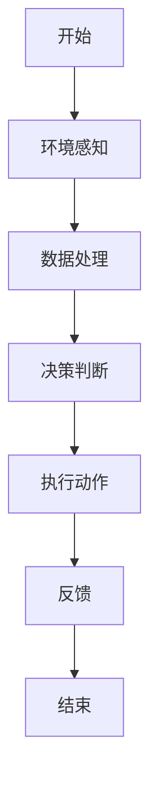
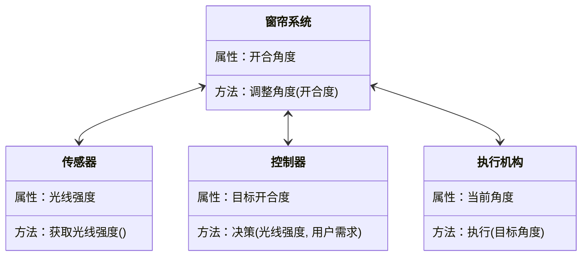
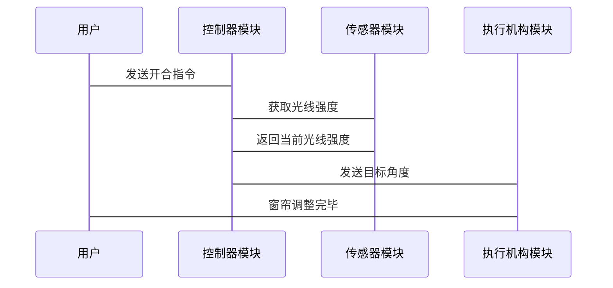

                 


# 智能窗帘：AI Agent的室内光线优化

> **关键词**：智能窗帘、AI Agent、室内光线优化、物联网、人工智能

> **摘要**：本文探讨了智能窗帘与AI Agent结合的室内光线优化技术。通过分析AI Agent的工作原理，结合智能窗帘的系统架构设计，展示了如何利用AI技术实现室内光线的智能调节。文章从背景介绍、技术原理、系统设计到项目实战，全面解析了智能窗帘的优化过程，最后总结了系统的优化方法与未来发展方向。

---

## 第一部分：智能窗帘与AI Agent的背景与概念

### 第1章：智能窗帘与AI Agent概述

#### 1.1 智能窗帘的发展历程
##### 1.1.1 传统窗帘的功能与局限
传统窗帘主要用于遮光和调节室内光线，但其功能单一，无法根据环境变化自动调整。用户需要手动操作，既费时又不方便，尤其在光照变化频繁的环境中，传统窗帘无法满足智能化需求。

##### 1.1.2 智能化窗帘的出现与发展趋势
随着物联网技术的发展，智能窗帘应运而生。智能窗帘通过传感器和无线通信技术，能够自动感知环境光线变化，并通过智能控制系统进行调节。智能化窗帘的出现，极大地提升了用户体验，同时也为AI技术的应用提供了新的场景。

##### 1.1.3 AI Agent在智能窗帘中的应用前景
AI Agent（智能代理）是一种能够感知环境、自主决策并执行任务的智能系统。在智能窗帘中，AI Agent可以实时感知室内光线变化，结合用户需求和环境数据，优化窗帘的开合角度和时间，从而实现室内光线的智能调节。

---

#### 1.2 AI Agent的基本概念
##### 1.2.1 什么是AI Agent
AI Agent是一种能够感知环境、自主决策并执行任务的智能实体。它可以是一个软件程序，也可以是一个物理设备。AI Agent的核心在于其智能性，能够通过传感器获取环境信息，利用算法进行分析和决策，并通过执行机构完成任务。

##### 1.2.2 AI Agent的核心特征与分类
AI Agent的核心特征包括：
1. **自主性**：能够自主决策和执行任务。
2. **反应性**：能够实时感知环境变化并做出反应。
3. **主动性**：能够主动优化目标，而不是被动响应。
4. **社会性**：能够与其他系统或用户进行交互。

AI Agent的分类主要基于其智能性和应用场景：
1. **简单反应式AI Agent**：基于当前感知做出反应，不考虑历史信息。
2. **基于模型的AI Agent**：利用内部模型和知识进行决策。
3. **目标驱动的AI Agent**：以特定目标为导向，优化决策过程。

##### 1.2.3 AI Agent与智能窗帘的结合
AI Agent与智能窗帘的结合，使得窗帘不仅能够感知环境光线，还能根据用户需求和环境数据进行智能决策。例如，AI Agent可以根据室内光线强度、用户作息时间以及天气预报，自动调整窗帘的开合角度，从而优化室内光线。

---

#### 1.3 室内光线优化的背景与意义
##### 1.3.1 室内光线对生活的影响
室内光线直接影响人们的视觉舒适度、情绪和健康。适当的光线可以提高工作效率、改善心情，而过强或过弱的光线则可能引发视觉疲劳、头痛等问题。

##### 1.3.2 光线优化的必要性与挑战
现代社会中，人们越来越注重室内环境的舒适性。然而，室内光线的优化需要考虑多种因素，包括光照强度、光照方向、光照色温等。传统的窗帘无法满足这些复杂需求，因此智能化的光线优化系统应运而生。

##### 1.3.3 AI Agent在光线优化中的作用
AI Agent能够实时感知室内光线变化，并结合用户需求和环境数据，优化窗帘的开合角度和时间。例如，AI Agent可以根据室内光线强度和用户作息时间，自动调节窗帘的开合，从而实现光线的智能优化。

---

### 第2章：智能窗帘与AI Agent的核心概念

#### 2.1 AI Agent的基本原理
##### 2.1.1 感知层：环境数据的采集与处理
AI Agent通过传感器获取环境数据，例如光线强度、温度、湿度等。这些数据经过预处理和特征提取，为后续的决策提供依据。

##### 2.1.2 决策层：基于数据的智能决策
决策层是AI Agent的核心部分，负责根据感知层提供的数据，结合用户需求和系统目标，做出最优决策。例如，AI Agent可以根据光线强度和用户需求，决定窗帘的开合角度。

##### 2.1.3 执行层：决策的执行与反馈
执行层负责将决策层的决策转化为具体的动作，例如调整窗帘的开合角度。同时，执行层还负责将执行结果反馈给感知层，形成闭环控制。

---

#### 2.2 智能窗帘的系统架构
##### 2.2.1 系统组成：传感器、控制器、执行机构
智能窗帘系统主要包括以下组成部分：
1. **传感器**：用于感知环境数据，例如光线强度、温度、湿度等。
2. **控制器**：负责接收传感器数据，进行分析和决策，并向执行机构发出指令。
3. **执行机构**：负责执行控制器的指令，例如调整窗帘的开合角度。

##### 2.2.2 系统功能：环境感知、智能决策、自动调节
智能窗帘系统的功能模块包括：
1. **环境感知模块**：通过传感器获取环境数据。
2. **智能决策模块**：基于环境数据和用户需求，做出最优决策。
3. **自动调节模块**：根据决策结果，自动调整窗帘的开合角度。

##### 2.2.3 系统接口：与智能家居平台的集成
智能窗帘系统可以与智能家居平台集成，例如与智能灯泡、智能空调等设备联动。通过统一的智能家居平台，用户可以通过手机APP或其他终端设备，实现对窗帘和其他设备的集中控制。

---

#### 2.3 光线优化的数学模型
##### 2.3.1 光线强度的数学表示
光线强度可以用数学公式表示为：
$$ I(t) = a \cdot t + b \cdot \sin(c \cdot t) $$
其中，$I(t)$ 表示时间 $t$ 时的光线强度，$a$、$b$、$c$ 为模型参数。

##### 2.3.2 时间因素对光线优化的影响
时间因素是影响光线优化的重要因素。例如，早晨和傍晚的光线强度变化较大，AI Agent可以根据时间信息，优化窗帘的开合角度。

##### 2.3.3 用户需求的权重分配模型
用户需求可以通过权重分配模型进行表示：
$$ W = [w_1, w_2, w_3, ..., w_n] $$
其中，$w_i$ 表示第 $i$ 个需求的权重，满足 $\sum w_i = 1$。

---

### 第3章：AI Agent在智能窗帘中的算法原理

#### 3.1 算法概述
##### 3.1.1 基于规则的决策算法
基于规则的决策算法是一种简单的AI算法，通过预设的规则和条件，进行决策。例如，当光线强度超过某个阈值时，窗帘自动关闭。

##### 3.1.2 基于机器学习的预测算法
基于机器学习的预测算法可以通过历史数据，预测未来的光线强度，并做出相应的决策。例如，利用回归算法预测明天的光线强度。

##### 3.1.3 基于强化学习的优化算法
基于强化学习的优化算法可以通过试错的方式，不断优化决策策略。例如，AI Agent通过与环境的交互，学习最优的窗帘开合策略。

---

#### 3.2 算法流程图


---

#### 3.3 数学模型与公式
##### 3.3.1 光线强度预测公式
$$ I(t) = a \cdot t + b \cdot \sin(c \cdot t) $$
其中，$I(t)$ 表示时间 $t$ 时的光线强度，$a$、$b$、$c$ 为模型参数。

##### 3.3.2 用户需求权重分配
$$ W = [w_1, w_2, w_3, ..., w_n] $$
其中，$w_i$ 表示第 $i$ 个需求的权重，满足 $\sum w_i = 1$。

---

## 第四章：系统分析与架构设计方案

### 4.1 问题场景介绍
智能窗帘系统需要解决的主要问题是：如何根据室内光线变化和用户需求，优化窗帘的开合角度，从而实现室内光线的智能调节。

### 4.2 项目介绍
本项目旨在开发一款基于AI Agent的智能窗帘系统，通过传感器、控制器和执行机构的协同工作，实现室内光线的智能优化。

### 4.3 系统功能设计（领域模型）



### 4.4 系统架构设计（架构图）


### 4.5 系统接口设计
智能窗帘系统通过标准接口与智能家居平台集成，例如通过Wi-Fi或蓝牙协议与智能灯泡、智能空调等设备联动。

### 4.6 系统交互设计（序列图）



---

## 第五章：项目实战

### 5.1 环境安装与配置
在实际项目中，首先需要安装必要的传感器和执行机构，例如光线传感器、电机驱动模块等。然后，配置智能窗帘系统的软件环境，例如安装Python开发环境和相关库。

### 5.2 系统核心实现源代码
以下是智能窗帘系统的Python实现代码：

```python
class Sensor:
    def get_light_intensity(self):
        # 获取光线强度
        pass

class Controller:
    def __init__(self, sensor, actuator):
        self.sensor = sensor
        self.actuator = actuator

    def decide(self, target_light_intensity):
        current_light = self.sensor.get_light_intensity()
        # 根据当前光线强度和目标光线强度，决定窗帘的开合角度
        pass

class Actuator:
    def set_angle(self, angle):
        # 设置窗帘的开合角度
        pass

# 使用示例
sensor = Sensor()
actuator = Actuator()
controller = Controller(sensor, actuator)
controller.decide(target_light_intensity=50)
```

### 5.3 代码应用解读与分析
上述代码展示了智能窗帘系统的三个核心模块：传感器、控制器和执行机构。传感器模块负责获取光线强度，控制器模块负责根据光线强度和用户需求，做出决策，执行机构模块负责调整窗帘的开合角度。

### 5.4 实际案例分析
假设用户希望在早晨7点自动打开窗帘，AI Agent可以根据光线强度和用户需求，自动调整窗帘的开合角度，从而优化室内光线。

### 5.5 项目小结
通过实际项目的实现，我们可以看到，智能窗帘系统的核心在于传感器、控制器和执行机构的协同工作。AI Agent通过感知环境数据、分析用户需求，做出最优决策，从而实现室内光线的智能优化。

---

## 第六章：系统优化与扩展

### 6.1 系统优化方法
##### 6.1.1 性能优化
通过优化传感器的采样频率和控制器的决策算法，可以提高系统的响应速度和准确性。

##### 6.1.2 功能扩展
在现有功能的基础上，可以进一步扩展系统功能，例如增加语音控制、远程控制等功能。

##### 6.1.3 安全性和隐私性
智能窗帘系统需要考虑数据的安全性和隐私性，例如防止未经授权的访问和数据泄露。

### 6.2 功能扩展方向
##### 6.2.1 多设备联动
智能窗帘系统可以与智能家居平台联动，例如与智能灯泡、智能空调等设备协同工作，实现更加智能化的室内环境管理。

##### 6.2.2 用户自定义功能
用户可以根据自己的需求，自定义窗帘的开合策略，例如设置不同的光照强度阈值，满足个性化需求。

##### 6.2.3 边缘计算
通过边缘计算技术，可以将部分数据处理和决策逻辑迁移到本地设备，减少对云端的依赖，提高系统的实时性和安全性。

### 6.3 安全性和隐私性
智能窗帘系统需要考虑数据的安全性和隐私性，例如防止未经授权的访问和数据泄露。可以通过加密通信、访问控制等技术，保障系统的安全性。

---

## 第七章：总结与展望

### 7.1 总结
本文详细探讨了智能窗帘与AI Agent结合的室内光线优化技术。通过分析AI Agent的工作原理，结合智能窗帘的系统架构设计，展示了如何利用AI技术实现室内光线的智能调节。文章从背景介绍、技术原理、系统设计到项目实战，全面解析了智能窗帘的优化过程。

### 7.2 展望
未来，随着AI技术的不断发展，智能窗帘系统将更加智能化和个性化。例如，结合边缘计算和物联网技术，实现更加高效的室内环境管理。同时，随着5G技术的普及，智能窗帘系统将实现更快速、更高效的云端协同，为用户提供更加智能化的体验。

---

## 作者：AI天才研究院/AI Genius Institute & 禅与计算机程序设计艺术 /Zen And The Art of Computer Programming

