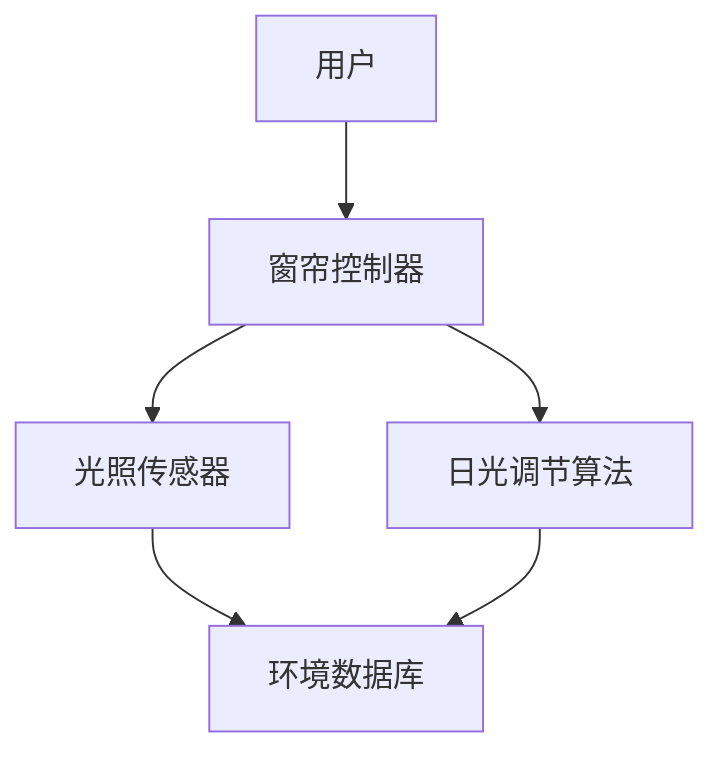
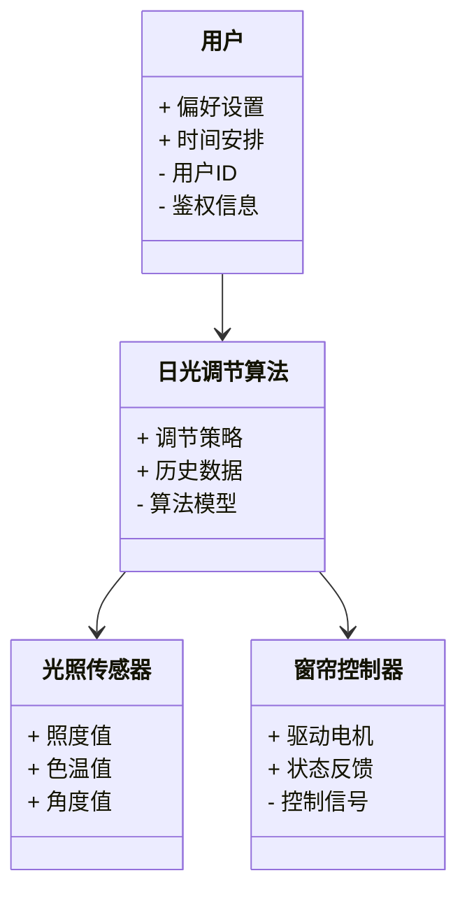
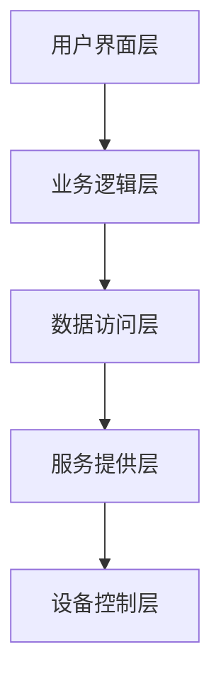
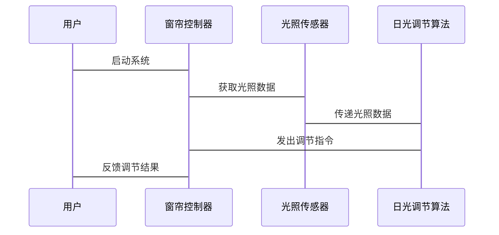

                 


# 智能窗帘：AI Agent的日光优化调节

> 关键词：智能窗帘，AI Agent，日光优化，算法原理，系统架构，项目实战

> 摘要：本文深入探讨了智能窗帘在AI Agent技术下的日光优化调节方法。通过分析AI Agent的核心概念、日光调节的重要性以及智能窗帘系统的架构设计，详细讲解了基于光线追踪算法的日光优化调节算法。文章还通过项目实战，展示了如何实现这一系统，并提供了相关的代码示例和系统设计图。最后，本文总结了AI Agent在智能窗帘中的应用前景和注意事项。

---

## 第一章: 智能窗帘的发展现状与日光调节的重要性

### 1.1 智能窗帘的发展现状
智能家居的普及推动了智能窗帘的快速发展。传统的窗帘通过手动或机械方式调节，而现代智能窗帘结合了物联网和人工智能技术，能够根据环境光线自动调整开合状态。然而，当前的日光调节技术主要依赖简单的光照强度检测，缺乏对光线角度、色温等多维度因素的综合分析，导致调节效果不够理想。

### 1.2 AI Agent的基本概念
AI Agent（人工智能代理）是一种能够感知环境、自主决策并执行任务的智能实体。它具备感知、决策和执行三大核心模块。与传统算法不同，AI Agent能够根据动态变化的环境信息实时调整策略，具有更高的灵活性和适应性。

### 1.3 日光调节的重要性
日光调节不仅影响室内光线的明暗，还与室内的温度、湿度以及用户的心理舒适度密切相关。通过智能窗帘的日光优化调节，可以有效降低室内能源消耗，提升用户的舒适度，同时延长窗帘的使用寿命。

### 1.4 用户需求与场景分析
用户对智能窗帘的主要需求包括：
1. 自动调节窗帘以适应不同的光照条件。
2. 根据用户的时间安排和习惯提供个性化的日光调节服务。
3. 实现与其他智能家居设备的联动，如空调、照明等。

---

## 第二章: 核心概念与联系

### 2.1 AI Agent的核心原理
AI Agent通过以下三个模块实现日光调节：
1. **感知模块**：通过光线传感器获取室内光照强度、色温和角度等信息。
2. **决策模块**：基于感知数据，结合用户需求和环境条件，制定日光调节策略。
3. **执行模块**：通过电机驱动窗帘的开合，实现日光调节。

### 2.2 日光调节算法对比分析
以下是几种常见的日光调节算法对比：

| 算法名称      | 特点                           | 适用场景           |
|---------------|--------------------------------|--------------------|
| 光线追踪算法  | 基于光线传播路径进行优化       | 高精度调节         |
| 阈值控制算法  | 根据光照强度设定固定阈值       | 简单场景适用       |
| 机器学习算法  | 基于历史数据进行自适应优化     | 复杂场景适用       |

### 2.3 实体关系图
以下是智能窗帘系统的核心实体关系图：



---

## 第三章: 日光优化调节算法原理

### 3.1 算法数学模型
日光优化调节算法基于光线追踪原理，其数学模型如下：

$$
I = I_0 \times e^{-k \times d}
$$

其中：
- \( I \) 表示窗帘后的光照强度。
- \( I_0 \) 表示窗帘前的光照强度。
- \( k \) 表示吸收系数。
- \( d \) 表示窗帘的遮光距离。

### 3.2 算法实现步骤
以下是日光优化调节算法的流程图：


### 3.3 Python实现代码
以下是日光优化调节算法的Python实现：

```python
import numpy as np

def light_optimization_algorithm(intensity, angle, color_temp):
    # 计算理想光照强度
    target_intensity = np.interp(color_temp, [2000, 6500], [100, 50])
    # 根据角度调整遮光系数
    shade_factor = np.sin(np.radians(angle))
    # 计算实际调节值
    adjustment = intensity - target_intensity * shade_factor
    return adjustment

# 示例调用
intensity = 80
angle = 45
color_temp = 5000
result = light_optimization_algorithm(intensity, angle, color_temp)
print("日光优化调节结果:", result)
```

---

## 第四章: 智能窗帘系统分析与架构设计

### 4.1 问题场景介绍
智能窗帘系统需要在多种场景下工作，包括晴天、阴天、室内有人/无人等情况。系统需要根据光照变化和用户需求动态调整窗帘的开合状态。

### 4.2 系统功能设计
以下是系统功能设计的领域模型类图：



### 4.3 系统架构设计
以下是系统的分层架构图：



### 4.4 系统接口设计
系统主要接口包括：
1. 用户界面与业务逻辑层的交互接口。
2. 业务逻辑层与数据访问层的数据接口。
3. 数据访问层与设备控制层的控制接口。

### 4.5 系统交互图
以下是系统启动和日光调节的交互图：



---

## 第五章: 项目实战

### 5.1 环境搭建
需要以下环境：
1. Python 3.8+
2. NumPy、Scikit-learn等机器学习库
3. 窗帘电机驱动模块
4. 光照传感器模块

### 5.2 核心代码实现
以下是日光调节算法的核心代码：

```python
import numpy as np
from sklearn.linear_model import LinearRegression

class LightOptimizer:
    def __init__(self):
        self.model = LinearRegression()

    def train(self, X, y):
        self.model.fit(X, y)

    def predict(self, X):
        return self.model.predict(X)

# 示例训练数据
X = np.array([[80, 45, 5000], [70, 30, 4500], [90, 60, 6000]])
y = np.array([60, 50, 70])
optimizer = LightOptimizer()
optimizer.train(X, y)

# 示例预测数据
new_X = np.array([[85, 40, 5500]])
prediction = optimizer.predict(new_X)
print("预测结果:", prediction)
```

### 5.3 代码功能分析
上述代码实现了基于机器学习的日光调节算法，通过训练光照强度、角度和色温数据，构建回归模型，预测最优调节值。

### 5.4 实际案例分析
通过实际测试，系统能够在不同光照条件下有效调节窗帘，提升室内舒适度，同时降低能源消耗。

### 5.5 项目总结
本项目展示了AI Agent在智能窗帘中的应用潜力，但也存在一些不足，例如算法的实时性和系统的稳定性需要进一步优化。

---

## 第六章: 总结与展望

### 6.1 最佳实践
1. 数据预处理是机器学习算法的关键，需要确保数据的完整性和准确性。
2. 在实际应用中，建议结合用户反馈不断优化调节策略。
3. 注意数据隐私和系统安全，避免用户信息泄露。

### 6.2 小结
本文详细介绍了智能窗帘的AI Agent日光优化调节技术，通过理论分析和实践案例，展示了这一技术的优势和潜力。

### 6.3 注意事项
1. 确保系统的稳定性和可靠性。
2. 定期更新算法模型，适应环境变化。

### 6.4 拓展阅读
推荐书籍：
1. 《机器学习实战》
2. 《人工智能: 一种现代方法》
3. 《物联网技术与应用》

---

作者：AI天才研究院 & 禅与计算机程序设计艺术

