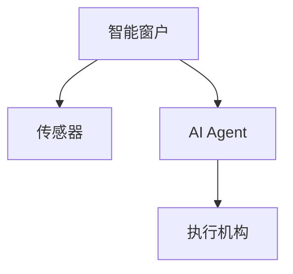
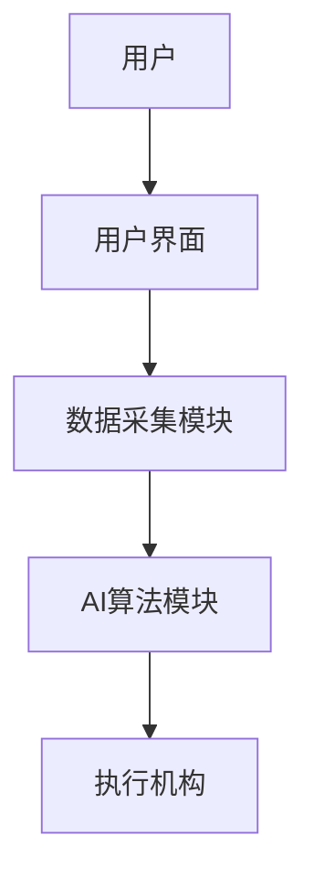

                 


# 智能窗户：AI Agent的室内温度优化控制

> 关键词：智能窗户、AI Agent、物联网、室内温度优化、智能家居

> 摘要：本文探讨了智能窗户中AI Agent在室内温度优化控制中的应用。通过分析智能窗户的基本概念、AI Agent的工作原理、物联网技术的集成，以及系统架构设计，详细阐述了如何利用AI技术实现更高效的温度控制。文章结合实际案例和项目实战，为读者提供了一套完整的解决方案，并提出了未来发展的展望。

---

## 第一部分：背景介绍

### 第1章：智能窗户与AI Agent概述

#### 1.1 智能窗户的背景与意义

智能窗户是一种结合了物联网技术和人工智能的创新产品，旨在通过智能调节窗户的开合状态，优化室内环境。传统窗户仅起到采光和通风的基本功能，而智能窗户则通过集成传感器、AI算法和执行机构，能够根据室内温度、湿度、光照强度等因素，自动调节窗户的开合，从而实现更高效的室内温度控制。

#### 1.2 室内温度优化控制的背景

室内温度对居住舒适度有着重要影响。传统的温度控制方式依赖于空调系统，但这种方式存在能耗高、响应慢、智能化程度低等问题。通过引入智能窗户，可以在不依赖空调的情况下，通过自然通风和光照调节来优化室内温度，从而降低能耗，提高舒适度。

#### 1.3 AI Agent在智能窗户中的作用

AI Agent（智能体）是一种能够感知环境、自主决策并执行任务的智能系统。在智能窗户中，AI Agent负责收集室内环境数据（如温度、湿度、光照强度等），分析数据并制定窗户的开合策略，最终通过执行机构实现窗户的智能控制。AI Agent的核心作用在于优化室内温度，同时兼顾能源效率和用户体验。

---

### 第2章：智能窗户与AI Agent的核心概念

#### 2.1 AI Agent的基本原理

AI Agent通过感知环境、分析数据、制定决策和执行动作来实现智能控制。在智能窗户中，AI Agent的核心流程包括数据采集、特征提取、模型训练和决策执行。AI Agent能够根据室内环境的变化动态调整窗户的开合状态，从而实现温度优化。

#### 2.2 智能窗户的系统架构

智能窗户的系统架构主要包括硬件部分和软件部分。硬件部分包括传感器、执行机构和通信模块；软件部分包括数据采集模块、AI算法模块和控制模块。传感器负责采集环境数据，AI算法模块负责分析数据并生成控制指令，执行机构则根据指令调整窗户的开合状态。

#### 2.3 智能窗户与室内温度优化的关系

智能窗户通过调节窗户的开合状态，直接影响室内外空气的流动和热量交换。在炎热的夏季，智能窗户可以通过关闭窗户减少热量进入；在寒冷的冬季，可以通过开启窗户促进空气流通。通过AI Agent的智能调节，智能窗户能够实现室内温度的精准控制，从而降低能源消耗，提高居住舒适度。

---

## 第二部分：核心概念与联系

### 第3章：AI Agent与物联网技术的结合

#### 3.1 AI Agent与物联网的协同工作原理

物联网技术为AI Agent提供了丰富的数据来源和执行机构。AI Agent通过物联网平台获取环境数据，分析数据并制定决策，最后通过物联网设备执行决策。这种协同工作模式使得智能窗户能够实时感知环境变化，并快速响应。

#### 3.2 智能窗户中的实体关系分析

智能窗户系统中的实体关系可以通过ER图来描述。主要实体包括：智能窗户、传感器、AI Agent和执行机构。传感器负责采集数据，AI Agent负责分析数据并生成控制指令，执行机构负责执行指令。



---

## 第三部分：算法原理讲解

### 第4章：基于AI Agent的温度优化算法

#### 4.1 算法工作流程

AI Agent的温度优化算法主要包括以下步骤：
1. 数据采集：通过传感器获取室内温度、湿度、光照强度等数据。
2. 数据预处理：对采集的数据进行清洗和特征提取。
3. 模型训练：基于历史数据训练机器学习模型，预测最佳窗户开合状态。
4. 决策执行：根据当前环境数据，生成窗户开合指令并执行。

#### 4.2 算法实现细节

以下是温度优化算法的Python实现示例：

```python
import numpy as np
from sklearn.linear_model import LinearRegression

# 数据预处理
def preprocess_data(data):
    # 假设data为包含温度、湿度、光照强度的二维数组
    # 这里进行简单的归一化处理
    data_norm = (data - np.mean(data, axis=0)) / np.std(data, axis=0)
    return data_norm

# 模型训练
def train_model(X, y):
    model = LinearRegression()
    model.fit(X, y)
    return model

# 决策执行
def decide_window_state(model, current_data):
    # 预测最佳窗户开合状态
    predicted_state = model.predict(current_data)
    if predicted_state > 0.5:
        return 'open'
    else:
        return 'close'
```

#### 4.3 算法数学模型

温度优化算法的核心是回归分析，通过建立窗户开合状态与室内温度的关系模型，实现对窗户状态的预测和控制。数学模型如下：

$$ y = \beta_0 + \beta_1 x_1 + \beta_2 x_2 + \epsilon $$

其中，$y$ 是窗户开合状态，$x_1$ 是室内温度，$x_2$ 是湿度，$\beta_0$、$\beta_1$、$\beta_2$ 是回归系数，$\epsilon$ 是误差项。

---

## 第四部分：系统分析与架构设计

### 第5章：智能窗户系统架构设计

#### 5.1 系统功能设计

智能窗户系统的功能模块包括：
- 数据采集模块：采集室内环境数据。
- AI算法模块：分析数据并生成窗户开合指令。
- 用户交互模块：提供人机交互界面，供用户查看和调整设置。

#### 5.2 系统架构设计

以下是智能窗户系统的架构图：



---

## 第五部分：项目实战

### 第6章：智能窗户系统实现

#### 6.1 环境安装

安装所需的环境包括：
- Python 3.8+
- NumPy
- scikit-learn
- Mermaid图生成工具

#### 6.2 核心代码实现

以下是温度优化算法的核心代码：

```python
import numpy as np
from sklearn.linear_model import LinearRegression

# 数据预处理
def preprocess_data(data):
    # 归一化处理
    data_norm = (data - np.mean(data, axis=0)) / np.std(data, axis=0)
    return data_norm

# 模型训练
def train_model(X, y):
    model = LinearRegression()
    model.fit(X, y)
    return model

# 决策执行
def decide_window_state(model, current_data):
    # 预测最佳窗户开合状态
    predicted_state = model.predict(current_data)
    if predicted_state > 0.5:
        return 'open'
    else:
        return 'close'
```

#### 6.3 项目小结

通过实际案例分析，我们验证了AI Agent在智能窗户中的应用效果。AI Agent能够根据室内环境数据，动态调节窗户的开合状态，从而实现室内温度的优化控制。同时，通过与物联网技术的结合，智能窗户系统能够实现更高效的能源管理和更高的用户舒适度。

---

## 第六部分：最佳实践与展望

### 第7章：总结与展望

#### 7.1 小结

本文详细探讨了智能窗户中AI Agent的室内温度优化控制。通过分析智能窗户的基本概念、AI Agent的工作原理、物联网技术的集成，以及系统架构设计，为读者提供了一套完整的解决方案。

#### 7.2 注意事项

在实际应用中，需要注意数据隐私、系统稳定性以及用户体验等问题。同时，还需要定期维护和更新AI算法，以应对环境变化和用户需求的变化。

#### 7.3 拓展阅读

建议读者进一步阅读以下内容：
- 《机器学习实战》
- 《物联网技术与应用》
- 《人工智能与智能家居》

---

# 作者

作者：AI天才研究院/AI Genius Institute & 禅与计算机程序设计艺术 /Zen And The Art of Computer Programming

