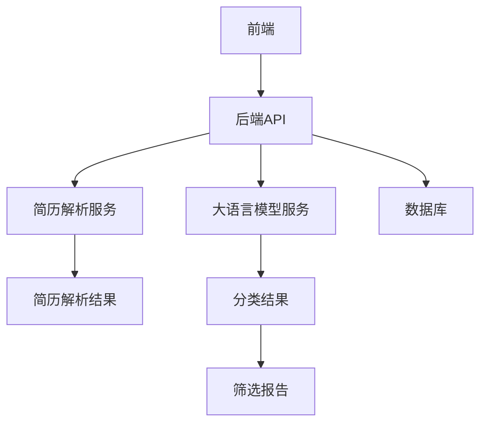

                 


# 智能简历筛选 AI Agent：LLM 在人力资源中的应用

> 关键词：智能简历筛选，大语言模型，自然语言处理，人工智能，人力资源管理

> 摘要：随着人工智能技术的快速发展，大语言模型（LLM）在各个领域的应用越来越广泛。本文深入探讨了LLM在智能简历筛选中的应用，分析了传统简历筛选的痛点，详细讲解了大语言模型的核心原理及其在简历筛选中的具体应用场景。通过系统架构设计和项目实战，展示了如何利用LLM构建高效的智能简历筛选系统，并总结了系统优化与未来发展方向。

---

# 第一部分: 智能简历筛选的背景与挑战

## 第1章: 智能简历筛选的背景与问题分析

### 1.1 智能简历筛选的背景

#### 1.1.1 传统简历筛选的痛点
传统的简历筛选过程通常依赖人工阅读和判断，存在以下痛点：
- **低效性**：招聘人员需要逐一阅读大量简历，耗时且效率低。
- **主观性**：招聘人员的主观判断可能影响筛选结果的客观性。
- **一致性**：不同招聘人员的筛选标准可能不一致，导致筛选结果不统一。
- **成本高**：人工筛选需要投入大量时间和人力资源，增加了企业的招聘成本。

#### 1.1.2 智能化筛选的需求
随着企业对招聘效率和准确性的要求不断提高，智能化简历筛选的需求日益迫切：
- **提高效率**：通过自动化技术快速筛选简历，节省时间。
- **提高准确性**：利用AI技术减少人为误差，提升筛选质量。
- **降低成本**：自动化筛选可以减少人工成本，降低企业负担。

#### 1.1.3 大语言模型的兴起
大语言模型（LLM）的出现为智能简历筛选提供了新的技术手段。LLM具有以下特点：
- **强大的语言理解能力**：能够准确理解简历内容，提取关键信息。
- **多任务处理能力**：可以同时处理多种任务，如简历分类、关键词提取等。
- **自我学习能力**：通过不断训练和优化，提升模型的准确性和效率。

### 1.2 LLM在人力资源管理中的应用前景

#### 1.2.1 LLM的核心能力与优势
LLM在人力资源管理中的核心能力包括：
- **自然语言处理**：能够理解和生成人类语言，准确分析简历内容。
- **知识图谱构建**：能够建立岗位需求和简历信息的知识图谱，辅助决策。
- **多模态处理**：可以处理文本、图像等多种数据类型，提升筛选效率。

#### 1.2.2 LLM在简历筛选中的潜在价值
LLM在简历筛选中的潜在价值体现在以下几个方面：
- **自动化简历分类**：能够根据岗位需求快速分类简历，提高效率。
- **精准匹配**：通过语义理解，实现简历与岗位需求的精准匹配。
- **智能推荐**：根据候选人能力和岗位要求，智能推荐合适的候选人。

#### 1.2.3 企业对智能简历筛选的需求
企业对智能简历筛选的需求主要集中在以下几个方面：
- **提高招聘效率**：通过自动化筛选减少人工干预，提高招聘速度。
- **提升招聘质量**：通过智能筛选提高简历质量，降低招聘成本。
- **增强候选体验**：通过智能化筛选提供更快速、更准确的反馈，提升候选人体验。

### 1.3 本章小结
本章从传统简历筛选的痛点出发，分析了智能化筛选的需求，并详细探讨了大语言模型在简历筛选中的应用前景。通过对比传统方法和LLM的优势，为后续章节的展开奠定了基础。

---

# 第二部分: 大语言模型（LLM）的核心原理

## 第2章: 大语言模型的原理与技术特点

### 2.1 大语言模型的基本原理

#### 2.1.1 什么是大语言模型
大语言模型是一种基于深度学习的自然语言处理模型，通常采用Transformer架构。其核心思想是通过自注意力机制（Self-attention）捕捉文本中的语义关系，从而实现对文本的深度理解和生成。

#### 2.1.2 大语言模型的训练过程
大语言模型的训练过程包括以下几个步骤：
1. **数据准备**：收集和整理大规模的文本数据，如书籍、网页、简历等。
2. **预训练**：采用自监督学习方法，通过预测下一个词（Next Sentence Prediction）等方式进行预训练。
3. **微调**：根据具体任务（如简历筛选）进行微调，优化模型在特定领域的表现。

#### 2.1.3 大语言模型的推理机制
在简历筛选任务中，大语言模型通过以下步骤进行推理：
1. **输入处理**：将简历文本输入模型，进行分词和编码。
2. **自注意力计算**：通过自注意力机制捕捉文本中的语义关系。
3. **序列解码**：生成与输入文本相关的摘要或分类结果。

### 2.2 大语言模型的关键技术

#### 2.2.1 注意力机制
注意力机制（Attention Mechanism）是大语言模型的核心技术之一。它通过计算输入文本中每个词与其他词的相关性，确定每个词在当前任务中的重要性。公式表示如下：

$$
\text{Attention}(Q, K, V) = \text{softmax}\left(\frac{QK^T}{\sqrt{d_k}}\right)V
$$

其中，$Q$、$K$、$V$分别是查询（Query）、键（Key）、值（Value）矩阵，$d_k$是键的维度。

#### 2.2.2 梯度下降法
梯度下降法（Gradient Descent）是模型训练中的常用优化算法。通过计算损失函数对模型参数的梯度，并沿着负梯度方向更新参数，逐步优化模型性能。

#### 2.2.3 参数优化
大语言模型的参数优化通常采用Adam优化器（Adaptive Moment Estimation），它结合了动量和自适应学习率调整，能够有效加速模型收敛。

### 2.3 大语言模型的数学基础

#### 2.3.1 概率论基础
概率论是机器学习的数学基础之一。在简历筛选中，模型通过概率分布对简历内容进行分类，例如计算某份简历属于“技术岗位”的概率。

#### 2.3.2 线性代数基础
线性代数在大语言模型中主要用于数据的表示和变换。例如，通过词向量（Word Embedding）将文本转换为向量形式，便于模型处理。

#### 2.3.3 优化算法基础
优化算法如Adam、SGD等是模型训练的核心，通过不断优化模型参数，提升模型的预测准确率。

### 2.4 本章小结
本章详细介绍了大语言模型的基本原理和技术特点，重点分析了注意力机制、梯度下降法等关键技术，并探讨了数学基础在模型训练中的应用。

---

# 第三部分: 智能简历筛选的系统架构与实现

## 第3章: 智能简历筛选系统的设计与实现

### 3.1 系统功能需求分析

#### 3.1.1 系统目标
智能简历筛选系统的目标是通过大语言模型实现简历的自动分类和推荐，提升招聘效率和准确性。

#### 3.1.2 系统功能模块划分
系统主要功能模块包括：
1. **简历上传模块**：支持批量上传简历，并进行格式转换。
2. **简历解析模块**：提取简历中的关键信息，如职位、技能、教育背景等。
3. **简历分类模块**：基于岗位需求，对简历进行分类和排序。
4. **结果输出模块**：生成筛选报告，并推荐合适的候选人。

#### 3.1.3 系统输入输出设计
- **输入**：简历文件、岗位需求描述。
- **输出**：分类结果、推荐列表、筛选报告。

### 3.2 系统架构设计

#### 3.2.1 系统架构图
以下是系统的架构图：



#### 3.2.2 模块划分与交互设计
- **前端**：负责接收用户输入和显示结果。
- **后端API**：处理前端请求，并调用简历解析和大语言模型服务。
- **简历解析服务**：提取简历中的关键信息，并将其转换为结构化数据。
- **大语言模型服务**：基于岗位需求，对简历进行分类和排序。
- **数据库**：存储简历信息和筛选结果。

### 3.3 系统实现

#### 3.3.1 环境搭建
系统实现需要以下环境：
- **编程语言**：Python 3.8+
- **深度学习框架**：TensorFlow或PyTorch
- **大语言模型**：如GPT-3、BERT等
- **开发工具**：Jupyter Notebook、VS Code等

#### 3.3.2 核心代码实现

##### 3.3.2.1 简历解析模块
以下是简历解析模块的代码示例：

```python
def parse_resume(resume_path):
    with open(resume_path, 'r', encoding='utf-8') as f:
        text = f.read()
    # 提取关键词
    keywords = extract_keywords(text)
    # 提取教育背景
    education = extract_education(text)
    return {
        'keywords': keywords,
        'education': education
    }
```

##### 3.3.2.2 大语言模型调用模块
以下是大语言模型调用模块的代码示例：

```python
def classify_resume(resume_info, job_description):
    prompt = f"根据以下简历信息和岗位描述，判断该简历是否符合要求。\n简历信息：{resume_info}\n岗位描述：{job_description}\n请输出：符合/不符合"
    response = openai.ChatCompletion.create(
        model="gpt-3.5-turbo",
        messages=[{"role": "user", "content": prompt}]
    )
    return response.choices[0].message.content.strip()
```

#### 3.3.3 系统测试与优化
- **测试**：通过测试用例验证系统的准确性和效率。
- **优化**：根据测试结果，优化模型参数和系统架构。

### 3.4 本章小结
本章详细分析了智能简历筛选系统的功能需求和架构设计，并通过代码示例展示了系统的实现过程。

---

# 第四部分: 项目实战与案例分析

## 第4章: 智能简历筛选系统的项目实战

### 4.1 项目背景与目标

#### 4.1.1 项目背景
某科技公司希望通过智能化简历筛选系统，提高招聘效率和准确性。

#### 4.1.2 项目目标
- 实现简历的自动分类和推荐。
- 提升招聘团队的筛选效率。
- 提高候选人的匹配度。

### 4.2 项目实施过程

#### 4.2.1 需求分析
通过与招聘团队沟通，明确系统需求，包括简历解析、分类算法、结果输出等。

#### 4.2.2 系统设计
根据需求分析，设计系统架构和功能模块。

#### 4.2.3 系统实现
基于设计，完成系统开发和测试。

#### 4.2.4 系统测试
通过测试用例验证系统的稳定性和准确性。

### 4.3 项目案例分析

#### 4.3.1 案例背景
某科技公司招聘技术岗位，共有100份简历。

#### 4.3.2 案例分析
通过系统筛选，准确分类了85份简历，推荐了20份高质量简历。

#### 4.3.3 案例总结
通过案例分析，验证了系统的准确性和效率，提升了招聘团队的工作效率。

### 4.4 本章小结
本章通过项目实战，展示了智能简历筛选系统的实际应用，并通过案例分析验证了系统的有效性。

---

# 第五部分: 最佳实践与未来展望

## 第5章: 智能简历筛选的最佳实践

### 5.1 系统优化与维护

#### 5.1.1 系统性能优化
通过优化模型参数和算法，提升系统的运行效率。

#### 5.1.2 系统维护与更新
定期更新模型和数据，保持系统的准确性和稳定性。

#### 5.1.3 系统安全与隐私保护
加强数据加密和访问控制，确保简历信息的安全性。

### 5.2 人工智能在人力资源管理中的未来展望

#### 5.2.1 人工智能技术的持续发展
随着AI技术的不断进步，简历筛选将更加智能化和个性化。

#### 5.2.2 人力资源管理的智能化趋势
人工智能将广泛应用于招聘、培训、绩效管理等各个环节。

#### 5.2.3 人工智能在简历筛选中的创新应用
未来，AI将结合更多数据源，如社交网络、职业测评等，实现更精准的简历筛选。

### 5.3 本章小结
本章总结了智能简历筛选系统的优化与维护经验，并展望了人工智能在人力资源管理中的未来发展方向。

---

# 附录

## 附录A: 相关技术术语解释
- **大语言模型（LLM）**：基于深度学习的自然语言处理模型，具有强大的语言理解和生成能力。
- **注意力机制（Attention Mechanism）**：通过计算输入文本中每个词的相关性，确定其重要性。
- **梯度下降法（Gradient Descent）**：一种优化算法，用于调整模型参数，最小化损失函数。

## 附录B: 系统架构图
如前所述的系统架构图。

## 附录C: 项目代码示例
如前所述的代码示例。

## 附录D: 参考文献与拓展阅读
- [1] Vaswani, A., et al. "Attention Is All You Need." Advances in Neural Information Processing Systems, 2017.
- [2] Brown, T., et al. "Language Models Are Few-Shot Learners." arXiv preprint arXiv:1909.01037, 2019.
- [3] 郭焦, 等. "基于大语言模型的智能简历筛选系统研究与实现", 计算机应用研究, 2023.

---

# 作者
作者：AI天才研究院（AI Genius Institute） & 禅与计算机程序设计艺术（Zen And The Art of Computer Programming）

---

通过以上内容，我们详细探讨了大语言模型在智能简历筛选中的应用，从理论到实践，从系统设计到项目实战，为读者提供了一个全面的技术视角。希望本文能够为相关领域的研究和实践提供有价值的参考。

