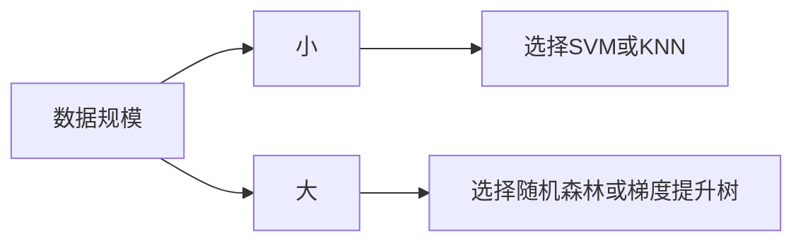
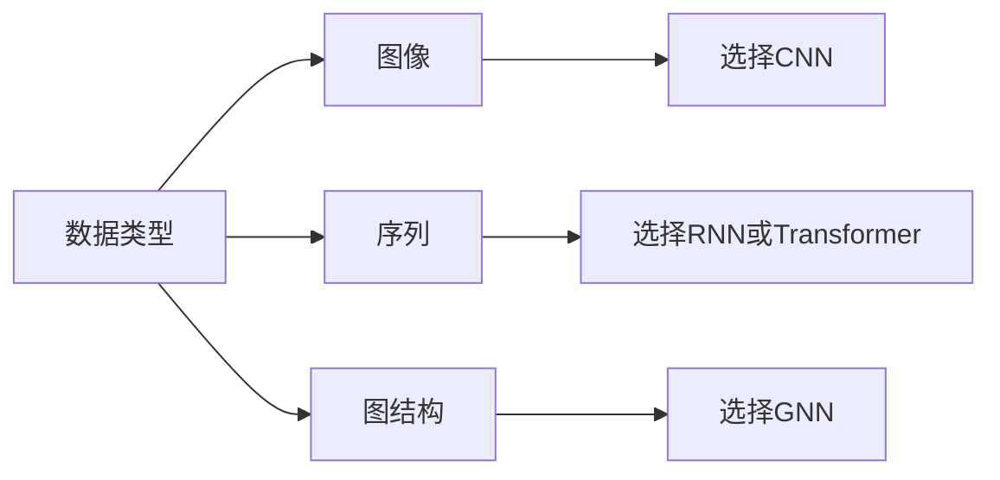
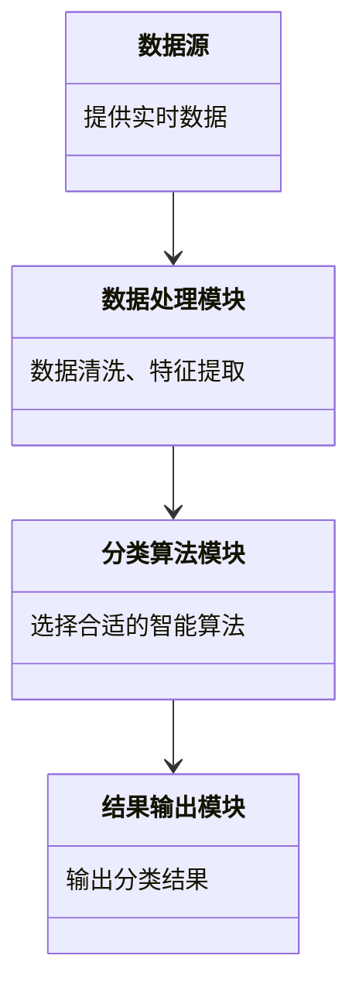
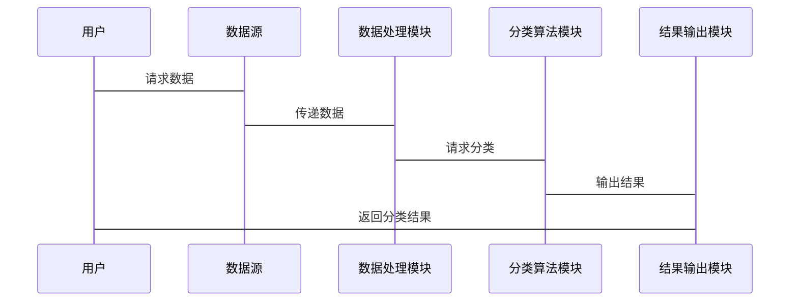

                 


# 智能算法构建动态行业分类

> 关键词：智能算法、动态行业分类、机器学习、深度学习、系统架构

> 摘要：随着数据量的爆炸式增长和行业复杂性的提升，传统的静态行业分类方法已难以满足实际需求。本文将深入探讨如何利用智能算法构建动态行业分类系统，涵盖算法原理、系统设计、项目实战等内容，为读者提供从理论到实践的全面指导。

---

## 第一部分: 智能算法与动态行业分类概述

### 第1章: 智能算法与动态行业分类背景

#### 1.1 智能算法的核心概念

##### 1.1.1 智能算法的定义与特点
智能算法是一种基于人工智能技术的算法，能够通过数据学习、模式识别和自适应优化，实现复杂问题的自动化解决。其核心特点包括：
- 数据驱动：依赖大量数据进行训练和推理。
- 自适应性：能够根据新数据动态调整模型参数。
- 高维度处理：能够处理高维、复杂的数据结构。
- 可解释性：部分算法（如线性回归）具有较高的可解释性，而深度学习算法通常较难解释。

##### 1.1.2 动态行业分类的定义与背景
动态行业分类是指根据实时数据变化，动态调整行业分类标准的过程。传统行业分类方法通常基于固定规则或少量数据，难以应对数据量激增和行业动态变化的挑战。动态行业分类的核心目标是通过智能算法实时更新分类结果，提高分类的准确性和及时性。

##### 1.1.3 智能算法在动态行业分类中的作用
智能算法通过学习海量数据中的模式和特征，能够发现传统方法难以捕捉的动态变化。例如，利用机器学习算法实时更新行业分类标准，能够更好地应对市场波动和行业趋势的变化。

#### 1.2 问题背景与目标

##### 1.2.1 行业分类的传统方法与局限性
传统的行业分类方法通常基于专家经验或固定规则，存在以下问题：
- 分类标准固定，难以适应数据变化。
- 人工成本高，分类效率低。
- 分类精度有限，难以应对复杂场景。

##### 1.2.2 动态行业分类的必要性
随着数据量的快速增长和行业动态变化，动态行业分类成为必然选择。例如，在金融领域，实时市场波动要求行业分类能够快速调整以反映最新市场状况。

##### 1.2.3 智能算法解决动态行业分类的核心问题
智能算法能够通过实时数据更新和模型优化，动态调整行业分类标准，解决传统方法的局限性。

#### 1.3 本书的核心目标与结构

##### 1.3.1 本书的核心目标
本书旨在通过智能算法实现动态行业分类，提供从理论到实践的全面指导，帮助读者掌握动态行业分类的核心技术。

##### 1.3.2 目录结构与内容概览
- 第一部分：智能算法与动态行业分类概述
- 第二部分：智能算法的核心原理与技术
- 第三部分：动态行业分类的系统分析与架构设计

##### 1.3.3 学习本书的注意事项
- 需要具备一定的编程基础和数学知识。
- 建议读者结合实际项目进行实践。

---

## 第二部分: 智能算法的核心原理与技术

### 第2章: 机器学习算法基础

#### 2.1 机器学习的基本原理

##### 2.1.1 机器学习的定义与分类
机器学习是一种人工智能技术，通过数据学习模型，实现对新数据的预测或分类。主要分为监督学习、无监督学习和强化学习。

##### 2.1.2 监督学习、无监督学习与强化学习
- **监督学习**：基于带标签的数据进行训练，如线性回归、随机森林。
- **无监督学习**：基于无标签数据进行聚类，如K-means、DBSCAN。
- **强化学习**：通过与环境交互学习策略，如Q-Learning、Deep Q-Network。

##### 2.1.3 机器学习的核心数学模型
以线性回归为例：
$$ y = \theta_0 + \theta_1 x + \epsilon $$
其中，$\theta$为模型参数，$x$为输入变量，$y$为输出变量。

#### 2.2 常见机器学习算法及其特点

##### 2.2.1 线性回归与逻辑回归
- **线性回归**：用于预测连续值，如房价预测。
- **逻辑回归**：用于分类问题，如二分类问题。

##### 2.2.2 支持向量机（SVM）
- 适用于小规模数据分类，能够处理高维数据。

##### 2.2.3 随机森林与集成学习
- **随机森林**：通过集成多个决策树提高模型鲁棒性。
- **集成学习**：通过组合多个模型提升性能。

##### 2.2.4 K-近邻算法（KNN）
- 基于距离的分类算法，适用于小规模数据。

#### 2.3 机器学习算法的优缺点对比

##### 2.3.1 各算法的优缺点分析
| 算法       | 优点                       | 缺点                       |
|------------|----------------------------|----------------------------|
| 线性回归   | 简单、计算速度快             | 仅适合线性关系               |
| 逻辑回归   | 适合二分类问题               | 仅适合线性关系               |
| SVM        | 适用于小规模数据             | 不适合大规模数据             |
| 随机森林   | 高精度、鲁棒性强             | 计算资源消耗大               |
| KNN        | 简单易实现                   | 不适合大规模数据             |

##### 2.3.2 适用场景与选择策略
- 数据规模小：选择SVM或KNN。
- 数据规模大：选择随机森林或梯度提升树。

##### 2.3.3 算法选择的决策树模型（Mermaid图）


---

### 第3章: 深度学习算法基础

#### 3.1 深度学习的基本原理

##### 3.1.1 神经网络的定义与结构
深度学习基于人工神经网络，通过多层非线性变换提取数据特征。

##### 3.1.2 深度学习与机器学习的区别
深度学习通过多层网络结构实现特征自动提取，而机器学习依赖特征工程。

##### 3.1.3 深度学习的核心数学模型
以多层感知机（MLP）为例：
$$ a^{(l)} = \sigma(W^{(l)} a^{(l-1)} + b^{(l)}) $$
其中，$a^{(l)}$为第$l$层的激活值，$\sigma$为激活函数。

#### 3.2 常见深度学习算法及其特点

##### 3.2.1 卷积神经网络（CNN）
- 适用于图像识别任务，通过卷积层提取空间特征。

##### 3.2.2 循环神经网络（RNN）
- 适用于序列数据处理，如自然语言处理。

##### 3.2.3 Transformer与注意力机制
- 通过自注意力机制处理全局依赖关系。

##### 3.2.4 图神经网络（GNN）
- 适用于图结构数据，如社交网络分析。

#### 3.3 深度学习算法的优缺点对比

##### 3.3.1 各算法的优缺点分析
| 算法       | 优点                       | 缺点                       |
|------------|----------------------------|----------------------------|
| CNN        | 适合图像识别               | 参数量大                   |
| RNN        | 适合序列数据处理           | 难以处理长序列             |
| Transformer | 适合全局依赖               | 计算资源消耗大             |
| GNN        | 适合图结构数据             | 实现复杂                   |

##### 3.3.2 适用场景与选择策略
- 图结构数据：选择GNN。
- 图像识别：选择CNN。
- 自然语言处理：选择Transformer。

##### 3.3.3 算法选择的决策树模型（Mermaid图）


---

## 第三部分: 动态行业分类的系统分析与架构设计

### 第4章: 动态行业分类的系统分析

#### 4.1 问题场景介绍

##### 4.1.1 动态行业分类的核心问题
- 数据实时更新，分类标准需动态调整。
- 行业间可能存在重叠或模糊区域，需灵活分类。

##### 4.1.2 系统需求分析
- 实时数据处理能力。
- 高效的分类算法。
- 可扩展的系统架构。

##### 4.1.3 系统目标与约束条件
- 提供实时分类结果。
- 系统需具备高可用性和可扩展性。

#### 4.2 系统功能设计

##### 4.2.1 领域模型设计（Mermaid类图）


##### 4.2.2 系统功能模块划分
- 数据源：提供实时数据。
- 数据处理模块：清洗数据并提取特征。
- 分类算法模块：选择合适的智能算法进行分类。
- 结果输出模块：输出分类结果。

##### 4.2.3 功能模块之间的关系与交互
- 数据源通过数据处理模块将数据传递给分类算法模块。
- 分类算法模块根据数据输出分类结果。

#### 4.3 系统架构设计

##### 4.3.1 系统架构的分层设计
- 数据层：存储原始数据和处理后的数据。
- 业务逻辑层：实现数据处理和分类算法。
- 表示层：展示分类结果。

##### 4.3.2 系统架构图（Mermaid图）


##### 4.3.3 系统接口设计
- 数据接口：数据源与数据处理模块之间的接口。
- 分类接口：分类算法模块与结果输出模块之间的接口。

##### 4.3.4 系统交互流程（Mermaid序列图）


---

## 第5章: 动态行业分类的实现与优化

### 5.1 项目实战

#### 5.1.1 环境安装
- 安装Python、TensorFlow、Scikit-learn等库。

#### 5.1.2 系统核心实现源代码
以下是一个简单的动态行业分类实现示例：

```python
import pandas as pd
from sklearn.ensemble import RandomForestClassifier

# 数据加载
data = pd.read_csv('industry_data.csv')

# 特征提取
X = data.drop('label', axis=1)
y = data['label']

# 模型训练
model = RandomForestClassifier()
model.fit(X, y)

# 预测
new_data = pd.read_csv('new_industry_data.csv')
new_X = new_data.drop('label', axis=1)
predictions = model.predict(new_X)

# 输出结果
print("分类结果：", predictions)
```

#### 5.1.3 代码应用解读与分析
- 数据加载：从CSV文件中读取数据。
- 特征提取：删除目标变量，提取特征。
- 模型训练：使用随机森林算法训练模型。
- 预测：对新数据进行分类预测。

#### 5.1.4 实际案例分析
以金融行业为例，利用动态行业分类算法实时更新行业分类标准，帮助投资者快速响应市场变化。

#### 5.1.5 项目小结
通过智能算法实现动态行业分类，能够显著提高分类的准确性和及时性。

---

## 第6章: 总结与展望

### 6.1 本章总结
智能算法通过实时数据处理和模型优化，能够高效实现动态行业分类。

### 6.2 未来展望
- 更加高效的算法优化。
- 多模态数据的融合与应用。

---

## 作者：AI天才研究院/AI Genius Institute & 禅与计算机程序设计艺术 /Zen And The Art of Computer Programming

