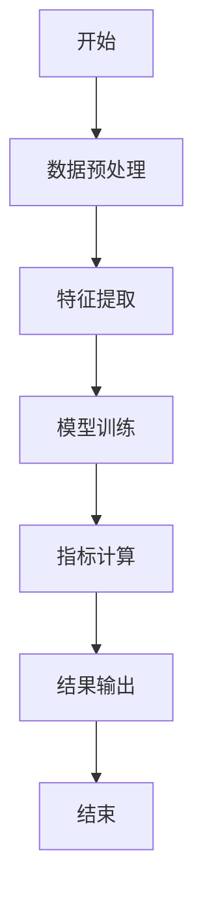

                 


# 智能算法构建动态行业景气指标

> 关键词：智能算法，行业景气指标，动态指标，算法实现，数学模型

> 摘要：本文详细探讨了利用智能算法构建动态行业景气指标的方法，从核心概念、算法原理、系统架构到项目实战，全面分析了动态行业景气指标的构建过程。通过本文，读者可以掌握如何利用智能算法实时分析和预测行业动态，从而为决策提供数据支持。

---

## 第一部分: 智能算法构建动态行业景气指标概述

### 第1章: 动态行业景气指标的背景与意义

#### 1.1 问题背景介绍
动态行业景气指标是一种能够实时反映行业发展趋势的量化指标，传统行业景气指标通常基于静态数据，难以捕捉行业动态变化。随着大数据和人工智能技术的发展，智能算法为动态行业景气指标的构建提供了新的可能性。

#### 1.2 核心概念与问题描述
动态行业景气指标的核心在于其动态性和实时性。传统指标通常基于历史数据，而动态指标则需要结合实时数据和智能算法进行动态调整和预测。

#### 1.3 问题解决与边界分析
智能算法的应用可以解决传统指标的滞后性和静态性问题。通过实时数据处理和模型优化，动态指标能够更好地反映行业动态变化。问题解决的边界包括数据来源、模型复杂度和实时性要求。

#### 1.4 核心概念结构与要素组成
动态行业景气指标的核心要素包括数据源、特征提取、模型训练和指标计算。各要素之间的关系通过ER图展示。

---

### 第2章: 智能算法与动态行业景气指标的核心联系

#### 2.1 核心概念原理
智能算法通过数据预处理、特征提取和模型训练，实现动态景气指标的计算。核心原理包括数据的实时处理和模型的动态优化。

#### 2.2 核心概念属性对比
通过对比传统指标和动态指标，分析智能算法在实时性、准确性和适应性方面的优势。

#### 2.3 ER实体关系图
```mermaid
er
  actor: 用户
  indicator: 景气指标
  algorithm: 智能算法
  relation: 实现
  actor --> indicator: 监测
  actor --> algorithm: 调用
  algorithm --> indicator: 计算
  indicator --> relation: 关联
```

---

### 第3章: 智能算法的数学模型与公式

#### 3.1 算法原理与流程


#### 3.2 核心数学模型
$$景气指数 = \sum_{i=1}^{n} w_i x_i$$
其中，$w_i$ 是第 $i$ 个特征的权重，$x_i$ 是第 $i$ 个特征的值。

---

## 第二部分: 系统分析与架构设计

### 第4章: 系统分析与架构设计方案

#### 4.1 问题场景介绍
动态行业景气指标的构建需要解决数据实时性、模型动态调整和结果可视化等问题。

#### 4.2 系统功能设计
系统功能包括数据采集、特征提取、模型训练、指标计算和结果展示。

#### 4.3 系统架构设计
```mermaid
graph TD
    User --> API: 请求指标
    API --> DataProcessing: 数据处理
    DataProcessing --> ModelTraining: 模型训练
    ModelTraining --> IndicatorCalculation: 指标计算
    IndicatorCalculation --> ResultDisplay: 结果展示
```

---

## 第三部分: 项目实战

### 第5章: 项目实战

#### 5.1 环境安装
需要安装Python、机器学习库（如scikit-learn）和数据处理库（如Pandas）。

#### 5.2 核心代码实现
```python
import pandas as pd
from sklearn.linear_model import LinearRegression

def calculate_industry景气指数(data):
    # 数据预处理
    data = data.dropna()
    # 特征提取
    features = data[['feature1', 'feature2']]
    target = data['target']
    # 模型训练
    model = LinearRegression()
    model.fit(features, target)
    # 指标计算
   景气指数 = model.predict(features)
    return 景气指数

# 示例数据
data = pd.DataFrame({
    'feature1': [1, 2, 3],
    'feature2': [4, 5, 6],
    'target': [7, 8, 9]
})

# 调用函数
result = calculate_industry景气指数(data)
print(result)
```

#### 5.3 案例分析与详细解读
通过实际案例分析，展示如何利用智能算法构建动态行业景气指标，并解释结果的含义。

---

## 第四部分: 最佳实践与总结

### 第6章: 最佳实践与总结

#### 6.1 最佳实践 Tips
- 数据来源的可靠性和实时性是关键。
- 模型需要定期更新以适应数据变化。

#### 6.2 小结
本文详细介绍了智能算法在动态行业景气指标构建中的应用，通过理论分析和实战案例，展示了其优势和实现方法。

#### 6.3 注意事项
- 数据隐私和安全问题需要重视。
- 模型的可解释性和鲁棒性需要优化。

#### 6.4 拓展阅读
推荐相关书籍和论文，供读者深入学习。

---

作者：AI天才研究院/AI Genius Institute & 禅与计算机程序设计艺术 /Zen And The Art of Computer Programming

