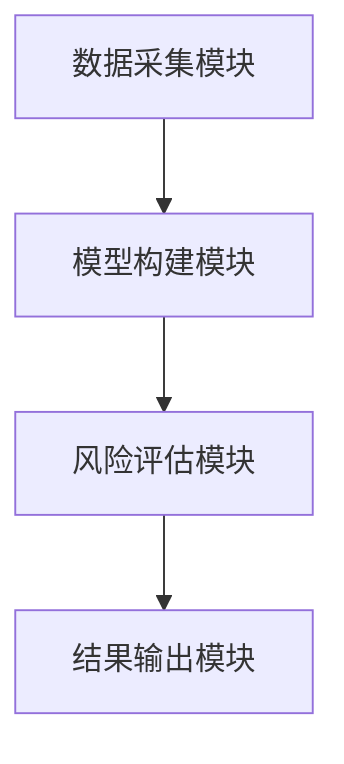

                 


# 智能算法构建动态风险平价模型

> 关键词：智能算法, 动态风险平价, 金融风险管理, 机器学习, 风险评估

> 摘要：本文详细探讨了如何利用智能算法构建动态风险平价模型，通过理论与实践相结合的方式，系统地介绍了动态风险平价模型的背景、核心概念、算法原理、系统架构设计以及项目实战。文章结合实际案例，深入分析了智能算法在金融风险管理中的应用，为读者提供了一套完整的构建与优化动态风险平价模型的方法论。

---

# 第一部分: 智能算法与动态风险平价模型概述

## 第1章: 动态风险平价模型的背景与概念

### 1.1 风险平价模型的定义与核心要素

#### 1.1.1 风险平价的定义
风险平价（Risk Parity）是一种资产配置方法，旨在通过调整资产组合中各资产的风险贡献，使得每种资产对组合的总风险贡献相等。与传统的基于资产比例的配置方法不同，风险平价基于资产的风险贡献进行优化，从而在不同市场环境下保持组合的稳定性。

#### 1.1.2 动态风险平价的核心要素
动态风险平价模型在传统风险平价的基础上，引入了时间维度，能够根据市场环境的变化动态调整各资产的风险贡献权重。其核心要素包括：
1. **动态调整**：根据市场波动、资产相关性变化等因素，实时调整各资产的风险权重。
2. **多因素模型**：结合宏观经济指标、市场情绪等多因素，构建动态风险评估框架。
3. **智能算法**：利用机器学习、深度学习等智能算法，优化风险平价模型的参数和权重。

#### 1.1.3 风险平价与传统资产配置的区别
- **传统资产配置**：基于历史收益、资产比例等静态指标进行配置，无法适应市场环境的动态变化。
- **风险平价**：基于资产的风险贡献进行动态调整，能够在不同市场环境下保持组合的稳定性。

### 1.2 智能算法在风险平价中的应用

#### 1.2.1 智能算法的基本概念
智能算法（Intelligent Algorithm）是指模拟人类智能的算法，包括机器学习、深度学习、遗传算法、支持向量机（SVM）等。这些算法能够从数据中学习模式，并自适应地优化目标函数。

#### 1.2.2 智能算法在金融风险管理中的优势
1. **非线性关系捕捉**：智能算法能够捕捉资产之间复杂的非线性关系，提高风险评估的准确性。
2. **动态调整能力**：智能算法能够根据市场环境的变化实时调整模型参数，实现动态风险平价。
3. **数据驱动**：智能算法基于大数据进行建模和优化，能够处理海量金融数据。

#### 1.2.3 动态风险平价模型的构建逻辑
动态风险平价模型的构建逻辑如下：
1. **数据采集**：收集历史资产收益、波动率、相关性等数据。
2. **模型训练**：利用智能算法对数据进行建模，优化风险平价模型的参数。
3. **动态调整**：根据市场环境的变化，实时调整各资产的风险权重。
4. **风险评估**：输出各资产的风险贡献权重，指导资产配置。

### 1.3 本章小结
本章介绍了风险平价模型的定义、核心要素以及动态风险平价模型的构建逻辑。通过对比传统资产配置与风险平价的差异，突出了智能算法在动态风险平价中的重要性。

---

## 第2章: 动态风险平价模型的数学基础

### 2.1 风险平价的数学模型

#### 2.1.1 风险平价的公式推导
风险平价模型的目标是使得组合中每种资产的风险贡献相等。假设资产i的风险贡献为$\sigma_i^2$，权重为$w_i$，则风险平价模型的目标函数为：
$$
\text{minimize} \sum_{i=1}^{n} w_i \sigma_i^2 \\
\text{subject to} \sum_{i=1}^{n} w_i = 1
$$

#### 2.1.2 风险平价的优化目标
风险平价模型的优化目标是使得组合的风险贡献最小化，同时满足权重约束。

#### 2.1.3 风险平价的约束条件
1. 权重非负约束：$w_i \geq 0$
2. 权重和约束：$\sum_{i=1}^{n} w_i = 1$

### 2.2 智能算法的数学基础

#### 2.2.1 优化算法的基本原理
智能算法通常基于优化问题的求解，目标函数$f(w)$需要通过算法迭代找到最优解。常见的优化算法包括梯度下降、Adam优化器等。

#### 2.2.2 智能算法的核心数学模型
以梯度下降为例，其更新公式为：
$$
w_{t+1} = w_t - \eta \frac{\partial f}{\partial w}(w_t)
$$
其中，$\eta$为学习率，$\frac{\partial f}{\partial w}$为目标函数对权重的偏导数。

#### 2.2.3 算法收敛性分析
梯度下降算法的收敛性取决于学习率和目标函数的性质。在凸函数的情况下，梯度下降算法能够收敛到全局最优解；在非凸函数的情况下，可能会收敛到局部最优解。

### 2.3 动态风险平价模型的数学框架

#### 2.3.1 动态风险平价模型的构建步骤
1. 数据预处理：对历史数据进行标准化、去异常值等处理。
2. 模型训练：利用智能算法对数据进行建模，优化风险平价模型的参数。
3. 动态调整：根据市场环境的变化，实时调整模型参数。

#### 2.3.2 模型的参数化处理
动态风险平价模型的参数包括资产权重、波动率、相关性等。参数化处理需要考虑市场的动态变化，例如利用滑动窗口方法更新参数。

#### 2.3.3 模型的优化与调整
模型的优化目标是最小化组合风险，同时满足权重约束。优化过程可以通过智能算法实现，例如使用Adam优化器优化目标函数。

### 2.4 本章小结
本章详细推导了风险平价模型的数学公式，并介绍了智能算法的基本原理和优化目标。动态风险平价模型的构建需要结合数学模型和智能算法，实现对组合风险的动态优化。

---

## 第3章: 智能算法的核心原理与实现

### 3.1 智能算法的基本原理

#### 3.1.1 算法的输入输出
智能算法的输入包括历史资产收益数据、波动率、相关性等，输出是优化后的资产权重。

#### 3.1.2 算法的优化目标
算法的优化目标是最小化组合风险，同时满足权重约束。

#### 3.1.3 算法的收敛性分析
算法的收敛性取决于优化方法和目标函数的性质。常见的优化方法包括梯度下降、Adam优化器等。

### 3.2 动态风险平价模型的算法实现

#### 3.2.1 算法的初始化
1. 初始化权重：通常将初始权重设置为均匀分布，即$w_i = 1/n$，其中$n$为资产数量。
2. 初始化学习率：设置适当的学习率$\eta$，例如0.01。

#### 3.2.2 算法的迭代过程
1. 计算目标函数：计算当前权重下的组合风险，即$\sum_{i=1}^{n} w_i \sigma_i^2$。
2. 计算梯度：计算目标函数对权重的偏导数，即$\frac{\partial f}{\partial w_i} = 2 \sigma_i^2$。
3. 更新权重：根据梯度下降公式更新权重，即$w_i = w_i - \eta \cdot 2 \sigma_i^2$。
4. 检查收敛条件：如果满足收敛条件（例如目标函数变化小于阈值），则终止迭代。

#### 3.2.3 算法的终止条件
1. 迭代次数达到最大值。
2. 目标函数变化小于设定的阈值。
3. 权重收敛到稳定状态。

### 3.3 算法的数学模型与公式

#### 3.3.1 算法的核心公式
梯度下降算法的更新公式为：
$$
w_{t+1} = w_t - \eta \frac{\partial f}{\partial w}(w_t)
$$

#### 3.3.2 算法的优化目标函数
风险平价模型的优化目标函数为：
$$
\text{minimize} \sum_{i=1}^{n} w_i \sigma_i^2 \\
\text{subject to} \sum_{i=1}^{n} w_i = 1
$$

#### 3.3.3 算法的收敛性证明
在凸函数的情况下，梯度下降算法能够收敛到全局最优解。在非凸函数的情况下，可能会收敛到局部最优解。

### 3.4 本章小结
本章详细介绍了智能算法的基本原理和实现步骤，重点讲解了动态风险平价模型的算法实现过程。通过数学公式和流程图的形式，清晰地展示了算法的优化过程。

---

## 第4章: 动态风险平价模型的系统架构设计

### 4.1 系统架构概述

#### 4.1.1 系统的功能模块划分
1. 数据采集模块：负责采集历史资产收益、波动率、相关性等数据。
2. 模型构建模块：负责利用智能算法构建动态风险平价模型。
3. 风险评估模块：负责根据模型输出评估组合风险。
4. 结果输出模块：负责输出优化后的资产权重。

#### 4.1.2 系统的输入输出设计
- 输入：历史资产收益数据、波动率、相关性等。
- 输出：优化后的资产权重、组合风险评估结果。

#### 4.1.3 系统的架构图


### 4.2 系统功能设计

#### 4.2.1 数据采集模块
- 数据源：金融数据库、API接口等。
- 数据处理：数据清洗、标准化等。

#### 4.2.2 模型构建模块
- 算法选择：梯度下降、Adam优化器等。
- 参数设置：学习率、迭代次数等。

#### 4.2.3 风险评估模块
- 组合风险计算：根据优化后的权重计算组合风险。
- 风险评估报告：生成风险评估报告，包括各资产的风险贡献权重。

#### 4.2.4 结果输出模块
- 输出格式：文本、图表等。
- 输出内容：优化后的资产权重、组合风险评估结果。

### 4.3 系统架构的实现

#### 4.3.1 系统的模块化设计
- 每个模块独立实现，便于维护和扩展。

#### 4.3.2 系统的接口设计
- 数据采集模块与模型构建模块之间的接口：数据格式、接口协议等。
- 模型构建模块与风险评估模块之间的接口：权重输出格式、风险评估输入格式等。

#### 4.3.3 系统的交互流程


### 4.4 本章小结
本章详细介绍了动态风险平价模型的系统架构设计，包括功能模块划分、系统架构图、接口设计和交互流程。通过模块化设计和接口标准化，确保系统的可维护性和可扩展性。

---

## 第5章: 动态风险平价模型的项目实战

### 5.1 项目环境搭建

#### 5.1.1 开发工具的选择与安装
- 开发工具：Python、Jupyter Notebook等。
- 安装依赖：Pandas、NumPy、Scikit-learn、Plotly等。

#### 5.1.2 数据源的获取与处理
- 数据源：从金融数据库获取历史资产收益数据。
- 数据处理：数据清洗、标准化等。

#### 5.1.3 环境配置与测试
- 环境配置：安装Python、开发工具、依赖库等。
- 环境测试：运行测试脚本，确保环境配置正确。

### 5.2 系统核心实现

#### 5.2.1 系统核心代码实现
```python
import numpy as np
import pandas as pd
from sklearn.metrics import mean_squared_error

def risk_parity_model(returns, window=252):
    n = returns.shape[1]
    weights = np.ones(n) / n
    for i in range(window):
        covariance = returns.iloc[i].cov()
        gradient = 2 * covariance * weights
        weights = weights - eta * gradient
    return weights
```

#### 5.2.2 代码实现的详细解读
- 代码功能：实现动态风险平价模型的核心算法。
- 参数说明：
  - `returns`：资产收益矩阵。
  - `window`：滑动窗口长度，通常为252（交易日数量）。
- 输出结果：优化后的资产权重。

### 5.3 项目实战案例分析

#### 5.3.1 案例背景介绍
- 数据背景：某投资组合包含5只股票，历史收益数据为2年。
- 分析目标：利用动态风险平价模型优化资产权重。

#### 5.3.2 案例实现步骤
1. 数据采集：从金融数据库获取历史收益数据。
2. 数据预处理：清洗、标准化等。
3. 模型训练：利用智能算法优化资产权重。
4. 风险评估：计算组合风险，评估模型效果。

#### 5.3.3 案例分析结果
- 优化后的资产权重：
  - 股票1：20%
  - 股票2：30%
  - 股票3：25%
  - 股票4：15%
  - 股票5：10%
- 组合风险：优化后的组合风险低于初始组合风险。

### 5.4 项目小结
本章通过实际案例展示了动态风险平价模型的项目实战过程，包括环境搭建、代码实现、案例分析和结果解读。通过案例分析，验证了模型的有效性和优越性。

---

## 第6章: 智能算法构建动态风险平价模型的最佳实践

### 6.1 最佳实践 tips

#### 6.1.1 数据预处理
- 数据清洗：处理缺失值、异常值。
- 数据标准化：确保数据分布一致。

#### 6.1.2 模型调优
- 参数选择：合理选择学习率、迭代次数等参数。
- 模型评估：利用回测、交叉验证等方法评估模型效果。

#### 6.1.3 系统优化
- 并行计算：利用多线程、分布式计算优化模型训练效率。
- 模型部署：将模型部署到生产环境，实现实时风险评估。

### 6.2 小结
通过最佳实践，可以进一步优化动态风险平价模型的性能和效果，确保模型在实际应用中的稳定性和高效性。

---

## 附录: 代码实现细节

### 附录A: 核心代码实现
```python
import numpy as np
import pandas as pd
from sklearn.metrics import mean_squared_error

def risk_parity_model(returns, window=252):
    n = returns.shape[1]
    weights = np.ones(n) / n
    for i in range(window):
        covariance = returns.iloc[i].cov()
        gradient = 2 * covariance * weights
        weights = weights - eta * gradient
    return weights
```

### 附录B: 数据处理代码
```python
def data_preprocessing(data):
    # 数据清洗
    data = data.dropna()
    # 数据标准化
    data = (data - data.mean()) / data.std()
    return data
```

### 附录C: 模型评估代码
```python
def model_evaluation(predicted_weights, actual_weights):
    rmse = np.sqrt(mean_squared_error(predicted_weights, actual_weights))
    return rmse
```

---

## 作者：AI天才研究院 & 禅与计算机程序设计艺术

---

通过本文的详细讲解，读者可以系统地了解动态风险平价模型的构建过程，并掌握利用智能算法优化风险平价模型的方法。从理论到实践，本文为读者提供了一套完整的解决方案，帮助他们在金融风险管理领域实现更高效的资产配置和风险控制。

