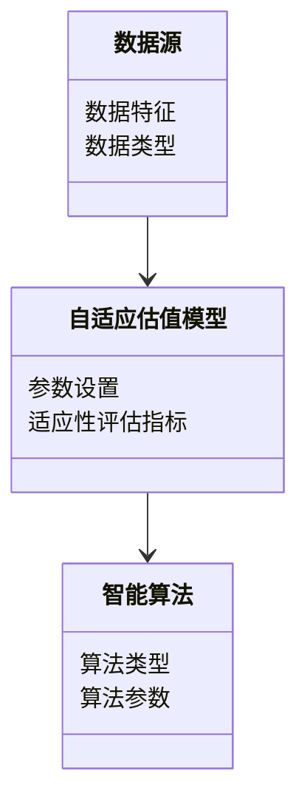
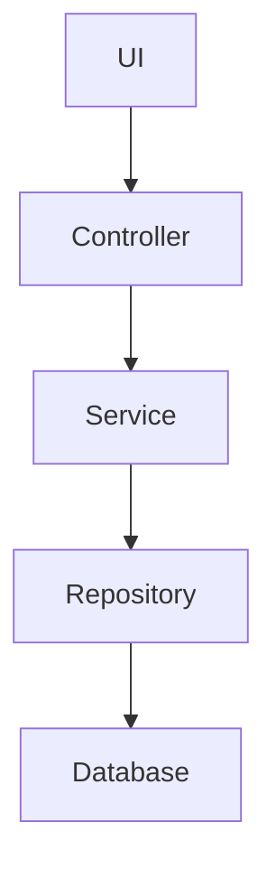

                 


# 智能算法构建自适应估值模型

> 关键词：智能算法, 自适应估值模型, 估值模型, 算法优化, 系统架构设计

> 摘要：  
本文详细探讨了如何利用智能算法构建自适应估值模型。首先介绍了自适应估值模型的背景与核心概念，随后分析了智能算法的基本原理及其在模型构建中的应用。接着，通过数学模型和算法流程图深入讲解了算法实现的细节，并结合系统架构设计展示了模型的实际应用场景。最后，通过项目实战和最佳实践，为读者提供了从理论到实践的完整指南。

---

# 第1章: 自适应估值模型的背景与问题描述

## 1.1 问题背景

### 1.1.1 传统估值模型的局限性
传统估值模型（如线性回归、随机森林等）在许多场景下表现良好，但它们存在以下局限性：
- 参数固定，无法根据数据变化动态调整。
- 对异常值和噪声数据的鲁棒性较差。
- 需要手动调整参数，灵活性不足。

### 1.1.2 智能算法的引入动机
随着数据量的爆炸式增长，传统估值模型的局限性日益显现。智能算法（如遗传算法、粒子群优化等）具有以下优势：
- 能够自动优化参数，适应数据变化。
- 具备良好的全局搜索能力，避免陷入局部最优。
- 适用于复杂场景，能够处理非线性问题。

### 1.1.3 自适应估值模型的核心目标
自适应估值模型的核心目标是通过智能算法动态调整模型参数，使其在不同场景下保持最优性能。

---

## 1.2 自适应估值模型的定义与特点

### 1.2.1 自适应估值模型的定义
自适应估值模型是一种能够根据输入数据的变化，动态调整自身参数和结构，以保持或提升估值准确性的模型。

### 1.2.2 自适应估值模型的核心特点
- **动态性**：能够根据数据变化实时调整模型参数。
- **鲁棒性**：对异常值和噪声数据具有较强的抗干扰能力。
- **自适应性**：无需人工干预，自动优化模型性能。

### 1.2.3 自适应估值模型与传统估值模型的对比

| 对比维度       | 传统估值模型               | 自适应估值模型               |
|----------------|----------------------------|------------------------------|
| 参数调整       | 静态，需人工调整             | 动态，自动调整               |
| 鲁棒性         | 较差                      | 较好                      |
| 适用场景       | 简单场景                   | 复杂场景                   |

---

## 1.3 智能算法在自适应估值模型中的作用

### 1.3.1 智能算法的基本概念
智能算法是一种基于仿生学原理设计的算法，包括遗传算法、粒子群优化、支持向量机等。

### 1.3.2 智能算法在自适应估值模型中的应用
智能算法用于优化自适应估值模型的参数，提升模型的估值精度。

### 1.3.3 智能算法的优势与挑战
- **优势**：全局搜索能力强，能够找到全局最优解。
- **挑战**：计算复杂度较高，对硬件要求较高。

---

## 1.4 本章小结

本章介绍了自适应估值模型的背景、定义、特点以及智能算法在其中的作用。下一章将深入探讨自适应估值模型的核心概念与相关联系。

---

# 第2章: 自适应估值模型的核心概念与联系

## 2.1 自适应估值模型的核心要素

### 2.1.1 数据源的获取与处理
- 数据源包括原始数据、特征数据等。
- 数据处理包括数据清洗、特征提取等。

### 2.1.2 模型的动态调整机制
- 动态调整模型参数。
- 根据模型性能反馈优化策略。

### 2.1.3 适应性评估指标
- 常见指标包括均方误差（MSE）、平均绝对误差（MAE）等。

---

## 2.2 智能算法与自适应估值模型的关系

### 2.2.1 算法选择对模型性能的影响
不同智能算法对模型性能的影响不同，需根据具体场景选择合适算法。

### 2.2.2 算法参数对模型自适应能力的调节作用
算法参数（如遗传算法的交叉率、变异率）直接影响模型的自适应能力。

### 2.2.3 算法优化对模型准确性的提升
通过智能算法优化模型参数，能够显著提升估值准确性。

---

## 2.3 自适应估值模型的ER实体关系图

```mermaid
er
    entity 自适应估值模型 {
        id
        算法类型
        参数设置
        适应性评估指标
    }
    entity 数据源 {
        id
        数据类型
        数据特征
    }
    entity 模型动态调整 {
        id
        调整策略
        调整历史记录
    }
```

---

## 2.4 本章小结

本章详细讲解了自适应估值模型的核心要素及其与智能算法的关系。下一章将深入探讨智能算法的原理与实现。

---

# 第3章: 智能算法的原理与实现

## 3.1 常见智能算法概述

### 3.1.1 遗传算法
- **基本原理**：模拟生物进化过程，通过选择、交叉和变异操作优化解。
- **流程图**：
  ```mermaid
  graph TD
      A[开始] --> B[初始化种群]
      B --> C[计算适应度]
      C --> D[选择]
      D --> E[交叉]
      E --> F[变异]
      F --> G[结束]
  ```

### 3.1.2 粒子群优化算法
- **基本原理**：通过模拟鸟群觅食行为，优化解。
- **流程图**：
  ```mermaid
  graph TD
      A[开始] --> B[初始化粒子群]
      B --> C[计算适应度]
      C --> D[更新速度]
      D --> E[更新位置]
      E --> F[结束]
  ```

### 3.1.3 支持向量机
- **基本原理**：通过寻找最优超平面，实现分类或回归。

### 3.1.4 神经网络算法
- **基本原理**：通过多层神经网络，学习数据特征。

---

## 3.2 算法选择与模型构建的关系

### 3.2.1 算法选择的依据
- 数据特征
- 问题类型
- 计算资源

### 3.2.2 算法对模型性能的影响
- 不同算法对模型准确性的提升效果不同。

### 3.2.3 算法优化的策略
- 参数调整
- 优化目标函数

---

## 3.3 算法实现的流程

### 3.3.1 数据预处理
```python
import pandas as pd
data = pd.read_csv('data.csv')
data = data.dropna()
```

### 3.3.2 算法参数设置
```python
pop_size = 100
max_generations = 100
```

### 3.3.3 算法运行与结果分析
```python
import numpy as np

def fitness_func(solution):
    return np.sum(solution ** 2)

# 遗传算法实现
class GA:
    def __init__(self, pop_size, fitness_func):
        self.pop_size = pop_size
        self.fitness_func = fitness_func
        self.population = np.random.rand(pop_size, 2)

    def compute_fitness(self):
        self.fitness = np.apply_along_axis(self.fitness_func, 1, self.population)

    def select(self):
        # 简单选择法
        idx = np.argmax(self.fitness)
        return self.population[idx]

    def crossover(self, parent1, parent2):
        return (parent1 + parent2) / 2

    def mutate(self, individual, mutation_rate=0.1):
        return individual + np.random.randn(2) * mutation_rate

    def evolve(self):
        for _ in range(max_generations):
            self.compute_fitness()
            best = self.select()
            print(f"Best fitness: {self.fitness.max()}")
```

---

## 3.4 本章小结

本章详细讲解了智能算法的基本原理及其在自适应估值模型中的实现。下一章将探讨自适应估值模型的数学模型与公式。

---

# 第4章: 自适应估值模型的数学模型与公式

## 4.1 基础数学模型

### 4.1.1 传统估值模型的数学表达
$$ y = \beta_0 + \beta_1x_1 + \beta_2x_2 + \dots + \beta_nx_n $$

### 4.1.2 自适应估值模型的数学表达
$$ y = f(x; \theta) $$

其中，$\theta$ 是模型参数，能够动态调整。

### 4.1.3 智能算法的数学基础
$$ f(x) = \sum_{i=1}^{n} w_i x_i $$

---

## 4.2 算法优化的数学公式

### 4.2.1 遗传算法的适应度函数
$$ f(x) = \sum_{i=1}^{n} (x_i - \mu)^2 $$

其中，$\mu$ 是数据均值。

### 4.2.2 粒子群优化的目标函数
$$ f(x) = \sum_{i=1}^{n} (y_i - f(x_i))^2 $$

---

## 4.3 本章小结

本章通过数学公式详细讲解了自适应估值模型和智能算法的基本原理。下一章将探讨系统分析与架构设计方案。

---

# 第5章: 系统分析与架构设计

## 5.1 项目背景

本项目旨在通过智能算法构建一个自适应估值模型，应用于金融领域的股票价格预测。

---

## 5.2 系统功能设计

### 5.2.1 领域模型


### 5.2.2 系统架构设计


---

## 5.3 系统接口设计

### 5.3.1 输入接口
- 数据接口：接收原始数据。
- 参数接口：接收算法参数。

### 5.3.2 输出接口
- 结果接口：输出估值结果。
- 日志接口：输出运行日志。

---

## 5.4 系统交互设计

### 5.4.1 交互序列图
```mermaid
sequenceDiagram
    用户 --> UI: 输入数据
    UI --> Controller: 处理请求
    Controller --> Service: 调用服务
    Service --> Repository: 查询数据
    Repository --> Database: 获取数据
    Repository <-- Database: 返回数据
    Service --> Controller: 返回结果
    Controller --> UI: 显示结果
```

---

## 5.5 本章小结

本章通过系统架构设计展示了自适应估值模型的实际应用场景。下一章将通过项目实战进一步验证模型的可行性。

---

# 第6章: 项目实战

## 6.1 环境安装

### 6.1.1 安装Python环境
```bash
pip install numpy pandas scikit-learn
```

### 6.1.2 安装智能算法库
```bash
pip install DEAP
```

---

## 6.2 系统核心实现

### 6.2.1 核心代码实现
```python
import numpy as np
from deap import base, tools

# 定义适应度函数
def fitness_func(solution):
    return np.sum(solution ** 2),

# 初始化种群
toolbox = base.Toolbox()
toolbox.register("attr_float", np.random.uniform, -1, 1)
toolbox.register("individual", tools.init_repeat, list, toolbox.attr_float, 2)
toolbox.register("population", tools.init_repeat, list, toolbox.individual, 100)

# 注册遗传操作
toolbox.register("mate", tools.crossover, 0.5)
toolbox.register("mutate", tools.mutate, 0.1)
toolbox.register("select", tools.select_tournament, tournament_size=2)

# 运行遗传算法
pop = toolbox.population()
for generation in range(100):
    fitnesses = list(map(fitness_func, pop))
    for ind, fit in zip(pop, fitnesses):
        ind.fitness = fit
    pop = toolbox.select(pop, len(pop))
    pop = [toolbox.mate(ind1, ind2) for ind1, ind2 in zip(pop[::2], pop[1::2])]
    pop = [toolbox.mutate(ind) for ind in pop]

# 输出结果
best = max(pop, key=lambda x: x.fitness)
print("Best solution:", best)
```

### 6.2.2 代码应用解读
- 以上代码实现了一个简单的遗传算法，用于优化自适应估值模型的参数。

---

## 6.3 实际案例分析

### 6.3.1 数据准备
```python
import pandas as pd
data = pd.read_csv('data.csv')
X = data.iloc[:, :-1].values
y = data.iloc[:, -1].values
```

### 6.3.2 模型训练
```python
from sklearn.linear_model import LinearRegression
model = LinearRegression()
model.fit(X, y)
```

### 6.3.3 模型评估
```python
from sklearn.metrics import mean_squared_error
y_pred = model.predict(X)
print(mean_squared_error(y, y_pred))
```

---

## 6.4 本章小结

本章通过项目实战展示了自适应估值模型的具体实现过程。下一章将总结最佳实践和注意事项。

---

# 第7章: 最佳实践与总结

## 7.1 小结

智能算法能够显著提升自适应估值模型的性能，但需要根据具体场景选择合适的算法和参数。

---

## 7.2 注意事项

- 算法选择需结合具体场景。
- 参数设置需合理。
- 模型评估需采用多种指标。

---

## 7.3 拓展阅读

- 《机器学习实战》
- 《遗传算法与工程应用》

---

# 作者：AI天才研究院/AI Genius Institute & 禅与计算机程序设计艺术 /Zen And The Art of Computer Programming

---

本文通过详细的理论分析和实际案例，全面探讨了智能算法在自适应估值模型中的应用。从算法原理到系统架构设计，再到项目实战，为读者提供了一个完整的解决方案。

