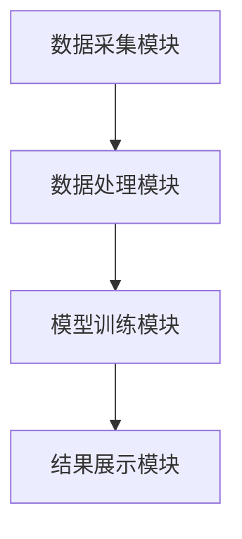
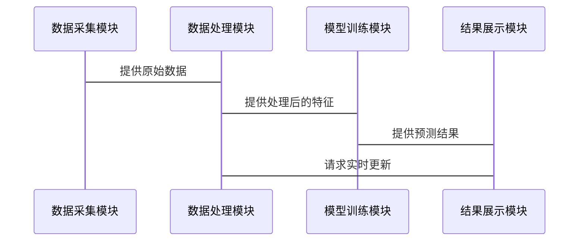

                 


# 智能算法识别市场情绪拐点信号

## 关键词：
- 市场情绪拐点
- 智能算法
- 时间序列分析
- 自然语言处理
- 机器学习
- 情感分析

## 摘要：
市场情绪拐点是金融市场中一个重要的研究方向，能够帮助投资者在市场波动中做出更明智的决策。本文通过智能算法，如时间序列分析、自然语言处理和机器学习模型，详细探讨了如何识别市场情绪拐点信号。文章从数据来源、特征提取、算法原理、系统架构设计到实际案例分析，全面介绍了市场情绪拐点识别的理论与实践。通过对多种算法的对比与优化，结合实际项目实战，本文为读者提供了深入了解市场情绪拐点识别的有效方法。

---

## 第1章: 市场情绪拐点与智能算法概述

### 1.1 市场情绪拐点的定义与重要性

#### 1.1.1 市场情绪拐点的定义
市场情绪拐点是指金融市场中投资者情绪发生显著变化的临界点。这种变化通常与市场的波动、价格走势的变化密切相关。拐点可能是市场从上涨转为下跌，或者从下跌转为上涨的转折点。

#### 1.1.2 市场情绪拐点的重要性
- 帮助投资者在市场波动中做出及时的决策。
- 提供提前预警机制，避免重大损失或抓住潜在机会。
- 为机构投资者制定策略提供数据支持。

#### 1.1.3 智能算法在市场情绪分析中的作用
智能算法通过分析海量数据，识别市场情绪的变化趋势，从而提前预测市场拐点。算法的优势在于能够处理复杂、非线性的问题，并能够在大数据环境中快速找到规律。

### 1.2 智能算法的核心概念

#### 1.2.1 智能算法的基本原理
智能算法通常基于机器学习和深度学习，通过训练模型从历史数据中提取特征，识别模式，并预测未来的变化。这些算法能够处理结构化和非结构化的数据，如时间序列数据和文本数据。

#### 1.2.2 市场情绪分析的常用算法
- **支持向量机（SVM）**：适用于分类任务，能够区分不同的市场情绪状态。
- **随机森林（Random Forest）**：用于分类和回归，能够处理高维数据。
- **长短期记忆网络（LSTM）**：适用于时间序列数据，能够捕捉长期依赖关系。
- **Transformer模型**：在自然语言处理领域表现出色，适用于文本数据的情感分析。

#### 1.2.3 智能算法的优势与局限性
**优势**：
- 能够处理复杂的数据模式。
- 可以自动化提取特征，减少人工干预。
- 高度可扩展，适用于大规模数据。

**局限性**：
- 对数据质量要求较高，噪声数据可能影响模型性能。
- 模型的解释性较差，难以直观理解拐点的形成原因。
- 对计算资源需求较高，尤其是深度学习模型。

### 1.3 市场情绪拐点信号的识别需求

#### 1.3.1 金融市场中的情绪分析需求
- 投资者需要实时了解市场情绪，以便做出快速决策。
- 机构需要通过市场情绪分析制定长期投资策略。

#### 1.3.2 智能算法在情绪拐点识别中的应用场景
- **实时监测**：通过智能算法实时监控市场情绪，提供及时的预警。
- **历史回测**：利用历史数据训练模型，验证拐点识别的准确性。
- **风险控制**：通过预测市场情绪拐点，制定有效的风险管理策略。

#### 1.3.3 情绪拐点信号识别的挑战与机遇
**挑战**：
- 市场情绪的变化受多种因素影响，难以准确预测。
- 数据质量和多样性可能影响模型的泛化能力。

**机遇**：
- 大数据技术的发展为市场情绪分析提供了丰富的数据来源。
- 深度学习模型的不断进步为复杂模式的识别提供了可能。

---

## 第2章: 市场情绪数据的来源与特征

### 2.1 市场情绪数据的来源

#### 2.1.1 传统金融市场数据
- 股票价格、指数、成交量等数据。
- 数据来源包括股票交易所的公开数据和金融信息服务提供商的数据。

#### 2.1.2 社交媒体数据
- Twitter、Facebook等社交平台上的用户评论、帖子。
- 通过自然语言处理技术分析文本情绪。

#### 2.1.3 新闻与舆情数据
- 财经新闻、行业报告等文本数据。
- 通过情感分析技术判断新闻的积极或消极情绪。

#### 2.1.4 其他辅助数据
- 宏观经济指标（GDP、失业率等）。
- 政治事件、自然灾害等可能影响市场情绪的事件。

### 2.2 市场情绪数据的特征分析

#### 2.2.1 时间序列特征
- 数据的时间依赖性。
- 周期性、趋势性、随机性。

#### 2.2.2 文本特征
- 词语的情感倾向。
- 句子的复杂性、语气。

#### 2.2.3 统计特征
- 均值、方差、偏度等统计指标。
- 数据的分布特征。

#### 2.2.4 图结构特征
- 社交网络中的节点度、中心性等。

### 2.3 数据预处理与特征提取

#### 2.3.1 数据清洗与标准化
- 去除噪声数据。
- 标准化或归一化处理。

#### 2.3.2 文本特征提取方法
- TF-IDF：计算词语的重要性。
- Word2Vec：将词语映射为向量。
- BERT：提取上下文语义特征。

#### 2.3.3 时间序列特征提取
- 分解时间序列（如ARIMA模型）。
- 使用滑动窗口提取特征。

#### 2.3.4 特征选择与降维
- 选择对模型影响较大的特征。
- 使用主成分分析（PCA）进行降维。

---

## 第3章: 市场情绪拐点识别的核心算法原理

### 3.1 时间序列分析算法

#### 3.1.1 ARIMA模型
- **原理**：基于时间序列的自相关性和平稳性。
- **流程**：
  1. 检验数据的平稳性。
  2. 确定模型的参数（p, d, q）。
  3. 模型训练与预测。

#### 3.1.2 LSTM模型
- **原理**：通过长短期记忆单元捕捉长期依赖关系。
- **流程**：
  1. 将时间序列数据转换为序列输入。
  2. 构建LSTM网络并训练。
  3. 预测未来值并识别拐点。

#### 3.1.3 Prophet模型
- **原理**：基于时间序列分解和回归模型。
- **流程**：
  1. 分解数据为趋势、季节性、噪声。
  2. 训练模型并预测未来值。
  3. 通过置信区间判断拐点。

#### 3.1.4 算法对比与适用场景
| 算法 | 优点 | 缺点 | 适用场景 |
|------|------|------|----------|
| ARIMA | 简单、易于解释 | 无法捕捉复杂模式 | 线性趋势和周期性数据 |
| LSTM | 能捕捉复杂模式 | 需大量数据、计算复杂 | 非线性、长依赖关系数据 |
| Prophet | 易用性高、适合业务理解 | 对异常值敏感 | 需要简单解释的场景 |

### 3.2 自然语言处理算法

#### 3.2.1 TF-IDF与词袋模型
- **原理**：计算词语的重要性，构建词袋向量。
- **流程**：
  1. 分词并统计词频。
  2. 计算TF-IDF权重。
  3. 构建词袋向量。

#### 3.2.2 Word2Vec与GloVe
- **原理**：将词语映射为低维向量，捕捉语义信息。
- **流程**：
  1. 训练词嵌入模型。
  2. 使用嵌入向量表示文本。

#### 3.2.3 BERT与Transformer模型
- **原理**：通过自注意力机制捕捉上下文语义。
- **流程**：
  1. 将文本输入BERT模型。
  2. 提取模型的隐藏层向量。
  3. 使用向量表示文本情绪。

#### 3.2.4 情感分析算法
- **原理**：通过机器学习或深度学习模型判断文本情感倾向。
- **流程**：
  1. 数据预处理和特征提取。
  2. 训练情感分类模型。
  3. 预测文本情感。

### 3.3 机器学习与深度学习算法

#### 3.3.1 支持向量机（SVM）
- **原理**：通过构建超平面区分不同类别。
- **流程**：
  1. 特征提取与数据标准化。
  2. 训练SVM模型。
  3. 预测情绪类别。

#### 3.3.2 随机森林（Random Forest）
- **原理**：通过决策树的集成模型进行分类或回归。
- **流程**：
  1. 生成多棵决策树。
  2. 组合各树的预测结果。

#### 3.3.3 神经网络（CNN、RNN）
- **原理**：通过神经网络结构捕捉数据特征。
- **流程**：
  1. 构建神经网络模型。
  2. 训练模型并预测。

#### 3.3.4 算法选择与调优
- **选择**：根据数据类型和任务选择合适的算法。
- **调优**：通过交叉验证优化模型参数。

---

## 第4章: 市场情绪拐点识别的系统架构设计

### 4.1 系统功能模块划分

#### 4.1.1 数据采集模块
- 从多个数据源获取市场情绪数据。
- 包括金融数据API和社交媒体API。

#### 4.1.2 数据处理模块
- 数据清洗、特征提取。
- 文本数据的情感分析。

#### 4.1.3 模型训练模块
- 选择合适的算法训练模型。
- 调优模型参数，提高预测精度。

#### 4.1.4 结果展示模块
- 可视化预测结果。
- 提供实时预警功能。

### 4.2 系统架构设计

#### 4.2.1 问题场景介绍
- 系统需要实时监控市场情绪，预测拐点。
- 需要处理多源异构数据，保证系统的实时性和准确性。

#### 4.2.2 系统功能设计
- **领域模型**：市场情绪拐点识别涉及多个领域，包括数据采集、特征提取、模型训练等。
- **系统架构**：采用微服务架构，各个模块独立运行，便于扩展和维护。

#### 4.2.3 系统架构图


#### 4.2.4 系统接口设计
- 数据采集模块提供API接口，接收外部数据。
- 模型训练模块提供API接口，供其他模块调用。

#### 4.2.5 系统交互序列图


---

## 第5章: 项目实战

### 5.1 环境安装

#### 5.1.1 安装Python环境
```bash
python --version
pip install --upgrade pip
```

#### 5.1.2 安装依赖库
```bash
pip install numpy pandas scikit-learn tensorflow bert-for-tf
```

### 5.2 核心实现源代码

#### 5.2.1 数据采集模块
```python
import requests

def get_market_data(api_key):
    url = f"https://api.example.com/market-data?api_key={api_key}"
    response = requests.get(url)
    return response.json()
```

#### 5.2.2 情感分析模块
```python
from tensorflow.keras.models import Model
from tensorflow.keras.layers import Input, Dense, LSTM, Bidirectional

input_layer = Input(shape=(None, 1))
lstm_layer = Bidirectional(LSTM(64, return_sequences=True))(input_layer)
dense_layer = Dense(1, activation='sigmoid')(lstm_layer)
model = Model(inputs=input_layer, outputs=dense_layer)
model.compile(loss='binary_crossentropy', optimizer='adam', metrics=['accuracy'])
```

#### 5.2.3 模型训练模块
```python
import pandas as pd
from sklearn.model_selection import train_test_split

data = pd.read_csv('market_sentiment.csv')
X = data[['feature1', 'feature2', ...]]
y = data['sentiment_label']

X_train, X_test, y_train, y_test = train_test_split(X, y, test_size=0.2)
model.fit(X_train, y_train, epochs=10, batch_size=32, validation_data=(X_test, y_test))
```

#### 5.2.4 结果展示模块
```python
import matplotlib.pyplot as plt

predictions = model.predict(X_test)
plt.plot(y_test, color='blue', label='True Values')
plt.plot(predictions, color='red', label='Predictions')
plt.legend()
plt.show()
```

### 5.3 项目小结

---

## 第6章: 总结与展望

### 6.1 总结
本文详细介绍了智能算法在市场情绪拐点识别中的应用，从数据来源、特征提取、算法原理到系统架构设计，全面探讨了市场情绪拐点识别的理论与实践。通过实际案例分析，展示了如何利用智能算法实现市场情绪的实时监测和预测。

### 6.2 未来展望
未来的研究方向包括：
- 更加复杂的情感分析模型，如多模态数据的融合。
- 更高效的算法优化，降低计算成本。
- 更加智能化的系统架构，实现自动化的市场情绪分析。

---

## 作者：AI天才研究院/AI Genius Institute & 禅与计算机程序设计艺术/Zen And The Art of Computer Programming

