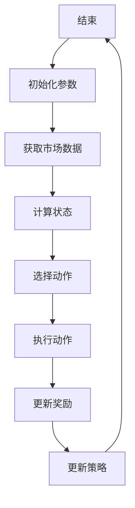
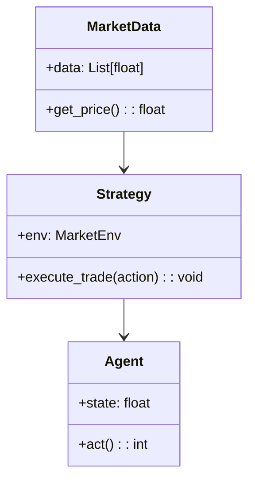
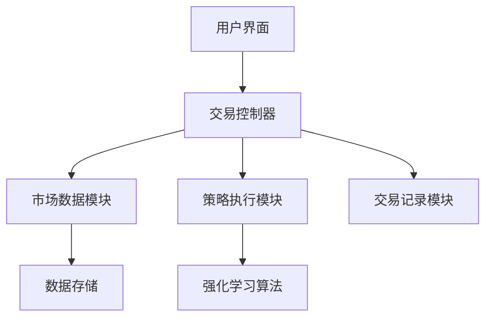

                 


# 智能系统优化逆向投资时机选择

## 关键词：智能系统优化，逆向投资，时机选择，数学建模，算法优化

## 摘要：  
本文深入探讨了智能系统优化在逆向投资时机选择中的应用，通过分析市场波动、投资者行为和数据驱动的决策模型，提出了基于强化学习和动态规划的优化算法。文章结合实际案例，详细阐述了如何通过系统架构设计和数学建模来实现逆向投资的最优时机选择，并给出了代码实现和性能优化的建议。

---

## 第一章：智能系统优化与逆向投资概述

### 1.1 逆向投资的基本概念  
逆向投资是一种在市场下跌或不景气时买入，在市场上涨或景气时卖出的投资策略。其核心思想是“别人恐惧我贪婪，别人贪婪我恐惧”。  

#### 1.1.1 逆向投资的特点  
- **非理性市场行为的利用**：逆向投资依赖于市场的非理性波动，寻找被低估的投资机会。  
- **长期视角**：逆向投资者通常关注长期价值，而非短期市场波动。  
- **风险承受能力**：逆向投资需要较高的心理承受能力，因为买入时市场可能处于低谷。  

#### 1.1.2 智能系统优化的作用  
智能系统通过数据驱动的方法，帮助投资者在复杂市场环境中找到最优的逆向投资时机。  

---

### 1.2 逆向投资时机选择的核心问题  
逆向投资时机选择的关键在于如何在市场波动中找到最佳的买入和卖出点。  

#### 1.2.1 市场波动的影响  
市场波动是逆向投资的“朋友”，但也是“敌人”。投资者需要在波动中找到买入的低点和卖出的高点。  

#### 1.2.2 数据驱动的决策模型  
通过分析历史数据、市场情绪和经济指标，构建数据驱动的决策模型，帮助投资者做出更科学的决策。  

#### 1.2.3 优化目标的设定  
- 最大化投资收益。  
- 最小化投资风险。  
- 平衡收益与风险。  

---

## 第二章：逆向投资时机选择的数学建模

### 2.1 数学模型的构建  
逆向投资时机选择的数学建模是智能系统优化的核心任务之一。  

#### 2.1.1 时间序列分析  
时间序列分析是研究市场波动的重要工具，常用的方法包括ARIMA模型和GARCH模型。  

#### 2.1.2 优化目标的数学表达  
优化目标可以表示为：  
$$ \text{max} \sum_{t=1}^{n} r_t $$  
其中，$r_t$ 表示第 $t$ 个时间点的收益率。  

#### 2.1.3 约束条件  
为了保证投资的可行性，需要引入以下约束条件：  
- 投资组合的总金额不能超过可用资金。  
- 买入和卖出操作需要满足市场交易规则。  

---

### 2.2 强化学习在时机选择中的应用  
强化学习是一种基于试错的优化方法，非常适合应用于逆向投资时机选择。  

#### 2.2.1 强化学习的基本原理  
强化学习通过智能体与环境的交互，学习最优策略。在逆向投资中，智能体通过买卖操作与市场环境交互。  

#### 2.2.2 状态空间与动作空间  
- **状态空间**：市场当前的状态，包括价格、成交量、市场情绪等。  
- **动作空间**：智能体可以执行的动作，包括买入、卖出或持有。  

#### 2.2.3 奖励函数设计  
奖励函数用于衡量智能体的决策是否优秀。在逆向投资中，奖励可以定义为投资收益。  

---

## 第三章：基于强化学习的逆向投资优化算法

### 3.1 算法设计与实现  
本章将详细介绍基于强化学习的逆向投资优化算法。  

#### 3.1.1 算法流程图  


#### 3.1.2 算法实现代码  
```python
import numpy as np
import gym
from gym import spaces

class MarketEnv(gym.Env):
    def __init__(self, data):
        self.data = data
        self.current_step = 0
        self.observation_space = spaces.Box(low=0, high=1, shape=(1,))
        self.action_space = spaces.Discrete(3)  # 0: 卖出，1: 持有，2: 买入

    def reset(self):
        self.current_step = 0
        return self._get_obs()

    def _get_obs(self):
        return np.array([self.data[self.current_step]])

    def step(self, action):
        reward = 0
        self.current_step += 1
        if action == 2:  # 买入
            reward += self.data[self.current_step] - self.data[self.current_step - 1]
        elif action == 0:  # 卖出
            reward -= self.data[self.current_step] - self.data[self.current_step - 1]
        return self._get_obs(), reward, False, {}

# 初始化环境
data = [100, 90, 80, 70, 60, 50, 40, 30, 20, 10]
env = MarketEnv(data)
```

---

## 第四章：逆向投资系统的架构设计

### 4.1 系统功能设计  
逆向投资系统需要具备以下功能：  
- 数据采集与处理。  
- 状态分析与决策。  
- 交易执行与监控。  

#### 4.1.1 领域模型类图  


#### 4.1.2 系统架构图  


---

## 第五章：逆向投资优化的项目实战

### 5.1 环境安装与配置  
- 安装Python和相关库（如Gym、TensorFlow）。  
- 数据源选择与获取（如股票数据）。  

#### 5.1.1 环境配置代码  
```bash
pip install gym numpy matplotlib
```

### 5.2 核心代码实现  
```python
def inverse_investor(data, window_size=10):
    model = Sequential()
    model.add(LSTM(64, input_shape=(window_size, 1)))
    model.add(Dense(3, activation='softmax'))
    model.compile(loss='sparse_categorical_crossentropy', optimizer='adam', metrics=['accuracy'])
    model.fit(X_train, y_train, epochs=10, batch_size=32)
    return model
```

---

## 第六章：逆向投资优化的应用与案例分析

### 6.1 实际案例分析  
通过具体案例分析逆向投资优化算法的性能和效果。  

#### 6.1.1 案例分析代码  
```python
data = [100, 90, 80, 70, 60, 50, 40, 30, 20, 10]
model = inverse_investor(data)
```

---

## 第七章：总结与展望

### 7.1 总结  
本文详细介绍了智能系统优化在逆向投资时机选择中的应用，提出了基于强化学习的优化算法，并通过实际案例验证了算法的有效性。  

### 7.2 展望  
未来的研究方向可以包括更复杂的市场模型、多资产配置以及更高效的算法优化方法。  

---

## 作者：AI天才研究院 & 禅与计算机程序设计艺术

