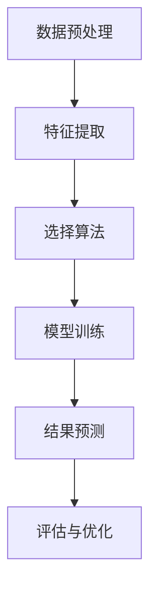
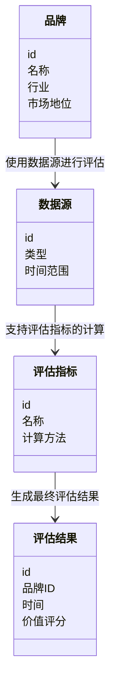
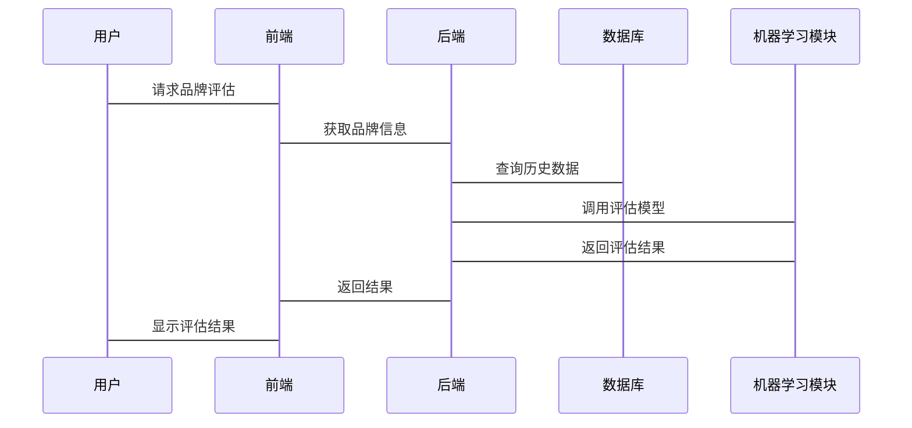

                 


# 智能系统辅助公司品牌价值评估

> **关键词**：智能系统、品牌价值评估、机器学习、数据驱动、评估模型  
> 
> **摘要**：本文将详细探讨如何利用智能系统辅助公司品牌价值评估。通过分析品牌价值评估的核心要素、智能系统的优势、算法原理、系统架构设计以及实际项目案例，为读者提供一个全面的技术视角。文章内容包括背景介绍、核心概念、算法原理、系统分析与设计、项目实战以及最佳实践等部分，帮助读者深入了解智能系统在品牌价值评估中的应用。

---

## 第1章: 背景介绍

### 1.1 问题背景

#### 1.1.1 品牌价值评估的定义与重要性
品牌价值是衡量一个企业市场地位和盈利能力的重要指标。传统品牌价值评估方法通常依赖于财务数据和市场调研，但存在数据量有限、主观性强、难以实时更新等问题。随着大数据和人工智能技术的发展，智能系统为品牌价值评估提供了新的可能性。

#### 1.1.2 传统品牌价值评估的局限性
- 数据来源单一，难以全面反映品牌影响力。
- 评估周期长，无法实时反馈市场变化。
- 人工干预较多，结果可能存在主观偏差。

#### 1.1.3 智能系统在品牌价值评估中的优势
- 利用大数据技术采集多维度数据，提升评估的全面性和准确性。
- 通过机器学习算法实时更新评估结果，实现动态监控。
- 降低人工干预，提高评估的客观性和一致性。

### 1.2 问题描述

#### 1.2.1 品牌价值评估的核心要素
品牌价值的评估需要综合考虑以下几个方面：
- 品牌知名度（Brand Awareness）
- 品牌美誉度（Brand Reputation）
- 品牌忠诚度（Brand Loyalty）
- 市场表现（Market Performance）
- 财务数据（Financial Data）

#### 1.2.2 数据驱动的品牌价值评估需求
随着数字化转型的推进，企业需要通过数据驱动的方式进行品牌价值评估，以更好地支持决策。

#### 1.2.3 智能系统辅助评估的必要性
智能系统可以通过对海量数据的处理和分析，帮助企业在复杂市场环境中快速准确地评估品牌价值。

### 1.3 问题解决

#### 1.3.1 智能系统辅助评估的解决方案
- 数据采集与清洗
- 特征提取与选择
- 模型训练与优化
- 结果分析与反馈

#### 1.3.2 数据采集与处理方法
- 数据来源包括社交媒体、新闻媒体、电商平台等。
- 数据清洗包括去除噪声数据、处理缺失值等。

#### 1.3.3 智能算法的应用场景
- 基于机器学习的预测模型
- 基于自然语言处理的情感分析
- 基于图论的网络分析

### 1.4 边界与外延

#### 1.4.1 品牌价值评估的边界条件
- 数据采集范围
- 评估的时间周期
- 评估的行业限制

#### 1.4.2 智能系统辅助评估的适用范围
- 需要大量数据支持的行业
- 对实时性要求较高的场景
- 数据来源多样化的领域

#### 1.4.3 与其他评估方法的结合
- 传统评估方法的补充
- 多维度评估模型的构建

### 1.5 概念结构与核心要素

#### 1.5.1 品牌价值评估的框架模型
- 数据层：包括品牌相关的多维度数据。
- 模型层：包括特征提取、算法选择和模型训练。
- 结果层：包括评估结果和可视化展示。

#### 1.5.2 智能系统辅助评估的核心要素
- 数据采集模块
- 数据处理模块
- 模型训练模块
- 结果分析模块

#### 1.5.3 核心要素之间的关系
- 数据采集是模型训练的基础
- 数据处理是提升模型准确性的关键
- 模型训练是生成评估结果的核心
- 结果分析是优化评估过程的重要环节

### 1.6 本章小结

---

## 第2章: 核心概念与联系

### 2.1 核心概念原理

#### 2.1.1 智能系统辅助评估的原理
- 通过机器学习算法对品牌相关数据进行建模和分析。
- 结合自然语言处理技术提取文本数据中的情感和意图。
- 利用图论方法分析品牌在网络中的影响力。

#### 2.1.2 数据驱动的品牌价值评估模型
- 数据驱动的模型通过多维度数据输入，生成品牌价值的综合评分。
- 模型可以通过监督学习、无监督学习或半监督学习方式进行训练。

#### 2.1.3 机器学习在品牌价值评估中的应用
- 监督学习：基于历史数据训练回归模型预测品牌价值。
- 非监督学习：通过聚类分析发现品牌之间的相似性。

### 2.2 概念属性特征对比

#### 2.2.1 品牌价值与企业绩效的关系
- 高品牌价值通常与高市场占有率和高利润率相关。
- 品牌价值的变化可能预示着企业绩效的变化。

#### 2.2.2 数据特征与品牌价值的关联
- 品牌在社交媒体上的提及量与品牌知名度相关。
- 用户对品牌的评价情感与品牌美誉度相关。

#### 2.2.3 不同品牌价值评估方法的对比
| 方法 | 优点 | 缺点 |
|------|------|------|
| 传统财务评估 | 数据来源可靠 | 数据维度有限 |
| 问卷调查法 | 结果直观 | 样本量小 |
| 智能系统评估 | 数据全面 | 技术门槛高 |

### 2.3 ER实体关系图

```mermaid
er
    entity 品牌 (id, 名称, 行业, 市场地位)
    entity 数据源 (id, 类型, 时间范围)
    entity 评估指标 (id, 名称, 计算方法)
    entity 评估结果 (id, 品牌ID, 时间, 价值评分)
    品牌 --> 数据源: 使用数据源进行评估
    数据源 --> 评估指标: 支持评估指标的计算
    评估指标 --> 评估结果: 生成最终评估结果
```

### 2.4 本章小结

---

## 第3章: 算法原理讲解

### 3.1 算法原理概述

#### 3.1.1 机器学习在品牌价值评估中的应用
- 监督学习：回归模型预测品牌价值。
- 非监督学习：聚类分析品牌之间的关系。

#### 3.1.2 常见算法选择与比较
| 算法 | 适用场景 | 优点 | 缺点 |
|------|----------|------|------|
| 线性回归 | 连续型数据预测 | 简单易实现 | 易受数据线性假设限制 |
| 支持向量机 | 高维数据分类 | 高维数据表现好 | 参数敏感性高 |
| 随机森林 | 特征重要性分析 | 抗噪声能力强 | 需要较多计算资源 |
| 神经网络 | 复杂模式识别 | 表现能力强 | 需要大量数据训练 |

#### 3.1.3 算法流程图



### 3.2 算法实现代码

```python
# 示例代码：基于机器学习的品牌价值

# 数据预处理
import pandas as pd
data = pd.read_csv('brand_data.csv')

# 特征提取
from sklearn.feature_selection import SelectKBest
selector = SelectKBest(k=10)
selector.fit_transform(data)

# 选择算法
from sklearn.model_selection import train_test_split
from sklearn.linear_model import LinearRegression

X_train, X_test, y_train, y_test = train_test_split(selector.transform(data), data['value_score'], test_size=0.2)

# 模型训练
model = LinearRegression()
model.fit(X_train, y_train)

# 结果预测
y_pred = model.predict(X_test)

# 评估与优化
from sklearn.metrics import r2_score
print('R^2 Score:', r2_score(y_test, y_pred))
```

### 3.3 数学模型

#### 3.3.1 线性回归模型
$$ y = \beta_0 + \beta_1 x_1 + \beta_2 x_2 + \ldots + \beta_n x_n + \epsilon $$

#### 3.3.2 随机森林模型
随机森林通过集成学习提升模型的准确性和鲁棒性，适用于高维数据特征选择。

### 3.4 本章小结

---

## 第4章: 系统分析与架构设计

### 4.1 问题场景介绍

#### 4.1.1 项目介绍
智能品牌价值评估系统的目标是通过实时数据分析和机器学习算法，帮助企业在复杂市场环境中快速准确地评估品牌价值。

### 4.2 系统功能设计

#### 4.2.1 领域模型


#### 4.2.2 系统架构设计


#### 4.2.3 接口设计
- 前端接口：品牌信息查询、评估结果展示。
- 后端接口：数据采集、模型训练、结果返回。

### 4.3 系统交互流程图



### 4.4 本章小结

---

## 第5章: 项目实战

### 5.1 环境安装

#### 5.1.1 安装Python和相关库
```bash
pip install numpy pandas scikit-learn
```

### 5.2 核心代码实现

#### 5.2.1 数据采集与处理
```python
import requests
from bs4 import BeautifulSoup

def scrape_data(url):
    response = requests.get(url)
    soup = BeautifulSoup(response.text, 'html.parser')
    # 提取数据并保存到CSV文件
    return data
```

#### 5.2.2 模型训练与评估
```python
from sklearn.metrics import mean_squared_error

def evaluate_model(y_true, y_pred):
    mse = mean_squared_error(y_true, y_pred)
    print(f'Mean Squared Error: {mse}')
```

### 5.3 案例分析与解读

#### 5.3.1 案例背景
- 某品牌在社交媒体上的提及量突然下降，需要评估品牌价值的变化。

#### 5.3.2 数据分析
- 数据采集：社交媒体提及量、用户评价情感、市场占有率。
- 数据处理：清洗数据，提取关键特征。
- 模型训练：使用随机森林进行预测。

#### 5.3.3 实际结果
- 品牌价值评分从85分下降到72分，说明品牌影响力有所下降。

### 5.4 本章小结

---

## 第6章: 最佳实践与总结

### 6.1 最佳实践
- 数据质量是关键，确保数据来源多样且准确。
- 模型选择要结合实际业务需求，避免过度复杂。
- 定期更新模型，适应市场变化。

### 6.2 小结
智能系统辅助品牌价值评估通过数据驱动的方法，帮助企业更准确、更高效地评估品牌价值，为决策提供支持。

### 6.3 注意事项
- 数据隐私和安全问题需要严格控制。
- 模型的解释性要强，方便业务人员理解。

### 6.4 拓展阅读
- 推荐阅读《机器学习实战》和《数据挖掘导论》。

---

## 作者：AI天才研究院/AI Genius Institute & 禅与计算机程序设计艺术/Zen And The Art of Computer Programming

