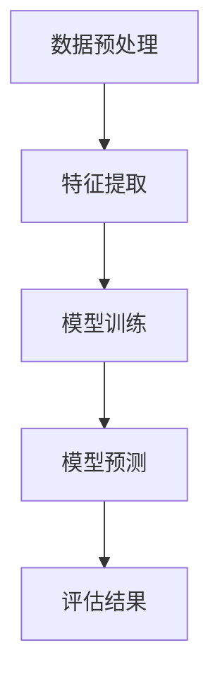
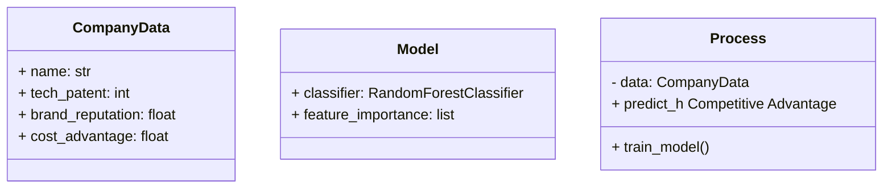

                 


# 智能系统辅助公司护城河评估

## 关键词：公司护城河，智能系统，数据驱动评估，机器学习，系统架构

## 摘要：  
公司在竞争激烈的市场中，如何构建和维护自己的竞争优势（护城河）至关重要。传统的护城河评估方法存在主观性强、效率低下、难以量化等问题。随着人工智能和大数据技术的发展，智能系统逐渐成为护城河评估的重要工具。本文将详细探讨智能系统如何辅助公司护城河评估，从背景、核心概念、算法原理到系统架构、项目实战，再到最佳实践，全面解析智能系统在护城河评估中的应用。

---

## 第1章: 公司护城河的定义与评估背景

### 1.1 公司护城河的定义与分类

#### 1.1.1 什么是公司护城河  
公司护城河是指公司在市场竞争中，通过独特的资源、技术、品牌、成本优势或商业模式所形成的竞争壁垒，以防止竞争对手轻易复制或超越。护城河是企业长期竞争优势的核心来源。

#### 1.1.2 护城河的分类与特点  
护城河可以分为以下几类：  
1. **技术型护城河**：通过技术创新形成的技术壁垒。  
2. **成本型护城河**：通过规模经济或成本优势形成的竞争优势。  
3. **品牌型护城河**：通过强大的品牌影响力吸引客户。  
4. **网络效应护城河**：通过用户网络效应形成正反馈循环。  
5. **政策型护城河**：通过政策支持或行业准入壁垒形成的竞争优势。  

#### 1.1.3 护城河评估的重要性  
护城河的强弱直接关系到公司的长期盈利能力和发展潜力。通过评估护城河，公司可以识别自身竞争优势，制定更有针对性的发展战略，并及时发现潜在风险。

---

### 1.2 传统护城河评估方法的局限性

#### 1.2.1 传统评估方法的概述  
传统的护城河评估方法通常依赖于主观判断和经验分析，例如通过行业分析、竞争对手对比、财务指标分析等方式进行评估。这种方法虽然简单，但存在以下问题：  
1. 主观性强，缺乏客观量化标准。  
2. 数据来源有限，难以全面覆盖影响护城河的多种因素。  
3. 评估效率低，难以快速响应市场变化。  

#### 1.2.2 传统方法的局限性与不足  
传统评估方法的局限性主要体现在以下方面：  
- **数据维度不足**：传统方法往往依赖财务数据或行业经验，难以涵盖技术、品牌、网络等多维度因素。  
- **动态变化难以捕捉**：市场环境和竞争态势不断变化，传统方法难以实时更新评估结果。  
- **缺乏精准预测能力**：传统方法难以量化护城河对未来业绩的具体影响。  

#### 1.2.3 智能系统评估的优势  
智能系统通过大数据分析和机器学习算法，可以实现以下优势：  
- **数据驱动**：利用海量数据，从多个维度全面评估护城河。  
- **实时更新**：通过动态数据采集和分析，实时更新评估结果。  
- **精准预测**：基于历史数据和算法模型，预测护城河的未来表现。  

---

### 1.3 智能系统在护城河评估中的作用

#### 1.3.1 智能系统的核心优势  
智能系统在护城河评估中的核心优势包括：  
1. **数据处理能力**：能够处理海量数据，提取关键特征。  
2. **算法支持**：利用机器学习算法，构建预测模型。  
3. **可视化能力**：通过数据可视化，直观呈现评估结果。  

#### 1.3.2 智能系统评估的流程与特点  
智能系统评估流程通常包括以下步骤：  
1. 数据采集：从多个来源获取相关数据。  
2. 数据预处理：清洗和标准化数据。  
3. 模型训练：基于数据训练评估模型。  
4. 结果分析：输出评估结果并进行解读。  

#### 1.3.3 智能系统评估的未来趋势  
随着人工智能和大数据技术的不断发展，智能系统在护城河评估中的应用将更加广泛和深入。未来，智能系统将结合更多的数据源和更复杂的算法，提供更精准的评估结果。

---

## 第2章: 智能系统辅助护城河评估的核心概念与联系

### 2.1 智能系统辅助评估的核心概念

#### 2.1.1 数据驱动的评估方法  
数据驱动的评估方法通过分析大量数据，发现隐藏在数据中的规律和趋势，从而为护城河评估提供客观依据。

#### 2.1.2 智能算法的评估模型  
智能算法（如机器学习、深度学习）可以构建预测模型，评估护城河的强弱及其对业绩的影响。

#### 2.1.3 评估结果的可视化与反馈  
通过数据可视化工具，将评估结果以图表、报告等形式呈现，便于企业理解和应用。

---

### 2.2 护城河评估的核心要素与系统关系

#### 2.2.1 核心要素的定义与属性  
护城河评估的核心要素包括：  
1. **技术优势**：技术专利数量、研发投入占比等。  
2. **品牌影响力**：品牌知名度、市场份额等。  
3. **成本优势**：单位成本、供应链效率等。  
4. **网络效应**：用户数量、用户活跃度等。  

#### 2.2.2 系统关系的ER实体关系图  

```mermaid
er
actor: 企业
model: 护城河评估模型
data: 评估数据
process: 评估流程
actor --> data
data --> model
model --> process
process --> actor
```

---

## 第3章: 智能系统辅助护城河评估的算法原理

### 3.1 算法原理概述

#### 3.1.1 算法选择与优化  
在护城河评估中，常用的算法包括：  
- **决策树**：用于分类和回归分析。  
- **随机森林**：用于特征选择和分类。  
- **支持向量机（SVM）**：用于分类问题。  

#### 3.1.2 算法的输入与输出  
- **输入**：企业的各项指标数据（如技术专利数、品牌影响力等）。  
- **输出**：护城河强弱的评估结果。  

#### 3.1.3 算法的数学模型  
随机森林算法的数学模型如下：  

$$ y = \text{sign}(\sum_{i=1}^{n} w_i x_i) $$  

其中，$w_i$ 是特征权重，$x_i$ 是输入特征。

---

### 3.2 算法流程与实现

#### 3.2.1 数据预处理  
数据预处理步骤包括：  
1. 数据清洗：去除缺失值和异常值。  
2. 数据标准化：将数据归一化到统一范围。  

#### 3.2.2 模型训练  
以随机森林为例，训练过程如下：  



#### 3.2.3 代码实现  
以下是Python代码示例：

```python
from sklearn.ensemble import RandomForestClassifier
import pandas as pd

# 数据加载与预处理
data = pd.read_csv('company_data.csv')
X = data.drop('target', axis=1)
y = data['target']

# 模型训练
model = RandomForestClassifier()
model.fit(X, y)

# 模型预测
predictions = model.predict(X)
```

---

## 第4章: 智能系统辅助护城河评估的系统架构设计

### 4.1 问题场景介绍  
护城河评估系统需要处理大量数据，包括企业内部数据和外部市场数据。

### 4.2 系统功能设计

#### 4.2.1 领域模型（类图）  



### 4.3 系统架构设计  


---

## 第5章: 智能系统辅助护城河评估的项目实战

### 5.1 环境安装  
安装Python和必要的库（如scikit-learn、pandas）。

### 5.2 核心代码实现  

```python
import pandas as pd
from sklearn.ensemble import RandomForestClassifier
from sklearn.metrics import accuracy_score

# 数据加载
data = pd.read_csv('company_data.csv')

# 特征与目标分离
X = data.drop('target', axis=1)
y = data['target']

# 模型训练
model = RandomForestClassifier()
model.fit(X, y)

# 预测与评估
predictions = model.predict(X)
print("准确率:", accuracy_score(y, predictions))
```

### 5.3 案例分析  
以某科技公司为例，通过数据计算其护城河的强弱，并分析结果。

---

## 第6章: 最佳实践与小结

### 6.1 最佳实践 tips  
- 数据质量是关键，确保数据来源可靠。  
- 定期更新模型，适应市场变化。  

### 6.2 小结  
智能系统通过数据驱动和算法支持，显著提升了护城河评估的效率和准确性。企业可以利用这些工具，更好地识别和维护自己的竞争优势。

---

## 第7章: 总结与展望

### 7.1 总结  
智能系统在护城河评估中的应用为企业提供了全新的思路和工具，未来将更加智能化和自动化。

### 7.2 展望  
随着AI技术的进步，护城河评估将更加精准和动态，为企业战略决策提供更有力的支持。

---

## 作者：AI天才研究院 & 禅与计算机程序设计艺术

---

通过以上结构，我们可以看到智能系统在护城河评估中的巨大潜力。希望本文能为企业的护城河评估提供新的思路和实践指导。

