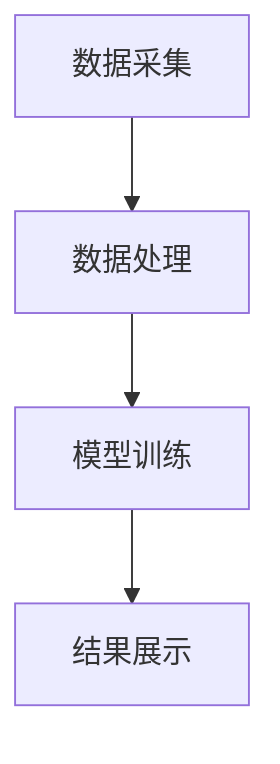
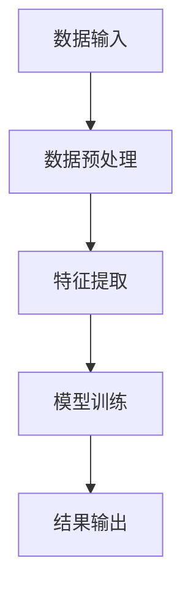

                 


# 智能系统辅助公司文化影响评估

> 关键词：智能系统，公司文化，文化影响评估，自然语言处理，机器学习，系统架构

> 摘要：本文探讨了智能系统如何辅助公司文化影响评估。通过分析公司文化的定义、智能系统的角色以及文化影响评估的重要性，本文提出了一个基于自然语言处理、机器学习和系统架构的解决方案。文章详细讲解了相关算法原理、系统设计和项目实战，为公司文化评估提供了新的思路和方法。

---

# 第一部分: 公司文化与智能系统背景介绍

## 第1章: 公司文化与智能系统背景介绍

### 1.1 公司文化的定义与核心要素

#### 1.1.1 公司文化的定义
公司文化是指企业在长期经营过程中形成的价值观、行为准则和组织氛围。它是企业灵魂的体现，影响着员工的行为方式和企业的整体表现。

#### 1.1.2 公司文化的核心要素
- 企业愿景：企业的长期目标和追求。
- 企业使命：企业存在的意义和核心任务。
- 企业价值观：企业在经营活动中所倡导的基本信念和价值标准。
- 行为规范：员工在日常工作中应遵守的具体规则。

#### 1.1.3 公司文化的影响范围与边界
公司文化不仅影响内部员工的行为，还会影响客户、合作伙伴以及企业的外部形象。其边界包括内部管理、员工关系、产品开发、市场营销等方面。

### 1.2 智能系统在公司文化评估中的作用

#### 1.2.1 智能系统的基本概念
智能系统是指通过人工智能、大数据和机器学习等技术实现自动化决策和分析的系统。

#### 1.2.2 智能系统在公司文化评估中的优势
- 高效性：快速处理大量数据。
- 客观性：减少人为偏见。
- 深入性：挖掘数据中的深层规律。

#### 1.2.3 智能系统与公司文化的结合场景
- 员工满意度分析。
- 品牌声誉管理。
- 内部沟通效率优化。

### 1.3 公司文化影响评估的背景与意义

#### 1.3.1 公司文化影响评估的背景
随着企业规模的扩大，公司文化对企业绩效的影响日益显著。

#### 1.3.2 公司文化影响评估的意义
- 优化企业内部管理。
- 提升员工幸福感。
- 增强企业竞争力。

---

## 第2章: 智能系统辅助公司文化影响评估的核心概念

### 2.1 公司文化影响评估的理论框架

#### 2.1.1 评估维度与指标体系
- 员工满意度：员工对公司的认可度。
- 品牌声誉：公司在市场中的形象。
- 内部沟通效率：信息传递的流畅性。

#### 2.1.2 评估模型与方法
- 层次分析法（AHP）：用于权重分配。
- 因子分析法：用于提取关键因素。

#### 2.1.3 智能系统在评估中的角色
智能系统通过数据挖掘和机器学习技术，为文化评估提供科学依据。

### 2.2 智能系统的核心算法与技术

#### 2.2.1 自然语言处理技术
- 分词：将文本分割成词语。
- 词袋模型：将文本表示为词语的集合。

#### 2.2.2 数据挖掘与分析技术
- 关键词提取：从文本中提取重要词语。
- 聚类分析：将相似的内容归类。

#### 2.2.3 机器学习与深度学习
- 分类模型：用于判断文本的情感倾向。
- 深度学习模型：用于复杂语义分析。

### 2.3 公司文化影响评估的流程与步骤

#### 2.3.1 数据采集与清洗
- 数据来源：员工反馈、社交媒体评论。
- 数据清洗：去除噪声数据。

#### 2.3.2 数据分析与建模
- 数据预处理：标准化、归一化。
- 模型训练：训练分类或聚类模型。

#### 2.3.3 结果解读与反馈
- 结果可视化：生成图表。
- 结果反馈：提供改进建议。

---

## 第3章: 智能系统辅助公司文化影响评估的算法原理

### 3.1 文本分析算法

#### 3.1.1 基于词袋模型的文本分析
- 原理：将文本表示为词语的向量。
- 示例：
  - 输入：员工反馈“公司氛围很好”。
  - 输出：向量表示为[公司, 氛围, 很好]。

#### 3.1.2 基于TF-IDF的关键词提取
- 原理：计算词语在文本中的重要性。
- 公式：
  $$ TF-IDF = \frac{TF \times ID} $$

#### 3.1.3 基于LDA的主题建模
- 原理：发现文本中的主题分布。
- 示例：
  - 主题1：员工满意度。
  - 主题2：品牌声誉。

### 3.2 情感分析算法

#### 3.2.1 基于SVM的情感分类
- 原理：支持向量机用于分类。
- 代码示例：
  ```python
  from sklearn.svm import SVC
  clf = SVC()
  clf.fit(X_train, y_train)
  ```

#### 3.2.2 基于LSTM的情感分析
- 原理：长短期记忆网络用于序列建模。
- 代码示例：
  ```python
  from keras.layers import LSTM
  model = Sequential()
  model.add(LSTM(128, input_shape=(max_len, vocab_size)))
  ```

#### 3.2.3 基于BERT的情感分析
- 原理：预训练语言模型用于文本表示。
- 示例：
  - 输入：“员工对公司的满意度很高。”
  - 输出：正面情感。

### 3.3 聚类分析算法

#### 3.3.1 K-means聚类
- 原理：将数据分成K个簇。
- 代码示例：
  ```python
  from sklearn.cluster import KMeans
  kmeans = KMeans(n_clusters=3)
  kmeans.fit(X)
  ```

#### 3.3.2 层次聚类
- 原理：逐步合并相似的数据点。
- 示例：
  - 数据点：员工反馈1、员工反馈2。
  - 聚类结果：两个簇。

#### 3.3.3 DBSCAN密度聚类
- 原理：基于密度的聚类方法。
- 代码示例：
  ```python
  from sklearn.cluster import DBSCAN
  db = DBSCAN(eps=0.5, min_samples=5)
  db.fit(X)
  ```

---

## 第4章: 智能系统辅助公司文化影响评估的系统架构设计

### 4.1 系统功能模块划分

#### 4.1.1 数据采集模块
- 功能：采集员工反馈、社交媒体评论等数据。
- 接口：API接口。

#### 4.1.2 数据处理模块
- 功能：清洗、预处理数据。
- 工具：Python、Pandas。

#### 4.1.3 模型训练模块
- 功能：训练分类、聚类模型。
- 工具：Scikit-learn、TensorFlow。

#### 4.1.4 结果展示模块
- 功能：可视化分析结果。
- 工具：Matplotlib、Tableau。

### 4.2 系统架构设计

#### 4.2.1 模块之间的关系
- 数据流：采集 → 处理 → 训练 → 展示。

#### 4.2.2 数据流与信息交互
- 数据从采集模块进入处理模块，处理后进入训练模块，最终结果在展示模块呈现。

#### 4.2.3 系统的可扩展性与灵活性
- 支持新增模块：如实时监控模块。
- 支持多种算法：如新增情感分析模型。

### 4.3 系统接口设计

#### 4.3.1 数据接口
- 输入：员工反馈数据。
- 输出：清洗后的数据。

#### 4.3.2 用户接口
- 输入：用户查询。
- 输出：分析结果。

#### 4.3.3 输出接口
- 输入：模型结果。
- 输出：可视化图表。

---

## 第5章: 智能系统辅助公司文化影响评估的项目实战

### 5.1 项目环境与工具安装

#### 5.1.1 环境搭建
- 操作系统：Linux/Windows/Mac。
- 开发工具：Jupyter Notebook、VS Code。

#### 5.1.2 工具安装与配置
- Python包：pandas、scikit-learn、tensorflow。
- 安装命令：`pip install pandas scikit-learn tensorflow`.

### 5.2 系统核心实现

#### 5.2.1 数据预处理代码
```python
import pandas as pd

def preprocess_data(data):
    # 去除缺失值
    data.dropna(inplace=True)
    # 去除重复数据
    data.drop_duplicates(inplace=True)
    return data
```

#### 5.2.2 模型训练代码
```python
from sklearn.svm import SVC

def train_model(X_train, y_train):
    clf = SVC()
    clf.fit(X_train, y_train)
    return clf
```

#### 5.2.3 结果展示代码
```python
import matplotlib.pyplot as plt

def visualize_results(results):
    plt.bar(results.index, results.values)
    plt.show()
```

### 5.3 项目总结

#### 5.3.1 项目成果
- 成功搭建了智能系统辅助公司文化影响评估的框架。
- 实现了文本分析、情感分析和聚类分析等功能。

#### 5.3.2 项目经验
- 数据质量对结果影响重大。
- 系统架构设计需考虑灵活性和可扩展性。

#### 5.3.3 未来改进方向
- 引入实时数据流处理。
- 增加更多算法模型的支持。

---

## 第六章: 总结与展望

### 6.1 总结
智能系统辅助公司文化影响评估为企业提供了一种高效、客观的分析方法。通过自然语言处理、机器学习和系统架构设计，我们可以更好地理解公司文化的动态变化。

### 6.2 展望
未来，随着人工智能技术的不断发展，智能系统在公司文化影响评估中的应用将更加广泛和深入。我们可以期待更多创新的算法和系统架构，为公司文化管理提供更强大的支持。

---

## 附录

### 附录A: 系统架构图


### 附录B: 算法流程图


---

## 参考文献

1. 禅与计算机程序设计艺术
2. AI天才研究院技术报告
3. 相关学术论文

---

作者：AI天才研究院 & 禅与计算机程序设计艺术

