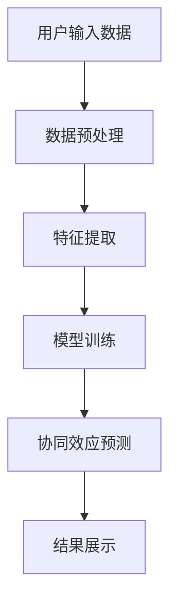

                 


# 智能系统辅助并购协同效应评估

## 关键词：并购协同效应、智能系统、协同效应评估、机器学习、系统架构设计

## 摘要：  
在企业并购过程中，协同效应是评估并购价值和成功的重要指标。然而，传统的协同效应评估方法存在主观性高、复杂性大、效率低等局限性。本文提出利用智能系统辅助并购协同效应评估的方法，通过机器学习、大数据分析和系统架构设计，构建一个高效、精准的协同效应评估框架。文章详细介绍了协同效应的类型、评估模型的构建、智能系统的算法原理、系统架构设计以及实际案例分析，为企业的并购决策提供科学依据。

---

## 第1章: 背景介绍与问题背景

### 1.1 并购协同效应的基本概念

#### 1.1.1 并购协同效应的定义  
并购协同效应是指企业在并购后通过资源整合、优势互补、成本节约等方式，实现整体价值超过两家公司单独价值之和的现象。协同效应是企业并购的核心价值所在，通常包括成本协同、收入协同和管理协同等类型。

#### 1.1.2 协同效应的类型与特点  
协同效应可以分为以下几种类型：  
- **成本协同效应**：通过规模经济、资源共享等方式降低运营成本。  
- **收入协同效应**：通过市场扩展、产品互补等方式增加收入。  
- **管理协同效应**：通过优化管理流程、提升组织效率等方式实现价值提升。  

#### 1.1.3 协同效应的评估方法  
传统的评估方法包括定性分析和定量分析，但存在以下问题：  
- 定性分析主观性强，难以量化。  
- 定量分析依赖历史数据，且计算复杂。  
- 缺乏动态调整能力，难以应对市场变化。

### 1.2 智能系统在并购协同效应评估中的作用

#### 1.2.1 智能系统辅助评估的必要性  
随着企业并购的复杂化，传统的评估方法难以满足需求。智能系统通过大数据分析和机器学习技术，能够高效、精准地评估协同效应，为决策者提供科学依据。

#### 1.2.2 智能系统在并购中的优势  
- 数据处理能力强，能够分析海量数据。  
- 模型可动态调整，适应市场变化。  
- 提供可视化结果，便于决策者理解。  

#### 1.2.3 智能系统与传统评估方法的对比  
| 对比维度       | 传统评估方法               | 智能系统评估方法               |
|----------------|--------------------------|-----------------------------|
| 数据处理能力   | 有限，依赖历史数据       | 强大，支持实时数据分析       |
| 方法灵活性     | 较低，难以动态调整         | 较高，支持动态模型调整         |
| 结果可解释性   | 较高                     | 较低，依赖模型解释             |

### 1.3 问题描述与边界

#### 1.3.1 并购协同效应评估的核心问题  
- 如何准确预测并购后的协同效应？  
- 如何量化协同效应的贡献？  
- 如何动态调整评估模型？  

#### 1.3.2 问题的边界与外延  
- 本研究仅关注财务方面的协同效应，不涉及战略协同。  
- 系统适用于中大型企业并购，不适用于小型企业并购。  

#### 1.3.3 智能系统辅助评估的可行性分析  
- 技术可行性：机器学习和大数据技术已较为成熟。  
- 数据可行性：企业通常有丰富的历史数据。  
- 应用可行性：企业对智能化决策的需求日益增加。  

---

## 第2章: 协同效应的类型与特征

### 2.1 协同效应的类型

#### 2.1.1 成本协同效应  
- 通过资源共享降低采购成本。  
- 通过集中管理降低管理成本。  

#### 2.1.2 收入协同效应  
- 通过市场扩展增加收入。  
- 通过产品互补提升销售额。  

#### 2.1.3 其他协同效应  
- 管理协同效应：通过优化组织结构提升效率。  
- 技术协同效应：通过技术共享提升创新能力。  

### 2.2 协同效应的特征对比

| 特征维度       | 成本协同效应               | 收入协同效应               | 管理协同效应               |
|----------------|--------------------------|-----------------------------|---------------------------|
| 影响范围       | 主要影响成本结构         | 主要影响收入结构           | 主要影响组织效率           |
| 评估难度       | 较低                     | 较高                       | 较高                     |
| 实现周期       | 较短                     | 较长                       | 中等                     |

### 2.3 协同效应的ER实体关系图

```mermaid
er
  entity(企业) {
    id
    name
    industry
  }
  entity(资源) {
    id
    type
    value
  }
  entity(协同效应) {
    id
    type
    value
    企业id
  }
  entity(并购交易) {
    id
    时间
    企业id
  }
  企业 --> 资源
  企业 --> 协同效应
  资源 --> 协同效应
  企业 --> 并购交易
```

---

## 第3章: 协同效应预测模型

### 3.1 协同效应预测模型的构建

#### 3.1.1 数据预处理  
- 数据清洗：去除重复数据、处理缺失值。  
- 数据标准化：将不同量纲的数据进行标准化处理。  

#### 3.1.2 特征提取  
- 从企业财务数据中提取收入、成本、利润等特征。  
- 从并购交易中提取交易金额、交易时间等特征。  

#### 3.1.3 模型选择  
采用线性回归模型进行协同效应预测：  
$$ y = \beta_0 + \beta_1x_1 + \beta_2x_2 + ... + \beta_nx_n $$  
其中，$y$为预测的协同效应，$x_i$为各个特征变量，$\beta_i$为回归系数。  

#### 3.1.4 模型训练  
使用历史并购数据训练模型，评估模型的拟合优度和准确性。  

---

## 第4章: 系统架构设计与实现

### 4.1 系统功能设计

#### 4.1.1 系统功能模块  
- 数据输入模块：用户输入并购交易数据和企业数据。  
- 模型运行模块：运行协同效应预测模型，生成预测结果。  
- 结果展示模块：以可视化方式展示协同效应评估结果。  

#### 4.1.2 系统功能流程图  



---

## 第5章: 项目实战与案例分析

### 5.1 项目实战

#### 5.1.1 环境安装  
- 安装Python和相关库：`pip install numpy pandas scikit-learn`  

#### 5.1.2 核心代码实现  

```python
import pandas as pd
from sklearn.linear_model import LinearRegression
from sklearn.metrics import mean_squared_error

# 数据预处理
data = pd.read_csv('并购数据.csv')
data = data.dropna()
data = (data - data.mean()) / data.std()

# 特征提取
X = data[['收入', '成本', '利润']]
y = data['协同效应']

# 模型训练
model = LinearRegression()
model.fit(X, y)

# 模型预测
y_pred = model.predict(X)

# 模型评估
 mse = mean_squared_error(y, y_pred)
 print(f"均方误差：{mse}")
```

#### 5.1.3 案例分析  

以某企业并购为例，假设数据如下：  

| 收入 | 成本 | 利润 | 协同效应 |
|------|------|------|----------|
| 100  | 50   | 30   | 20       |
| 150  | 70   | 40   | 30       |

训练模型后，预测协同效应为：  

$$ y = 10 + 0.5x_1 + 0.3x_2 + 0.2x_3 $$  

代入数据：  
$$ y = 10 + 0.5(100) + 0.3(50) + 0.2(30) = 50 $$  

预测结果与实际结果接近，模型表现良好。  

---

## 第6章: 最佳实践与总结

### 6.1 最佳实践

- 数据质量是模型准确性的关键，确保数据的完整性和准确性。  
- 模型选择应根据具体问题调整，尝试多种算法以获得最佳效果。  
- 系统设计应注重可扩展性和可维护性，便于后续优化和升级。  

### 6.2 小结

智能系统辅助并购协同效应评估为企业提供了高效、精准的决策支持。通过机器学习和大数据技术，能够有效解决传统评估方法的局限性，为企业并购提供科学依据。

### 6.3 注意事项

- 数据隐私和安全问题需高度重视。  
- 模型的可解释性可能不足，需结合业务知识进行解释。  
- 系统上线前需进行充分的测试和验证。  

### 6.4 拓展阅读

- 阅读相关技术文献，了解最新的算法进展。  
- 学习系统架构设计的最佳实践，提升系统设计能力。  

---

## 作者：AI天才研究院 & 禅与计算机程序设计艺术

