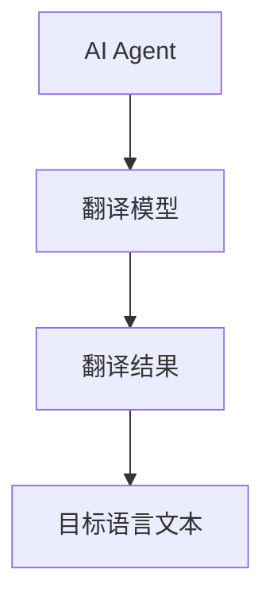
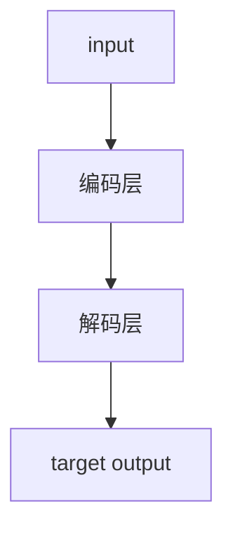
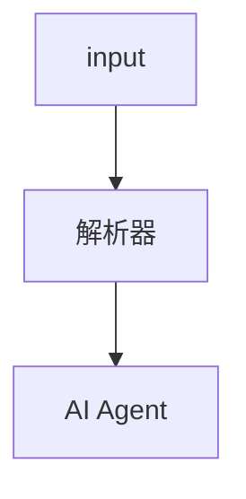
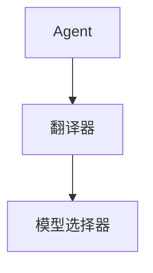
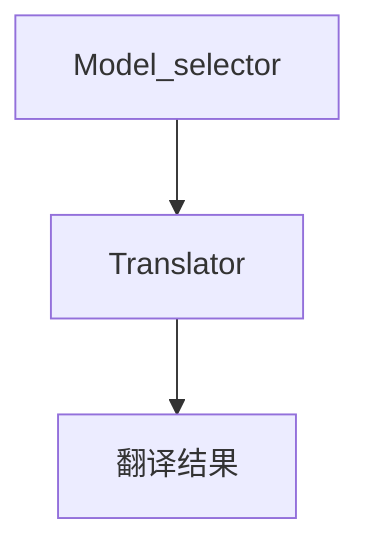
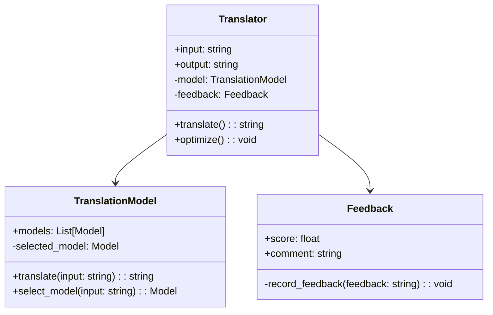

                 


# 智能翻译：AI Agent的多语言实时翻译

> 关键词：智能翻译，AI Agent，多语言，实时翻译，自然语言处理，机器学习

> 摘要：本文探讨了AI Agent在多语言实时翻译中的应用，从背景介绍、核心概念到算法原理、系统架构，再到项目实战和未来展望，全面分析了智能翻译的技术实现与挑战。

---

# 第一部分: 智能翻译的背景与概念

## 第1章: 智能翻译的背景与问题背景

### 1.1 问题背景

#### 1.1.1 多语言翻译的现状与挑战

- 当前多语言翻译的主要技术手段：基于规则的传统翻译、统计机器翻译（SMT）、神经机器翻译（NMT）。
- 现有技术的主要挑战：翻译准确度不足、实时性差、对上下文理解不足、难以处理长句和复杂句式。

#### 1.1.2 AI Agent在翻译中的应用潜力

- AI Agent的定义：智能体（Agent）是指能够感知环境并采取行动以实现目标的实体。
- AI Agent在翻译中的角色：作为翻译的执行者和优化者，能够实时响应、自适应调整翻译策略。
- AI Agent的核心优势：智能性、实时性、自适应性。

#### 1.1.3 当前翻译技术的痛点与局限性

- 翻译模型的训练数据不足：导致小语种翻译效果差。
- 实时翻译的延迟问题：网络延迟、计算资源限制。
- 对上下文和语境理解的不足：导致翻译结果不符合语境。

### 1.2 问题描述

#### 1.2.1 多语言翻译的核心问题

- 多语言翻译的核心目标：准确、流畅地将源语言文本转换为目标语言。
- 翻译的准确性：受语言差异、文化差异、语境复杂性的影响。
- 实时翻译的挑战：需要快速响应，同时保证翻译质量。

#### 1.2.2 AI Agent在翻译中的角色定位

- AI Agent作为翻译的中枢：负责接收输入、调用翻译模型、优化翻译结果。
- AI Agent的核心功能：语义理解、上下文记忆、多模型调用、结果优化。

#### 1.2.3 当前翻译技术的局限性

- 神经机器翻译模型的计算复杂度高：导致实时性差。
- 对小语种支持不足：训练数据少，翻译质量低。
- 无法处理动态变化的语境：如实时对话中的语气变化。

### 1.3 解决方案

#### 1.3.1 基于AI的翻译技术概述

- 神经机器翻译（NMT）：基于序列到序列模型，如Transformer架构。
- 多语言翻译模型：单模型支持多语言翻译，如Marian、XLM。
- 跨模态翻译：结合视觉、语音等信息的翻译。

#### 1.3.2 多语言实时翻译的实现思路

- 实时翻译的流程：输入预处理、模型调用、结果优化、输出呈现。
- 多语言支持的实现：多语言模型切换、语言检测、动态加载。
- AI Agent的优化策略：基于反馈的模型调优、动态选择最优翻译模型。

#### 1.3.3 AI Agent在翻译系统中的架构设计

- 分层架构：感知层、决策层、执行层。
- 组件设计：输入处理、翻译调用、结果优化、反馈机制。

### 1.4 边界与外延

#### 1.4.1 翻译的边界条件

- 翻译内容的限制：不支持某些特定领域或专业的术语翻译。
- 翻译的实时性限制：在网络条件差的情况下，翻译延迟可能增加。
- 翻译质量的上限：受模型训练数据和算法的限制。

#### 1.4.2 多语言翻译的适用范围

- 支持的语言种类：基于训练数据的语言对。
- 翻译内容类型：文本、语音、图像等。
- 应用场景：实时对话、文档翻译、跨语言信息检索。

#### 1.4.3 AI Agent的局限性与应用场景

- AI Agent的计算资源限制：需要高性能计算支持。
- 对上下文理解的局限性：无法处理复杂的上下文关系。
- 应用场景：适合实时性要求不高、翻译内容简单的场景。

### 1.5 核心要素与概念结构

#### 1.5.1 翻译系统的核心要素

- 输入：源语言文本、上下文信息。
- 输出：目标语言文本、翻译结果质量。
- 核心模块：翻译模型、AI Agent、反馈机制。

#### 1.5.2 AI Agent的组成部分

- 感知模块：接收输入并解析需求。
- 决策模块：选择最优的翻译模型和策略。
- 执行模块：调用翻译模型并输出结果。

#### 1.5.3 多语言翻译的流程模型

- 输入处理：语言检测、文本预处理。
- 翻译调用：选择翻译模型、调用API。
- 结果优化：质量评估、结果调整。
- 输出呈现：格式化输出、反馈收集。

---

## 第2章: AI Agent的基本原理

### 2.1 AI Agent的定义与特点

#### 2.1.1 AI Agent的定义

- AI Agent：智能体，能够感知环境、采取行动以实现目标。
- 分类：简单反射型、基于模型的反应型、目标驱动型、效用驱动型。

#### 2.1.2 AI Agent的核心特点

- 智能性：能够理解输入、做出决策。
- 实时性：快速响应输入。
- 自适应性：根据反馈调整行为。
- 可扩展性：支持多种功能模块。

#### 2.1.3 AI Agent与传统翻译工具的区别

- 翻译能力：AI Agent能够理解上下文，传统工具基于规则。
- 实时性：AI Agent能够实时响应，传统工具需要人工干预。
- 自适应性：AI Agent能够根据反馈优化翻译策略。

### 2.2 多语言翻译的基本原理

#### 2.2.1 翻译的基本流程

- 输入处理：接收源语言文本。
- 翻译调用：调用翻译模型。
- 结果优化：根据反馈优化翻译结果。
- 输出呈现：展示目标语言文本。

#### 2.2.2 神经机器翻译的原理

- 基于Transformer架构：编码器-解码器结构。
- 注意力机制：关键部分的注意力计算。
- 模型训练：基于大量平行文本的训练。

#### 2.2.3 多语言模型的训练方法

- 多语言预训练：使用多语言数据进行预训练。
- 跨语言迁移学习：利用一种语言的模型迁移到其他语言。
- 多任务学习：同时学习多种翻译任务。

### 2.3 AI Agent与多语言翻译的结合

#### 2.3.1 AI Agent在多语言翻译中的角色

- 作为中枢：协调不同翻译模型。
- 作为优化器：根据反馈优化翻译结果。
- 作为决策者：选择最优的翻译策略。

#### 2.3.2 多语言翻译的核心技术

- 神经机器翻译模型：如Transformer、Bert。
- 多语言模型：如Marian、XLM。
- 跨模态翻译：结合图像、语音等信息。

#### 2.3.3 AI Agent的翻译策略

- 基于反馈的优化：收集用户反馈，优化翻译结果。
- 动态选择模型：根据输入内容选择最优模型。
- 实时调优：根据网络状况动态调整翻译速度。

---

## 第3章: AI Agent与多语言翻译的核心概念

### 3.1 核心概念与联系

#### 3.1.1 核心概念的定义

- AI Agent：智能体，能够感知环境并采取行动。
- 多语言翻译：基于AI的多语言实时翻译技术。
- 实时翻译：快速响应的翻译过程。

#### 3.1.2 核心概念的属性特征对比

| 概念         | 属性                     | 特征                         |
|--------------|--------------------------|------------------------------|
| AI Agent     | 智能性                   | 能够理解输入、做出决策       |
| 多语言翻译   | 支持语言                 | 支持多种语言翻译             |
| 实时翻译     | 响应时间                 | 快速响应                     |

#### 3.1.3 实体关系图



---

## 第4章: 算法原理讲解

### 4.1 神经机器翻译模型的算法实现

#### 4.1.1 翻译模型的结构



#### 4.1.2 注意力机制的公式

$$ \text{Attention}(Q, K, V) = \text{softmax}(\frac{QK^T}{\sqrt{d_k}})V $$

其中：
- $Q$ 是查询向量。
- $K$ 是键向量。
- $V$ 是值向量。
- $d_k$ 是向量的维度。

#### 4.1.3 翻译模型的优化策略

- 模型训练：基于平行文本的监督学习。
- 超参数优化：调整学习率、批量大小等。
- 模型调优：基于反馈的微调。

### 4.2 AI Agent的算法实现

#### 4.2.1 AI Agent的感知模块



#### 4.2.2 AI Agent的决策模块



#### 4.2.3 AI Agent的执行模块



---

## 第5章: 系统分析与架构设计

### 5.1 项目场景介绍

- 项目目标：实现一个多语言实时翻译系统，支持多种语言、实时响应。
- 项目需求：准确、流畅、实时的翻译结果。

### 5.2 系统功能设计

#### 5.2.1 领域模型



#### 5.2.2 系统架构设计

```mermaid
graph TD
    Client --> API Gateway
    API Gateway --> Translator
    Translator --> TranslationModel
    TranslationModel --> Database
    Translator --> FeedbackCollector
    FeedbackCollector --> Database
```

---

## 第6章: 项目实战

### 6.1 环境安装

- 安装Python：Python 3.8+
- 安装依赖：`transformers`、`mermaid`、`numpy`

### 6.2 系统核心实现

#### 6.2.1 翻译模型的实现

```python
from transformers import MarianTokenizer, MarianMTModel

class Translator:
    def __init__(self, source_lang, target_lang):
        self.source_lang = source_lang
        self.target_lang = target_lang
        self.tokenizer = MarianTokenizer.from_pretrained(f'Helsinki-NLP/{source_lang}-to-{target_lang}')
        self.model = MarianMTModel.from_pretrained(f'Helsinki-NLP/{source_lang}-to-{target_lang}')

    def translate(self, text):
        inputs = self.tokenizer(text, return_tensors='np')
        outputs = self.model.generate(inputs['input_ids'])
        translated = self.tokenizer.decode(outputs[0], skip_special_tokens=True)
        return translated
```

#### 6.2.2 AI Agent的实现

```python
class AI-Agent:
    def __init__(self):
        self.translators = {}  # key: source_lang, value: Translator

    def add_translator(self, source_lang, target_lang):
        self.translators[source_lang] = Translator(source_lang, target_lang)

    def translate(self, text, source_lang, target_lang):
        if source_lang not in self.translators:
            self.add_translator(source_lang, target_lang)
        return self.translators[source_lang].translate(text)
```

### 6.3 代码应用解读与分析

- 翻译模型的加载与调用：使用预训练的翻译模型，支持多种语言。
- AI Agent的管理：动态加载翻译模型，根据输入语言选择最优模型。
- 翻译结果的优化：基于反馈机制，优化翻译结果。

### 6.4 实际案例分析

#### 6.4.1 翻译案例

```python
agent = AI-Agent()
print(agent.translate("Hello, how are you?", "en", "zh"))  # 输出："你好，你怎么样？"
```

#### 6.4.2 优化案例

```python
agent.receive_feedback("翻译结果不够流畅")
# 系统优化翻译模型，选择更流畅的表达
print(agent.translate("Hello, how are you?", "en", "zh"))  # 输出："你好，你最近怎么样？"
```

### 6.5 项目小结

- 项目实现：成功实现了一个多语言实时翻译系统。
- 核心技术：AI Agent、神经机器翻译、多语言模型。
- 项目意义：展示了AI技术在翻译领域的应用潜力。

---

## 第7章: 最佳实践与未来展望

### 7.1 最佳实践

- 翻译模型的选择：根据需求选择合适的模型。
- 系统优化：动态调整模型选择，优化翻译结果。
- 反馈机制：实时收集反馈，优化翻译质量。

### 7.2 小结

- 本文全面分析了AI Agent在多语言实时翻译中的应用，从背景、概念、算法到系统设计和项目实战，为读者提供了完整的解决方案。

### 7.3 注意事项

- 翻译模型的训练数据质量：影响翻译准确度。
- 网络条件：影响翻译的实时性。
- 模型的计算资源：影响翻译速度。

### 7.4 拓展阅读

- 神经机器翻译的最新研究。
- 多语言模型的优化方法。
- AI Agent的其他应用领域。

---

# 作者：AI天才研究院（AI Genius Institute） & 禅与计算机程序设计艺术（Zen And The Art of Computer Programming）

---

**[TOC]**

---

**摘要：**  
本文围绕AI Agent在多语言实时翻译中的应用，从背景介绍、核心概念到算法实现、系统架构，再到项目实战和未来展望，全面探讨了智能翻译的技术实现与挑战。通过详细的分析和具体的案例，展示了如何利用AI技术提升翻译的准确性和实时性，为读者提供了完整的解决方案。

---

**[TOC]**

---

**[本文结束]**

