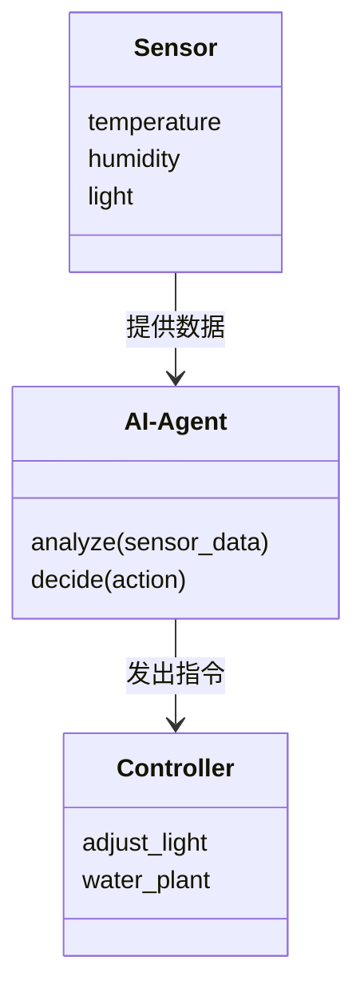

                 


# 智能花盆：AI Agent的植物生长优化管理器

**关键词**：智能花盆、AI Agent、植物生长优化、物联网、传感器数据、智能控制

**摘要**：本文介绍了一种基于AI Agent的智能花盆系统，通过物联网技术和环境传感器，实时监测植物生长环境，并利用机器学习算法优化植物生长条件。系统设计包括环境数据采集、AI决策、智能控制和用户交互模块，旨在为用户提供高效、便捷的植物养护方案。

---

## 目录大纲

### 第一部分：背景介绍

#### 第1章：问题背景与描述

##### 1.1 问题背景
- **1.1.1 传统植物养护的挑战**：人工监控环境因素的复杂性，浇水、光照和温度管理的困难。
- **1.1.2 智能化植物养护的需求**：提高养护效率，减少人为失误，优化植物生长条件。
- **1.1.3 AI Agent在植物养护中的作用**：通过实时数据分析和决策，自动调整环境参数，促进植物健康成长。

##### 1.2 问题描述
- **1.2.1 植物生长的环境因素分析**：光照、温度、湿度、水分和营养等关键因素。
- **1.2.2 现有养护工具的不足**：传统花盆无法实时监测和调整环境，依赖人工操作。
- **1.2.3 智能花盆的目标与边界**：目标是优化植物生长环境，边界包括传感器、AI决策和执行机构。

### 第二部分：核心概念与联系

#### 第2章：AI Agent与物联网技术的协同

##### 2.1 AI Agent的核心原理
- **2.1.1 状态感知**：通过传感器获取环境数据，如温度、湿度等。
- **2.1.2 状态推理**：分析环境数据，判断植物的生长状态。
- **2.1.3 行动决策**：根据推理结果，决定是否调整光照、浇水等参数。

##### 2.2 物联网技术在智能花盆中的应用
- **2.2.1 传感器网络**：多种传感器协同工作，实时采集环境数据。
- **2.2.2 数据传输与处理**：通过无线通信技术传输数据，并进行预处理。
- **2.2.3 远程控制**：通过物联网设备远程调整环境参数。

##### 2.3 实体关系图
```mermaid
er
    actor(AI Agent)
    actor(User)
    entity(Sensor Data)
    entity(Plant Growth Data)
    entity(Control Signal)
    actor(AI Agent) --> entity(Sensor Data): 采集
    actor(AI Agent) --> entity(Plant Growth Data): 分析
    actor(AI Agent) --> entity(Control Signal): 发送
    actor(User) --> entity(Sensor Data): 监控
    actor(User) --> entity(Plant Growth Data): 查看
    actor(User) --> entity(Control Signal): 设置
```

### 第三部分：算法原理

#### 第3章：AI Agent的决策算法

##### 3.1 状态感知与数据采集
- **传感器数据采集**：温度、湿度、光照强度等环境参数的采集。
- **数据预处理**：去噪、归一化处理，确保数据准确可靠。

##### 3.2 状态推理与分析
- **数学模型构建**：利用回归分析或机器学习模型预测植物生长状态。
- **状态空间定义**：定义状态空间和动作空间，明确AI Agent的决策范围。

##### 3.3 行动决策与反馈机制
- **Q-learning算法**：使用Q-learning算法进行状态-动作价值评估，优化决策策略。
  ```python
  def q_learning(state, action):
      next_state = transition(state, action)
      q_value = q_table[state][action]
      next_q_value = q_table[next_state][best_action]
      q_table[state][action] = q_value + learning_rate * (reward + gamma * next_q_value - q_value)
      return q_table
  ```

### 第四部分：系统分析与架构设计

#### 第4章：系统功能设计

##### 4.1 领域模型


#### 第4.2 系统架构设计
```mermaid
graph TD
    A[AI Agent] --> B[传感器] : 获取数据
    B --> C[数据处理] 
    C --> D[决策模块] 
    D --> E[控制信号]
    E --> F[执行机构]
    F --> G[环境]
```

### 第五部分：项目实战

#### 第5章：环境安装与代码实现

##### 5.1 环境安装
- **安装Python和相关库**：如TensorFlow、Raspberry Pi、传感器驱动。
- **硬件安装**：传感器、控制器、无线通信模块的安装与配置。

##### 5.2 核心代码实现
```python
import numpy as np
from tensorflow.keras import models

# 定义AI Agent模型
class AIAgent:
    def __init__(self, input_dim, output_dim):
        self.model = models.Sequential([
            layers.Dense(32, activation='relu', input_dim=input_dim),
            layers.Dense(output_dim, activation='softmax')
        ])
        self.model.compile(optimizer='adam', loss='sparse_categorical_crossentropy')

    def predict(self, input_data):
        return self.model.predict(input_data)

# 初始化传感器和控制器
class Sensor:
    def read(self):
        # 返回温度、湿度、光照强度
        return (25, 70, 80)

class Controller:
    def control(self, action):
        # action: 0-调整光照，1-浇水
        pass

# 训练AI Agent
agent = AIAgent(3, 2)
# 使用传感器数据训练模型
sensor = Sensor()
data = sensor.read()
agent.model.fit(data, np.array([0]), epochs=10)
```

### 第六部分：最佳实践

#### 第6章：总结与扩展

##### 6.1 小结
- AI Agent在智能花盆中的应用显著提升了植物养护的效率和效果。
- 系统设计的关键点包括传感器数据采集、AI算法决策和智能控制执行。

##### 6.2 注意事项
- 传感器的校准和维护，确保数据准确性。
- 系统的实时性和稳定性，避免数据延迟和系统故障。
- 用户界面的友好性，方便非技术人员使用。

##### 6.3 拓展阅读
- 深入学习强化学习算法，优化AI Agent的决策策略。
- 探索更多传感器技术，提升系统的感知能力。
- 研究植物生长模型，结合AI技术实现更精准的生长预测和管理。

---

**作者：AI天才研究院 & 禅与计算机程序设计艺术**

