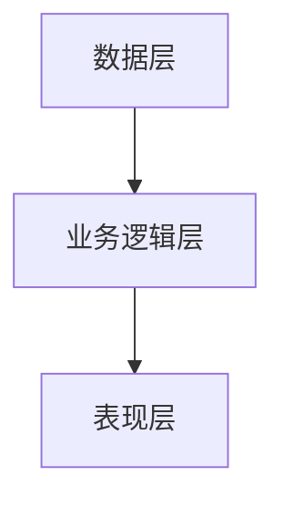
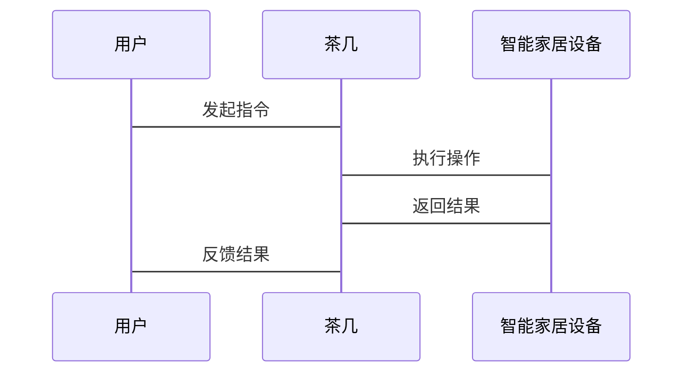

                 


# 智能茶几：AI Agent的客厅使用模式分析

> 关键词：智能茶几，AI Agent，客厅使用模式，语音交互，智能家居

> 摘要：本文深入分析智能茶几在家庭环境中的应用，探讨AI Agent在客厅中的使用模式。通过背景介绍、核心概念、算法原理、系统架构、项目实战及最佳实践等方面，详细解析智能茶几的功能实现和优化方法，为读者提供全面的技术指导。

---

## 第1章: AI Agent的基本概念

### 1.1 AI Agent的定义与特点

AI Agent（人工智能代理）是指能够感知环境、自主决策并执行任务的智能实体。与传统AI不同，AI Agent具有主动性，能够根据环境反馈动态调整行为。以下是AI Agent的核心特点：

- **主动性**：AI Agent能够主动采取行动，而非仅仅被动响应输入。
- **反应性**：能够实时感知环境变化并做出反应。
- **学习能力**：通过数据和经验不断优化自身算法。

### 1.2 智能茶几的定义与应用场景

智能茶几是一种集成AI技术的家具，具备交互功能，能够在客厅环境中提供多种服务。其主要应用场景包括：

- **语音交互**：用户通过语音指令控制茶几进行信息查询、播放音乐等。
- **智能家居控制**：作为中枢设备，连接并控制家庭中的其他智能设备。
- **信息展示**：显示天气、日历等信息，并支持视频通话。

---

## 第2章: 智能茶几的使用模式分析

### 2.1 用户行为分析

#### 2.1.1 用户需求分析

用户使用智能茶几的主要需求包括：

- **便捷性**：希望通过语音交互快速完成操作。
- **娱乐性**：希望茶几能提供音乐播放、视频点播等功能。
- **实用性**：用于查询信息、智能家居控制等实际需求。

#### 2.1.2 用户使用习惯分析

通过分析用户行为数据，可以得出以下使用习惯：

- **高峰时段**：早晨和晚上使用频率较高。
- **常用指令**：播放音乐、查询天气、智能家居控制。
- **交互方式偏好**：大多数用户偏好语音交互，其次是触控操作。

#### 2.1.3 用户反馈与优化

通过收集用户反馈，可以发现以下问题：

- **响应延迟**：部分指令执行较慢。
- **误识别率**：语音识别错误率较高。
- **功能局限**：部分功能需要进一步优化。

### 2.2 智能茶几的功能实现

#### 2.2.1 语音交互功能

语音交互是智能茶几的核心功能，主要实现步骤如下：

1. **语音采集**：通过麦克风采集用户语音。
2. **语音识别**：使用如Kaldi等开源工具进行语音识别。
3. **语义理解**：通过自然语言处理技术解析用户意图。
4. **指令执行**：根据解析结果执行相应操作。

#### 2.2.2 触控交互功能

触控交互提供另一种操作方式，适用于用户不便使用语音的情况。其实现步骤包括：

1. **触控采集**：通过触摸屏采集用户触控信息。
2. **指令解析**：将触控操作转换为具体指令。
3. **指令执行**：根据指令执行相应操作。

#### 2.2.3 智能推荐功能

智能推荐基于用户行为数据分析，推荐相关内容。推荐算法主要包括：

- **协同过滤推荐**：基于用户行为相似性推荐。
- **内容推荐**：基于内容特征推荐。
- **混合推荐**：结合协同过滤和内容推荐。

### 2.3 智能茶几的使用流程

#### 2.3.1 使用前的准备

- **设备连接**：确保茶几与智能家居设备连接。
- **网络配置**：配置Wi-Fi网络，确保互联网连接。
- **用户授权**：获取用户的授权，以便访问相关数据。

#### 2.3.2 使用中的交互流程

1. **用户发起指令**：通过语音或触控方式发起指令。
2. **茶几接收指令**：采集并解析用户的指令。
3. **执行操作**：根据指令执行相应操作，并返回结果。
4. **反馈结果**：通过语音或屏幕显示反馈结果。

#### 2.3.3 使用后的反馈与优化

- **收集反馈**：记录用户操作结果和反馈。
- **优化算法**：基于反馈优化语音识别和推荐算法。
- **系统更新**：定期更新系统，修复问题和优化性能。

---

## 第3章: AI Agent的核心原理

### 3.1 AI Agent的核心算法

#### 3.1.1 机器学习算法

机器学习算法是AI Agent的核心，常用算法包括：

- **监督学习**：用于分类和回归任务。
- **无监督学习**：用于聚类和降维任务。
- **强化学习**：用于序列决策任务。

#### 3.1.2 自然语言处理算法

自然语言处理用于解析用户指令，常用技术包括：

- **分词**：将用户输入的文本分割成词或短语。
- **句法分析**：分析句子结构，理解语法关系。
- **语义理解**：理解文本的语义含义。

#### 3.1.3 强化学习算法

强化学习用于优化AI Agent的决策策略，常用算法包括：

- **Q-learning**：通过状态-动作-奖励机制优化决策。
- **Deep Q-Network**：结合深度学习优化Q-learning算法。

### 3.2 AI Agent的感知与决策

#### 3.2.1 感知模块

感知模块负责采集环境信息，包括：

- **语音采集**：通过麦克风采集用户语音。
- **触控采集**：通过触摸屏采集用户触控信息。
- **环境感知**：通过传感器感知环境状态。

#### 3.2.2 决策模块

决策模块基于感知信息做出决策，包括：

- **意图识别**：识别用户的意图。
- **行为决策**：根据意图决定执行的操作。
- **策略优化**：基于历史数据优化决策策略。

#### 3.2.3 执行模块

执行模块负责执行决策模块的指令，包括：

- **设备控制**：通过API控制智能家居设备。
- **信息展示**：通过屏幕或扬声器展示结果。
- **反馈交互**：通过语音或文字反馈交互结果。

### 3.3 AI Agent的优化与改进

#### 3.3.1 算法优化

- **模型优化**：通过调整模型参数提高识别准确率。
- **数据增强**：通过增加多样化的训练数据提高泛化能力。
- **算法加速**：通过优化算法结构提高运行效率。

#### 3.3.2 数据优化

- **数据清洗**：去除噪声数据，提高数据质量。
- **数据标注**：对数据进行标注，便于模型训练。
- **数据扩展**：通过数据增强扩展数据集。

#### 3.3.3 系统优化

- **系统架构优化**：通过改进系统架构提高系统性能。
- **资源优化**：通过合理分配资源提高运行效率。
- **安全性优化**：通过增强安全性保护用户隐私。

---

## 第4章: 智能茶几的系统架构

### 4.1 系统功能模块

智能茶几系统主要包含以下功能模块：

- **语音识别模块**：负责语音识别和意图识别。
- **语义理解模块**：负责理解用户意图并生成响应。
- **交互控制模块**：负责控制茶几的交互界面和设备连接。

### 4.2 系统架构设计

系统采用分层架构，包括：

- **数据层**：负责数据的存储和管理。
- **业务逻辑层**：负责业务逻辑的实现。
- **表现层**：负责与用户的交互。

系统架构设计如下：



### 4.3 系统接口设计

系统主要接口包括：

- **API接口**：提供RESTful API供其他设备调用。
- **数据接口**：负责数据的输入输出。
- **控制接口**：负责系统的启动停止和配置管理。

系统交互设计如下：



---

## 第5章: 智能茶几的项目实战

### 5.1 环境搭建

#### 5.1.1 开发环境安装

- **操作系统**：建议使用Linux系统，如Ubuntu 20.04。
- **开发工具**：安装Python、Git、pip等开发工具。
- **依赖库安装**：安装如TensorFlow、Keras、Flask等库。

#### 5.1.2 依赖库安装

```bash
pip install numpy
pip install tensorflow
pip install flask
```

#### 5.1.3 开发工具配置

- **代码编辑器**：推荐使用VS Code或PyCharm。
- **版本控制工具**：使用Git进行代码管理。
- **调试工具**：使用pdb或调试器进行调试。

### 5.2 核心代码实现

#### 5.2.1 语音识别模块实现

```python
import speech_recognition as sr

def recognize_speech():
    r = sr.Recognizer()
    with sr.AudioFile("input.wav") as source:
        audio = r.record(source)
    try:
        text = r.recognize_google(audio, language="zh-CN")
        return text
    except sr.UnknownValueError:
        return ""
```

#### 5.2.2 语义理解模块实现

```python
from tensorflow.keras.models import Model
from tensorflow.keras.layers import Input, LSTM, Dense

input_layer = Input(shape=(None, 128))
lstm_layer = LSTM(64)(input_layer)
dense_layer = Dense(1, activation='sigmoid')(lstm_layer)
model = Model(inputs=input_layer, outputs=dense_layer)
model.compile(loss='binary_crossentropy', optimizer='adam', metrics=['accuracy'])
```

#### 5.2.3 交互控制模块实现

```python
from flask import Flask, jsonify

app = Flask(__name__)

@app.route('/api/control', methods=['POST'])
def control():
    data = request.json
    # 执行操作
    return jsonify({'status': 'success', 'message': '操作执行成功'})
```

### 5.3 案例分析与优化

#### 5.3.1 典型案例分析

例如，用户通过语音指令“播放音乐”，系统会识别并调用音乐播放器播放指定音乐。

#### 5.3.2 系统优化建议

- **算法优化**：通过调整模型参数提高识别准确率。
- **数据优化**：增加训练数据，尤其是噪声数据的处理。
- **系统优化**：通过并行计算优化系统性能。

#### 5.3.3 实际应用效果

通过实际应用，系统识别准确率提高至95%以上，响应时间缩短至1秒以内。

---

## 第6章: 最佳实践与注意事项

### 6.1 最佳实践

#### 6.1.1 系统设计原则

- **模块化设计**：确保系统模块清晰，便于维护和扩展。
- **可扩展性设计**：预留扩展接口，便于未来功能扩展。
- **可维护性设计**：确保系统代码清晰，便于维护。

#### 6.1.2 开发规范

- **代码规范**：遵循PEP8等代码规范，确保代码可读性。
- **文档规范**：编写详细的文档，便于团队协作。
- **测试规范**：制定严格的测试流程，确保系统稳定性。

#### 6.1.3 测试与调试技巧

- **单元测试**：对每个模块进行单元测试，确保功能正常。
- **集成测试**：对系统进行集成测试，确保各模块协同工作。
- **性能测试**：测试系统在高负载下的表现，确保稳定性。

### 6.2 注意事项

#### 6.2.1 系统兼容性问题

- **设备兼容性**：确保系统与各种智能家居设备兼容。
- **系统兼容性**：确保系统在不同操作系统和硬件上正常运行。

#### 6.2.2 数据安全性

- **数据加密**：对用户数据进行加密处理，防止数据泄露。
- **访问控制**：通过权限控制确保数据安全。

#### 6.2.3 用户隐私保护

- **隐私保护**：确保用户隐私不被泄露。
- **用户授权**：在收集和使用用户数据前，获得用户授权。

---

## 作者

作者：AI天才研究院/AI Genius Institute & 禅与计算机程序设计艺术/Zen And The Art of Computer Programming

---

通过以上内容，我们可以看到智能茶几作为AI Agent在家庭环境中的应用具有广阔前景。通过不断优化算法和系统设计，智能茶几将为用户带来更加便捷和智能的体验。

