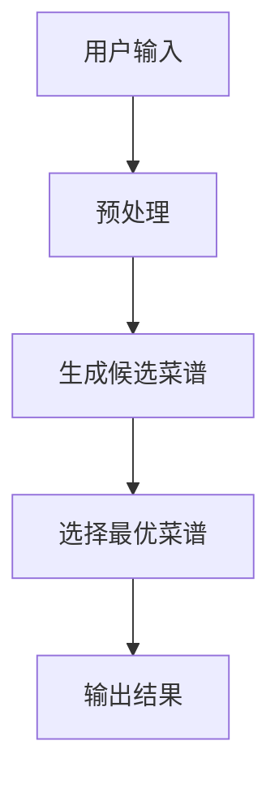
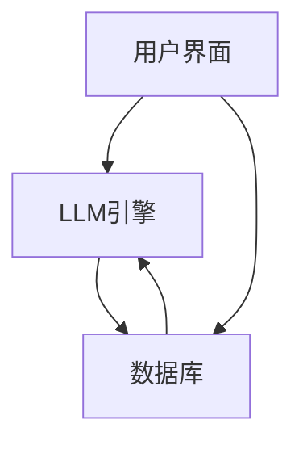

                 


# 智能菜谱生成 AI Agent：LLM 辅助烹饪创新

**关键词**：智能菜谱生成，AI Agent，LLM，烹饪创新，人工智能，大语言模型

**摘要**：本文探讨如何利用大语言模型（LLM）构建智能菜谱生成AI代理，通过分析烹饪过程中的痛点，提出基于LLM的解决方案，详细阐述算法原理、系统架构，并通过实战项目展示其应用，最后总结经验和未来方向。

---

## 第一部分：背景介绍

### 第1章：智能菜谱生成的背景与问题描述

#### 1.1 传统烹饪的痛点与挑战

- **1.1.1 烹饪过程中的效率问题**
  - 传统烹饪步骤繁琐，依赖经验，效率低下。
  - 初学者难以掌握复杂技巧，挫败感强。

- **1.1.2 初学者的困难与学习曲线**
  - 缺乏系统指导，难以快速掌握多种烹饪方法。
  - 烹饪资源分散，难以高效利用。

- **1.1.3 烹饪资源的分散与不系统性**
  - 菜谱来源多样，质量参差不齐。
  - 高效整合资源的需求迫切。

#### 1.2 AI技术在烹饪领域的应用潜力

- **1.2.1 AI在烹饪中的创新应用**
  - 个性化菜谱推荐，满足不同用户需求。
  - 自动优化烹饪步骤，提升效率。

- **1.2.2 大语言模型（LLM）的优势**
  - 强大的自然语言处理能力，理解用户需求。
  - 多样化的生成能力，提供创新菜谱。

- **1.2.3 AI菜谱生成的市场前景**
  - 智能厨房设备普及，推动AI应用。
  - 用户对高效、个性化的烹饪解决方案需求增加。

#### 1.3 智能菜谱生成的核心问题

- **1.3.1 菜谱生成的关键挑战**
  - 理解用户需求的多样性。
  - 确保生成菜谱的可行性和创新性。

- **1.3.2 用户需求**
  - 快速获取个性化菜谱。
  - 学习高效的烹饪技巧。

---

## 第二部分：核心概念与联系

### 第2章：AI Agent与LLM的核心概念

#### 2.1 AI Agent的基本原理

- **AI Agent的定义**：智能体，感知环境并采取行动以实现目标。
- **功能特点**：自主性、反应性、目标导向。
- **分类**：简单反射型、基于模型的反射型、目标驱动型、效用驱动型。

#### 2.2 LLM的基本原理

- **LLM的定义**：大规模预训练语言模型，具备强大的自然语言处理能力。
- **训练过程**：预训练和微调，预训练学习语言结构，微调适应特定任务。
- **工作原理**：基于概率生成文本，通过优化损失函数提升生成质量。

#### 2.3 AI Agent与LLM的协同工作

- **协同机制**：AI Agent通过自然语言处理能力接收用户输入，LLM生成菜谱。
- **核心联系**：AI Agent作为控制器，协调LLM的生成过程。

#### 2.4 核心概念对比分析

| **概念**      | **AI Agent**               | **LLM**                  |
|---------------|---------------------------|--------------------------|
| **核心功能**   | 执行任务，实现目标         | 生成高质量文本           |
| **输入输出**   | 多种数据类型               | 文本生成                 |
| **应用场景**   | 个性化服务                | 自然语言处理             |

#### 2.5 系统核心要素构成

- **用户输入模块**：接收用户需求。
- **菜谱生成模块**：LLM生成菜谱。
- **反馈优化模块**：根据用户反馈调整生成策略。

---

## 第三部分：算法原理讲解

### 第3章：LLM的训练与推理过程

#### 3.1 模型训练流程

- **预训练阶段**：使用大规模数据训练模型，学习语言结构。
- **微调阶段**：针对特定任务（如菜谱生成）进行优化，提升任务相关性。

#### 3.2 菜谱生成的推理过程

- **输入处理**：解析用户需求。
- **生成策略**：基于概率生成最优菜谱。
- **输出结果**：生成菜谱并返回用户。

#### 3.3 算法流程图



#### 3.4 数学模型与公式

- **条件概率公式**：$$P(\text{菜谱}|\text{输入}) = \prod_{i=1}^{n} P(w_i|\text{输入}, w_{i-1})$$
- **损失函数**：$$L = -\sum_{i=1}^{n} \log P(w_i|\text{输入}, w_{i-1})$$

---

## 第四部分：系统分析与架构设计

### 第4章：系统功能设计与架构

#### 4.1 系统应用场景

- **家庭厨房**：辅助日常烹饪。
- **餐饮行业**：优化菜单设计。
- **教育领域**：提供教学支持。

#### 4.2 系统功能设计

- **用户输入模块**：接收需求。
- **生成模块**：LLM生成菜谱。
- **反馈模块**：收集用户反馈，优化生成策略。

#### 4.3 系统架构设计



---

## 第五部分：项目实战

### 第5章：智能菜谱生成系统实现

#### 5.1 环境安装与配置

- **Python 3.8+**
- **安装库**：`transformers`, `torch`

#### 5.2 核心代码实现

```python
from transformers import LlamaForCausalInference, LlamaTokenizer

model = LlamaForCausalInference.from_pretrained('tii-small-llama-2')
tokenizer = LlamaTokenizer.from_pretrained('tii-small-llama-2')

def generate_recipe(input_text):
    inputs = tokenizer(input_text, return_tensors='np')
    outputs = model.generate(inputs.input_ids, max_length=500)
    return tokenizer.decode(outputs[0], skip_special_tokens=True)
```

#### 5.3 代码解读与分析

- **输入处理**：将用户输入转换为模型可处理的格式。
- **生成过程**：调用模型生成菜谱。
- **输出处理**：将生成结果解码为文本。

#### 5.4 实际案例分析

- **输入**：用户输入“家常豆腐”。
- **输出**：生成多种做法，包括材料和步骤。

#### 5.5 项目小结

- 成功实现菜谱生成系统。
- 验证了LLM在烹饪创新中的应用潜力。

---

## 第六部分：系统实现与优化

### 第6章：系统优化与注意事项

#### 6.1 系统优化建议

- **模型优化**：选择更合适的模型，提升生成质量。
- **用户反馈**：建立反馈机制，持续优化系统。

#### 6.2 注意事项

- **数据安全**：确保用户数据隐私。
- **模型调优**：根据实际需求调整参数。

---

## 第七部分：总结与展望

### 第7章：总结与未来方向

#### 7.1 总结

- 成功构建智能菜谱生成系统。
- 展现了LLM在烹饪创新中的潜力。

#### 7.2 未来方向

- **多模态模型**：结合视觉和听觉信息，提升生成质量。
- **个性化服务**：根据用户偏好提供定制化菜谱。

---

**作者：AI天才研究院/AI Genius Institute & 禅与计算机程序设计艺术 /Zen And The Art of Computer Programming**

