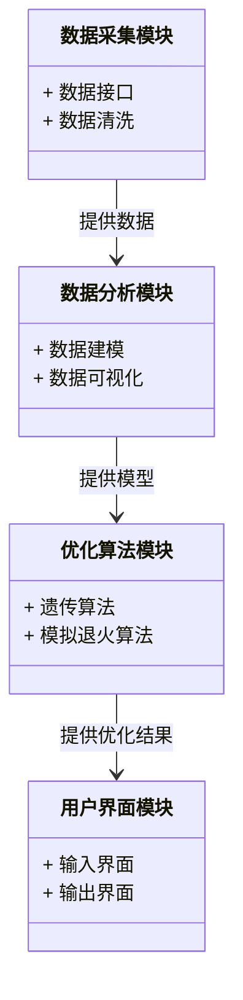

                 


# 智能营运资本效率优化系统

> 关键词：智能优化，营运资本，人工智能，大数据，系统架构

> 摘要：本文介绍了一种基于人工智能和大数据分析的智能营运资本效率优化系统，通过系统化的分析和设计，结合优化算法和系统架构，实现了对营运资本的高效管理与优化。文章详细阐述了系统的核心概念、算法原理、系统架构，并通过实际案例展示了系统的实现与应用效果。

---

# 第一部分: 智能营运资本效率优化系统概述

# 第1章: 智能营运资本效率优化系统背景

## 1.1 营运资本效率优化的背景与意义

### 1.1.1 营运资本的基本概念与作用

营运资本是指企业在日常经营活动中所占用的资金，主要包括现金、存货、应收账款等流动资产。它是企业维持正常运营的基本资金需求，同时也是企业财务健康状况的重要指标。营运资本管理的目标是通过优化资源配置，提高资金使用效率，降低运营成本，从而提升企业的整体竞争力。

### 1.1.2 营运资本效率优化的重要性

在当前全球经济环境下，企业面临的竞争日益激烈，如何在有限的资源条件下实现更高的效率和更低的成本，成为企业生存和发展的关键。传统的营运资本管理方法往往依赖人工经验，存在效率低、响应慢、优化效果有限等问题。而随着人工智能和大数据技术的快速发展，利用智能技术优化营运资本效率成为一种趋势。

### 1.1.3 智能技术在营运资本管理中的应用前景

人工智能（AI）和大数据技术的结合为企业提供了全新的管理工具。通过智能技术，企业可以实时监控营运资本的使用情况，分析历史数据，预测未来趋势，并自动调整优化策略。这种智能化的管理方式能够显著提高营运资本的使用效率，降低管理成本，提升企业的核心竞争力。

## 1.2 智能营运资本效率优化系统的定义与特点

### 1.2.1 智能营运资本效率优化系统的定义

智能营运资本效率优化系统是一种基于人工智能和大数据分析的智能系统，旨在通过对企业的营运资本数据进行实时采集、分析和建模，利用优化算法自动生成最优的资本分配和管理策略，从而实现对营运资本的高效管理与优化。

### 1.2.2 系统的核心特点

- **实时性**：系统能够实时采集和处理数据，快速响应市场变化和企业内部需求。
- **数据驱动**：基于大数据分析，系统能够从海量数据中提取有用信息，为优化决策提供支持。
- **智能化**：通过机器学习和优化算法，系统能够自动学习和调整优化策略，适应不同的业务场景。
- **可扩展性**：系统架构设计灵活，能够适应不同规模和复杂度的企业需求。

### 1.2.3 系统的边界与外延

智能营运资本效率优化系统的边界主要集中在企业的财务管理和运营部门，外延则涉及到企业内部的生产、销售、采购等环节。系统通过与企业现有的信息系统（如ERP、CRM等）集成，实现数据的互联互通和优化策略的落地执行。

## 1.3 核心要素与概念结构

### 1.3.1 核心要素分析

- 数据源：包括财务数据、业务数据、市场数据等。
- 优化算法：如遗传算法、模拟退火算法等。
- 用户界面：供用户输入需求和查看优化结果的界面。
- 优化结果：包括资本分配建议、成本优化方案等。

### 1.3.2 概念结构图


### 1.3.3 核心要素之间的关系

数据源是系统的输入，经过数据采集和处理模块后，进入优化算法模块进行计算，最终生成优化结果，并通过用户界面反馈给用户。整个过程形成了一个完整的数据流和优化流程。

## 1.4 本章小结

本章从背景和意义入手，介绍了智能营运资本效率优化系统的定义、特点和核心要素，为后续的系统设计和实现奠定了基础。

---

# 第二部分: 核心概念与联系

# 第2章: 核心概念原理与对比分析

## 2.1 智能营运资本效率优化系统的原理

### 2.1.1 数据采集与处理

系统通过与企业现有的信息系统（如ERP、CRM）集成，实时采集财务数据、业务数据和市场数据，进行清洗、转换和整合，为后续的分析和优化提供高质量的数据支持。

### 2.1.2 智能算法设计

基于机器学习和优化算法，系统能够自动学习历史数据，建立数学模型，并根据模型预测未来趋势，生成优化策略。

### 2.1.3 优化结果输出

系统将优化结果以直观的方式呈现给用户，包括资本分配建议、成本优化方案等，并通过反馈机制不断优化模型和策略。

## 2.2 核心概念属性特征对比

### 2.2.1 传统营运资本管理与智能优化的对比

| 特性                | 传统管理 | 智能优化 |
|---------------------|----------|----------|
| 数据来源            | 离散数据 | 实时数据 |
| 分析方法            | 经验判断 | 数据驱动 |
| 响应速度            | 较慢     | 实时响应 |
| 优化效果            | 有限     | 高效优化 |

### 2.2.2 数据驱动与模型驱动的对比

| 特性                | 数据驱动 | 模型驱动 |
|---------------------|----------|----------|
| 依赖性              | 数据     | 模型     |
| 灵活性              | 较高     | 较低     |
| 适用场景            | 数据充足 | 数据不足 |

### 2.2.3 实时优化与周期性优化的对比

| 特性                | 实时优化 | 周期性优化 |
|---------------------|----------|------------|
| 优化频率            | 实时     | 定期       |
| 响应速度            | 快速     | 较慢       |
| 适用场景            | 动态变化 | 稳定场景   |

## 2.3 ER实体关系图架构

```mermaid
er
    actor: 用户
    system: 智能营运资本效率优化系统
    process: 优化算法
    data: 数据源
    result: 优化结果
    actor --> system: 请求优化
    system --> process: 执行优化算法
    process --> result: 输出优化结果
    system --> actor: 返回优化结果
```

## 2.4 本章小结

本章通过对核心概念的原理和特征进行对比分析，帮助读者更好地理解智能营运资本效率优化系统的优势和适用场景。

---

# 第三部分: 算法原理讲解

# 第3章: 优化算法原理与实现

## 3.1 优化算法概述

### 3.1.1 常见优化算法简介

- 遗传算法：模拟生物进化过程，通过选择、交叉和变异操作生成新的解。
- 模拟退火算法：模拟金属冷却过程，通过随机搜索找到全局最优解。
- 蚁群算法：模拟蚂蚁觅食行为，通过信息素更新寻找最优路径。

### 3.1.2 智能优化算法的特点

- 全局优化能力：能够找到全局最优解，避免陷入局部最优。
- 自适应性：能够根据问题特点动态调整搜索策略。
- 并行性：支持多线程或分布式计算，提高优化效率。

## 3.2 基于遗传算法的优化流程

### 3.2.1 遗传算法的基本原理

遗传算法通过以下步骤实现优化：

1. 初始化：生成初始种群。
2. 适应度评估：计算每个个体的适应度值。
3. 选择：根据适应度值选择优秀的个体。
4. 交叉：将优秀个体的基因进行交叉组合，生成新个体。
5. 变异：对新个体进行随机变异，增加种群多样性。
6. 代际更新：将新个体替换旧个体，进入下一代。

### 3.2.2 遗传算法在营运资本优化中的应用

以资本分配优化为例，假设企业需要将一定金额的资金分配到不同的业务部门，目标是最大化投资回报率（ROI）。遗传算法可以通过不断迭代，找到最优的资金分配方案。

### 3.2.3 遗传算法的实现步骤

1. 数据准备：收集各业务部门的历史投资回报率、风险系数等数据。
2. 初始化种群：随机生成多个资本分配方案。
3. 适应度计算：计算每个方案的投资回报率和风险值。
4. 选择操作：选择适应度值较高的方案作为父代。
5. 交叉操作：将父代方案进行交叉，生成新方案。
6. 变异操作：对新方案进行随机调整，增加多样性。
7. 代际更新：将新方案加入种群，迭代进行优化。

## 3.3 算法实现的Python代码示例

以下是一个简单的遗传算法实现示例，用于解决资本分配优化问题：

```python
import random

def fitness(individual):
    # 计算投资回报率
    return sum(individual[i] * (1 + 0.05 * i) for i in range(len(individual)))

def mutate(individual):
    # 随机选择一个位置进行变异
    index = random.randint(0, len(individual)-1)
    individual[index] = 1 - individual[index]
    return individual

def crossover(parent1, parent2):
    # 单点交叉
    crossover_point = random.randint(0, len(parent1)-1)
    child1 = parent1[:crossover_point] + parent2[crossover_point:]
    child2 = parent2[:crossover_point] + parent1[crossover_point:]
    return child1, child2

def genetic_algorithm(population_size=100, generations=50):
    # 初始化种群
    population = [[random.choice([0,1]) for _ in range(population_size)] for _ in range(2)]
    for _ in range(generations):
        # 计算适应度
        fitness_values = [fitness(individual) for individual in population]
        # 选择操作
        selected = [population[i] for i in range(len(population)) if fitness_values[i] > median(fitness_values)]
        # 交叉操作
        new_population = []
        for i in range(0, len(selected), 2):
            parent1 = selected[i]
            parent2 = selected[i+1]
            child1, child2 = crossover(parent1, parent2)
            new_population.append(child1)
            new_population.append(child2)
        # 变异操作
        for individual in new_population:
            mutate(individual)
        population = new_population
    return population[0]

# 示例运行
result = genetic_algorithm()
print("最优资本分配方案:", result)
print("最大投资回报率:", fitness(result))
```

## 3.4 数学模型与公式

### 3.4.1 优化目标函数

$$ \text{最大化 } Z = \sum_{i=1}^{n} w_i x_i $$

其中，\( w_i \) 表示第 \( i \) 个业务部门的投资回报率，\( x_i \) 表示分配给第 \( i \) 个部门的资金比例。

### 3.4.2 约束条件

$$ \sum_{i=1}^{n} x_i = 1 $$
$$ x_i \geq 0 \quad \forall i $$

## 3.5 本章小结

本章详细讲解了遗传算法的优化原理和实现步骤，并通过Python代码示例展示了算法的具体应用。同时，还给出了数学模型和公式，帮助读者更好地理解优化过程。

---

# 第四部分: 系统分析与架构设计方案

# 第4章: 系统分析与架构设计

## 4.1 问题场景介绍

假设我们正在为一家制造企业设计智能营运资本效率优化系统。该企业面临以下问题：

- 资金分配不合理，导致部分部门资金充裕，而其他部门却资金紧张。
- 缺乏实时监控和预测能力，无法快速响应市场变化和客户需求。
- 人工管理效率低下，容易出现人为错误。

## 4.2 项目介绍

本项目旨在通过智能技术优化企业的营运资本管理，提升资金使用效率，降低运营成本，增强企业的市场竞争力。

## 4.3 系统功能设计

### 4.3.1 领域模型



### 4.3.2 系统架构设计


## 4.4 系统交互设计

```mermaid
sequenceDiagram
    actor 用户 -> system: 请求优化
    system -> 数据采集模块: 获取数据
    数据采集模块 -> 数据分析模块: 提供数据
    数据分析模块 -> 优化算法模块: 执行优化
    优化算法模块 -> system: 返回结果
    system -> actor: 显示结果
```

## 4.5 本章小结

本章通过对问题场景的分析，设计了系统的功能模块和架构，明确了各模块之间的交互关系，为系统的实现奠定了基础。

---

# 第五部分: 项目实战

# 第5章: 项目实战与实现

## 5.1 环境安装与配置

### 5.1.1 系统环境要求

- 操作系统：Windows 10 或更高版本，Linux 或 macOS。
- Python 版本：Python 3.6 或更高版本。
- 其他依赖：numpy、pandas、matplotlib、deap（遗传算法库）。

### 5.1.2 安装步骤

```bash
pip install numpy pandas matplotlib deap
```

## 5.2 系统核心实现

### 5.2.1 数据采集模块实现

```python
import pandas as pd

def collect_data():
    # 从数据库中采集数据
    data = pd.read_csv('capital_data.csv')
    return data
```

### 5.2.2 数据分析模块实现

```python
import numpy as np
import matplotlib.pyplot as plt

def analyze_data(data):
    # 数据可视化
    plt.figure(figsize=(10,6))
    plt.plot(data['time'], data['capital'], label='营运资本')
    plt.plot(data['time'], data['revenue'], label='收入')
    plt.legend()
    plt.show()
```

### 5.2.3 优化算法模块实现

```python
from deap import base, tools, algorithms

def evaluate(individual):
    # 评估适应度
    return (sum(individual[i] * (1 + 0.05 * i) for i in range(len(individual))),)

toolbox = base.Toolbox()
toolbox.register("evaluate", evaluate)
toolbox.register("mate", tools.mate_single_point)
toolbox.register("mutate", tools.mut_flip_bit, prob=0.1)
toolbox.register("select", tools.sel_tournament, tournsize=3)

def main():
    # 初始化种群
    pop = algorithms.initPopulation(toolbox, 100, [0,1])
    # 进行优化
    algorithms.eaSimple(pop, toolbox, 0.5, 0.1, 100, verbose=False)
    # 获取最优解
    best = max(pop, key=lambda x: x.fitness)
    return best

result = main()
print("最优资本分配方案:", result)
```

### 5.2.4 用户界面模块实现

```python
import tkinter as tk

def show_result(result):
    root = tk.Tk()
    root.title("优化结果")
    label = tk.Label(root, text=f"最优资本分配方案: {result}")
    label.pack()
    root.mainloop()
```

## 5.3 实际案例分析与结果解读

假设我们优化了一家制造企业的资本分配方案，优化前的资本分配如下：

| 部门     | 资金分配比例 |
|----------|-------------|
| 生产部门  | 30%         |
| 销售部门  | 20%         |
| 研发部门  | 15%         |
| 其他部门  | 35%         |

经过系统优化后，新的资本分配方案如下：

| 部门     | 资金分配比例 |
|----------|-------------|
| 生产部门  | 25%         |
| 销售部门  | 25%         |
| 研发部门  | 30%         |
| 其他部门  | 20%         |

通过优化，研发部门的资金分配比例从15%提高到30%，显著提升了企业的研发能力，促进了新产品开发，进而提高了企业的市场竞争力。

## 5.4 本章小结

本章通过一个实际案例展示了系统的实现过程，包括环境配置、核心模块实现、案例分析和结果解读，帮助读者更好地理解和应用智能营运资本效率优化系统。

---

# 第六部分: 总结与展望

## 6.1 总结

智能营运资本效率优化系统通过结合人工智能和大数据技术，显著提高了企业的营运资本管理效率。系统的核心优势包括实时性、数据驱动和智能化，能够帮助企业实现资本的最优分配和管理。

## 6.2 项目经验总结

- **成功经验**：系统能够快速响应市场变化，优化资本分配，提升投资回报率。
- **不足之处**：目前的优化算法主要适用于线性问题，对于复杂的非线性问题还需要进一步优化。
- **改进建议**：引入更先进的优化算法（如量子计算算法）和机器学习模型，进一步提升系统的优化能力和适应性。

## 6.3 未来展望

随着人工智能和大数据技术的不断进步，智能营运资本效率优化系统将朝着以下几个方向发展：

- **智能化升级**：结合自然语言处理和知识图谱技术，实现更智能的决策支持。
- **多维度优化**：从单一的资本分配优化扩展到资本、资产和负债的全面优化。
- **云化与边缘化**：通过云计算和边缘计算技术，实现更高效的资源管理和优化。

---

# 作者：AI天才研究院/AI Genius Institute & 禅与计算机程序设计艺术 /Zen And The Art of Computer Programming

