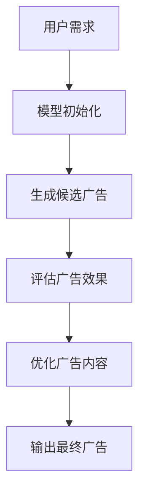
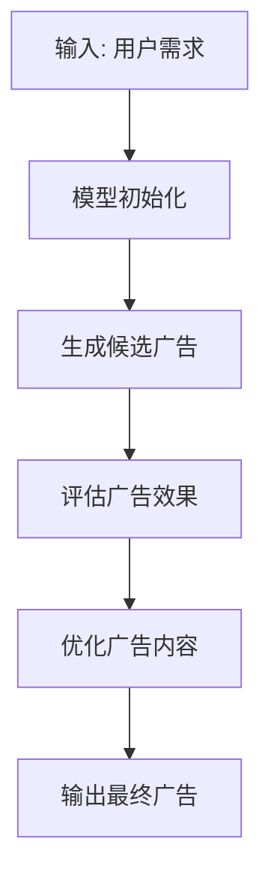
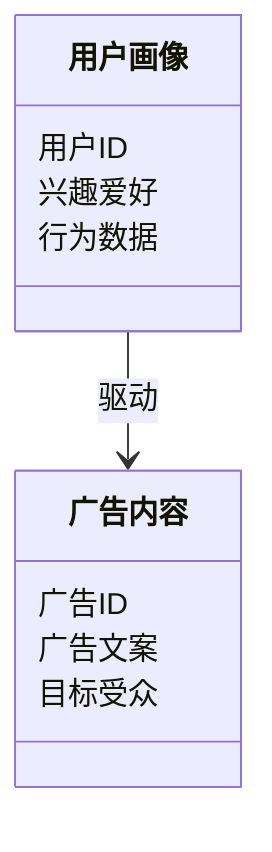
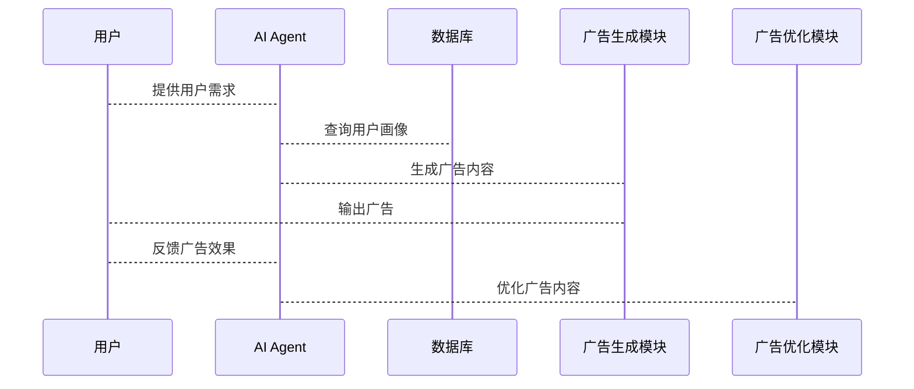

                 


# 智能营销 AI Agent：LLM 驱动的个性化广告生成

> 关键词：智能营销, AI Agent, LLM, 个性化广告, 自然语言处理, 机器学习, 广告生成

> 摘要：本文探讨了如何利用大语言模型（LLM）驱动的AI Agent进行个性化广告生成，通过分析LLM的基本原理、广告生成机制、系统架构设计以及实际案例，详细阐述了智能营销的核心技术和应用场景。

---

# 第一部分: 智能营销与AI Agent概述

## 第1章: 智能营销与AI Agent的背景介绍

### 1.1 什么是智能营销
#### 1.1.1 智能营销的定义
智能营销是指通过人工智能技术，结合大数据分析，实现精准、个性化的营销策略。它能够根据用户的行为、偏好和需求，实时调整营销内容和渠道，以提升营销效果。

#### 1.1.2 智能营销的核心要素
智能营销的核心要素包括：  
1. 数据采集与分析：收集用户行为数据、偏好数据等。  
2. 个性化推荐：基于数据分析生成个性化内容。  
3. 自动化执行：通过AI技术实现营销策略的自动化执行。  
4. 实时优化：根据用户反馈持续优化营销策略。

#### 1.1.3 智能营销与传统营销的区别
智能营销与传统营销的主要区别在于数据驱动和个性化。智能营销利用AI和大数据技术，能够实时调整策略，而传统营销则依赖于人工分析和经验。

### 1.2 LLM驱动的AI Agent在营销中的作用
#### 1.2.1 AI Agent的定义与特点
AI Agent（人工智能代理）是指能够感知环境、执行任务并做出决策的智能体。其特点是自动化、智能化和实时响应。

#### 1.2.2 LLM在AI Agent中的应用
大语言模型（LLM）通过自然语言处理技术，能够理解用户需求、生成文本内容，并与用户进行交互。在AI Agent中，LLM主要用于广告生成、用户交互和内容推荐。

#### 1.2.3 AI Agent在智能营销中的优势
AI Agent能够快速响应用户需求，提供个性化的服务，同时通过数据分析优化营销策略，提升转化率和用户满意度。

### 1.3 个性化广告生成的必要性
#### 1.3.1 个性化广告的定义
个性化广告是指根据用户的兴趣、行为和偏好，生成定制化的广告内容。

#### 1.3.2 个性化广告对企业的价值
个性化广告能够提高广告点击率、转化率，同时增强品牌忠诚度。

#### 1.3.3 个性化广告对用户体验的提升
个性化广告能够减少用户的广告疲劳，提供更有价值的内容，提升用户体验。

---

## 第2章: LLM驱动的AI Agent核心概念与联系

### 2.1 LLM的基本原理
#### 2.1.1 大语言模型的定义
大语言模型是指基于深度学习的自然语言处理模型，如GPT系列。这些模型通过大量数据训练，能够生成自然流畅的文本。

#### 2.1.2 LLM的核心算法
大语言模型的核心算法包括：  
1. Transformer架构：用于处理序列数据。  
2. 自注意力机制：用于捕捉文本中的长距离依赖关系。  
3. 梯度下降优化：用于模型的训练和优化。

#### 2.1.3 LLM的训练与优化
大语言模型的训练过程包括预训练和微调。预训练阶段通过大量无标签数据进行自监督学习，微调阶段则在特定任务上进行优化。

### 2.2 个性化广告生成的机制
#### 2.2.1 用户画像的构建
用户画像是基于用户行为数据和偏好构建的用户模型，用于生成个性化广告内容。

#### 2.2.2 广告内容的生成逻辑
广告生成逻辑包括：  
1. 用户需求分析：识别用户的需求和偏好。  
2. 内容生成：基于用户需求生成广告文本。  
3. 广告优化：根据用户反馈优化广告内容。

#### 2.2.3 广告效果的评估与优化
广告效果的评估包括点击率、转化率等指标。优化策略包括A/B测试、多目标优化等。

### 2.3 LLM与个性化广告的关系
#### 2.3.1 LLM在广告生成中的作用
大语言模型通过生成自然语言文本，能够生成高质量的个性化广告内容。

#### 2.3.2 广告生成的流程图（Mermaid）


#### 2.3.3 LLM与个性化广告的对比表格
| 对比维度 | LLM | 个性化广告 |
|----------|-----|-------------|
| 核心技术  | 深度学习 | 自然语言处理 |
| 应用场景  | 文本生成 | 广告内容生成 |
| 优势      | 高效性 | 个性化 |

---

## 第3章: LLM驱动的个性化广告生成算法原理

### 3.1 算法原理概述
#### 3.1.1 LLM的训练目标
大语言模型的训练目标是通过最大化似然估计，生成与上下文最相关的文本。

#### 3.1.2 广告生成的损失函数
广告生成的损失函数包括交叉熵损失和KL散度损失。

#### 3.1.3 模型优化策略
模型优化策略包括：  
1. 学习率调整：使用Adam优化器。  
2. 正则化：防止模型过拟合。  
3. 模型微调：在特定任务上进行优化。

### 3.2 算法流程图（Mermaid）


### 3.3 核心算法的数学模型
#### 3.3.1 损失函数
$$ \text{Loss} = -\sum_{i=1}^{n} \log p(y_i|x_i) $$

#### 3.3.2 优化目标
$$ \text{Optimize} = \min_{\theta} \text{Loss} + \lambda \text{Regularization} $$

#### 3.3.3 

---

# 第二部分: 系统分析与架构设计

## 第4章: 系统分析与架构设计方案

### 4.1 问题场景介绍
个性化广告生成系统需要满足以下需求：  
1. 实时生成个性化广告内容。  
2. 支持多语言和多平台的广告生成。  
3. 提供广告效果的实时反馈。

### 4.2 项目介绍
本项目旨在开发一个基于LLM的个性化广告生成系统，利用AI Agent实现智能化营销。

### 4.3 系统功能设计
#### 4.3.1 领域模型（Mermaid类图）


#### 4.3.2 系统架构设计（Mermaid架构图）


### 4.4 系统接口设计
系统接口包括：  
1. 用户画像接口。  
2. 广告生成接口。  
3. 广告效果反馈接口。

### 4.5 系统交互流程图（Mermaid序列图）


---

## 第5章: 项目实战

### 5.1 环境安装
安装Python和相关库（如Flask、 transformers）。

### 5.2 核心代码实现
#### 5.2.1 广告生成模块
```python
from transformers import GPT2LMHeadModel, GPT2Tokenizer

def generate_advertisement(prompt, max_length=50):
    model_name = "gpt2"
    tokenizer = GPT2Tokenizer.from_pretrained(model_name)
    model = GPT2LMHeadModel.from_pretrained(model_name)
    inputs = tokenizer.encode(prompt, return_tensors="pt")
    outputs = model.generate(inputs, max_length=max_length)
    advertisement = tokenizer.decode(outputs[0], skip_special_tokens=True)
    return advertisement
```

#### 5.2.2 广告效果评估模块
```python
def evaluateadvertisement(advertisement, user_profile):
    # 实现广告效果评估逻辑
    pass
```

### 5.3 实际案例分析
通过实际案例分析广告生成的效果，优化广告内容。

### 5.4 项目小结
总结项目实现过程中的经验和教训，提出改进建议。

---

## 第6章: 最佳实践、小结与展望

### 6.1 最佳实践
#### 6.1.1 性能优化
1. 使用更高效的模型架构。  
2. 优化数据预处理流程。  

#### 6.1.2 数据安全
确保用户数据的安全性和隐私性。

#### 6.1.3 模型迭代
定期更新模型参数，提升广告生成效果。

### 6.2 小结
本文详细介绍了LLM驱动的个性化广告生成系统，从算法原理到系统设计，再到项目实战，全面阐述了智能营销的核心技术和实现过程。

### 6.3 未来展望
未来，随着大语言模型的不断发展，个性化广告生成系统将更加智能化和个性化，为企业提供更高效的营销解决方案。

---

# 作者：AI天才研究院/AI Genius Institute & 禅与计算机程序设计艺术 /Zen And The Art of Computer Programming

---

以上是一个详细的目录大纲和文章内容框架，涵盖了从背景介绍到系统设计、项目实战的全过程。每一部分都按照逻辑顺序展开，确保读者能够逐步理解智能营销AI Agent的核心概念和实现细节。

