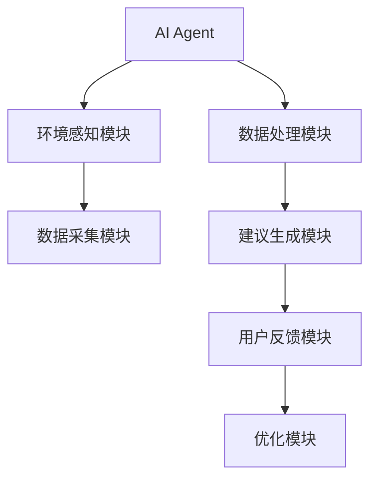
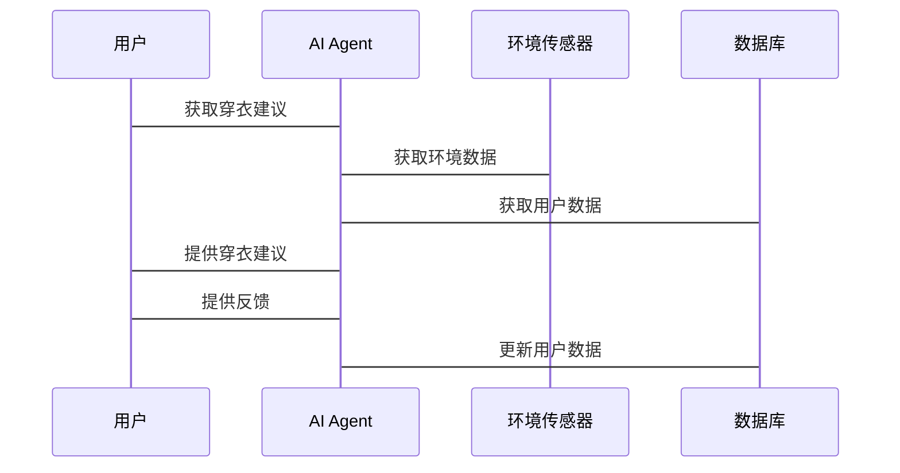

                 


# 智能衣帽架：AI Agent的穿衣温度建议

> 关键词：智能衣帽架，AI Agent，穿衣搭配，温度预测，个性化推荐

> 摘要：随着人工智能技术的快速发展，智能衣帽架逐渐成为现代生活中不可或缺的一部分。本文将深入探讨AI Agent在智能衣帽架中的应用，重点分析基于温度预测的穿衣建议系统。通过详细的技术分析和实际案例，本文将揭示如何利用AI技术实现智能化的穿衣搭配建议，从而为用户提供更高效、更个性化的穿衣体验。

---

# 第一部分: 智能衣帽架的背景与核心概念

## 第1章: 问题背景与用户需求分析

### 1.1 问题背景

#### 1.1.1 衣服搭配与温度的关系
在现代生活中，穿衣搭配不仅关乎时尚，更与实际的穿着环境密切相关。温度是决定穿衣选择的核心因素之一。例如，冬季需要保暖的衣物，夏季则需要透气轻薄的面料。然而，随着气候变化的复杂化，人们在穿衣选择上面临着更多的不确定性。

#### 1.1.2 智能化穿衣助手的必要性
传统的穿衣搭配依赖于经验和直觉，但这种方式难以满足现代人对高效、精准穿衣建议的需求。特别是在快节奏的生活中，人们需要一个能够快速提供合理建议的工具。智能衣帽架通过集成AI技术，能够实时分析环境数据并提供个性化的穿衣建议，从而帮助用户做出更明智的穿衣选择。

#### 1.1.3 温度对穿衣选择的影响
温度的变化直接影响穿衣的选择。例如，高温天气需要选择透气的面料和轻薄的衣物，低温天气则需要保暖的衣物和厚重的面料。通过实时温度预测，智能衣帽架可以为用户提供更具前瞻性的穿衣建议。

### 1.2 用户需求分析

#### 1.2.1 用户的穿衣习惯与偏好
不同用户有不同的穿衣习惯和偏好。例如，有些人喜欢舒适的穿衣风格，而有些人则追求时尚和个性化。了解用户的穿衣习惯和偏好是实现个性化推荐的基础。

#### 1.2.2 温度对用户穿衣决策的影响
温度是影响用户穿衣决策的重要因素。用户在选择衣物时，不仅会考虑当前的温度，还会参考未来一段时间的温度变化。因此，智能衣帽架需要能够实时获取温度数据并进行预测。

#### 1.2.3 用户对智能穿衣助手的功能需求
用户对智能穿衣助手的功能需求主要包括：
- 实时温度监测与预测
- 个性化穿衣建议
- 多场景穿衣推荐（如通勤、休闲、运动等）
- 历史数据记录与分析
- 用户偏好自定义功能

## 第2章: 技术背景与应用价值

### 2.1 AI Agent的基本概念

#### 2.1.1 AI Agent的定义与特点
AI Agent（人工智能代理）是一种能够感知环境、执行任务并做出决策的智能实体。AI Agent的核心特点包括：
- **自主性**：能够在没有外部干预的情况下自主运行。
- **反应性**：能够根据环境变化实时调整行为。
- **目标导向**：具有明确的目标，并能够采取行动以实现目标。
- **学习能力**：能够通过数据和经验不断优化自身的决策能力。

#### 2.1.2 AI Agent在智能衣帽架中的应用
在智能衣帽架中，AI Agent主要用于以下几个方面：
- **环境感知**：实时监测环境温度、湿度等数据。
- **数据处理**：分析用户的行为数据和环境数据，生成个性化的穿衣建议。
- **决策优化**：根据环境变化和用户偏好，优化穿衣建议，提升用户体验。

#### 2.1.3 AI Agent与传统穿衣建议系统的区别
与传统穿衣建议系统相比，AI Agent具有以下优势：
- **实时性**：能够实时获取环境数据并提供即时建议。
- **个性化**：通过分析用户数据，提供高度个性化的建议。
- **自适应性**：能够根据环境和用户行为的变化，动态调整建议内容。

### 2.2 温度预测与穿衣建议的核心技术

#### 2.2.1 温度预测的数学模型
温度预测是智能衣帽架的核心技术之一。常用的温度预测模型包括：
- **线性回归模型**：适用于温度变化趋势较为线性的场景。
- **神经网络模型**：适用于温度变化复杂、非线性特征明显的场景。
- **时间序列模型**：如ARIMA和LSTM，能够捕捉时间序列中的模式和趋势。

#### 2.2.2 穿衣建议的规则引擎
规则引擎是实现穿衣建议的核心模块。规则引擎通过预设的规则和逻辑，根据当前环境和用户数据生成建议。例如：
- **规则一**：如果当前温度低于5℃，建议穿羽绒服和保暖内衣。
- **规则二**：如果当前温度在20℃~25℃之间，建议穿长袖衬衫和薄外套。

#### 2.2.3 用户行为分析与个性化推荐
通过分析用户的穿衣记录、偏好和行为数据，系统可以生成个性化的穿衣建议。例如：
- **偏好分析**：用户喜欢的品牌、颜色和款式。
- **行为分析**：用户的穿衣习惯、搭配偏好和使用场景。
- **个性化推荐**：基于用户数据分析，推荐适合用户的衣物搭配方案。

## 第3章: 核心概念与系统架构

### 3.1 AI Agent在智能衣帽架中的角色

#### 3.1.1 AI Agent的功能模块划分
AI Agent在智能衣帽架中的功能模块主要包括：
- **环境感知模块**：实时监测环境温度、湿度等数据。
- **数据处理模块**：分析用户数据和环境数据，生成穿衣建议。
- **决策优化模块**：根据环境变化和用户反馈，优化穿衣建议。

#### 3.1.2 AI Agent与衣帽架硬件的交互
AI Agent通过与衣帽架硬件的交互，实现数据的采集和控制。例如：
- **硬件传感器**：采集环境数据（如温度、湿度）。
- **用户输入**：获取用户的穿衣偏好和历史数据。
- **系统反馈**：根据AI Agent的建议，用户选择衣物并反馈使用体验。

#### 3.1.3 AI Agent的数据处理流程
AI Agent的数据处理流程包括：
1. **数据采集**：获取环境数据和用户数据。
2. **数据预处理**：对数据进行清洗和标准化处理。
3. **数据分析**：利用机器学习算法分析数据，生成穿衣建议。
4. **建议生成**：根据分析结果生成个性化穿衣建议。
5. **反馈优化**：根据用户反馈优化建议生成算法。

### 3.2 温度预测模型

#### 3.2.1 温度预测模型的输入与输出
温度预测模型的输入包括：
- **历史温度数据**：过去一段时间的温度记录。
- **当前环境数据**：实时温度、湿度等。
- **天气预报数据**：未来一段时间的天气预报。

温度预测模型的输出包括：
- **当前温度预测值**。
- **未来一段时间的温度变化趋势**。

#### 3.2.2 常见的温度预测算法
常用的温度预测算法包括：
- **线性回归**：适用于温度变化趋势线性的场景。
- **神经网络**：适用于温度变化复杂、非线性特征明显的场景。
- **时间序列模型**：如ARIMA和LSTM，能够捕捉时间序列中的模式和趋势。

#### 3.2.3 温度预测模型的训练与优化
温度预测模型的训练与优化包括以下几个步骤：
1. **数据预处理**：对原始数据进行清洗和标准化处理。
2. **模型训练**：利用训练数据训练模型参数。
3. **模型评估**：通过验证集评估模型的性能。
4. **模型优化**：调整模型参数，提升预测精度。

### 3.3 穿衣建议生成机制

#### 3.3.1 穿衣建议的规则库设计
穿衣建议的规则库设计包括以下几个方面：
- **基本规则**：如根据温度推荐衣物类型。
- **个性化规则**：基于用户偏好生成个性化建议。
- **动态调整规则**：根据环境变化和用户反馈动态调整建议。

#### 3.3.2 基于用户数据的个性化推荐
基于用户数据的个性化推荐包括：
- **用户画像**：通过用户行为数据生成用户画像。
- **偏好分析**：分析用户的穿衣偏好和品牌偏好。
- **个性化推荐**：根据用户画像和偏好生成个性化穿衣建议。

#### 3.3.3 穿衣建议的动态调整机制
穿衣建议的动态调整机制包括：
- **实时反馈**：根据用户反馈实时调整建议。
- **环境变化**：根据环境变化动态调整建议。
- **历史数据分析**：基于历史数据优化建议生成算法。

---

# 第二部分: 算法原理与系统架构设计

## 第4章: 温度预测算法原理

### 4.1 温度预测的数学模型

#### 4.1.1 线性回归模型
线性回归模型是一种常用的温度预测模型。其数学表达式为：
$$ y = \beta_0 + \beta_1x + \epsilon $$
其中：
- $y$ 是预测温度。
- $x$ 是输入特征（如历史温度）。
- $\beta_0$ 和 $\beta_1$ 是模型参数。
- $\epsilon$ 是误差项。

#### 4.1.2 神经网络模型
神经网络模型是一种非线性回归模型，适用于复杂温度变化场景。其数学表达式为：
$$ y = f(Wx + b) $$
其中：
- $W$ 是权重矩阵。
- $b$ 是偏置向量。
- $f$ 是激活函数（如ReLU、sigmoid）。

#### 4.1.3 时间序列模型
时间序列模型（如LSTM）适用于时间依赖性较强的温度预测场景。其数学表达式为：
$$ y_t = LSTM(y_{t-1}, y_{t-2}, \dots, y_{t-n}) $$
其中：
- $y_t$ 是当前时间点的温度预测值。
- $y_{t-n}$ 是过去时间点的温度值。

### 4.2 温度预测算法的实现流程

#### 4.2.1 数据预处理
数据预处理包括以下几个步骤：
1. **数据清洗**：去除异常值和缺失值。
2. **数据标准化**：对数据进行归一化处理。
3. **数据分割**：将数据分为训练集、验证集和测试集。

#### 4.2.2 模型训练
模型训练包括以下几个步骤：
1. **选择算法**：根据场景选择合适的算法（如线性回归、神经网络、时间序列模型）。
2. **训练模型**：利用训练数据训练模型参数。
3. **评估模型**：通过验证集评估模型的性能。

#### 4.2.3 模型优化
模型优化包括以下几个步骤：
1. **调整参数**：如学习率、正则化参数等。
2. **交叉验证**：通过交叉验证优化模型。
3. **模型调优**：通过网格搜索等方法优化模型。

## 第5章: 穿衣建议生成算法

### 5.1 穿衣建议生成算法的实现流程

#### 5.1.1 数据采集与分析
数据采集与分析包括以下几个步骤：
1. **环境数据采集**：获取当前温度、湿度等数据。
2. **用户数据采集**：获取用户的穿衣偏好和历史数据。
3. **数据预处理**：对数据进行清洗和标准化处理。

#### 5.1.2 穿衣建议生成
穿衣建议生成包括以下几个步骤：
1. **温度预测**：利用温度预测模型预测当前和未来温度。
2. **规则匹配**：根据温度预测结果和用户数据生成穿衣建议。
3. **个性化调整**：根据用户偏好和历史数据优化建议。

#### 5.1.3 用户反馈与优化
用户反馈与优化包括以下几个步骤：
1. **用户反馈采集**：获取用户的反馈和建议。
2. **模型优化**：根据用户反馈优化建议生成算法。
3. **持续改进**：通过持续优化提升用户体验。

---

# 第三部分: 系统分析与架构设计

## 第6章: 系统分析与架构设计

### 6.1 系统功能设计

#### 6.1.1 领域模型设计
领域模型是系统功能设计的核心。领域模型包括以下几个模块：
- **环境感知模块**：实时监测环境数据。
- **数据处理模块**：分析用户数据和环境数据。
- **建议生成模块**：生成个性化穿衣建议。
- **用户反馈模块**：收集用户反馈并优化系统。

#### 6.1.2 系统功能模块划分
系统功能模块划分包括以下几个部分：
1. **环境感知模块**：采集环境数据。
2. **数据处理模块**：分析数据并生成建议。
3. **建议生成模块**：生成个性化穿衣建议。
4. **用户反馈模块**：收集用户反馈并优化系统。

### 6.2 系统架构设计

#### 6.2.1 系统架构图
以下是系统架构图的简要描述：


#### 6.2.2 接口设计
系统接口设计包括以下几个方面：
1. **环境数据接口**：与环境传感器交互，获取环境数据。
2. **用户数据接口**：与用户数据库交互，获取用户数据。
3. **建议生成接口**：生成个性化穿衣建议并返回给用户。
4. **反馈接口**：收集用户反馈并优化系统。

### 6.3 系统交互设计

#### 6.3.1 交互流程
以下是系统交互流程的简要描述：


---

# 第四部分: 项目实战

## 第7章: 项目实战

### 7.1 环境安装与配置

#### 7.1.1 系统环境
建议使用以下系统环境：
- **操作系统**：Linux/Windows/MacOS
- **编程语言**：Python
- **深度学习框架**：TensorFlow/PyTorch
- **其他工具**：Jupyter Notebook、Git

#### 7.1.2 安装依赖
安装必要的依赖库：
```bash
pip install numpy
pip install pandas
pip install scikit-learn
pip install tensorflow
```

### 7.2 核心实现

#### 7.2.1 温度预测模型实现
以下是温度预测模型的实现代码：
```python
import numpy as np
import pandas as pd
from sklearn.linear_model import LinearRegression
from sklearn.metrics import mean_squared_error

# 数据加载
data = pd.read_csv('temperature_data.csv')

# 数据预处理
X = data[['temperature_prev', 'humidity_prev']]
y = data['temperature_current']

# 模型训练
model = LinearRegression()
model.fit(X, y)

# 模型预测
y_pred = model.predict(X)
print('均方误差:', mean_squared_error(y, y_pred))
```

#### 7.2.2 穿衣建议生成实现
以下是穿衣建议生成模块的实现代码：
```python
import numpy as np
import pandas as pd
from sklearn.neural_network import MLPClassifier

# 数据加载
data = pd.read_csv('clothing_data.csv')

# 数据预处理
X = data[['temperature', 'user_preference']]
y = data['clothing_recommendation']

# 模型训练
model = MLPClassifier(hidden_layer_sizes=(10, 5))
model.fit(X, y)

# 模型预测
y_pred = model.predict(X)
print('预测结果:', y_pred)
```

### 7.3 案例分析与详细解读

#### 7.3.1 案例分析
假设当前温度为20℃，湿度为60%。根据温度预测模型，未来24小时内温度将保持在18℃~22℃之间。基于用户偏好（喜欢轻薄面料和浅色系），系统推荐以下穿衣方案：
- 上衣：短袖衬衫（浅蓝色）
- 下装：休闲裤（米白色）
- 鞋子：运动鞋（白色）

#### 7.3.2 代码实现解读
1. **数据加载与预处理**：
   - 加载环境数据和用户数据。
   - 对数据进行清洗和标准化处理。

2. **模型训练**：
   - 选择合适的算法（如线性回归或神经网络）。
   - 对模型进行训练并评估性能。

3. **模型预测**：
   - 根据当前环境数据和用户数据生成穿衣建议。
   - 返回预测结果并进行优化。

### 7.4 项目总结

#### 7.4.1 项目小结
通过本项目，我们实现了基于AI Agent的智能衣帽架穿衣温度建议系统。系统能够实时监测环境数据，分析用户数据，生成个性化的穿衣建议，并根据用户反馈不断优化建议生成算法。

#### 7.4.2 项目优化建议
1. **算法优化**：尝试不同的算法（如LSTM）以提高温度预测精度。
2. **功能扩展**：增加多场景穿衣建议（如运动、商务等）。
3. **用户体验优化**：优化用户界面，提升用户体验。

---

# 第五部分: 最佳实践与总结

## 第8章: 最佳实践与总结

### 8.1 最佳实践

#### 8.1.1 算法选择
选择合适的算法是项目成功的关键。建议根据具体场景选择合适的算法（如线性回归适用于温度变化趋势明显的场景，神经网络适用于复杂场景）。

#### 8.1.2 数据预处理
数据预处理是模型训练的基础。建议对数据进行清洗、标准化和分割，确保数据质量。

#### 8.1.3 模型优化
模型优化是提高系统性能的重要环节。建议通过交叉验证和网格搜索等方法优化模型参数。

### 8.2 项目总结

#### 8.2.1 项目小结
通过本项目，我们深入探讨了AI Agent在智能衣帽架中的应用，重点分析了基于温度预测的穿衣建议系统。通过详细的技术分析和实际案例，我们揭示了如何利用AI技术实现智能化的穿衣搭配建议。

#### 8.2.2 项目注意事项
- 数据隐私保护：确保用户数据的安全和隐私。
- 系统稳定性：确保系统在高并发场景下的稳定运行。
- 用户体验优化：持续优化用户界面和交互流程，提升用户体验。

### 8.3 项目展望

#### 8.3.1 未来发展方向
1. **算法优化**：研究更先进的温度预测算法（如深度学习模型）。
2. **功能扩展**：增加更多智能化功能（如衣物清洗建议、衣物搭配建议等）。
3. **多场景应用**：将智能衣帽架应用到更多场景（如家庭、办公室、健身房等）。

#### 8.3.2 拓展阅读
- 《机器学习实战》
- 《深度学习》
- 《人工智能: 一种现代的方法》

---

# 作者：AI天才研究院/AI Genius Institute & 禅与计算机程序设计艺术 /Zen And The Art of Computer Programming

