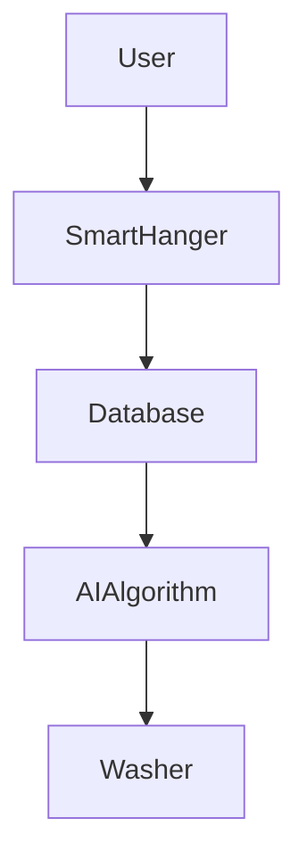
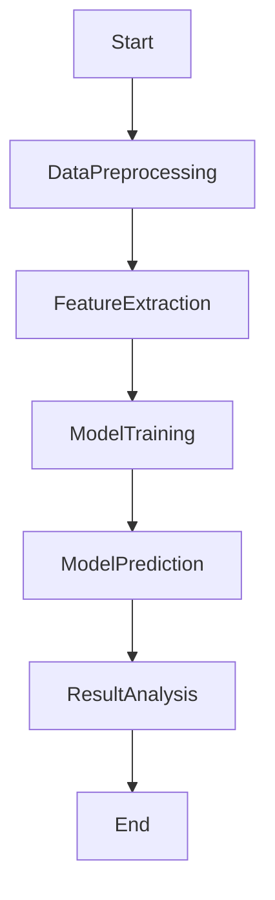
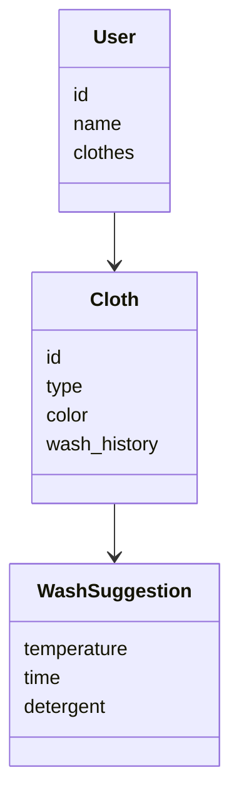
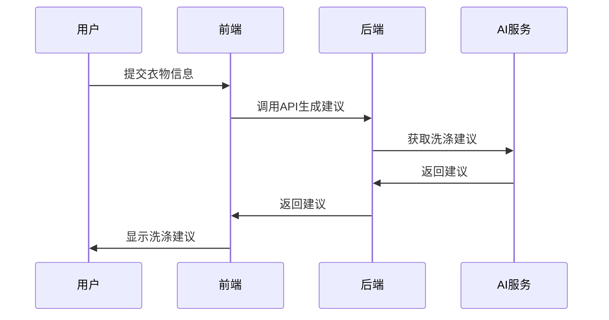

                 


# 《智能衣架：AI Agent的衣物保养专家系统》

> 关键词：智能衣架，AI Agent，衣物保养，系统架构，算法原理，项目实战

> 摘要：本文深入探讨了智能衣架系统的设计与实现，结合AI Agent技术，提出了一套智能化的衣物保养解决方案。通过分析衣物保养的核心问题，提出了一种基于AI的衣物管理方法，详细讲解了系统架构、算法原理和项目实现，为读者提供了从理论到实践的全面指导。

---

# 第一部分：背景与核心概念

## 第1章：智能衣架的背景与问题背景

### 1.1 问题背景
#### 1.1.1 衣物保养的痛点
- 衣物洗涤不当导致损坏。
- 忘记清洗时间，导致衣物发黄或有异味。
- 不同材质衣物的洗涤要求不同，用户难以掌握。

#### 1.1.2 智能衣架的提出
- 利用AI技术解决衣物保养问题。
- 提供智能化的洗涤建议和管理功能。

#### 1.1.3 人工智能在衣物保养中的应用潜力
- 基于历史数据推荐洗涤方式。
- 自动识别衣物材质和颜色。
- 实时监测环境条件（如温度、湿度）。

### 1.2 问题描述
#### 1.2.1 衣物保养的复杂性
- 不同材质的衣物需要不同的洗涤方式。
- 清洗时间的选择对衣物寿命影响很大。
- 洗涤剂的选择与衣物材质密切相关。

#### 1.2.2 用户需求与现有解决方案的差距
- 用户缺乏专业的衣物保养知识。
- 现有洗涤设备无法提供智能化的建议。
- 缺乏个性化的衣物管理方案。

#### 1.2.3 智能衣架的目标与边界
- 目标：提供智能化的衣物保养建议，延长衣物寿命。
- 边界：专注于衣物保养，不涉及其他家居设备。

### 1.3 问题解决
#### 1.3.1 AI Agent在衣物保养中的作用
- AI Agent通过学习用户习惯和衣物特性，提供个性化建议。
- 自动优化洗涤参数，确保衣物安全。

#### 1.3.2 智能衣架的核心功能
- 衣物识别与分类。
- 洗涤建议生成。
- 洗涤历史记录与分析。

#### 1.3.3 系统的可扩展性与可维护性
- 支持新增衣物材质和洗涤方式。
- 系统可升级，适应新的技术需求。

### 1.4 边界与外延
#### 1.4.1 智能衣架的功能范围
- 衣物识别、洗涤建议、记录与分析。
- 不包括衣物购买和存储管理。

#### 1.4.2 系统的边界
- 仅处理衣物保养相关问题。
- 不与其他家居设备直接交互。

#### 1.4.3 系统的外延与扩展方向
- 扩展至其他衣物相关服务，如搭配建议。
- 与其他家居设备（如洗衣机）集成。

#### 1.5 核心要素组成
- 用户数据：包括衣物信息、洗涤历史。
- 衣物信息：材质、颜色、品牌、洗涤标签。
- AI算法：分类、推荐、优化。
- 系统交互：用户输入、系统输出、设备连接。

---

## 第2章：智能衣架的核心概念与联系

### 2.1 核心概念原理
#### 2.1.1 AI Agent的定义与特点
- AI Agent：智能主体，能够感知环境并采取行动以实现目标。
- 特点：自主性、反应性、目标导向。

#### 2.1.2 衣物保养系统的原理
- 数据采集：用户输入衣物信息和洗涤需求。
- 数据处理：识别衣物材质、分析洗涤条件。
- 决策生成：基于AI算法推荐洗涤方案。
- 反馈优化：根据用户反馈优化建议。

#### 2.1.3 智能衣架的系统架构
- 用户端：手机APP或网页界面。
- 服务端：AI算法和数据存储。
- 设备端：智能衣架硬件。

### 2.2 核心概念对比
#### 2.2.1 AI Agent与传统衣物管理系统的对比
| 特性         | AI Agent             | 传统管理系统         |
|--------------|----------------------|--------------------|
| 智能性       | 高，能主动优化建议    | 低，依赖人工操作     |
| 个性化       | 强，基于用户数据     | 弱，通用化建议       |
| 扩展性       | 高，支持新增功能     | 低，功能固定         |

#### 2.2.2 衣物保养系统的核心要素对比
| 组件         | 功能                 | 示例                 |
|--------------|----------------------|----------------------|
| 用户数据     | 存储衣物信息         | 用户上传的衬衫材质   |
| AI算法       | 生成洗涤建议         | 推荐低温手洗         |
| 设备交互     | 连接洗衣机           | 触发洗涤程序         |

#### 2.2.3 系统功能对比表格
| 功能模块     | 智能衣架             | 传统洗衣机           |
|--------------|----------------------|----------------------|
| 洗涤建议     | 提供个性化建议       | 提供固定模式         |
| 数据分析     | 分析洗涤历史         | 无数据分析功能       |
| 用户交互     | 通过APP操作         | 通过按键操作         |

### 2.3 系统实体关系图


---

# 第3章：算法原理

## 3.1 算法原理概述
### 3.1.1 数据预处理
- 清洗数据：去除缺失值、异常值。
- 特征提取：从衣物材质、颜色等属性中提取特征。

### 3.1.2 模型选择
- 分类模型：用于判断衣物材质。
- 回归模型：用于预测最佳洗涤时间。

### 3.1.3 模型训练
- 使用历史洗涤数据训练分类模型。
- 通过机器学习优化建议生成。

### 3.1.4 模型预测
- 输入新衣物数据，生成洗涤建议。

### 3.1.5 模型优化
- 增加数据样本，提升模型泛化能力。
- 调整超参数，优化模型性能。

## 3.2 算法流程图


## 3.3 算法实现
### 3.3.1 Python代码实现
```python
import pandas as pd
from sklearn.tree import DecisionTreeClassifier

# 数据预处理
data = pd.read_csv('clothes_data.csv')
data.dropna(inplace=True)

# 特征提取
X = data[['fabric_type', 'color']]
y = data['recommended_wash']

# 模型训练
model = DecisionTreeClassifier()
model.fit(X, y)

# 模型预测
new_cloth = {'fabric_type': 'cotton', 'color': 'white'}
predicted_wash = model.predict([[new_cloth['fabric_type'], new_cloth['color']]])
print(predicted_wash)
```

### 3.3.2 算法数学模型
- 分类模型：决策树模型
  $$ P(y|x) = \frac{P(x|y)P(y)}{P(x)} $$
- 回归模型：线性回归
  $$ y = \beta_0 + \beta_1x + \epsilon $$

## 3.4 算法优化
### 3.4.1 参数调整
- 调整决策树的深度，防止过拟合。

### 3.4.2 模型评估
- 使用准确率、召回率等指标评估模型性能。

---

## 第4章：系统分析与架构设计

### 4.1 系统分析
#### 4.1.1 问题场景
- 用户上传衣物信息，系统生成洗涤建议。

#### 4.1.2 系统功能设计
- 用户界面：输入衣物信息，查看建议。
- 数据采集：记录洗涤历史。
- AI服务：生成洗涤建议。

### 4.2 系统架构设计
#### 4.2.1 领域模型


#### 4.2.2 系统架构


### 4.3 系统接口设计
#### 4.3.1 接口定义
- HTTP API：`POST /suggestions`，输入衣物信息，返回洗涤建议。

#### 4.3.2 接口实现
```python
@app.route('/suggestions', methods=['POST'])
def get_suggestions():
    data = request.json
    # 调用AI服务生成建议
    suggestion = ai_service.predict(data)
    return jsonify(suggestion)
```

### 4.4 系统交互流程图


---

## 第5章：项目实战

### 5.1 环境配置
#### 5.1.1 安装Python
- 安装Python 3.8及以上版本。
- 安装必要的库：`pandas`, `scikit-learn`, `flask`.

#### 5.1.2 安装TensorFlow
```bash
pip install tensorflow
```

### 5.2 核心代码实现
#### 5.2.1 数据预处理
```python
import pandas as pd

# 读取数据
data = pd.read_csv('clothes.csv')

# 删除缺失值
data.dropna(inplace=True)

# 提取特征
X = data[['fabric_type', 'color']]
y = data['recommended_wash']
```

#### 5.2.2 模型训练
```python
from sklearn.tree import DecisionTreeClassifier

model = DecisionTreeClassifier()
model.fit(X, y)
```

#### 5.2.3 模型预测
```python
new_cloth = {'fabric_type': 'cotton', 'color': 'white'}
predicted = model.predict([[new_cloth['fabric_type'], new_cloth['color']]])
print(predicted)
```

### 5.3 代码解读与分析
#### 5.3.1 数据预处理
- 清洗数据，确保数据质量。
- 特征提取，为模型提供输入。

#### 5.3.2 模型训练
- 使用决策树模型进行分类训练。
- 调整模型参数，优化性能。

#### 5.3.3 模型预测
- 输入新的衣物信息，生成洗涤建议。
- 输出结果，供用户参考。

### 5.4 案例分析
#### 5.4.1 案例背景
- 用户上传一件白色棉质衬衫。

#### 5.4.2 数据分析
- 材质：棉，颜色：白色。
- 推荐洗涤温度：30℃，时间：30分钟，使用中性洗涤剂。

#### 5.4.3 优化建议
- 根据洗涤历史调整建议，延长衣物寿命。

### 5.5 项目小结
- 成功实现智能衣架的核心功能。
- 系统具有良好的扩展性和维护性。

---

## 第6章：最佳实践

### 6.1 小结
- 智能衣架通过AI技术解决了衣物保养问题。
- 系统架构合理，功能完善。

### 6.2 注意事项
- 数据隐私保护，避免用户信息泄露。
- 模型优化，提升准确性和泛化能力。

### 6.3 拓展阅读
- 《机器学习实战》
- 《深入浅出人工智能》
- 《软件架构设计》

---

# 作者

作者：AI天才研究院/AI Genius Institute & 禅与计算机程序设计艺术 /Zen And The Art of Computer Programming

