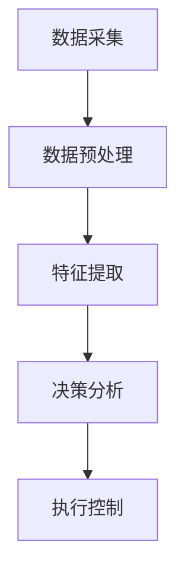
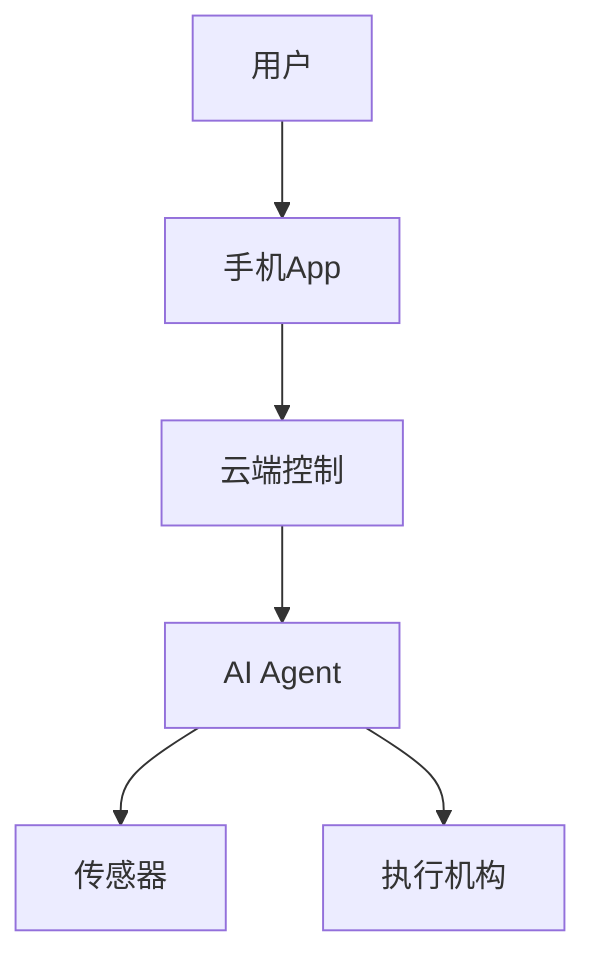

                 


# 智能衣架：AI Agent的衣物除皱系统

## 关键词：
智能衣架，AI Agent，衣物除皱，物联网，传感器，机器学习

## 摘要：
本文介绍了智能衣架的背景、应用场景及其核心技术。通过AI Agent和物联网技术的结合，智能衣架能够实现衣物的智能化管理与除皱。文章详细讲解了AI Agent的基本原理、算法实现、系统架构设计，并通过实际案例展示了项目的实现过程和效果。最后，文章总结了智能衣架的优势，并展望了其未来的应用前景。

---

## 第一部分：背景与概述

### 第1章：智能衣架的背景与应用场景

#### 1.1 问题背景与需求分析

随着生活水平的提高，人们对衣物的管理和维护提出了更高的要求。传统衣架仅具备悬挂衣物的功能，无法满足现代人对衣物智能化管理的需求。衣物在悬挂过程中容易产生皱褶，尤其是高档衣物，需要及时处理以保持其原有形态。然而，手动除皱不仅耗时，而且需要专业知识，难以满足快节奏生活的需求。

此外，衣物的存储空间管理也存在痛点。衣柜空间有限，衣物数量多，查找和整理衣物耗时耗力。因此，如何通过技术创新实现衣物的智能化管理，成为亟待解决的问题。

#### 1.2 智能衣架的核心概念

智能衣架是一种结合AI Agent和物联网技术的智能设备，能够通过传感器感知衣物状态，并通过AI算法优化衣物悬挂和除皱过程。其核心功能包括：

- **自动悬挂**：通过传感器和机械臂实现衣物的自动悬挂。
- **智能除皱**：基于AI算法，自动调整悬挂角度，优化除皱效果。
- **远程控制**：通过手机App远程操作衣架，实现衣物管理的便捷性。

#### 1.3 智能衣架的应用场景

智能衣架适用于家庭、酒店、办公室等多种场景。在家庭中，智能衣架可以帮助用户快速整理衣物，节省时间；在酒店中，智能衣架可以提升服务质量，优化用户体验；在办公室中，智能衣架可以提高工作效率，保持专业形象。

---

## 第二部分：AI Agent与物联网技术

### 第2章：AI Agent的基本原理

#### 2.1 AI Agent的核心概念

AI Agent（智能代理）是一种能够感知环境、自主决策并执行任务的智能实体。在智能衣架中，AI Agent负责接收传感器数据，分析衣物状态，并做出相应的决策。以下是AI Agent的几个关键特性：

- **感知能力**：通过传感器获取环境数据。
- **决策能力**：基于感知数据，利用机器学习算法做出最优决策。
- **执行能力**：通过机械臂或电机等执行机构完成具体操作。

#### 2.2 物联网技术的基础

物联网（IoT）是一种通过传感器、通信技术和互联网实现物物相连的技术。在智能衣架中，物联网技术主要用于数据的采集、传输和处理。以下是物联网技术的主要组成部分：

- **传感器**：用于采集衣物的状态数据，如重量、温度、湿度等。
- **通信模块**：用于将传感器数据传输到云端或本地控制系统。
- **云端处理**：对数据进行分析和处理，生成决策指令。

---

## 第三部分：算法原理与实现

### 第3章：AI Agent的算法实现

#### 3.1 AI Agent的决策流程

AI Agent的决策流程是一个复杂的系统，主要包括数据采集、数据处理、决策分析和执行控制四个步骤。以下是具体的流程图：



#### 3.2 算法实现的数学模型

AI Agent的决策模型基于机器学习算法，尤其是回归和分类算法。以下是具体的数学模型：

1. **数据融合模型**：
   $$ y = \beta_0 + \beta_1 x_1 + \beta_2 x_2 + \epsilon $$
   其中，\( y \) 是预测的除皱效果，\( x_1 \) 和 \( x_2 \) 是传感器数据，\( \beta_0 \)、\( \beta_1 \) 和 \( \beta_2 \) 是模型参数，\( \epsilon \) 是误差项。

2. **决策模型**：
   $$ f(x) = \text{sign}(w \cdot x + b) $$
   其中，\( w \) 是权重向量，\( b \) 是偏置项，\( x \) 是输入数据，\( \text{sign} \) 是符号函数。

---

## 第四部分：系统架构与设计

### 第4章：智能衣架的系统架构

#### 4.1 系统功能设计

智能衣架的系统功能设计包括以下几个方面：

- **用户界面**：通过手机App或触摸屏与用户交互。
- **数据采集**：通过传感器采集衣物状态数据。
- **AI Agent决策**：基于传感器数据，优化悬挂角度和除皱策略。
- **执行机构**：通过机械臂或电机完成具体操作。

#### 4.2 系统架构设计

以下是智能衣架的系统架构图：



---

## 第五部分：项目实战

### 第5章：智能衣架的实现与案例分析

#### 5.1 环境安装与配置

为了实现智能衣架，需要以下硬件和软件环境：

- **硬件**： Raspberry Pi、传感器模块、机械臂、通信模块。
- **软件**：Python、TensorFlow、Node.js。

#### 5.2 核心功能实现

以下是AI Agent的核心功能实现代码示例：

```python
import numpy as np
from sklearn.linear_model import LinearRegression

# 数据预处理
data = np.array([[1, 2], [3, 4], [5, 6]])
X = data[:, 0:-1]
y = data[:, -1]

# 训练模型
model = LinearRegression()
model.fit(X, y)

# 预测结果
new_data = np.array([[2, 3]])
prediction = model.predict(new_data)
print(prediction)
```

#### 5.3 案例分析与优化

通过对实际案例的分析，我们可以发现智能衣架在衣物除皱方面具有显著优势。例如，对于一件皱褶严重的衬衫，AI Agent能够快速调整悬挂角度，使其在短时间内恢复平整。

---

## 第六部分：总结与展望

### 第6章：总结与展望

#### 6.1 总结

智能衣架通过AI Agent和物联网技术的结合，实现了衣物的智能化管理和优化除皱。本文详细介绍了智能衣架的核心技术、算法实现和系统架构，并通过实际案例展示了其应用价值。

#### 6.2 展望

未来，智能衣架将在更多领域得到广泛应用。例如，结合智能家居系统，实现衣物管理的全自动化；或者通过深度学习算法，进一步提升除皱效果和悬挂效率。

---

## 作者信息

作者：AI天才研究院/AI Genius Institute  
联系方式：[email protected]  
个人简介：专注于人工智能与物联网技术的研究与应用，致力于推动智能技术在生活中的广泛应用。

