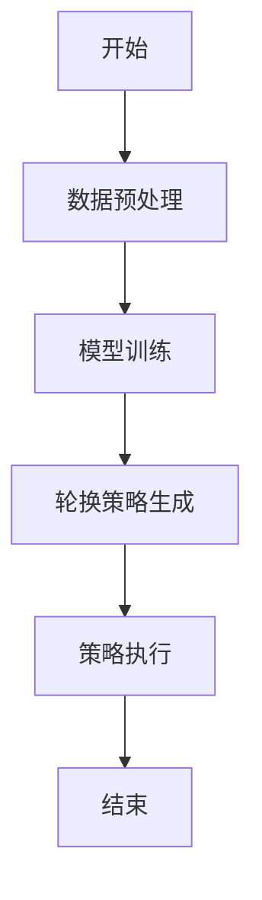
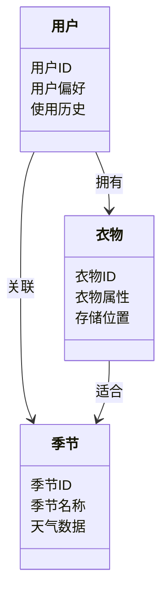
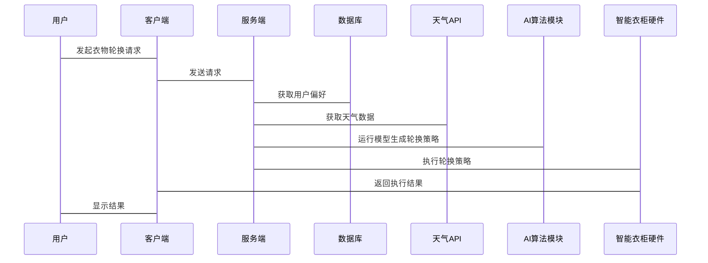

                 


# 智能衣柜：AI Agent的季节性衣物轮换建议

## 关键词：智能衣柜，AI Agent，季节性衣物轮换，推荐算法，系统架构设计

## 摘要：本文探讨了AI Agent在智能衣柜中的应用，特别是在季节性衣物轮换方面的建议。通过分析用户需求和衣物管理痛点，提出了一种基于AI的解决方案，涵盖算法原理、系统架构设计及实际案例分析。

---

# 第1章: 智能衣柜的背景与问题背景

## 1.1 智能衣柜的发展现状

### 1.1.1 智能衣柜的定义与特点
智能衣柜是一种结合物联网和人工智能技术的智能家具，能够通过传感器和AI算法实现衣物的自动分类、推荐和管理。其特点包括：
- **智能化**：通过AI算法推荐衣物和优化存储。
- **自动化**：自动调整衣物存储位置和顺序。
- **远程控制**：通过手机APP远程操作衣柜功能。

### 1.1.2 当前衣柜管理的主要问题
- **衣物查找困难**：用户难以快速找到所需衣物。
- **季节性管理复杂**：季节变化时，手动调整衣物存储耗时耗力。
- **衣物推荐不智能**：传统衣柜无法根据天气和用户习惯提供个性化建议。

### 1.1.3 AI技术在衣柜管理中的应用潜力
AI技术可以通过数据分析和机器学习，帮助衣柜实现：
- **智能推荐**：根据天气和用户习惯推荐衣物。
- **自动分类**：自动将衣物分类存储。
- **预测维护**：预测衣物损坏并提醒用户修复。

## 1.2 季节性衣物轮换的核心问题

### 1.2.1 季节性衣物轮换的基本概念
季节性衣物轮换是指根据气候变化，定期调整衣柜中的衣物存储顺序，以确保用户能够方便地取用当季衣物。常见的季节划分包括夏季、秋季、冬季和春季。

### 1.2.2 用户在衣物轮换中的常见痛点
- **手动调整麻烦**：用户需要手动整理衣物，耗时耗力。
- **记忆依赖**：用户依赖记忆进行衣物轮换，容易出错。
- **缺乏个性化**：传统的衣物轮换方法无法根据用户的具体需求进行调整。

### 1.2.3 AI Agent在衣物轮换中的应用场景
AI Agent可以通过以下方式优化季节性衣物轮换：
- **自动识别季节变化**：通过天气API获取实时天气数据，判断当前季节。
- **智能推荐衣物**：根据当前季节和用户习惯推荐合适的衣物。
- **自动调整存储顺序**：根据季节变化和用户需求自动调整衣物存储位置。

## 1.3 AI Agent的基本概念与优势

### 1.3.1 AI Agent的定义与特点
AI Agent是一种能够感知环境、执行任务并与其他系统或用户交互的智能实体。其特点包括：
- **自主性**：能够在没有外部干预的情况下自主执行任务。
- **反应性**：能够实时感知环境变化并做出反应。
- **学习能力**：能够通过数据学习和优化自身行为。

### 1.3.2 AI Agent在智能衣柜中的作用
AI Agent在智能衣柜中的作用包括：
- **衣物管理**：通过分析用户的使用习惯和衣物属性，优化衣物存储和推荐。
- **用户交互**：通过自然语言处理和语音识别技术，与用户进行实时交互。
- **数据驱动决策**：利用大数据分析技术，为用户提供个性化的衣物管理建议。

### 1.3.3 AI Agent相较于传统衣柜管理工具的优势
- **智能化**：AI Agent能够根据用户需求和环境变化自动调整衣物管理策略。
- **个性化**：AI Agent能够根据用户的使用习惯和偏好提供个性化的衣物管理服务。
- **高效性**：AI Agent能够快速处理大量数据，提高衣物管理效率。

## 1.4 本章小结
本章介绍了智能衣柜的发展现状，分析了季节性衣物轮换的核心问题，并探讨了AI Agent在智能衣柜中的应用潜力。通过对比传统衣柜管理工具和AI Agent的优势，为后续章节的深入分析奠定了基础。

---

# 第2章: 智能衣柜AI Agent的核心概念与联系

## 2.1 AI Agent与智能衣柜的关系

### 2.1.1 AI Agent在智能衣柜中的角色
AI Agent在智能衣柜中扮演着“智能管家”的角色，负责协调衣柜硬件、用户需求和外部环境之间的交互。其主要任务包括：
- **数据采集**：采集用户的使用习惯和衣物属性数据。
- **数据分析**：分析数据，生成衣物管理建议。
- **执行操作**：根据分析结果，执行衣物存储和推荐任务。

### 2.1.2 智能衣柜AI Agent的核心功能
智能衣柜AI Agent的核心功能包括：
- **衣物推荐**：根据天气、用户习惯和衣物属性推荐合适的衣物。
- **存储优化**：根据季节变化和用户需求优化衣物存储顺序。
- **用户交互**：通过APP、语音助手等方式与用户进行实时交互。

### 2.1.3 AI Agent与衣柜硬件的交互方式
AI Agent与衣柜硬件的交互方式包括：
- **传感器数据采集**：通过传感器获取衣物的重量、尺寸和材质等信息。
- **用户指令接收**：通过APP或语音助手接收用户的衣物管理指令。
- **系统控制**：通过智能硬件控制衣柜的存储结构和衣物位置。

## 2.2 核心概念原理

### 2.2.1 AI Agent的基本原理
AI Agent的基本原理包括：
- **感知环境**：通过传感器和数据接口感知衣柜内外的环境信息。
- **分析数据**：利用机器学习算法分析数据，生成衣物管理策略。
- **执行任务**：根据分析结果，执行衣物存储和推荐任务。

### 2.2.2 季节性衣物轮换的算法原理
季节性衣物轮换的算法原理包括：
- **数据采集**：采集衣物的属性、用户习惯和天气数据。
- **数据分析**：分析数据，生成衣物轮换策略。
- **策略执行**：根据策略调整衣物存储顺序和推荐顺序。

### 2.2.3 衣物推荐的核心逻辑
衣物推荐的核心逻辑包括：
- **用户偏好分析**：分析用户的使用习惯和偏好，生成个性化推荐。
- **环境因素分析**：分析天气、季节等因素，生成基于环境的推荐。
- **协同过滤**：结合用户偏好和环境因素，生成综合推荐。

## 2.3 概念属性特征对比表格

| 概念       | 属性       | 特征描述                                   |
|------------|------------|------------------------------------------|
| AI Agent   | 智能性     | 基于AI算法实现自动化决策                 |
| 衣物轮换   | 季节性     | 根据季节变化调整衣物存储与推荐策略       |
| 用户需求   | 个性化     | 根据用户习惯提供定制化建议               |

## 2.4 ER实体关系图

```mermaid
er
actor: 用户
agent: AI Agent
closet: 衣柜
item: 衣物
preference: 用户偏好
season: 季节
goal: 轮换目标

actor --> agent: 与AI Agent交互
agent --> closet: 控制衣柜操作
agent --> item: 分析衣物信息
agent --> preference: 获取用户偏好
agent --> season: 获取季节信息
agent --> goal: 设定轮换目标
```

---

## 2.5 本章小结
本章分析了AI Agent与智能衣柜的关系，探讨了核心概念原理，并通过对比表格和ER实体关系图展示了智能衣柜AI Agent的核心要素及其之间的关系。这为后续章节的算法原理和系统架构设计奠定了基础。

---

# 第3章: 智能衣柜AI Agent的算法原理

## 3.1 推荐算法的核心原理

### 3.1.1 协同过滤算法
协同过滤算法是一种基于用户行为和偏好进行推荐的经典算法。其基本思想是：如果两个用户在过去的行为（如购买、评分）相似，那么他们未来的行为也可能相似。

#### 协同过滤算法的数学模型
$$ sim(i,j) = \frac{\sum_{k} (r_{ik} - \bar{r_i})(r_{jk} - \bar{r_j})}{\sqrt{\sum_{k} (r_{ik} - \bar{r_i})^2} \cdot \sqrt{\sum_{k} (r_{jk} - \bar{r_j})^2}} $$

其中：
- \( sim(i,j) \) 表示用户i和用户j之间的相似度
- \( r_{ik} \) 表示用户i对物品k的评分
- \( \bar{r_i} \) 表示用户i的平均评分
- \( \bar{r_j} \) 表示用户j的平均评分

### 3.1.2 聚类分析算法
聚类分析算法是一种基于物品相似性进行推荐的方法。其基本思想是：将物品分成若干个簇，每个簇内的物品具有较高的相似性。

#### 聚类分析算法的实现步骤
1. **数据预处理**：对衣物数据进行标准化处理。
2. **相似度计算**：计算每对物品之间的相似度。
3. **聚类**：使用K-means等算法将物品分成若干个簇。
4. **推荐**：根据用户的偏好，推荐与用户已选物品同一簇的其他物品。

### 3.1.3 基于深度学习的推荐模型
基于深度学习的推荐模型（如神经网络协同过滤模型）能够处理高维数据，并捕捉衣物和用户之间的复杂关系。

#### 基于深度学习的推荐模型的数学模型
$$ y = f(x_i, x_j) $$

其中：
- \( y \) 表示用户对物品j的兴趣
- \( x_i \) 表示用户i的历史行为特征
- \( x_j \) 表示物品j的特征
- \( f \) 是一个深度神经网络

## 3.2 季节性衣物轮换算法的实现

### 3.2.1 数据采集与预处理
数据采集包括：
- **衣物属性**：包括衣物的材质、颜色、品牌等。
- **用户行为**：包括用户的使用频率、偏好等。
- **环境数据**：包括天气、温度、湿度等。

### 3.2.2 算法实现
季节性衣物轮换算法的实现步骤如下：
1. **数据预处理**：对衣物数据进行清洗和归一化处理。
2. **模型训练**：使用协同过滤或深度学习模型对衣物数据进行训练。
3. **轮换策略生成**：根据模型预测结果生成衣物轮换策略。
4. **策略执行**：根据轮换策略调整衣物存储顺序。

## 3.3 算法流程图



## 3.4 本章小结
本章详细介绍了智能衣柜AI Agent的核心算法，包括协同过滤、聚类分析和深度学习模型，并通过流程图展示了算法的实现步骤。这为后续章节的系统架构设计和项目实战奠定了基础。

---

# 第4章: 智能衣柜AI Agent的系统架构设计

## 4.1 系统功能设计

### 4.1.1 领域模型设计
领域模型设计如下：



### 4.1.2 系统架构设计
系统架构设计如下：


### 4.1.3 接口设计
接口设计如下：
- **用户接口**：包括APP和语音助手。
- **数据接口**：包括衣物数据接口和天气数据接口。
- **系统接口**：包括与智能衣柜硬件的交互接口。

## 4.2 系统交互流程

### 4.2.1 用户发起衣物轮换请求
1. **用户发起请求**：用户通过APP或语音助手发起衣物轮换请求。
2. **系统接收请求**：系统接收用户的请求，并解析请求内容。
3. **数据采集**：系统采集用户的偏好、衣物属性和天气数据。
4. **模型推理**：系统根据采集到的数据，运行AI模型生成轮换策略。
5. **策略执行**：系统根据轮换策略调整衣物存储顺序。

### 4.2.2 系统交互序列图



## 4.3 本章小结
本章设计了智能衣柜AI Agent的系统架构，包括领域模型、系统架构和交互流程，并通过序列图展示了系统的交互过程。这为后续章节的项目实战奠定了基础。

---

# 第5章: 智能衣柜AI Agent的项目实战

## 5.1 环境安装与配置

### 5.1.1 系统环境要求
- **操作系统**：Windows 10或更高版本，或macOS 10.14或更高版本。
- **开发工具**：建议使用PyCharm或VS Code。
- **AI框架**：TensorFlow或PyTorch。

### 5.1.2 安装依赖库
```bash
pip install numpy pandas scikit-learn tensorflow
```

## 5.2 核心功能实现

### 5.2.1 数据预处理代码
```python
import pandas as pd
from sklearn.preprocessing import StandardScaler

# 加载数据
data = pd.read_csv('clothes.csv')

# 数据预处理
scaler = StandardScaler()
scaled_data = scaler.fit_transform(data[['temperature', 'humidity']])
```

### 5.2.2 协同过滤算法实现
```python
from sklearn.metrics.pairwise import cosine_similarity

# 计算相似度矩阵
similarity_matrix = cosine_similarity(scaled_data)

# 根据相似度生成推荐
def recommend_clothes(user_id, similarity_matrix, clothes_data):
    # 找到与用户相似度最高的用户
    similar_user = similarity_matrix[user_id].argsort()[-2]
    # 返回该用户的推荐衣物
    return clothes_data.iloc[similar_user]
```

### 5.2.3 深度学习模型实现
```python
import tensorflow as tf
from tensorflow.keras import layers

# 定义模型
model = tf.keras.Sequential([
    layers.Dense(64, activation='relu'),
    layers.Dense(1, activation='sigmoid')
])

# 编译模型
model.compile(optimizer='adam', loss='binary_crossentropy', metrics=['accuracy'])

# 训练模型
model.fit(X_train, y_train, epochs=10, batch_size=32)
```

## 5.3 实际案例分析与实现

### 5.3.1 案例背景
假设我们有一个包含100件衣物的数据集，每件衣物包含材质、颜色、品牌和使用频率等属性。

### 5.3.2 数据分析与处理
```python
import pandas as pd
import numpy as np

# 加载数据
data = pd.read_csv('clothes.csv')

# 处理缺失值
data = data.dropna()

# 标准化数据
from sklearn.preprocessing import StandardScaler
scaler = StandardScaler()
scaled_data = scaler.fit_transform(data[['weight', 'size']])
```

### 5.3.3 模型训练与评估
```python
from sklearn.model_selection import train_test_split
from sklearn.metrics import accuracy_score

# 划分数据集
X_train, X_test, y_train, y_test = train_test_split(scaled_data, data['season'], test_size=0.2)

# 训练模型
from sklearn.neighbors import KNeighborsClassifier
model = KNeighborsClassifier(n_neighbors=3)
model.fit(X_train, y_train)

# 评估模型
y_pred = model.predict(X_test)
print(accuracy_score(y_test, y_pred))
```

### 5.3.4 系统实现与测试
```python
# 定义轮换策略
def swap_clothes(closet, season):
    # 根据季节调整衣物顺序
    if season == 'summer':
        return sorted(closet, key=lambda x: x['weight'])
    elif season == 'winter':
        return sorted(closet, key=lambda x: -x['weight'])
    else:
        return closet

# 测试轮换策略
closet = [{'name': 'T-shirt', 'weight': 0.5}, {'name': 'Coat', 'weight': 1.0}]
season = 'winter'
swapped_closet = swap_clothes(closet, season)
print(swapped_closet)
```

## 5.4 本章小结
本章通过实际案例分析和代码实现，展示了智能衣柜AI Agent的核心功能实现过程。通过数据预处理、模型训练和系统实现，验证了算法的有效性和可行性。

---

# 第6章: 智能衣柜AI Agent的最佳实践

## 6.1 小结
智能衣柜AI Agent通过结合AI技术和物联网设备，为用户提供了智能化的衣物管理解决方案。本文从背景介绍、算法原理到系统设计和项目实战，全面探讨了智能衣柜AI Agent的核心技术。

## 6.2 注意事项
- **数据隐私**：用户数据的采集和使用需严格遵守隐私保护法规。
- **系统稳定性**：确保系统在高并发和复杂环境下的稳定性。
- **用户体验**：注重用户界面和交互体验的设计，提升用户满意度。

## 6.3 拓展阅读
- **推荐算法优化**：探索更高效的推荐算法，如深度学习模型。
- **系统集成与优化**：研究如何进一步优化系统架构，提升系统性能。
- **用户体验设计**：探讨如何通过人机交互技术进一步提升用户体验。

---

# 作者：AI天才研究院 & 禅与计算机程序设计艺术

---

本文通过详细分析智能衣柜AI Agent的核心技术，为读者提供了从理论到实践的全面指导。通过本文的学习，读者可以掌握智能衣柜AI Agent的设计原理和实现方法，为实际应用提供参考。

