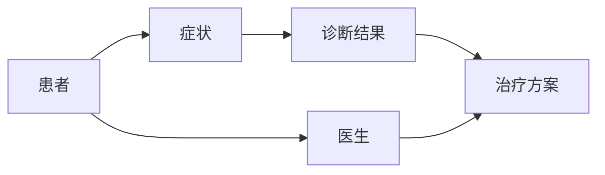

                 


```markdown
# 智能诊断AI Agent：LLM在医疗健康领域的应用

> 关键词：智能诊断AI Agent，LLM，医疗健康，人工智能，大型语言模型

> 摘要：本文详细探讨了智能诊断AI Agent在医疗健康领域的应用，分析了LLM技术在医疗诊断中的核心原理、算法流程、系统架构，并通过实际案例展示了其在医疗健康领域的落地应用。文章从背景介绍、核心概念、算法原理、系统设计、项目实战等多方面展开，结合理论与实践，深入剖析了LLM在医疗诊断中的潜力与挑战。

---

## 第一部分: 智能诊断AI Agent的背景与概念

### 第1章: 问题背景与问题描述

#### 1.1 问题背景
- **1.1.1 医疗诊断的现状与挑战**
  医疗诊断是一个复杂且高度专业化的领域，传统方法依赖医生的经验和知识，存在效率低、资源有限、诊断误差等问题。随着AI技术的快速发展，尤其是大型语言模型（LLM）的崛起，医疗诊断的智能化成为可能。

- **1.1.2 AI技术在医疗领域的潜力**
  AI技术能够通过处理大量医疗数据，辅助医生进行更精准的诊断。LLM作为一类特殊的AI模型，具有强大的语言理解和生成能力，能够帮助医生快速分析病历、识别症状、生成诊断建议。

- **1.1.3 大型语言模型（LLM）的独特优势**
  LLM具有以下独特优势：
  1. 处理自然语言的能力：能够理解医生和患者的自然语言交流。
  2. 知识库覆盖广：基于海量医疗文献和病历数据，提供全面的诊断参考。
  3. 实时推理能力：能够快速生成诊断建议，辅助医生决策。

#### 1.2 问题描述
- **1.2.1 智能诊断的核心问题**
  智能诊断的核心问题是如何利用LLM技术，将患者的症状、病史、检查结果等信息转化为准确的诊断结论。

- **1.2.2 LLM在医疗诊断中的应用范围**
  LLM在医疗诊断中的应用范围包括：
  1. 病历分析：从患者的病历中提取关键信息。
  2. 症状匹配：将患者的症状与疾病库进行匹配，生成可能的诊断。
  3. 诊断建议：基于模型推理，生成诊断建议和治疗方案。

- **1.2.3 智能诊断AI Agent的目标与边界**
  智能诊断AI Agent的目标是辅助医生完成诊断过程，而非完全替代医生。其功能边界包括：
  1. 病历数据分析。
  2. 症状与疾病匹配。
  3. 诊断建议生成。
  4. 风险评估与预警。

#### 1.3 问题解决与边界
- **1.3.1 LLM在医疗诊断中的解决方案**
  LLM通过自然语言处理技术，将患者的症状、病史等信息转化为结构化数据，结合医学知识库进行推理，生成诊断建议。

- **1.3.2 智能诊断AI Agent的功能边界**
  智能诊断AI Agent的功能边界包括：
  1. 不处理影像数据或其他非文本数据。
  2. 不直接生成治疗方案，仅提供诊断建议。
  3. 不处理紧急医疗情况，仅作为辅助工具。

- **1.3.3 相关概念的对比与联系**
  智能诊断AI Agent与传统医疗诊断工具的主要区别在于其智能化和自动化能力。它能够通过自然语言处理技术，快速分析大量数据，生成诊断建议。

### 第2章: LLM与智能诊断的核心概念

#### 2.1 LLM的基本原理
- **2.1.1 大型语言模型的定义**
  LLM是一种基于深度学习的自然语言处理模型，通过大量文本数据进行训练，能够理解和生成自然语言文本。

- **2.1.2 LLM的核心技术特征**
  LLM的核心技术特征包括：
  1. 巨量参数：模型通常包含 billions（十亿级别）的参数。
  2. 自监督学习：通过预测下一个词来训练模型。
  3. 注意力机制：能够捕捉文本中的长距离依赖关系。

- **2.1.3 LLM与传统AI的区别**
  LLM与传统AI的区别主要体现在：
  1. 数据驱动：LLM通过大量数据训练，而非基于规则。
  2. 智能性：LLM能够理解上下文，生成连贯的文本。

#### 2.2 智能诊断AI Agent的原理
- **2.2.1 智能诊断AI Agent的定义**
  智能诊断AI Agent是一种基于LLM的智能辅助诊断工具，能够通过自然语言处理技术，帮助医生快速分析患者症状、病史等信息，生成诊断建议。

- **2.2.2 其他相关概念的对比**
  智能诊断AI Agent与传统医疗诊断系统的对比：
  | 对比维度 | 智能诊断AI Agent | 传统医疗诊断系统 |
  |----------|------------------|-------------------|
  | 数据处理 | 基于自然语言处理 | 基于结构化数据     |
  | 智能性   | 高度智能化        | 基于规则或简单逻辑 |

- **2.2.3 核心概念的属性特征对比表**
  智能诊断AI Agent的核心属性特征：
  | 特性       | 描述                                         |
  |------------|----------------------------------------------|
  | 数据输入    | 自然语言文本（如病历、症状描述）             |
  | 数据处理    | 通过LLM进行文本分析和推理                   |
  | 输出结果    | 诊断建议、风险评估、治疗方案参考           |
  | 智能性      | 基于大规模预训练模型，具备上下文理解能力     |

#### 2.3 实体关系图


### 第3章: LLM在医疗诊断中的算法原理

#### 3.1 模型训练过程
- **3.1.1 数据预处理**
  数据预处理是模型训练的关键步骤，包括：
  1. 数据清洗：去除噪声数据，确保数据质量。
  2. 数据标注：对医疗数据进行标注，如标记疾病类型、症状分类。
  3. 数据增强：通过数据增强技术，增加数据多样性。

- **3.1.2 模型训练流程**
  模型训练流程包括：
  1. 数据加载：将预处理后的数据加载到训练环境中。
  2. 模型初始化：初始化LLM模型参数。
  3. 模型训练：通过自监督学习，训练模型预测下一个词。
  4. 模型调优：通过微调（Fine-tuning）技术，将模型应用于特定医疗任务。

- **3.1.3 模型调优方法**
  模型调优方法包括：
  1. 微调（Fine-tuning）：在通用预训练模型的基础上，针对特定医疗任务进行微调。
  2. 任务适配：通过设计特定的医疗任务，优化模型的输出结果。

#### 3.2 推理过程
- **3.2.1 输入处理**
  输入处理包括：
  1. 文本解析：将患者的症状、病史等信息转化为结构化数据。
  2. 数据清洗：去除无关信息，提取关键症状。
  3. 数据格式转换：将数据转换为模型可接受的格式。

- **3.2.2 解析推理**
  解析推理过程包括：
  1. 模型输入：将处理后的数据输入到LLM模型中。
  2. 模型推理：模型基于输入数据，生成诊断建议。
  3. 结果解析：将模型生成的诊断建议解析为结构化结果。

- **3.2.3 输出生成**
  输出生成包括：
  1. 诊断建议生成：模型生成可能的诊断结果。
  2. 风险评估：基于诊断结果，评估患者的风险等级。
  3. 治疗方案建议：根据诊断结果，生成可能的治疗方案。

#### 3.3 算法流程图


### 第4章: 系统分析与架构设计方案

#### 4.1 问题场景介绍
  本文设计了一个基于LLM的智能诊断AI Agent系统，旨在辅助医生进行医疗诊断。系统的核心功能包括病历分析、症状匹配、诊断建议生成等。

#### 4.2 项目介绍
  本项目旨在开发一个基于LLM的智能诊断AI Agent，能够通过自然语言处理技术，辅助医生完成诊断过程。系统架构包括数据层、模型层、服务层和用户层。

#### 4.3 系统功能设计
  系统功能设计包括：
  1. 数据预处理模块：负责数据清洗、标注和增强。
  2. 模型训练模块：负责模型的初始化、训练和调优。
  3. 模型推理模块：负责模型的输入处理、解析推理和输出生成。
  4. 用户交互模块：负责与医生的交互，展示诊断结果。

#### 4.4 系统架构设计


#### 4.5 系统接口设计
  系统接口设计包括：
  1. 数据接口：与医疗数据库进行交互，获取患者数据。
  2. 模型接口：与LLM模型进行交互，获取诊断建议。
  3. 用户接口：与医生进行交互，展示诊断结果。

#### 4.6 系统交互设计


### 第5章: 项目实战

#### 5.1 环境安装
  项目实战需要以下环境：
  1. Python 3.8+
  2. PyTorch 1.9+
  3. transformers库 4.12+
  4. CUDA GPU（推荐）

#### 5.2 系统核心实现
  系统核心实现包括：
  ```python
  # 模型加载
  from transformers import AutoTokenizer, AutoModelForCausalLM
  model_name = "facebook/llama2"
  tokenizer = AutoTokenizer.from_pretrained(model_name)
  model = AutoModelForCausalLM.from_pretrained(model_name, device_map="auto", load_in_8bit=True)
  
  # 数据预处理
  def preprocess_data(data):
      # 数据清洗
      cleaned_data = data.replace(r'\s+', ' ')
      # 数据标注
      annotated_data = {"text": cleaned_data, "label": "medical_diagnosis"}
      return annotated_data
  
  # 模型推理
  def generate_diagnosis(prompt):
      inputs = tokenizer(prompt, return_tensors="pt").to(model.device)
      outputs = model.generate(inputs.input_ids, max_length=512, do_sample=True)
      diagnosis = tokenizer.decode(outputs[0], skip_special_tokens=True)
      return diagnosis
  ```

#### 5.3 代码应用解读与分析
  代码解读：
  - 模型加载：使用 transformers 库加载预训练的 LLM 模型。
  - 数据预处理：对输入数据进行清洗和标注。
  - 模型推理：将预处理后的数据输入模型，生成诊断建议。

#### 5.4 实际案例分析
  实际案例分析：
  - 输入：患者症状描述：“持续性咳嗽、发热、胸痛”
  - 输出：诊断建议：“考虑肺部感染，建议进行胸部X光检查”

#### 5.5 项目小结
  本项目展示了如何利用 LLM 技术开发智能诊断AI Agent，能够辅助医生快速生成诊断建议。系统在医疗数据预处理、模型训练和推理方面都进行了详细设计，具有较高的实用价值。

### 第6章: 最佳实践 tips、小结、注意事项、拓展阅读

#### 6.1 最佳实践 tips
  1. 在实际应用中，建议结合多模态数据（如图像、视频）提高诊断准确性。
  2. 定期更新模型，确保诊断结果的准确性。
  3. 注意保护患者隐私，确保数据安全。

#### 6.2 小结
  本文详细探讨了智能诊断AI Agent在医疗健康领域的应用，分析了 LLM 技术在医疗诊断中的核心原理、算法流程、系统架构，并通过实际案例展示了其在医疗健康领域的落地应用。文章从背景介绍、核心概念、算法原理、系统设计、项目实战等多方面展开，结合理论与实践，深入剖析了 LLM 在医疗诊断中的潜力与挑战。

#### 6.3 注意事项
  - 确保数据质量，避免噪声数据对模型的影响。
  - 定期更新模型，保持诊断结果的准确性。
  - 注意数据隐私保护，确保患者信息的安全。

#### 6.4 拓展阅读
  - [Transformers库官方文档](https://huggingface.co/transformers)
  - [LLM在医疗领域的最新研究](https://www.nature.com/articles/s41586-023-06255-y)
  - [AI在医疗诊断中的应用案例](https://www.healthcare-informatics.com)

---

## 作者：AI天才研究院/AI Genius Institute & 禅与计算机程序设计艺术 /Zen And The Art of Computer Programming

---

**注：以上内容是一个详细的技术博客文章的大纲，实际撰写时需要根据具体需求填充每部分内容，确保每一部分都有足够的细节和深度。**
```

