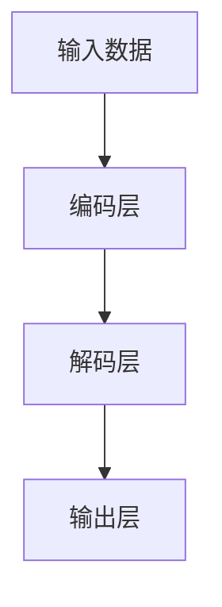
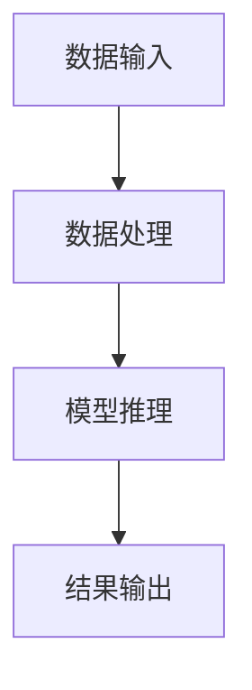

                 


# 智能财务分析 AI Agent：LLM 在企业财务管理中的应用

## 关键词：
- 智能财务分析
- AI Agent
- 大语言模型（LLM）
- 企业财务管理
- 数字化转型

## 摘要：
随着人工智能技术的快速发展，大语言模型（LLM）在企业财务管理中的应用日益广泛。本文将探讨LLM如何赋能智能财务分析AI Agent，为企业财务管理带来革命性的变化。通过分析LLM的技术原理、系统架构及实际应用案例，本文旨在为企业提供一种高效、智能的财务管理解决方案，助力企业在数字化转型中抢占先机。

---

# 第一部分: 背景与概述

## 第1章: 智能财务分析与AI Agent的背景

### 1.1 财务管理的数字化转型
#### 1.1.1 传统财务管理的局限性
传统财务管理依赖人工操作，存在效率低下、数据分散、分析深度不足等问题，难以满足现代企业的复杂需求。

#### 1.1.2 数字化转型的驱动力
企业面临日益复杂的市场环境和数据爆炸式增长的挑战，数字化转型成为必然选择，而AI技术是推动这一转型的核心力量。

#### 1.1.3 AI在财务管理中的潜力
AI技术能够显著提升财务管理的效率和准确性，通过自动化处理、智能分析和实时监控，为企业提供更高效的决策支持。

### 1.2 大语言模型（LLM）的崛起
#### 1.2.1 LLM的定义与特点
大语言模型是一种基于深度学习的自然语言处理模型，具有强大的文本理解和生成能力，能够处理复杂语言任务。

#### 1.2.2 LLM在企业中的应用趋势
LLM正在广泛应用于信息抽取、文本生成、对话交互等领域，尤其是在需要处理大量文本数据的财务管理中展现出巨大潜力。

#### 1.2.3 LLM与财务管理的结合
通过LLM技术，企业可以实现财务报告的智能生成、数据分析的自动化以及财务决策的智能化。

### 1.3 智能财务分析AI Agent的概念
#### 1.3.1 AI Agent的基本定义
AI Agent是一种能够感知环境、执行任务并提供智能服务的软件实体，能够在特定场景下替代或辅助人类完成复杂任务。

#### 1.3.2 智能财务分析AI Agent的核心功能
智能财务分析AI Agent能够自动化处理财务数据、生成财务报告、进行风险评估，并提供实时的财务洞察。

#### 1.3.3 智能财务分析AI Agent的应用场景
在企业财务报表分析、预算管理、成本控制、风险评估等领域，AI Agent都能发挥重要作用。

---

## 第2章: LLM在企业财务管理中的应用前景

### 2.1 财务报告分析
#### 2.1.1 自动化财务报告生成
LLM能够根据输入的财务数据自动生成结构化报告，显著提高工作效率。

#### 2.1.2 财务数据的自动提取与分析
通过自然语言处理技术，LLM可以从非结构化数据中提取关键财务信息并进行分析。

#### 2.1.3 财务报告的智能摘要与洞察
LLM可以生成财务报告的智能摘要，并提供深层次的财务洞察，帮助管理层做出明智决策。

### 2.2 财务预测与决策支持
#### 2.2.1 财务预测模型的构建
基于历史数据和市场趋势，LLM能够帮助构建高精度的财务预测模型。

#### 2.2.2 基于LLM的决策支持系统
通过分析财务数据和市场信息，LLM为管理层提供实时的决策支持。

#### 2.2.3 财务风险评估与预警
LLM能够实时监控财务数据，识别潜在风险并提供预警，帮助企业避免财务危机。

### 2.3 财务流程优化
#### 2.3.1 自动化账单处理
LLM可以自动化处理和分类账单，减少人工干预，提高处理效率。

#### 2.3.2 智能报销与审批流程
通过自动化审核和审批流程，LLM能够显著简化报销和审批过程。

#### 2.3.3 财务数据的实时监控
LLM可以实时监控财务数据，提供实时的财务洞察和异常检测。

### 2.4 本章小结
#### 2.4.1 LLM在财务管理中的核心价值
LLM能够显著提升财务管理的效率和准确性，为企业提供智能化的决策支持。

#### 2.4.2 未来发展趋势
随着技术的不断进步，LLM在财务管理中的应用将更加广泛和深入，为企业创造更大的价值。

---

# 第二部分: 技术原理与算法解析

## 第3章: LLM的核心技术原理

### 3.1 大语言模型的结构与训练
#### 3.1.1 模型架构（使用 Mermaid 图展示模型结构）


#### 3.1.2 模型训练方法
大语言模型通常采用监督学习和无监督学习相结合的方式进行训练，通过大量的语料库数据优化模型参数。

#### 3.1.3 模型的数学基础
大语言模型的训练过程涉及复杂的数学计算，包括矩阵乘法、概率论和优化算法等。

### 3.2 LLM在财务分析中的应用原理
#### 3.2.1 自然语言处理（NLP）技术
NLP技术能够理解并生成自然语言文本，使LLM能够处理财务报告、账单等文本数据。

#### 3.2.2 文本生成与数据提取
通过LLM的文本生成能力，可以自动生成财务报告并提取关键数据。

#### 3.2.3 基于LLM的问答系统
LLM可以构建智能问答系统，回答与财务管理相关的问题，提供实时的财务支持。

### 3.3 LLM的数学模型与公式
#### 3.3.1 概率分布
$$ P(\text{next token} | \text{current tokens}) $$

#### 3.3.2 损失函数
$$ \text{Loss} = -\sum_{i=1}^{n} \log P(y_i | x_i) $$

#### 3.3.3 优化算法
常用的优化算法包括Adam、SGD等，用于最小化损失函数并优化模型参数。

---

## 第4章: 系统架构与算法实现

### 4.1 系统架构设计
#### 4.1.1 系统功能模块
- 数据输入模块
- 数据处理模块
- 模型推理模块
- 结果输出模块

#### 4.1.2 系统架构图（使用 Mermaid 图展示）


### 4.2 算法实现细节
#### 4.2.1 数据预处理
对输入的财务数据进行清洗、标准化和格式化处理。

#### 4.2.2 模型训练
基于预处理后的数据，训练大语言模型并优化模型参数。

#### 4.2.3 推理与输出
通过模型推理生成财务分析结果并输出。

### 4.3 代码实现
```python
import torch
import torch.nn as nn

class LLMModel(nn.Module):
    def __init__(self, input_size, hidden_size, output_size):
        super(LLMModel, self).__init__()
        self.encoder = nn.Linear(input_size, hidden_size)
        self.decoder = nn.Linear(hidden_size, output_size)
    
    def forward(self, x):
        encoded = self.encoder(x)
        output = self.decoder(encoded)
        return output

# 示例数据
input_data = torch.randn(100, input_size)
model = LLMModel(input_size, hidden_size, output_size)
output = model(input_data)
print(output)
```

---

## 第5章: 项目实战与案例分析

### 5.1 项目环境配置
#### 5.1.1 安装必要的库
```bash
pip install torch transformers
```

#### 5.1.2 数据准备
收集并整理企业财务数据，包括财务报表、账单、市场分析报告等。

### 5.2 系统实现
#### 5.2.1 数据输入模块
读取财务数据并进行预处理。

#### 5.2.2 模型推理
加载预训练的LLM模型并进行推理。

#### 5.2.3 结果输出
将推理结果输出为财务报告或预警信息。

### 5.3 案例分析
#### 5.3.1 财务报告生成
基于输入的财务数据，自动生成财务报告并提取关键指标。

#### 5.3.2 风险评估与预警
通过模型推理识别潜在的财务风险并提供预警。

---

## 第6章: 优化与维护

### 6.1 模型优化策略
#### 6.1.1 参数调优
通过调整学习率、批量大小等参数优化模型性能。

#### 6.1.2 数据增强
通过增加多样化的数据提升模型的泛化能力。

### 6.2 数据安全与隐私保护
在处理财务数据时，必须确保数据的安全性和隐私性，避免数据泄露风险。

### 6.3 模型维护与更新
定期更新模型参数，保持模型的准确性和适应性。

---

## 第7章: 总结与展望

### 7.1 全文总结
本文详细探讨了LLM在企业财务管理中的应用，从技术原理到实际应用，全面展示了智能财务分析AI Agent的潜力和价值。

### 7.2 未来展望
随着技术的进步，LLM在财务管理中的应用将更加广泛和深入，为企业创造更大的价值。

---

# 作者：
作者：AI天才研究院/AI Genius Institute  
合著者：禅与计算机程序设计艺术 /Zen And The Art of Computer Programming

