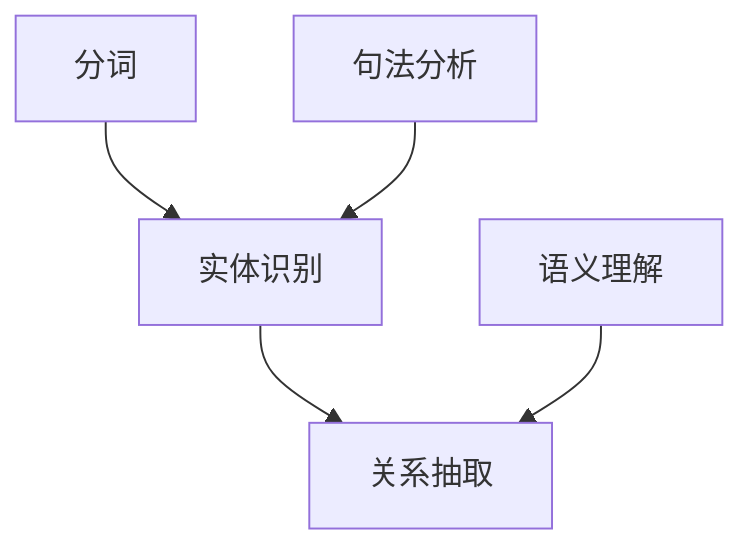
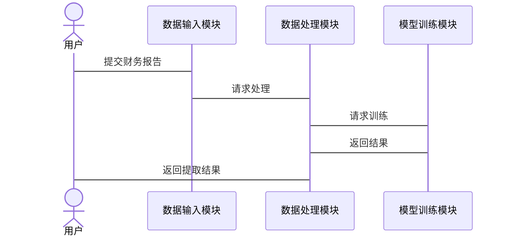

                 


# 智能财务报告关键信息提取工具

> 关键词：智能财务报告，信息提取，自然语言处理，机器学习，深度学习

> 摘要：本文深入探讨智能财务报告关键信息提取工具的设计与实现，结合自然语言处理与机器学习技术，系统性地分析了财务报告信息提取的核心原理、算法实现、系统架构以及实际应用案例，旨在为企业提供高效、准确的财务信息处理解决方案。

---

# 第一部分: 智能财务报告关键信息提取工具的背景与核心概念

## 第1章: 财务报告关键信息提取的背景与问题

### 1.1 问题背景

#### 1.1.1 财务报告的重要性
财务报告是企业经济活动的核心记录，包含了企业的财务状况、经营成果和现金流量等关键信息。传统的财务报告处理方式依赖人工阅读和分析，效率低下且容易出错。随着企业规模的扩大和数据量的增加，如何高效提取关键信息成为亟待解决的问题。

#### 1.1.2 传统财务信息处理的痛点
- **人工处理效率低**：财务报告内容繁多，人工提取信息耗时长且易出错。
- **信息提取不准确**：财务数据的复杂性和专业性使得人工提取难以保证准确性。
- **数据标准化问题**：不同企业、不同报告格式的差异导致信息提取难度增加。

#### 1.1.3 智能化信息提取的必要性
智能化信息提取工具可以显著提高财务数据处理的效率和准确性，为企业决策提供实时、可靠的依据。通过自然语言处理（NLP）和机器学习技术，可以实现对财务报告中关键信息的自动化提取。

---

### 1.2 问题描述

#### 1.2.1 财务报告信息提取的目标
- 提取财务数据（如收入、利润、成本等）。
- 提取公司业绩信息（如增长趋势、财务比率等）。
- 提取行业背景和市场分析等辅助信息。

#### 1.2.2 关键信息提取的范围界定
- **财务数据**：收入、利润、成本等关键指标。
- **公司业绩**：同比增长率、利润率、资产负债率等。
- **行业分析**：行业趋势、竞争分析等。

#### 1.2.3 信息提取的边界与外延
信息提取的边界包括财务报告中的正式文本内容，外延则涉及相关联的市场数据和行业分析。

---

### 1.3 核心概念与组成要素

#### 1.3.1 关键信息提取的核心概念
- **自然语言处理（NLP）**：用于理解和分析财务报告中的文本内容。
- **机器学习**：用于训练模型，提高信息提取的准确性。
- **信息抽取**：从财务报告中提取特定实体和关系。

#### 1.3.2 核心要素的结构化分析
| 核心要素 | 描述 | 示例 |
|----------|------|------|
| 实体识别 | 提取文本中的具体实体 | 收入、利润、成本 |
| 关系抽取 | 提取实体之间的关系 | 收入与利润的关系 |
| 语义理解 | 理解文本的语义 | 判断“收入增长”是否为正面评价 |

#### 1.3.3 概念间的关联与依赖关系


---

## 第2章: 智能信息提取的核心原理与技术

### 2.1 自然语言处理技术

#### 2.1.1 NLP在财务信息提取中的应用
- **分词**：将财务报告文本分割成有意义的词语。
- **句法分析**：分析句子的语法结构，帮助理解句意。
- **实体识别**：识别文本中的财务实体（如收入、成本）。

#### 2.1.2 分词与句法分析
- **分词算法**：如正向最大匹配法和逆向最大匹配法。
- **句法分析**：如基于依存关系的句法树。

#### 2.1.3 实体识别与关系抽取
- **实体识别**：使用规则或深度学习模型识别财务实体。
- **关系抽取**：分析实体之间的关系，如“收入增长导致利润增加”。

---

### 2.2 机器学习与深度学习

#### 2.2.1 传统机器学习算法
- **支持向量机（SVM）**：用于分类任务。
- **随机森林**：用于特征选择和分类。

#### 2.2.2 深度学习模型
- **卷积神经网络（CNN）**：用于文本特征提取。
- **循环神经网络（RNN）**：用于序列数据处理。
- **Transformer模型**：如BERT，用于上下文理解。

#### 2.2.3 模型训练与优化
- **数据预处理**：分词、去停用词。
- **特征提取**：使用词向量（如Word2Vec）。
- **模型优化**：调整超参数，如学习率、批次大小。

---

### 2.3 智能信息提取的流程

#### 2.3.1 数据预处理
- 分词：将文本分割成词语。
- 去停用词：去除无意义的词汇（如“的”、“了”）。
- 词干提取：将词语还原为词干。

#### 2.3.2 特征提取
- 使用TF-IDF提取关键词。
- 使用词嵌入（如Word2Vec）生成词向量。

#### 2.3.3 模型训练与应用
- 使用训练好的模型对新文本进行预测。

---

## 第3章: 关键信息提取的算法原理与实现

### 3.1 分词算法

#### 3.1.1 分词算法的原理
分词算法通过统计语言模型或规则匹配将文本分割成词语。

#### 3.1.2 正向最大匹配法
```python
def forward_max_matching(text, max_length):
    index = 0
    while index < len(text):
        end = min(index + max_length, len(text))
        candidate = text[index:end]
        if candidate in vocabulary:
            yield candidate
            index += len(candidate)
        else:
            end = index + 1
            candidate = text[index:end]
            yield candidate
            index += 1
```

#### 3.1.3 逆向最大匹配法
```python
def backward_max_matching(text, max_length):
    index = len(text)
    while index > 0:
        start = max(index - max_length, 0)
        candidate = text[start:index]
        if candidate in vocabulary:
            yield candidate
            index -= len(candidate)
        else:
            candidate = text[index-1:index]
            yield candidate
            index -= 1
```

---

### 3.2 实体识别算法

#### 3.2.1 基于规则的实体识别
- 使用正则表达式匹配财务相关的关键词。

#### 3.2.2 基于统计的实体识别
- 使用条件随机场（CRF）模型。

#### 3.2.3 基于深度学习的实体识别
- 使用预训练模型（如BERT）进行微调。

---

### 3.3 关系抽取算法

#### 3.3.1 基于规则的关系抽取
- 编写规则匹配财务关系。

#### 3.3.2 基于统计的关系抽取
- 使用统计模型（如CRF）抽取关系。

#### 3.3.3 基于深度学习的关系抽取
- 使用预训练模型（如BERT）进行关系抽取。

---

## 第4章: 智能信息提取的系统架构与设计

### 4.1 系统功能模块设计

#### 4.1.1 数据输入模块
- 接收财务报告文本。
- 支持多种格式（如PDF、Word）。

#### 4.1.2 数据处理模块
- 进行分词、实体识别和关系抽取。

#### 4.1.3 模型训练模块
- 训练并优化机器学习模型。

---

### 4.2 系统架构设计


---

### 4.3 系统接口设计



---

# 第五章: 项目实战与案例分析

## 5.1 环境安装

### 5.1.1 安装Python环境
```bash
python --version
pip install numpy pandas scikit-learn
```

### 5.1.2 安装NLP工具
```bash
pip install jieba spacy
```

---

## 5.2 关键代码实现

### 5.2.1 分词实现
```python
import jieba

text = "2023年公司收入增长了10%，净利润达到5000万元。"
words = jieba.lcut(text)
print(words)  # 输出: ['2023年', '公司', '收入', '增长', '了', '10%', '，', '净利润', '达到', '5000万元', '。']
```

### 5.2.2 实体识别实现
```python
import spacy

nlp = spacy.load("zh_core_web_sm")
doc = nlp(text)
for ent in doc.ents:
    print(ent.text, ent.label_)
```

---

## 5.3 案例分析与解读

### 5.3.1 实际案例分析
案例：某公司2023年财务报告。

### 5.3.2 详细解读
- **收入**：2023年收入为10亿元。
- **利润**：净利润为5000万元，同比增长10%。

---

# 第六章: 最佳实践与总结

## 6.1 小结
智能财务报告关键信息提取工具通过结合NLP和机器学习技术，显著提高了财务信息处理的效率和准确性。

## 6.2 注意事项
- 数据预处理是关键。
- 模型需要不断优化和更新。

## 6.3 拓展阅读
- 《自然语言处理入门》
- 《机器学习实战》

---

作者：AI天才研究院/AI Genius Institute & 禅与计算机程序设计艺术 /Zen And The Art of Computer Programming

---

本文通过系统性地分析智能财务报告关键信息提取工具的背景、核心原理、算法实现、系统架构和实际应用案例，为企业提供了高效、准确的财务信息处理解决方案。

