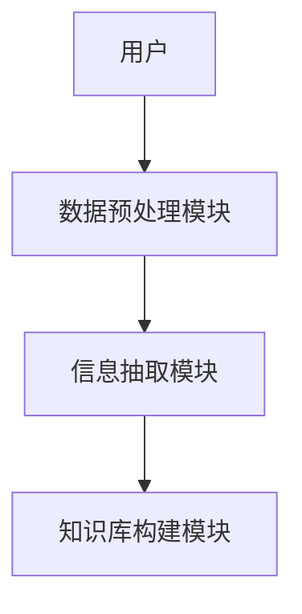
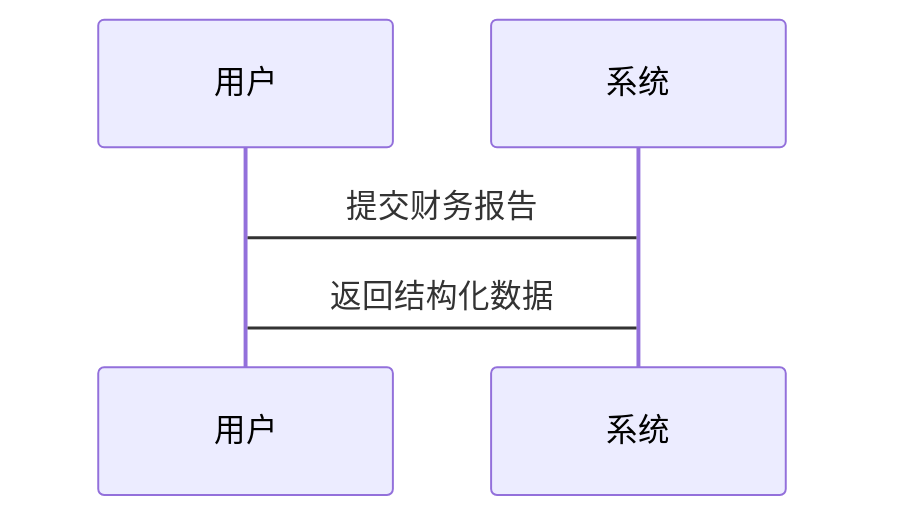

                 


# 智能财务报告关键信息提取系统

## 关键词：
智能财务报告，关键信息提取，自然语言处理，机器学习，深度学习，文本挖掘

## 摘要：
本文系统地探讨了智能财务报告关键信息提取系统的构建与应用。首先，我们介绍了财务报告的关键信息提取的背景、意义及核心概念。接着，详细分析了自然语言处理与机器学习在信息提取中的应用原理，并通过实际案例展示了系统的架构设计与实现过程。最后，我们总结了系统的实际应用价值及未来的发展方向，为读者提供了深入的技术洞察与实践指导。

---

# 第1章：智能财务报告关键信息提取概述

## 1.1 背景与意义

### 1.1.1 传统财务报告处理的痛点
传统的财务报告处理过程繁琐且效率低下，主要依赖人工操作，容易出现人为错误。财务报告中的信息分散在文本、表格和图表中，手动提取不仅耗时，还可能遗漏重要数据。

### 1.1.2 智能化提取的关键作用
智能财务报告关键信息提取系统通过自动化技术，能够快速、准确地从大量非结构化数据中提取关键信息，显著提高财务分析的效率和准确性，为决策者提供可靠支持。

### 1.1.3 技术进步带来的变革
随着自然语言处理和机器学习技术的进步，智能化信息提取已成为可能。这些技术能够处理复杂的文本结构，识别隐藏的模式，从而帮助财务人员更高效地完成工作。

## 1.2 核心概念与技术基础

### 1.2.1 关键信息提取的定义
关键信息提取是指从财务报告中提取对公司财务状况、经营成果和现金流量至关重要的数据，如收入、利润、成本等。

### 1.2.2 系统的目标与范围
- **目标**：自动化提取财务报告中的关键信息，提供结构化的数据输出。
- **范围**：包括对财务报表的理解、关键数据识别、信息整合与分析。

### 1.2.3 核心要素与组成
- **输入**：非结构化的财务报告文本。
- **输出**：结构化的财务数据，如收入、利润、成本等。
- **技术工具**：自然语言处理、机器学习模型。

## 1.3 技术基础与应用价值

### 1.3.1 自然语言处理技术简介
自然语言处理（NLP）是人工智能的核心技术之一，用于理解和处理人类语言。在财务报告信息提取中，NLP技术主要用于分词、实体识别和信息抽取。

### 1.3.2 机器学习在信息提取中的应用
机器学习通过训练模型，能够自动识别文本中的模式和特征，从而提高信息提取的准确率。常用算法包括支持向量机（SVM）和深度学习模型。

### 1.3.3 系统的应用场景与价值
- **场景**：企业财务分析、审计、投资决策。
- **价值**：提高效率、减少错误、支持数据驱动决策。

---

# 第2章：财务报告结构与信息提取关键点

## 2.1 财务报告的结构与内容

### 2.1.1 资产负债表
资产负债表反映了企业在某一特定日期的财务状况，包括资产、负债和所有者权益。

### 2.1.2 利润表
利润表展示企业在一定会计期间的经营成果，包括收入、费用和利润。

### 2.1.3 现金流量表
现金流量表记录企业在一定会计期间的现金流入和流出情况。

## 2.2 信息提取的关键点

### 2.2.1 识别财务数据
从文本中识别关键财务数据，如收入、成本、利润等。

### 2.2.2 理解上下文
理解财务报告中的上下文关系，如“收入”可能指总收入或营业收入。

### 2.2.3 提高准确率
通过模型优化和数据清洗，确保提取信息的准确性。

## 2.3 自然语言处理在信息提取中的应用

### 2.3.1 分词技术
将财务报告文本分割成词语，便于后续处理。

### 2.3.2 实体识别
识别文本中的财务实体，如公司名称、金额等。

### 2.3.3 信息抽取
从文本中提取特定信息，如收入和利润数据。

---

# 第3章：自然语言处理与机器学习技术的结合

## 3.1 分词技术

### 3.1.1 分词算法
- **分词方法**：基于统计的分词、基于规则的分词。
- **工具**：jieba、NLTK。

## 3.2 实体识别

### 3.2.1 实体识别模型
- **模型**：条件随机场（CRF）。
- **流程**：训练数据标注 -> 模型训练 -> 实体识别。

## 3.3 信息抽取

### 3.3.1 信息抽取流程
- **数据预处理**：文本清洗、分词。
- **特征提取**：提取文本特征。
- **模型训练**：训练分类器。
- **结果提取**：输出结构化数据。

---

# 第4章：系统架构设计

## 4.1 系统功能设计

### 4.1.1 功能模块
- **数据预处理模块**：清洗和结构化数据。
- **信息抽取模块**：提取关键信息。
- **知识库构建模块**：存储和管理数据。

## 4.2 系统架构设计

### 4.2.1 系统架构图


## 4.3 接口设计

### 4.3.1 输入接口
- **输入格式**：文本文件。
- **输出格式**：结构化数据。

## 4.4 交互流程设计

### 4.4.1 交互流程图


---

# 第5章：项目实战

## 5.1 环境安装

### 5.1.1 环境配置
- **工具**：Python、Jupyter Notebook。
- **库**：jieba、spaCy、scikit-learn。

## 5.2 核心实现

### 5.2.1 数据清洗代码
```python
import re

def clean_text(text):
    return re.sub(r'\s+', ' ', text).strip()
```

### 5.2.2 实体识别代码
```python
from sklearn.feature_extraction.text import TfidfVectorizer
from sklearn.svm import SVC

# 示例代码，实际应用中需要更多处理
vectorizer = TfidfVectorizer()
model = SVC()
```

## 5.3 案例分析

### 5.3.1 实际案例
- **案例**：从年度报告中提取收入和利润。

---

# 第6章：总结与展望

## 6.1 系统总结

### 6.1.1 核心功能
- **自动提取**：高效准确提取关键信息。
- **结构化输出**：提供结构化的财务数据。

## 6.2 技术展望

### 6.2.1 模型优化
- **深度学习模型**：改进准确率。
- **多语言支持**：处理多语言财务报告。

## 6.3 实践建议

### 6.3.1 数据质量
- **数据清洗**：确保数据完整性。
- **模型调优**：优化性能。

---

# 作者：AI天才研究院 & 禅与计算机程序设计艺术

---

通过以上结构，我们可以清晰地看到，智能财务报告关键信息提取系统在技术和应用上的重要性。希望这篇文章能够为读者提供有价值的见解和实践指导。

