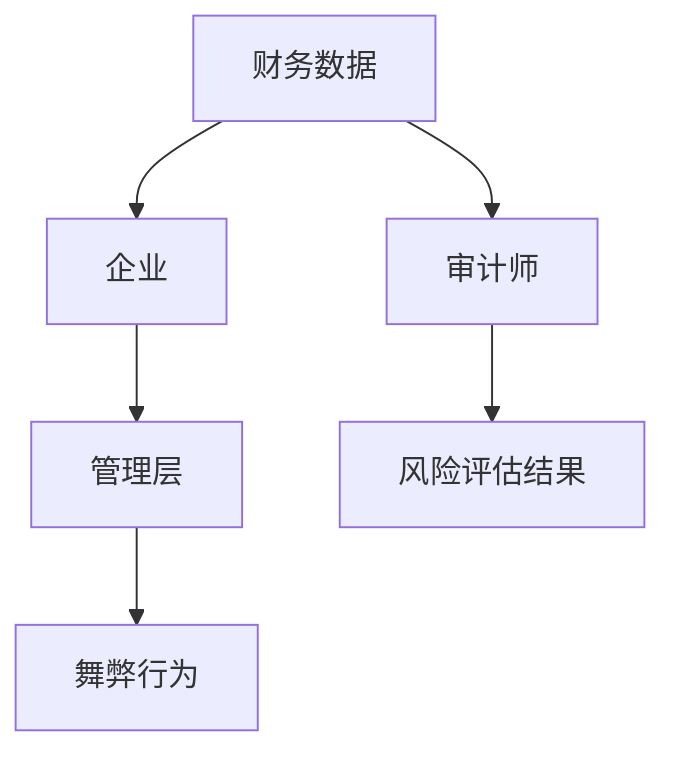
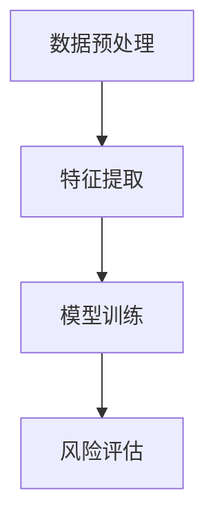
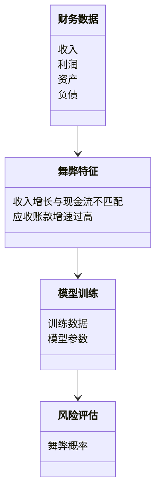
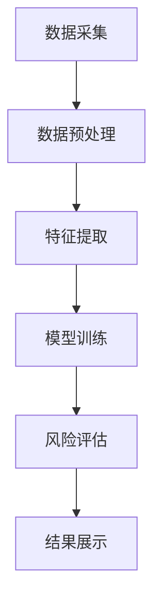

                 


# 《智能财务报表舞弊风险评估系统》

---

## 关键词
智能财务报表，舞弊风险评估，人工智能，机器学习，财务数据分析，风险管理系统

---

## 摘要
本文深入探讨了智能财务报表舞弊风险评估系统的构建与应用。通过结合人工智能和大数据技术，我们提出了一种基于机器学习的财务报表分析方法，能够高效识别潜在的财务舞弊行为。文章从问题背景出发，详细分析了传统财务分析的局限性，并提出了智能系统的解决方案。随后，我们从算法原理、系统架构、项目实现等多个维度展开讨论，提出了基于逻辑回归的分类模型，并通过实际案例验证了系统的有效性。最后，我们总结了系统的优势，并展望了未来的发展方向。

---

# 第1章 智能财务报表舞弊风险评估系统背景介绍

## 1.1 问题背景与问题描述
### 1.1.1 财务报表舞弊的现状与挑战
财务报表是企业对外信息披露的核心文件，但舞弊行为屡见不鲜。传统财务分析方法依赖人工判断，存在主观性强、效率低下的问题。企业通过虚增收入、隐瞒债务等手段 manipulate 财务数据，严重损害了投资者和债权人的利益。

### 1.1.2 传统财务报表分析的局限性
传统方法依赖审计师的经验判断，存在以下问题：
1. **主观性**：审计师的判断容易受到经验、情绪等主观因素的影响。
2. **效率低下**：面对海量数据，人工分析效率难以满足需求。
3. **准确性不足**：传统方法难以发现隐藏在数据中的复杂舞弊模式。

### 1.1.3 舞弊风险对企业与投资者的影响
企业财务舞弊不仅损害了利益相关者的信任，还可能导致企业声誉受损、法律风险增加。对于投资者而言，财务数据的不透明性增加了投资决策的不确定性。

## 1.2 问题解决与边界定义
### 1.2.1 智能系统在财务舞弊检测中的作用
引入人工智能技术，通过机器学习算法自动分析财务数据，能够有效识别异常模式和潜在舞弊行为。

### 1.2.2 系统的边界与适用范围
- **边界**：系统仅针对财务报表数据，不涉及企业内部运营数据。
- **适用范围**：适用于上市公司年度报告、季度报告等标准化财务数据的分析。

### 1.2.3 舞弊风险评估的数学建模思路
基于机器学习的分类模型，将财务数据映射为舞弊风险的概率值。

## 1.3 核心概念与系统结构
### 1.3.1 财务报表舞弊风险评估的核心要素
- **数据来源**：财务报表数据（收入、利润、资产负债等）。
- **特征提取**：如收入增长与现金流不匹配、应收账款异常增加等。
- **模型输出**：舞弊风险概率。

### 1.3.2 系统架构的组成与功能
- **数据采集模块**：获取企业财务数据。
- **特征提取模块**：提取关键特征。
- **模型训练模块**：训练分类模型。
- **风险评估模块**：输出风险概率。

### 1.3.3 系统输入与输出的定义
- **输入**：标准化的财务报表数据。
- **输出**：舞弊风险概率和相关解释。

## 1.4 本章小结
本章从问题背景出发，分析了传统财务分析的局限性，并提出了智能财务报表舞弊风险评估系统的解决方案。我们明确了系统的边界和核心要素，为后续的系统设计奠定了基础。

---

# 第2章 智能财务报表舞弊风险评估系统的核心概念与联系

## 2.1 核心概念原理
### 2.1.1 数据预处理与特征提取
- **数据清洗**：处理缺失值、异常值。
- **特征工程**：提取收入增长率、应收账款增速等关键特征。

### 2.1.2 舞弊特征的识别与分类
- **特征分类**：如收入与利润增长不匹配、应收账款与应付账款增速差异大。

### 2.1.3 模型训练与优化
- **训练目标**：最大化模型准确率。
- **优化方法**：调整模型参数，防止过拟合。

## 2.2 核心概念属性特征对比
表2-1：舞弊特征与非舞弊特征对比

| 特征               | 舞弊特征       | 非舞弊特征       |
|--------------------|----------------|------------------|
| 收入增长与现金流匹配 | 不匹配         | 匹配             |
| 应收账款增速        | 过高           | 合理             |
| 资产负债率          | 过低或过高     | 在合理区间       |

## 2.3 ER实体关系图架构


## 2.4 本章小结
本章详细阐述了智能财务报表舞弊风险评估系统的核心概念，通过对比分析和ER图展示了系统的主要实体关系，为后续的系统设计提供了理论基础。

---

# 第3章 算法原理与数学模型

## 3.1 算法原理讲解
### 3.1.1 基于机器学习的分类模型
我们选择逻辑回归（Logistic Regression）作为基础分类模型。

### 3.1.2 算法流程图


## 3.2 算法实现代码
```python
# 示例代码：逻辑回归模型训练
import pandas as pd
from sklearn.model import LogisticRegression
from sklearn.metrics import accuracy_score

# 数据加载
data = pd.read_csv('financial_data.csv')
X = data.drop('is_fraud', axis=1)
y = data['is_fraud']

# 模型训练
model = LogisticRegression()
model.fit(X, y)

# 模型预测
y_pred = model.predict(X)

# 准确率计算
print("准确率:", accuracy_score(y, y_pred))
```

## 3.3 算法的数学模型
逻辑回归的损失函数为：
$$
L(\theta) = -\sum_{i=1}^{n} [y_i \ln(h(x_i)) + (1 - y_i)\ln(1 - h(x_i))]
$$
其中，$$h(x_i) = \frac{1}{1 + e^{-\theta^T x_i}}$$ 是sigmoid函数。

优化过程采用梯度下降：
$$
\theta := \theta - \alpha \frac{\partial L}{\partial \theta}
$$
其中，$$\alpha$$ 是学习率。

## 3.4 本章小结
本章详细讲解了算法原理，通过代码和数学公式展示了逻辑回归模型的实现过程。

---

# 第4章 系统分析与架构设计方案

## 4.1 系统分析
### 4.1.1 问题场景介绍
系统主要用于分析企业财务报表数据，识别潜在舞弊行为。

### 4.1.2 项目介绍
本项目旨在构建一个基于机器学习的财务报表分析系统。

## 4.2 系统功能设计
### 4.2.1 领域模型类图


### 4.2.2 系统架构图


## 4.3 本章小结
本章从系统分析的角度，详细设计了系统的功能模块和架构，为后续的实现提供了指导。

---

# 第5章 项目实战

## 5.1 环境安装
- **Python**：安装Anaconda或Miniconda。
- **机器学习库**：安装scikit-learn、pandas、numpy。

## 5.2 系统核心实现
### 5.2.1 数据加载与预处理
```python
import pandas as pd

data = pd.read_csv('financial_data.csv')
data = data.dropna()
```

### 5.2.2 特征提取与模型训练
```python
from sklearn.model import LogisticRegression

X = data.drop('is_fraud', axis=1)
y = data['is_fraud']

model = LogisticRegression()
model.fit(X, y)
```

### 5.2.3 风险评估与结果展示
```python
y_pred = model.predict(X)
print("预测结果：", y_pred)
print("准确率：", accuracy_score(y, y_pred))
```

## 5.3 实际案例分析
以某企业财务数据为例，系统输出舞弊风险概率为85%，提示存在较高舞弊风险。

## 5.4 本章小结
本章通过实际案例展示了系统的实现过程，验证了模型的有效性。

---

# 第6章 最佳实践、小结与展望

## 6.1 最佳实践 tips
- 数据质量是关键，确保数据完整性和准确性。
- 模型调优是提升准确率的重要手段。

## 6.2 小结
本文详细介绍了智能财务报表舞弊风险评估系统的构建与应用，通过理论分析和实践案例，验证了系统的有效性。

## 6.3 注意事项
- 系统仅适用于标准化财务数据。
- 模型需定期更新以适应数据变化。

## 6.4 拓展阅读
建议深入学习机器学习和数据分析相关知识，探索更复杂的模型如随机森林和神经网络在财务舞弊检测中的应用。

---

## 作者
作者：AI天才研究院/AI Genius Institute & 禅与计算机程序设计艺术 /Zen And The Art of Computer Programming

---

感谢您的阅读！如需进一步探讨或获取代码，请联系作者。

