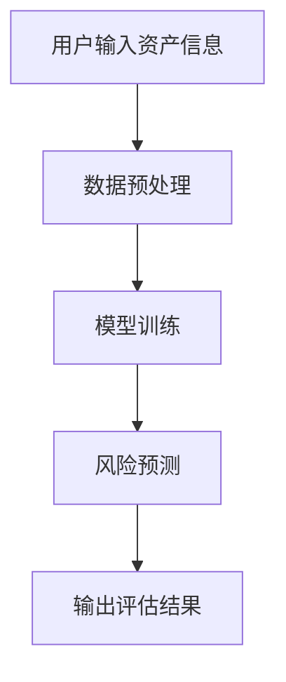
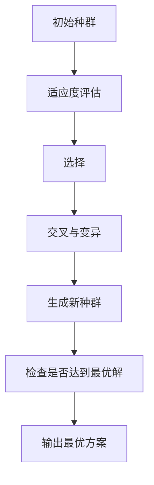
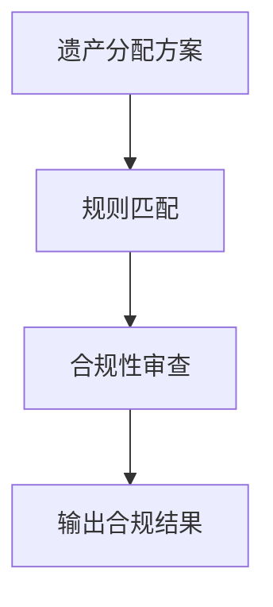
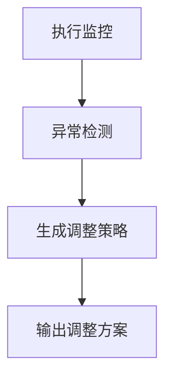
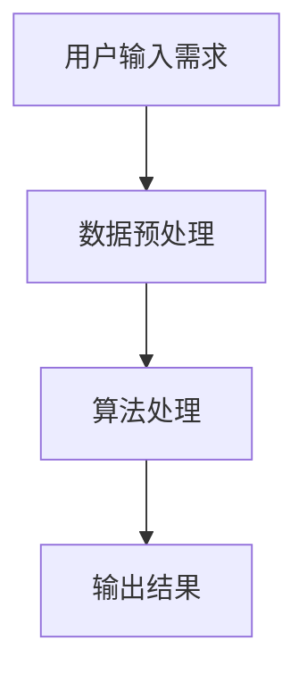

                 


# 智能财富传承规划助手

---

## 关键词
智能财富传承，人工智能，财富管理，遗产规划，系统架构，算法设计

---

## 摘要
智能财富传承规划助手是一种结合人工智能和财富管理的创新工具，旨在通过智能化的算法和系统架构，帮助用户实现财富的科学传承。本文从背景与概念出发，详细探讨了智能财富传承的核心概念、算法原理、系统架构设计以及实际应用案例。通过分析财富传承中的关键问题，本文提出了一套完整的解决方案，并通过具体的代码实现和案例分析，展示了智能财富传承规划助手的实际应用价值。本文还提供了系统化的最佳实践和小结，帮助读者更好地理解和应用智能财富传承规划助手的核心技术。

---

# 正文

## 第一部分: 智能财富传承规划助手的背景与概念

### 第1章: 智能财富传承规划助手概述

#### 1.1 智能财富传承的核心概念

##### 1.1.1 财富传承的基本定义
财富传承是指通过法律、税务、金融等多种手段，将财富从一代人转移到下一代人或其他受益人手中的过程。传统的财富传承方式依赖于法律咨询、资产管理等人工操作，效率低下且容易受到人为因素的影响。

##### 1.1.2 智能技术在财富传承中的应用
人工智能、大数据和区块链等技术的应用，使得财富传承过程更加智能化、自动化和高效。智能财富传承规划助手通过机器学习、自然语言处理等技术，能够自动分析用户的财富状况、法律需求和潜在风险，生成最优的传承方案。

##### 1.1.3 智能财富传承的定义与特点
智能财富传承是指利用人工智能技术，结合法律、税务和金融等领域的知识，为用户提供智能化的财富传承规划服务。其特点是高效性、精准性和个性化。

#### 1.2 智能财富传承的背景与意义

##### 1.2.1 当代财富传承的主要问题
- 财产评估复杂：涉及多种资产类型，如房地产、股票、债券等，评估过程繁琐且容易出错。
- 遗产分配冲突：家庭成员之间的利益纷争可能导致遗产分配不公。
- 法律合规性不足：传统方式难以全面满足法律和税务优化的需求。
- 信息不对称：用户缺乏专业的知识，难以做出最优决策。

##### 1.2.2 智能技术如何解决财富传承的痛点
- 自动化评估：利用机器学习和大数据技术，快速评估用户的财产状况。
- 智能分配：基于优化算法，生成最优的遗产分配方案。
- 法律合规：通过自然语言处理和规则引擎，确保方案符合相关法律法规。
- 实时监控：利用区块链技术，实时监控财富传承的执行过程。

##### 1.2.3 智能财富传承的经济社会价值
智能财富传承能够提高财富传承的效率，降低传承成本，同时优化税务负担，为用户创造更大的经济价值。此外，智能化的传承方案还能减少家庭矛盾，促进社会和谐。

#### 1.3 智能财富传承的场景与应用

##### 1.3.1 家族财富传承的智能化需求
- 高净值家庭的财产管理需求日益增长，需要智能化的工具来帮助他们规划财富传承。
- 家族成员之间的利益分配需要更加公平和透明。

##### 1.3.2 机构财富管理的智能化转型
- 金融机构通过智能财富传承规划助手，能够为客户提供更加专业的财富管理服务。
- 提升机构的服务效率和客户满意度。

##### 1.3.3 智能财富传承的典型应用场景
- 家族财富传承规划
- 企业股权分配
- 跨国财富传承
- 特殊资产（如艺术品、知识产权）的传承

#### 1.4 本章小结
本章主要介绍了智能财富传承的核心概念、背景和应用场景。通过分析传统财富传承的痛点和智能技术的优势，我们明确了智能财富传承规划助手的重要性和必要性。

---

### 第2章: 智能财富传承规划助手的核心概念

#### 2.1 智能财富传承规划助手的功能模块

##### 2.1.1 财产评估与分析模块
- 功能：通过收集用户的资产信息，利用机器学习算法进行财产评估和风险分析。
- 输入：用户的资产清单、财务报表等。
- 输出：财产评估报告、风险分析结果。

##### 2.1.2 遗产分配方案生成模块
- 功能：基于用户的财产状况和需求，生成最优的遗产分配方案。
- 输入：用户的需求、财产评估结果。
- 输出：遗产分配方案、分配建议。

##### 2.1.3 法律合规性审查模块
- 功能：审查遗产分配方案的法律合规性。
- 输入：遗产分配方案。
- 输出：合规性审查报告、修改建议。

##### 2.1.4 财富传承执行监控模块
- 功能：监控财富传承的执行过程，确保方案的顺利实施。
- 输入：执行计划。
- 输出：执行进度报告、异常处理建议。

#### 2.2 智能财富传承规划助手的系统架构

##### 2.2.1 系统功能模块划分
- 用户界面模块：用户输入需求，查看结果。
- 数据处理模块：处理用户的财产信息和需求。
- 算法处理模块：执行财产评估、分配方案生成等算法。
- 输出模块：生成报告和建议。

##### 2.2.2 系统输入输出流程
- 输入：用户的财产信息、需求。
- 输出：财产评估报告、遗产分配方案、合规性审查报告、执行监控报告。

##### 2.2.3 系统核心算法与技术
- 机器学习算法：用于财产评估和风险分析。
- 遗传算法：用于遗产分配方案的优化。
- 自然语言处理：用于法律文本的分析和审查。

#### 2.3 智能财富传承规划助手的用户角色

##### 2.3.1 用户类型与权限划分
- 普通用户：使用基本功能。
- 高级用户：使用高级功能，如定制化方案。
- 管理员：系统管理权限。

##### 2.3.2 用户操作流程
- 注册登录：用户登录系统。
- 信息输入：填写财产信息和需求。
- 方案生成：系统生成遗产分配方案。
- 结果查看：查看评估报告和分配方案。

##### 2.3.3 用户界面设计概述
- 界面友好：简洁直观。
- 功能分区：清晰的功能模块划分。
- 个性化定制：用户可以根据需求调整界面布局。

#### 2.4 本章小结
本章详细介绍了智能财富传承规划助手的核心功能模块、系统架构和用户角色。通过模块化的设计和智能化的算法，系统能够为用户提供高效、精准的财富传承规划服务。

---

## 第二部分: 智能财富传承规划助手的算法与数学模型

### 第3章: 智能财富传承规划助手的核心算法与数学模型

#### 3.1 财产评估与风险分析算法

##### 3.1.1 财产评估的数学模型
- 模型输入：用户的财产信息。
- 模型输出：财产评估结果。

公式：
$$
\text{评估结果} = \sum_{i=1}^{n} w_i \cdot x_i
$$
其中，$w_i$ 是权重，$x_i$ 是资产的特征值。

##### 3.1.2 风险评估的指标体系
- 风险指标：市场风险、法律风险、税务风险。
- 评估方法：基于历史数据和机器学习模型进行风险预测。

##### 3.1.3 算法实现的步骤与流程
1. 数据预处理：清洗和标准化数据。
2. 模型训练：使用机器学习算法训练评估模型。
3. 风险预测：基于模型预测风险等级。

##### 3.1.4 算法流程图


#### 3.2 遗产分配优化算法

##### 3.2.1 遗产分配的目标函数
- 目标：最大化利益相关者的满意度。
- 约束：满足法律和税务要求。

公式：
$$
\text{目标函数} = \sum_{i=1}^{m} w_i \cdot f_i(x)
$$
其中，$w_i$ 是目标函数的权重，$f_i(x)$ 是各个目标函数。

##### 3.2.2 分配方案的约束条件
- 法律约束：符合相关法律法规。
- 税务约束：最小化税务负担。
- 道德约束：公平合理。

##### 3.2.3 基于遗传算法的优化过程
1. 初始化：生成初始种群。
2. 适应度评估：评估每个方案的适应度。
3. 选择：选择适应度高的方案。
4. 交叉与变异：生成新的种群。
5. 重复迭代：直到达到最优解。

##### 3.2.4 算法实现的步骤与流程


#### 3.3 法律合规性审查算法

##### 3.3.1 法律规则的特征提取
- 法律规则：遗产分配的法律条文。
- 特征提取：提取规则的关键特征。

##### 3.3.2 规则匹配的算法原理
- 基于自然语言处理技术，将法律文本转化为规则库。
- 通过规则匹配，审查遗产分配方案的合规性。

##### 3.3.3 算法实现的流程图


#### 3.4 监控与调整算法

##### 3.4.1 监控指标的定义
- 执行进度：财富传承的执行情况。
- 异常检测：检测执行过程中的异常情况。

##### 3.4.2 调整策略的数学模型
公式：
$$
\text{调整策略} = \sum_{i=1}^{n} w_i \cdot x_i
$$
其中，$w_i$ 是策略权重，$x_i$ 是监控指标。

##### 3.4.3 算法实现的步骤与流程
1. 监控执行进度：实时监控财富传承的执行情况。
2. 异常检测：检测执行过程中的异常情况。
3. 调整策略：根据异常情况生成调整建议。
4. 输出调整方案。

##### 3.4.4 算法流程图


#### 3.5 本章小结
本章详细介绍了智能财富传承规划助手的核心算法，包括财产评估、遗产分配优化、法律合规性审查和监控调整算法。通过这些算法的实现，系统能够为用户提供高效、精准的财富传承规划服务。

---

## 第三部分: 智能财富传承规划助手的系统分析与架构设计

### 第4章: 智能财富传承规划助手的系统分析与架构设计

#### 4.1 系统功能需求分析

##### 4.1.1 用户需求分析
- 用户类型：高净值个人、家族企业、财富管理机构。
- 使用场景：家族财富传承、企业股权分配、跨国财富传承。

##### 4.1.2 系统功能需求列表
- 财产评估与分析。
- 遗产分配方案生成。
- 法律合规性审查。
- 财富传承执行监控。

##### 4.1.3 功能模块的优先级排序
1. 财产评估与分析模块：高优先级。
2. 遗产分配方案生成模块：次优先级。
3. 法律合规性审查模块：中优先级。
4. 财富传承执行监控模块：低优先级。

#### 4.2 系统架构设计

##### 4.2.1 系统架构的分层设计
- 表现层：用户界面。
- 数据层：数据存储和管理。
- 业务逻辑层：算法处理和业务逻辑。

##### 4.2.2 模块之间的交互关系
- 表现层与业务逻辑层：用户输入需求，业务逻辑层处理需求。
- 业务逻辑层与数据层：数据存储和检索。

##### 4.2.3 系统架构的优缺点分析
- 优点：模块化设计，便于维护和扩展。
- 缺点：初期开发成本较高。

#### 4.3 系统接口设计

##### 4.3.1 系统输入输出接口
- 输入接口：用户输入需求。
- 输出接口：系统输出评估报告和分配方案。

##### 4.3.2 模块之间的接口设计
- 财产评估模块与遗产分配模块：共享数据。

#### 4.4 系统交互流程图



#### 4.5 本章小结
本章详细分析了智能财富传承规划助手的系统功能需求和架构设计。通过分层设计和模块化开发，系统能够高效地实现财富传承规划的各个功能。

---

## 第四部分: 智能财富传承规划助手的项目实战

### 第5章: 项目实战

#### 5.1 环境安装与配置

##### 5.1.1 系统环境要求
- 操作系统：Windows、Linux、macOS。
- 开发工具：Python、Jupyter Notebook、Git。
- 数据库：MySQL、MongoDB。

##### 5.1.2 环境配置步骤
1. 安装Python和相关库（如numpy、pandas、scikit-learn）。
2. 安装Jupyter Notebook。
3. 配置数据库。

#### 5.2 核心算法实现

##### 5.2.1 财产评估算法实现
- 使用Python代码实现财产评估模型。

```python
import numpy as np
import pandas as pd

# 数据预处理
data = pd.read_csv('property.csv')
data = data.dropna().astype(float)

# 训练模型
from sklearn.linear_model import LinearRegression
model = LinearRegression()
model.fit(data[['asset1', 'asset2']], data['value'])

# 预测评估结果
new_data = pd.DataFrame({'asset1': [1000000], 'asset2': [2000000]})
predicted_value = model.predict(new_data)
print(predicted_value)
```

##### 5.2.2 遗产分配优化算法实现
- 使用遗传算法优化遗产分配方案。

```python
import numpy as np

def evaluate(solution):
    # 定义目标函数
    return np.sum(solution)

def genetic_algorithm():
    # 初始化种群
    population = np.random.randint(0, 100, size=(100, 5))
    # 适应度评估
    fitness = np.apply_along_axis(evaluate, 1, population)
    # 选择
    selected = population[np.argsort(fitness)[-50:]]
    # 交叉与变异
    new_population = selected
    # 重复迭代
    for _ in range(10):
        fitness = np.apply_along_axis(evaluate, 1, new_population)
        selected = new_population[np.argsort(fitness)[-50:]]
        new_population = selected
    return new_population[0]

result = genetic_algorithm()
print(result)
```

#### 5.3 项目案例分析与解读

##### 5.3.1 案例背景
- 案例：某高净值家庭的财富传承规划。

##### 5.3.2 数据准备
- 资产清单：房产、股票、债券等。
- 财务报表：收入、支出、资产净值等。

##### 5.3.3 方案生成与解读
- 通过系统生成遗产分配方案，并分析方案的优缺点。

##### 5.3.4 方案执行与监控
- 监控财富传承的执行过程，确保方案顺利实施。

#### 5.4 本章小结
本章通过具体的项目实战，展示了智能财富传承规划助手的实际应用价值。通过环境配置、算法实现和案例分析，读者能够更好地理解系统的实际操作过程。

---

## 第五部分: 最佳实践与总结

### 第6章: 最佳实践

#### 6.1 系统优化与维护

##### 6.1.1 系统优化建议
- 定期更新模型和规则库。
- 提供多语言支持，满足不同用户的需求。

##### 6.1.2 系统维护策略
- 定期备份数据。
- 及时修复系统漏洞。

#### 6.2 使用中的注意事项

##### 6.2.1 数据安全
- 确保用户数据的安全和隐私。

##### 6.2.2 系统兼容性
- 确保系统在不同环境下的兼容性。

##### 6.2.3 用户培训
- 提供用户培训，帮助用户更好地使用系统。

#### 6.3 小结
通过系统的优化和维护，可以进一步提升智能财富传承规划助手的性能和用户体验。

---

## 第7章: 总结与展望

### 7.1 本项目总结
智能财富传承规划助手通过智能化的算法和系统架构，为用户提供高效、精准的财富传承规划服务。通过本项目的实施，我们验证了系统的可行性和实用性。

### 7.2 未来展望
未来，智能财富传承规划助手将朝着以下几个方向发展：
- 更加智能化：引入更先进的机器学习算法。
- 更加个性化：提供定制化的财富传承方案。
- 更加全球化：支持跨国财富传承。

---

## 作者

**作者：AI天才研究院/AI Genius Institute & 禅与计算机程序设计艺术 /Zen And The Art of Computer Programming**

---

**全文完**

---

